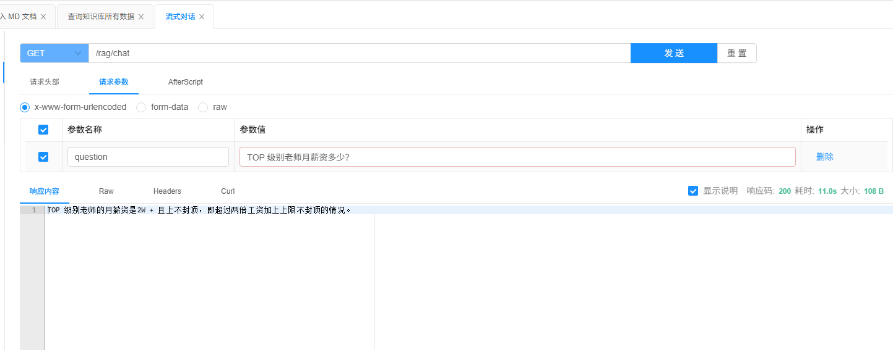

# RAG 技术完全指南：从原理到 Spring Boot 项目实战

> RAG = 智能检索模块 + LLM提示工程

## 一、什么是 RAG 技术

#### 1.1 核心定义

**RAG (Retrieval-Augmented Generation，检索增强生成)** 是一种结合**外部知识库检索**与**大语言模型生成**的混合 AI 架构，其核心思想是在模型生成答案前，先从外部私有知识库中获取相关事实性信息，再将 "用户问题 + 检索结果" 作为增强提示词输入模型，最终输出**基于事实、可验证、可追溯**的回答。

**核心公式**：`RAG = 智能检索模块 + LLM提示工程`，本质上是将大模型的 "闭卷考试" 变成 "开卷考试"，无需修改模型权重即可实现知识更新与扩展。

#### 1.2 为什么需要 RAG

大语言模型存在三大核心局限，RAG 针对性解决：

| 大模型局限                             | RAG 解决方案                     | 核心价值                         |
| -------------------------------------- | -------------------------------- | -------------------------------- |
| 知识时效性差（训练数据截止到特定时间） | 实时从外部知识库检索最新信息     | 保持回答时效性，无需重新训练模型 |
| 私有 / 敏感数据无法融入                | 构建私有向量知识库，数据不出本地 | 保护数据安全，满足合规要求       |
| 幻觉问题（生成不存在的事实）           | 基于检索到的权威文档生成答案     | 提升回答准确性，可追溯信息来源   |

#### 1.3 RAG 工作流程全解析

> Embedding 模型 -> 向量模型：nomic-embed-text、bge-m3。
>
> 向量模型的作用：用于将内容转换成高纬度的向量，然后通过向量计算相似度来匹配内容。
>
> 向量数据库：Elasticsearch、Redis、MongoDB 。[Embedding Stores | LangChain4j](https://docs.langchain4j.dev/category/embedding-stores)

##### 阶段一：离线知识库构建（一次性预处理）

1. **文档加载**：导入 PDF、Word、Markdown 等格式的原始文档
2. **文本分块**：将长文档切分为适合检索的小片段（Chunk），通常 500-1000 字符，设置 10%-15% 重叠窗口避免语义断裂
3. **向量化编码**：通过 Embedding 模型将每个文本块转换为高维向量
4. **向量存储**：将向量与文本片段、元数据（来源、页码等）存入向量数据库，建立索引

##### 阶段二：在线问答推理（实时交互）

1. **问题向量化**：将用户问题通过相同 Embedding 模型转换为向量
2. **相似度检索**：向量数据库计算问题向量与文档向量的相似度，返回 Top N（通常 3-5）最相关文本片段
3. **增强生成**：将问题 + 检索结果 + 提示词模板组合，输入大语言模型生成最终回答


## 二、RAG 核心组件详解

#### 2.1 文档处理模块

- **文档加载器**：支持多格式文档读取（Tika、Apache PDFBox 等）

- 文本分块策略

  - 固定长度分块：适合结构化文档
  - 语义分块：基于句子、段落边界，保持语义完整性
  - 递归分块：先大后小，灵活适配不同内容长度

  

#### 2.2 嵌入模型 (Embedding Model)

负责将文本转换为向量表示，捕捉语义信息：

- **开源推荐**：bge-m3（中文最优）、nomic-embed-text、all-MiniLM-L6-v2
- **核心要求**：与大语言模型语义空间一致，维度适中（通常 768-1536 维）

#### 2.3 向量数据库

专门用于存储和检索向量的数据库，支持高效相似度查询：

|  向量数据库   |                             特点                             |                  适用场景                  |
| :-----------: | :----------------------------------------------------------: | :----------------------------------------: |
| Elasticsearch | 全文检索 + 向量检索双引擎，中文生态成熟，企业级稳定性强，支持复杂过滤 |  生产级混合检索、企业知识库、中文核心场景  |
|     Redis     | 内存级极致低延迟，缓存 + 向量一体化，部署极简，高并发性能拉满 | 高并发问答、轻量向量检索、中小规模实时业务 |
|    MongoDB    |   文档数据库原生支持向量索引，数据结构统一，无独立组件依赖   |   文档一体化存储、中小项目、快速落地开发   |

#### 2.4 检索器 (Retriever)

- **核心算法**：余弦相似度、欧氏距离、点积

- 高级优化

  - 混合检索（向量检索 + 关键词检索 BM25）
  - 重排序（Rerank）：对初步结果二次筛选，提升相关性
  - 过滤：基于元数据（如文档类型、时间）精确筛选

  

#### 2.5 生成器 (LLM)

负责基于检索结果生成自然语言回答：

- **本地部署**：DeepSeek-R1、Llama 3、Mistral（通过 Ollama 管理）
- **云服务**：GPT-4、文心一言、通义千问
- **提示词设计**：明确要求模型基于提供的上下文回答，禁止编造信息


## 三、Spring Boot + LangChain4j + Ollama 项目实战

### 3.1 技术栈选型

| 组件       | 选型          | 版本    | 作用                           |
| ---------- | ------------- | ------- | ------------------------------ |
| 后端框架   | Spring Boot   | 3.5.13  | 快速构建 Java 后端服务         |
| RAG 框架   | LangChain4j   | 0.36.2  | 简化 RAG 系统开发              |
| 模型管理   | Ollama        | 0.18.3  | 本地部署 Embedding 和 LLM 模型 |
| 嵌入模型   | bge-m3        | latest  | 中文文本向量化                 |
| 大语言模型 | DeepSeek-R1   | 1.5B    | 生成回答                       |
| 向量数据库 | Elasticsearch | 8.19.13 | 存储向量数据                   |

### 3.2 RAG 架构图

整个流程分两个阶段：**离线阶段**将文档向量化存入 ES，**在线阶段**将用户问题向量化后检索相似内容，交给本地大模型生成答案。下面开始逐步讲解。




### 3.3 Maven 核心依赖配置（pom.xml）

```xml
<!-- Spring Boot WebFlux（流式输出必须用响应式，不能用普通 Web） -->
<dependency>
    <groupId>org.springframework.boot</groupId>
    <artifactId>spring-boot-starter-webflux</artifactId>
</dependency>

<!-- LangChain4j 核心 -->
<dependency>
    <groupId>dev.langchain4j</groupId>
    <artifactId>langchain4j</artifactId>
    <version>${langchain4j.version}</version>
</dependency>


<!-- 模型实现（按需选择，这里以 OpenAI + 智谱AI 为例） -->
<dependency>
    <groupId>dev.langchain4j</groupId>
    <artifactId>langchain4j-open-ai</artifactId>
    <version>${langchain4j.version}</version>
</dependency>

<!--质谱模型-->
<dependency>
    <groupId>dev.langchain4j</groupId>
    <artifactId>langchain4j-community-zhipu-ai</artifactId>
    <version>1.0.0-alpha1</version>
</dependency>

<!--ollama本地模型-->
<dependency>
    <groupId>dev.langchain4j</groupId>
    <artifactId>langchain4j-ollama</artifactId>
    <version>${langchain4j.version}</version>
</dependency>

<!--向量数据库：elasticsearch-->
<dependency>
    <groupId>dev.langchain4j</groupId>
    <artifactId>langchain4j-elasticsearch</artifactId>
    <version>${langchain4j.version}</version>
</dependency>


<!-- Markdown 解析支持 -->
<dependency>
    <groupId>dev.langchain4j</groupId>
    <artifactId>langchain4j-document-parser-apache-tika</artifactId>
    <version>${langchain4j.version}</version>
</dependency>
```

### 3.4 核心配置类

##### 模型配置 `LLMConfig.java`

```java
@Configuration
public class LLMConfig {
   static String MODEL_NAME = "deepseek-r1:1.5b"; // try other local ollama model names
    static String BASE_URL = "http://192.168.30.130:11434"; // local ollama base url

    /** 本地对话大模型 */
    @Bean(name = "ollamaStreamingModel")
    public StreamingChatLanguageModel OllamaStreamingModel() {
        return OllamaStreamingChatModel.builder()
            .baseUrl(BASE_URL)
            .modelName(MODEL_NAME)
            .temperature(0.0)
            .logRequests(true)
            .build();
    }


    /** 向量大模型 */
    @Bean(name = "nomicEmbedTextModel")
    public EmbeddingModel nomicEmbedTextModel() {
        return OllamaEmbeddingModel.builder()
            .baseUrl(BASE_URL)
            .modelName("nomic-embed-text")
            .build();
    }

    /** 向量大模型 */
    @Bean(name = "bGEM3")
    public EmbeddingModel bGEM3Model() {
        return OllamaEmbeddingModel.builder()
            .baseUrl(BASE_URL)
            .modelName("bge-m3")
            .build();
    }
}
```


##### 向量数据库配置 `ElasticsearchConfig.java`

```java
@Configuration
public class ElasticsearchConfig {

    @Value("${elasticsearch.host}")
    private String host;

    @Value("${elasticsearch.port}")
    private int port;

    @Value("${elasticsearch.username}")
    private String username;

    @Value("${elasticsearch.password}")
    private String password;

	/** es索引名称 */
    @Value("${elasticsearch.index-name}")
    private String indexName;


    /**
     * 构建 ES 低层 RestClient（本地无认证，使用 http）
     */
    @Bean
    public RestClient restClient() {
        BasicCredentialsProvider credentialsProvider = new BasicCredentialsProvider();
        credentialsProvider.setCredentials(
            AuthScope.ANY,
            new UsernamePasswordCredentials(username, password)
        );

        return RestClient.builder(new HttpHost(host, port, "http"))
            .setHttpClientConfigCallback(httpClientBuilder ->
                httpClientBuilder.setDefaultCredentialsProvider(credentialsProvider)
            )
            .build();
    }


    /**
     * 构建 LangChain4j 的向量存储
     * ElasticsearchEmbeddingStore 封装了向量写入/检索的逻辑
     * restClient es客户端
     * indexName 索引名称
     */
    @Bean(name = "elasticsearchEmbeddingStore")
    public ElasticsearchEmbeddingStore embeddingStore(RestClient restClient) {
        return ElasticsearchEmbeddingStore.builder()
            .restClient(restClient)
            .indexName(indexName)
            .build();
    }

}
```


##### 如何从向量库检索内容配置 `RagConfig.java`

```java
@Configuration
public class RagConfig {

    /**
     * ContentRetriever：定义"如何从向量库检索内容"
     *
     * maxResults = 5：每次检索返回最相似的 5 个文档片段
     * minScore = 0.8：相似度低于 0.8 的片段不返回（0~1之间，越高越严格）
     *
     * 内部工作流程：
     * 1. 拿到用户问题
     * 2. 调用 embeddingModel 将问题转成向量
     * 3. 在 embeddingStore（ES）中做 KNN 检索
     * 4. 返回最相似的 N 个文本片段
     */
    @Bean
    public ContentRetriever contentRetriever(
        @Qualifier("elasticsearchEmbeddingStore") EmbeddingStore<TextSegment> embeddingStore,
        @Qualifier("nomicEmbedTextModel") EmbeddingModel embeddingModel) {

        return EmbeddingStoreContentRetriever.builder()
            .embeddingStore(embeddingStore) // es向量存储
            .embeddingModel(embeddingModel) // 向量模型
            .maxResults(5)
            .minScore(0.8)
            .build();
    }

}
```


### 3.5 知识库向量服务实现

```java
/** 知识库向量存储 */
@Slf4j
@Service
@RequiredArgsConstructor
public class KnowledgeBaseService {

    /** 向量数据库存储 */
    private final EmbeddingStore<TextSegment> embeddingStore;

    /** 向量模型 */
    @Autowired
    @Qualifier("nomicEmbedTextModel")
    private EmbeddingModel embeddingModel;

    /** 自定义分割器 */
    private final QaBlockSplitter qaBlockSplitter;

    /** es客户端 */
    private final ElasticsearchClient elasticsearchClient;

    /**
     * 获取md文档对象，存入向量数据库
     * @param file 文件
     * @param isCover 是否覆盖
     */
    public void ingestMarkdownFile(MultipartFile file,Boolean isCover) throws IOException {

        if(isCover!=null && isCover){
            embeddingStore.removeAll();
        }

        // 直接从流读取内容，不需要写临时文件
        String content = new String(file.getBytes(), StandardCharsets.UTF_8);
        Document document = Document.from(content);

        EmbeddingStoreIngestor ingestor = EmbeddingStoreIngestor.builder()
            .documentSplitter(qaBlockSplitter)
            .embeddingModel(embeddingModel)
            .embeddingStore(embeddingStore)
            .build();

        ingestor.ingest(document);
        log.info("MD 文档导入完成：{}", file.getOriginalFilename());
    }


    public Map<String, Object> listAll(int page, int size,String indexName) {
        try {
            // 构建分页查询，match_all 查所有数据
            SearchResponse<ObjectNode> response = elasticsearchClient.search(s -> s
                    .index(indexName)
                    .from((page - 1) * size)   // 从第几条开始
                    .size(size)                 // 取几条
                    .query(q -> q.matchAll(m -> m)),  // 查全部
                ObjectNode.class
            );

            // 提取 hits 里的数据
            List<Map<String, Object>> records = response.hits().hits().stream()
                .map(hit -> {
                    Map<String, Object> record = new HashMap<>();
                    record.put("id", hit.id());

                    if (hit.source() != null) {
                        // 文本内容
                        JsonNode textNode = hit.source().get("text");
                        record.put("text", textNode != null ? textNode.asText() : "");

                        // 向量数据
                        JsonNode vectorNode = hit.source().get("vector");
                        if (vectorNode != null && vectorNode.isArray()) {
                            List<Double> vector = new ArrayList<>();
                            vectorNode.forEach(v -> vector.add(v.asDouble()));
                            record.put("vector", vector);
                            record.put("vectorDimension", vector.size()); // 顺便返回维度
                        }

                        // metadata
                        JsonNode metadataNode = hit.source().get("metadata");
                        record.put("metadata", metadataNode != null ? metadataNode : Map.of());
                    }
                    return record;
                })
                .collect(Collectors.toList());

            long total = response.hits().total() != null
                ? response.hits().total().value() : 0;

            return Map.of(
                "total", total,
                "page", page,
                "size", size,
                "records", records
            );

        } catch (IOException e) {
            log.error("查询 ES 数据失败", e);
            throw new RuntimeException("查询失败：" + e.getMessage());
        }
    }
}
```


### 3.6 LLM流式对话模型服务实现

```java
@Service
public class StreamingChatService {

    @Qualifier("openAiStreamingModel")
    @Autowired
    private StreamingChatLanguageModel openAiStreamingModel;

    @Qualifier("zhipuStreamingModel")
    @Autowired
    private StreamingChatLanguageModel zhipuStreamingModel;

    @Qualifier("ollamaStreamingModel")
    @Autowired
    private StreamingChatLanguageModel ollamaStreamingModel;

    public Flux<String> streamWithOpenAi(String prompt) {
        return buildFlux(openAiStreamingModel, prompt);
    }

    public Flux<String> streamWithZhipu(String prompt) {
        return buildFlux(zhipuStreamingModel, prompt);
    }

    public Flux<String> streamWithOllama(String prompt) {
        return buildFlux(ollamaStreamingModel, prompt);
    }

    /**
     * 本地模型流式输出服务
     * @param systemMessage 系统提示词
     * @param userMessage 用户提示词
     * @return 流式对象
     */
    public Flux<String> streamWithOllama(SystemMessage systemMessage, UserMessage userMessage) {
        return buildFlux(ollamaStreamingModel, systemMessage, userMessage);
    }

    /**
     * buildFlux
     *
     * @param model 模型
     * @param userMessage 用户提示词
     * @return
     */
    private Flux<String> buildFlux(StreamingChatLanguageModel model, String userMessage) {
        // Sinks 是 WebFlux 的响应式"管道"，把回调转成 Flux
        Sinks.Many<String> sink = Sinks.many().unicast().onBackpressureBuffer();

        model.generate(userMessage, getStreamingResponseHandler(sink));

        return sink.asFlux();
    }

    /**
     * buildFlux
     *
     * @param model 模型
     * @param systemMessage 系统提示词
     * @param userMessage 用户提示词
     * @return
     */
    private Flux<String> buildFlux(StreamingChatLanguageModel model, SystemMessage systemMessage, UserMessage userMessage) {
        // Sinks 是 WebFlux 的响应式"管道"，把回调转成 Flux
        Sinks.Many<String> sink = Sinks.many().unicast().onBackpressureBuffer();

        model.generate(List.of(systemMessage, userMessage), getStreamingResponseHandler(sink));

        return sink.asFlux();
    }

    /**
     * 构建 StreamingResponseHandler 对象 （作用与 model.generate() 入参）
     *
     * @param sink WebFlux 的响应式"管道"，把回调转成 Flux （流式输出的对象）
     * @return
     */
    public StreamingResponseHandler<AiMessage> getStreamingResponseHandler(Sinks.Many<String> sink) {
        return new StreamingResponseHandler<AiMessage>() {
            @Override
            public void onNext(String token) {
                // 每来一个 token，往管道里推一个
                sink.tryEmitNext(token);
            }

            @Override
            public void onComplete(Response<AiMessage> response) {
                // 生成完毕，关闭管道
                sink.tryEmitComplete();
            }

            @Override
            public void onError(Throwable error) {
                // 发生错误，向管道发送错误信号
                sink.tryEmitError(error);
            }
        };
    }
}
```


### 3.7 RAG 服务实现

```java
@Slf4j
@Service
@RequiredArgsConstructor
public class ManualRagService {

    /** 向量库数据库检索内容服务 */
    private final ContentRetriever contentRetriever;

    /** 流式输出模型对话服务 */
    private final StreamingChatService streamingChatService;

    /**
     * RAG对话服务
     * @param question 用户问题
     * @return
     */
    public Flux<String> chat(String question) {

        // 向量数据检索相关知识
        Query query = Query.from(question);
        List<Content> relevantContents = contentRetriever.retrieve(query);

        // 构建向量数据库检索的知识提示词
        String context;
        if (relevantContents.isEmpty()) {
            context = "（知识库中未找到相关内容）";
        } else {
            context = relevantContents.stream()
                .map(c -> c.textSegment().text())
                .collect(Collectors.joining("\n\n---\n\n")); // 用分隔符隔开每个片段
        }

        // 系统提示词
        SystemMessage systemMessage = SystemMessage.from("""
           你是专属招聘咨询助手，只负责回复候选人关于薪资、绩效、底薪、发放、社保、提成、试用期等岗位相关问题。
           规则：
           1. 只使用提供的【知识点】内容回答，**绝不编造、绝不扩展、绝不脑补**。
           2. 回答口语化、友好、简洁，符合HR正常回复语气。
           3. 没有匹配到知识点时，统一回复：「这个问题我暂时无法准确回答，建议你咨询面试组长。」
           4. 多条知识点相关时，按逻辑合并，不重复、不啰嗦。
           5. 严格忠于知识库，不添加任何知识库以外的信息。
            """);

        // 构建用户提示词
        String userMessageText = String.format("""
            【参考上下文】
            %s

            【问题】
            %s
            """, context, question);
        UserMessage userMessage = UserMessage.from(userMessageText);

        // 3. 流式调用
        return streamingChatService.streamWithOllama(systemMessage, userMessage);
    }
}
```

### 3.8 控制器层

```java
@RestController
@RequestMapping("/rag")
@Tag(name = "RAG 知识库", description = "知识库导入与对话接口")
@RequiredArgsConstructor
public class RagController {

    /** RAG对话服务 */
    private final ManualRagService manualRagService;

    /** 向量知识库存储 */
    private final KnowledgeBaseService knowledgeBaseService;

    @Operation(summary = "流式对话", description = "基于知识库进行流式问答")
    @GetMapping(value = "/chat", produces = "text/plain;charset=UTF-8")
    public Flux<String> chat(@Parameter(description = "用户问题", required = true) @RequestParam String question) {
        return manualRagService.chat(question);
    }

    @Operation(summary = "导入 MD 文档", description = "上传 Markdown 文件导入到向量知识库")
    @PostMapping("/ingest/markdown")
    public Map<String, String> ingestMarkdown(
        @Parameter(description = "Markdown 文件（.md）", required = true)
        @RequestParam("file") MultipartFile file,
        @RequestParam("isCover") Boolean isCover) throws IOException {

        String originalFilename = file.getOriginalFilename();
        if (originalFilename == null || !originalFilename.endsWith(".md")) {
            return Map.of("status", "error", "message", "只支持 .md 文件");
        }

        knowledgeBaseService.ingestMarkdownFile(file,isCover);

        return Map.of("status", "success", "message", originalFilename + " 导入完成");
    }

    @Operation(summary = "查询知识库所有数据", description = "分页查询 Elasticsearch 中的向量数据")
    @GetMapping("/list")
    public Map<String, Object> list(
        @Parameter(description = "页码，从 1 开始") @RequestParam(defaultValue = "1") int page,
        @Parameter(description = "每页条数") @RequestParam(defaultValue = "10") int size,
        @Parameter(description = "索引") @RequestParam(defaultValue = "rag_knowledge_base") String indexName) {
        return knowledgeBaseService.listAll(page, size, indexName);
    }
}
```

### 3.9 知识库Markdown 文档（用例，追加知识点即可）

```
每月需承接 330 + 好友，50% 以上老师月薪资 8500 元以上

25% 以上老师月薪资 11000 元以上

TOP 级别老师月薪资 2W + 且上不封顶
```

#### 测试结果明显获取到向量数据的知识点

**日志显示**

```json
{
    "model": "deepseek-r1:1.5b",
    "messages": [
        {
            "role": "system",
            "content": "你是专属招聘咨询助手，只负责回复候选人关于薪资、绩效、底薪、发放、社保、提成、试用期等岗位相关问题。\n规则：\n1. 只使用提供的【知识点】内容回答，**绝不编造、绝不扩展、绝不脑补**。\n2. 回答口语化、友好、简洁，符合HR正常回复语气。\n3. 没有匹配到知识点时，统一回复：「这个问题我暂时无法准确回答，建议你咨询面试组长。」\n4. 多条知识点相关时，按逻辑合并，不重复、不啰嗦。\n5. 严格忠于知识库，不添加任何知识库以外的信息。\n"
        },
        {
            "role": "user",
            "content": "【知识点】\nTOP 级别老师月薪资 2W + 且上不封顶\n\n---\n\n25% 以上老师月薪资 11000 元以上\n\n---\n\n每月需承接 330 + 好友，50% 以上老师月薪资 8500 元以上\n\n【问题】\nTOP 级别老师月薪资多少？\n"
        }
    ],
    "options": {
        "temperature": 0.0
    },
    "stream": true
}
```

**接口测试，准确击中目标。**

