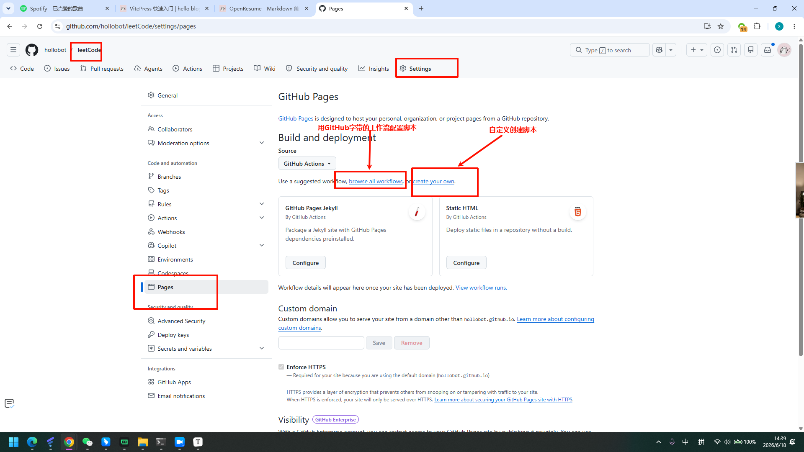
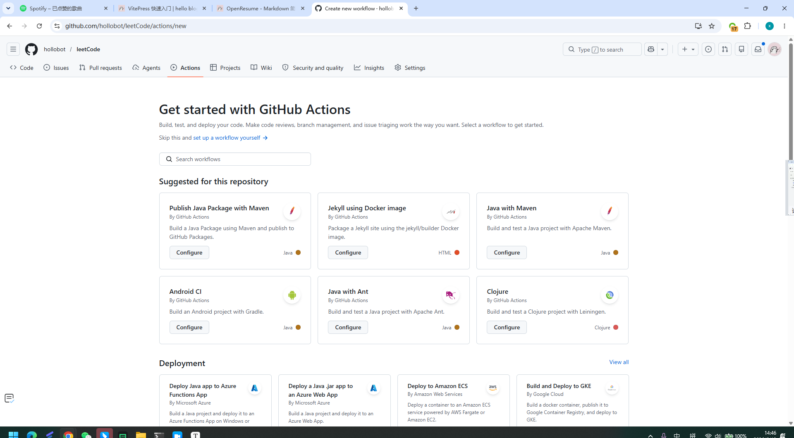
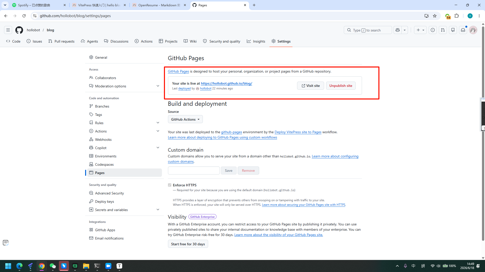

# GitHub Pages 部署 Vue3 · GitHub Actions 最终版

## 一、修改 `vite.config.js`

```js
import { defineConfig } from 'vite'
import vue from '@vitejs/plugin-vue'

export default defineConfig({
  plugins: [vue()],
  // process.env.GITHUB_ACTIONS 在 GitHub Actions 环境中自动为 true，本地开发为 undefined
  base: process.env.GITHUB_ACTIONS ? '/my-vue-app/' : '/',
  // ⚠️ my-vue-app 换成你的仓库名，大小写必须完全一致
})
```

---

## 二、创建 `.github/workflows/deploy.yml`

在 Github 对应仓库页面创建：



使用现成的模板：



根据项目自定义工作流脚本：

```yaml
# 工作流名称
name: Deploy to GitHub Pages

# 触发时机：push 到 main 分支时自动运行
on:
  push:
    branches:
      - main

# 声明权限
# contents: read     — 允许读取仓库代码
# pages: write       — 允许写入 GitHub Pages
# id-token: write    — 允许生成身份令牌（官方部署方式必须）
permissions:
  contents: read
  pages: write
  id-token: write

# 并发控制：同一时间只允许一个部署在跑
# cancel-in-progress: true 表示如果有新的推送，取消正在进行的旧部署
concurrency:
  group: pages
  cancel-in-progress: true

jobs:
  # ── Job 1：构建 ──────────────────────────────
  build:
    runs-on: ubuntu-latest   # 在 GitHub 提供的 Ubuntu 服务器上运行
    steps:
      # 1. 拉取仓库代码
      - name: Checkout
        uses: actions/checkout@v4

      # 2. 安装 Node.js 20，并启用 npm 缓存加速后续安装
      - name: Setup Node.js
        uses: actions/setup-node@v4
        with:
          node-version: '20'
          cache: 'npm'

      # 3. 安装项目依赖
      - name: Install dependencies
        run: npm install

      # 4. 执行构建，输出到 dist 目录
      #    此时 GITHUB_ACTIONS=true 已自动注入，base 会切换为 /my-vue-app/
      - name: Build
        run: npm run build

      # 5. 初始化 GitHub Pages 环境
      - name: Setup Pages
        uses: actions/configure-pages@v4

      # 6. 将 dist 目录打包上传为 Pages artifact（供下一个 job 使用）
      - name: Upload artifact
        uses: actions/upload-pages-artifact@v3
        with:
          path: ./dist

  # ── Job 2：部署 ──────────────────────────────
  # needs: build 表示必须等 build job 成功后才会执行
  deploy:
    needs: build
    runs-on: ubuntu-latest
    environment:
      name: github-pages
      url: ${{ steps.deployment.outputs.page_url }}  # 部署完成后输出访问地址（不用更改）
    steps:
      # 将上一步上传的 artifact 正式发布到 GitHub Pages
      - name: Deploy to GitHub Pages
        id: deployment
        uses: actions/deploy-pages@v4
```

---

## 三、推送代码

```bash
git init
git add .
git commit -m "init"
git branch -M main
git remote add origin https://github.com/你的用户名/my-vue-app.git
git push -u origin main
```

---

## 四、确认部署

仓库 → **Actions** 标签页，看到 `build ✅ → deploy ✅` 后访问：

```
https://你的用户名.github.io/my-vue-app/
```



---

## 后续更新

```bash
git add .
git commit -m "update"
git push
```

---

## 常见问题

| 现象 | 原因 | 解决 |
| --- | --- | --- |
| 页面空白 / 资源 404 | `base` 仓库名错误 | 检查大小写是否和 GitHub 仓库名完全一致 |
| 刷新页面 404 | 使用了 History 路由 | 改为 `createWebHashHistory()` |
| Actions ❌ 失败 | 构建报错 | 点进 Actions 查看详细日志 |