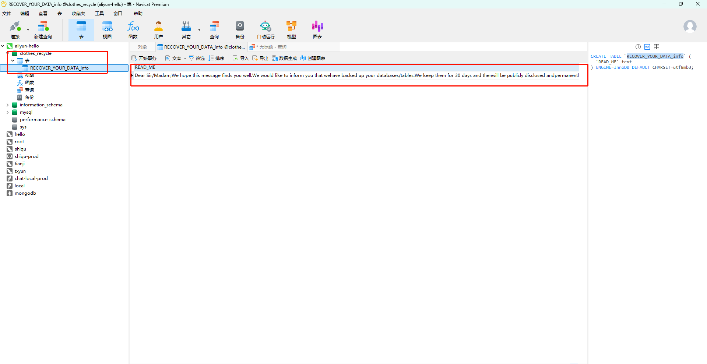

# 数据库勒索邮件攻击事件日志

> 起因是我部署项目到阿里云服务器，第二天访问接口报错，查看日志发现该表不存在，这时我就知道数据库的表没有了。


## 一、事件简述

收到境外英文勒索邮件，对方谎称已暴力获取数据库权限、窃取并备份全部业务数据，以30天后公开泄露、黑市售卖、通报竞品及监管方作为威胁，要求支付指定金额比特币赎金，提供付费防泄露、付费数据恢复两种勒索方案，诱导使用虚拟货币交易完成敲诈。

整个数据库表被删除。




留下一个 `RECOVER_YOUR_DATA_info` 表，里面带有一条read_me 信息，信息如下。

```markdown
Dear Sir/Madam,

We hope this message finds you well.

We would like to inform you that we
have backed up your databases/tables.
We keep them for 30 days and then
will be publicly disclosed and
permanently delete them
from our servers.

We offer two options:

Option 1.: recovery service + leak protection

if you want to recover your corrupted
or incomplete databases/tables and
you want to prevent it from being
leaked, simply transfer
1300 USD in BTC to this address:

13uwja3CSDX6f6TPVdCvX1xiaHB6NrysbY

This address is assigned to your
database credentials (host + user:
8.136.30.123 + root).
We will know when you have paid.

After payment confirmation, our
program will restore the entire
databases/tables automatically, so
please do not change your database
login details and make sure the
database is still accessible from
outside the local network.
Don not worry. All your databases and
tables will be restored. (If the
restore fails the current field will
be modified and provide links for you
to download your datas). The saved
files will be immediately deleted
from our servers.

Option 2.: leak protection only

If you don not need to restore your
databases but you want to prevent it
from being leaked, send
600 USD in BTC to this address:

13uwja3CSDX6f6TPVdCvX1xiaHB6NrysbY

In this case, your data will not be
made public and will be deleted from
our servers immediately, without
any further recovery service.


-------------
Please take note of the following:

After 30 days, we cannot guarantee
the restoration of your data.

The only way to recover your data
(and prevent it from being leaked)
is by making the payment.

Data leaks can have serious
consequences. Rest assured,
your data is protected.

Once your payment is completed,
all your data will be deleted from
our servers. Currently, government
agencies, competitors, contractors,
and local media remain unaware of
the incident. Upon receiving your
payment, we guarantee that these
entities will not be contacted about
this matter, ensuring your privacy
and the confidentiality of the
situation are maintained.

Pay now, and we guarantee that your
data will not be sold on dark web
resources or used to attack your
company, employees, or counterparties
in the future. The full database dump
will be restored, and all other data
will be immediately deleted from our
servers.

If you do not send the requested
amount within 30 days from the date
of the incident, we will consider the
transaction incomplete. Your data
will then be sent to any interested
parties. This is your responsibility.

After payment confirmation, our
system will automatically restore the
entire databases/tables, so please do
not change your database login
details and make sure the database is
still accessible from outside the
local network.

-------------
The only accepted payment method is
Bitcoin. To the wallet specified above.

Be advised: PayPal, WeTransfer,
Alipay, credit cards, and other
methods will not be accepted.

If you do not have Bitcoin, you can
purchase it using a credit card from
the following websites:

Coinbase: https://www.coinbase.com/
MoonPay: https://www.moonpay.com/buy
Paybis: https://paybis.com/
Changelly: https://changelly.com/buy
Aqua: https://aqua.net/
CEX: https://cex.io/
HodlHodl: https://hodlhodl.com

Alternatively, you can buy Bitcoin
using other payment methods from the
following platforms (some of them
work in China):

Coinbase: https://www.coinbase.com/
Paxful: https://paxful.com/
Binance: https://www.binance.com/
Crypto.com: https://www.crypto.com/
Huobi: https://www.huobi.com/
OKCoin: https://www.okcoin.com/
BTCC: https://www.btcc.com/
Paybis: https://paybis.com/
Coinmama: https://coinmama.com/
Bitfinex: https://www.bitfinex.com/

For users in China, Bitcoin can be
purchased with Alipay from:

CoinCola:
https://www.coincola.com/?lang=zh-HK
BitValve:
https://www.bitvalve.com/buy-bitcoin/alipay

Thank you for your time and
consideration. Good luck.
```


## 二、攻击方式分析
1. **信息搜集与广撒网投递**
攻击者通过全网端口扫描、弱口令探测，批量搜集暴露外网的数据库IP、端口及常见账号（如root），批量群发模板化勒索邮件，属于**大范围钓鱼+恐吓式批量攻击**。

2. **弱口令/外网暴露漏洞利用**
核心攻击前提：数据库直接暴露公网、未做IP白名单、防火墙未限制访问，搭配常见弱口令，极易被扫描工具探测、暴力破解，为恐吓勒索提供话术支撑。

3. **心理恐吓勒索手段**
利用企业对数据泄露、口碑、合规风险的顾虑，通过限期威胁、分级赎金、限制支付方式（仅比特币），逼迫受害者被动妥协，属于典型黑产敲诈链路。

## 三、问题根源
1. 数据库服务对外开放，无访问白名单限制；
2. 数据库、服务器账号密码复杂度低，存在弱口令风险；
3. 缺少入侵检测、端口防护与日常安全巡检机制；
4. 未建立完善异地备份与安全应急方案。

## 四、解决方案与整改措施
### 1. 紧急处置
- 不予回复、拒绝支付任何虚拟货币赎金，避免二次勒索；
- 留存邮件原文取证，拉黑拦截同类恶意发件源。

### 2. 网络权限加固
- 防火墙关闭数据库外网映射端口，仅放行内网、办公固定IP白名单；
- 禁止数据库、服务器核心服务直接暴露公网。

### 3. 账号与权限安全
- 重置数据库root、服务器远程登录密码，使用高强度组合密码；
- 禁用不必要高危账号，限制数据库远程登录权限。

### 4. 安全检测与防护
- 核查服务器、数据库登录日志，排查异常IP与爆破记录；
- 开启防火墙、安全组策略，拦截境外恶意扫描、暴力破解行为。

### 5. 数据备份保障
- 配置定时自动备份，做多副本、异地备份存储；
- 定期校验备份文件可用性，确保故障可快速回滚。

### 6. 长期防御
- 定期修复系统、数据库漏洞补丁；
- 建立常态化安全巡检，重点排查公网暴露服务与弱口令问题。