### 制造图

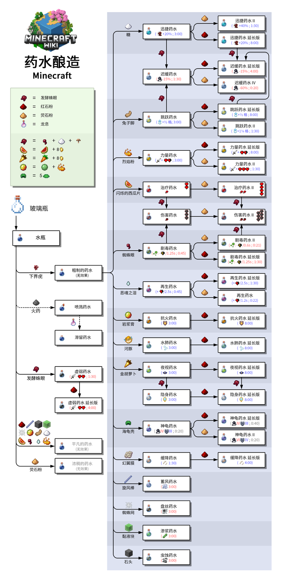

### 基础药水

基础药水是在酿造主要药水前首先要制作的药水。所有基础药水在饮用时均无任何效果。

|                             图标                             |    名称    |                             作用                             |
| :----------------------------------------------------------: | :--------: | :----------------------------------------------------------: |
| 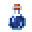 |    水瓶    |                       每一种配方的基础                       |
|  | 粗制的药水 | 所有主要药水的基础 （虚弱药水可以直接通过对水瓶加入发酵蛛眼来酿造） |
|  | 浓稠的药水 | 酿造虚弱药水[仅[基岩版](https://zh.minecraft.wiki/w/基岩版)] |
|  | 平凡的药水 | 酿造虚弱药水[仅[基岩版](https://zh.minecraft.wiki/w/基岩版)] |

### 主要药水

请注意：二级药水的持续时间永远是对应基础药水的一半（Java版剧毒药水除外）。延长版药水的持续时间是对应未延长的一级药水的2倍或8⁄3。

#### 正面效果

|                             图标                             |                             名称                             |                           持续时间                           |                             作用                             |
| :----------------------------------------------------------: | :----------------------------------------------------------: | :----------------------------------------------------------: | :----------------------------------------------------------: |
| 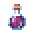 |                           再生药水                           |                             0:45                             | 每50刻（2.5秒）回复1（-1751716615515-434.png)），共回复18（-1751716615515-440.png) × 9）。 |
|                           再生药水                           | 1:30[仅[Java版](https://zh.minecraft.wiki/w/Java版)] 2:00[仅[基岩版](https://zh.minecraft.wiki/w/基岩版)] | 每50刻（2.5秒）回复1（-1751716615515-434.png)），共回复36（-1751716615515-440.png) × 18）[仅[Java版](https://zh.minecraft.wiki/w/Java版)]或48（ × 24）[仅[基岩版](https://zh.minecraft.wiki/w/基岩版)]。 |                                                              |
|                         再生药水 II                          |                            0:22.5                            | 每25刻（1.25秒）回复1（-1751716615515-434.png)），共回复18（ × 9）。 |                                                              |
| 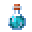 |                           迅捷药水                           |                             3:00                             |       增加20%移动速度，同时增加视野（疾跑每秒6.6格）。       |
|                           迅捷药水                           |                             8:00                             |                                                              |                                                              |
|                         迅捷药水 II                          |                             1:30                             |        增加40%移动速度，同时增加视野（疾跑每秒8格）。        |                                                              |
| 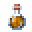 |                           抗火药水                           |                             3:00                             | 给予对火、熔岩、[烈焰人](https://zh.minecraft.wiki/w/烈焰人)的远程攻击和[岩浆块](https://zh.minecraft.wiki/w/岩浆块)伤害的免疫力。 |
|                           抗火药水                           |                             8:00                             |                                                              |                                                              |
| 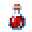 |                           治疗药水                           |                             瞬间                             | 回复4（） |
|                         治疗药水 II                          |                             瞬间                             | 回复8（） |                                                              |
| 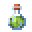 |                           夜视药水                           |                             3:00                             | 在视觉上将所有物体的亮度提高到15。 用蓝色的光使水变亮，用橘色的光使熔岩变亮，但其他没有此效果的玩家不能看到增大的亮度。 |
|                           夜视药水                           |                             8:00                             |                                                              |                                                              |
| 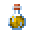 |                           力量药水                           |                             3:00                             | 在[Java版](https://zh.minecraft.wiki/w/Java版)中，增加3（-1751716615515-434.png)）近战攻击伤害。 在[基岩版](https://zh.minecraft.wiki/w/基岩版)中，增加30%近战攻击伤害+1（）伤害。 |
|                           力量药水                           |                             8:00                             |                                                              |                                                              |
|                         力量药水 II                          |                             1:30                             | 在[Java版](https://zh.minecraft.wiki/w/Java版)中，增加6（）近战攻击伤害。 在[基岩版](https://zh.minecraft.wiki/w/基岩版)中，增加69%近战攻击伤害+2.3（ × 1.15）伤害。 |                                                              |
| 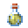 |                           跳跃药水                           |                             3:00                             | 允许玩家跳得更高，并减少摔落伤害，每等级降低摔落伤害1（）。 |
|                           跳跃药水                           |                             8:00                             |                                                              |                                                              |
|                         跳跃药水 II                          |                             1:30                             |     进一步增加跳跃高度（超过2个方块），并减少摔落伤害。      |                                                              |
| 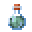 |                           水肺药水                           |                             3:00                             |                     在水下不消耗氧气条。                     |
|                           水肺药水                           |                             8:00                             |                                                              |                                                              |
| 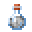 |                           隐身药水                           |                             3:00                             |         隐藏大多数生物模型，降低被生物探测到的范围。         |
|                           隐身药水                           |                             8:00                             |                                                              |                                                              |
| 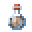 |                           缓降药水                           |                             1:30                             | 让玩家以较慢的速度下降，并且掉落到地面时不会受到任何伤害，这使得玩家在疾跑时可以跳过差不多6个方块。并且玩家在拥有这种药水效果时不能通过跳跃来摧毁任何农作物。 |
|                           缓降药水                           |                             4:00                             |                                                              |                                                              |
| 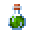 |  幸运药水 [仅[Java版](https://zh.minecraft.wiki/w/Java版)]   |                             5:00                             | 增加幸运[属性](https://zh.minecraft.wiki/w/属性#玩家的额外属性)1点。 |

#### 负面效果

|                             图标                             |                             名称                             |                           持续时间                           |                             作用                             |
| :----------------------------------------------------------: | :----------------------------------------------------------: | :----------------------------------------------------------: | :----------------------------------------------------------: |
| 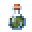 |                           剧毒药水                           |                             0:45                             | 随着时间受到36（ × 18）伤害，最多使生命减到1（）。 |
|                           剧毒药水                           | 1:30[仅[Java版](https://zh.minecraft.wiki/w/Java版)] 2:00[仅[基岩版](https://zh.minecraft.wiki/w/基岩版)] | 随着时间受到72（ × 36）[仅[Java版](https://zh.minecraft.wiki/w/Java版)]或96（ × 48）[仅[基岩版](https://zh.minecraft.wiki/w/基岩版)]伤害，最多使生命减到1（）。 |                                                              |
|                         剧毒药水 II                          | 0:21.6[仅[Java版](https://zh.minecraft.wiki/w/Java版)] 0:22.5[仅[基岩版](https://zh.minecraft.wiki/w/基岩版)] | 随着时间受到36（ × 18）伤害，最多使生命减到1（）。 |                                                              |
| 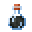 |                           虚弱药水                           |                             1:30                             | 减少4（）的近战伤害。 |
|                           虚弱药水                           |                             4:00                             |                                                              |                                                              |
|  |                           迟缓药水                           |                             1:30                             |        降低15%移动速度和减少视野。（疾跑每秒4.75格）         |
|                           迟缓药水                           |                             4:00                             |                                                              |                                                              |
|                         迟缓药水 IV                          |                             0:20                             |        降低60%移动速度和减少视野。（疾跑每秒2.25格）         |                                                              |
| 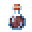 |                           伤害药水                           |                             瞬间                             | 造成6（）的伤害。 |
|                         伤害药水 II                          |                             瞬间                             | 造成12（ × 6）的伤害。 |                                                              |
| 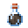 |  衰变药水 [仅[基岩版](https://zh.minecraft.wiki/w/基岩版)]   |                             0:40                             | 每秒给予1（）的伤害，造成总数为40（ × 20）的伤害。 |
|  |                           蓄风药水                           |                             3:00                             | 生物死亡后产生[风爆](https://zh.minecraft.wiki/w/爆炸#风爆)。 |
|  |                           盘丝药水                           |                             3:00                             | 生物死亡后在附近生成[蜘蛛网](https://zh.minecraft.wiki/w/蜘蛛网)。会被蜘蛛网减速的生物会以正常速度的50%穿过蜘蛛网。 |
|  |                           渗浆药水                           |                             3:00                             | 生物死亡后生成[史莱姆](https://zh.minecraft.wiki/w/史莱姆)。 |
| 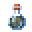 |                           虫蚀药水                           |                             3:00                             | 生物受伤时有概率生成[蠹虫](https://zh.minecraft.wiki/w/蠹虫)。 |

### 混合效果的药水

|                             图标                             |   名称   |               持续时间               |                 作用                  |
| :----------------------------------------------------------: | :------: | :----------------------------------: | :-----------------------------------: |
| 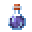 | 神龟药水 |                 0:20                 | 为玩家提供缓慢IV和抗性提升III的效果。 |
|                           神龟药水                           |   0:40   |                                      |                                       |
|                         神龟药水 II                          |   0:20   | 为玩家提供缓慢VI和抗性提升IV的效果。 |                                       |

### 不可合成的药水

**本段落所述内容仅适用于[Java版](https://zh.minecraft.wiki/w/Java版)。**

不可合成的药水是无药水效果的药水，它不能在生存模式获取。它也有喷溅药水、滞留药水和药箭的版本。

药水在没有药水效果或有游戏无法识别的药水效果ID时，其药水效果ID被移除，变为不可合成的药水。

它能通过以下命令获得：`/give @s minecraft:potion`。

|                             图标                             |      名称      |
| :----------------------------------------------------------: | :------------: |
|  | 不可合成的药水 |