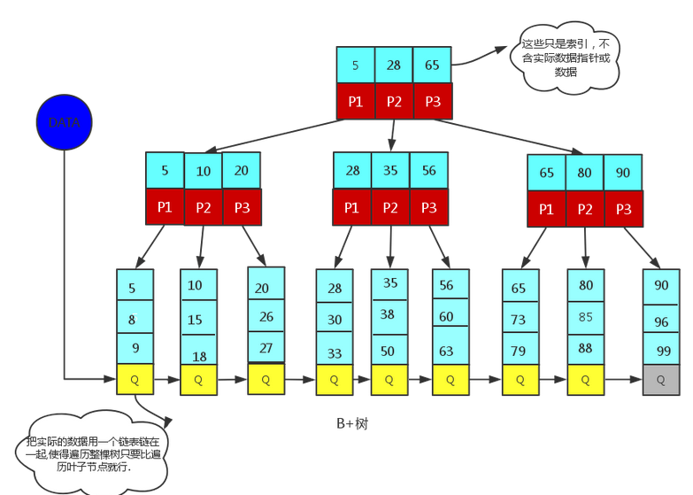
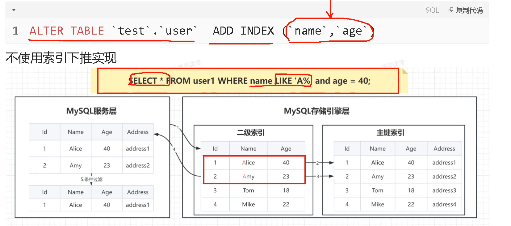
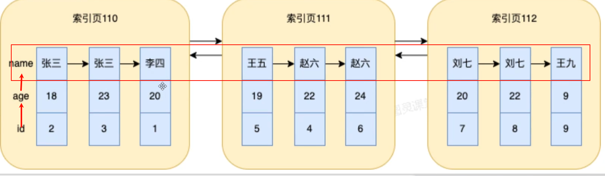
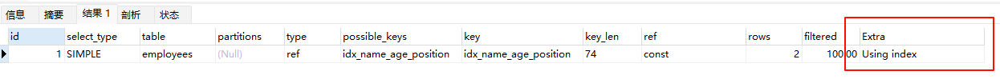

# 索引

### 索引基础概念

**索引的本质**索引是数据库表中一个或多个列的值的有序结构，类似于书本的目录，用于快速定位和访问数据。索引存储了指向实际数据行的指针。

**索引的作用**

- 大幅提升查询速度
- 加速ORDER BY和GROUP BY操作
- 加快表连接速度
- 帮助实现唯一性约束


**索引的物理存储**

**聚集索引（主键索引）**：数据行和索引存储在一起，叶子节点包含完整的数据行

**非聚集索引（二级索引）**：索引和数据分开存储，叶子节点包含主键值


### 索引类型

#### **按数据结构分类**

- **B-Tree索引**：最常用的索引类型，适合等值查询和范围查询
- **Hash索引**：适合等值查询，不支持范围查询
- **Full-text索引**：用于全文搜索
- **空间索引**：用于地理数据类型


**B+Tree结构（InnoDB默认）**

```markdown
特点：
- 所有数据都在叶子节点
- 叶子节点通过指针连接，支持范围查询
- 非叶子节点只存储键值和指针
- 树的高度通常为3-4层，查询效率稳定
```



**B-Tree vs B+Tree**

- B-Tree：每个节点都可能包含数据
- B+Tree：只有叶子节点包含数据，非叶子节点只做索引


**Hash索引（Memory引擎）**

- 等值查询非常快 O(1)
- 不支持范围查询
- 不支持排序
- 存在Hash冲突问题


#### **按字段特性分类**

- **主键索引**：PRIMARY KEY自动创建，唯一且非空。
- **唯一索引**：UNIQUE约束，保证字段值唯一
- **普通索引**：最基本的索引类型
- **复合索引**：包含多个字段的索引

**一级索引（主键索引）、二级索引（除了主键索引）**


### 索引分类详解

#### **按存储结构分类**

**聚集索引**（Clustered Index） 

数据行和索引存储在一起，叶子节点包含完整的数据行

```sql
-- 主键自动创建聚集索引
CREATE TABLE users (
    id INT PRIMARY KEY,
    name VARCHAR(50),
    age INT
);
```


**非聚集索引**（Non-Clustered Index）

索引和数据分开存储，叶子节点包含主键值

```sql
-- 在非主键字段创建
CREATE INDEX idx_name ON users(name);
```

```
InnoDB的存储方式是聚集索引，MyISAM的存储方式是非聚集索引。
```


**模型图对比**

两者都是用的 `B+Tree` 结构


#### **按字段数量分类**

**单列索引**

```sql
CREATE INDEX idx_age ON users(age);
```

**复合索引（联合索引）**

```sql
CREATE INDEX idx_name_age_city ON users(name, age, city);
```


#### **按功能特性分类**

**唯一索引**

```sql
CREATE UNIQUE INDEX idx_email ON users(email);
```

**前缀索引**

```sql
-- 只索引字符串的前10个字符
CREATE INDEX idx_name_prefix ON users(name(10));
```

**部分索引（条件索引）**

```sql
-- MySQL 8.0支持函数索引
CREATE INDEX idx_email_domain ON users((SUBSTRING(email, LOCATE('@', email) + 1)));
```


#### **复合索引深入解析**

 **最左前缀原则**

```sql
-- 创建复合索引
CREATE INDEX idx_abc ON table_name(a, b, c);

-- 以下查询可以使用索引：
SELECT * FROM table_name WHERE a = 1;
SELECT * FROM table_name WHERE a = 1 AND b = 2;
SELECT * FROM table_name WHERE a = 1 AND b = 2 AND c = 3;
SELECT * FROM table_name WHERE a = 1 AND c = 3; -- 只能用到a

-- 以下查询不能使用索引：
SELECT * FROM table_name WHERE b = 2;
SELECT * FROM table_name WHERE c = 3;
SELECT * FROM table_name WHERE b = 2 AND c = 3;
```

**索引字段顺序优化**

```sql
-- 区分度高的字段放前面
CREATE INDEX idx_status_create_time ON orders(status, create_time);
-- 而不是
CREATE INDEX idx_create_time_status ON orders(create_time, status);
```

**范围查询字段位置**

```sql
-- 范围查询字段应放在复合索引的最后
CREATE INDEX idx_city_age_salary ON employees(city, age, salary);

-- 好的查询
SELECT * FROM employees WHERE city = 'Beijing' AND age BETWEEN 25 AND 35;

-- 不好的查询（salary后面的索引无法使用）
SELECT * FROM employees WHERE city = 'Beijing' AND age BETWEEN 25 AND 35 AND salary > 10000;
```

**联合索引优势**

```sql
-- 1、减少开销
-- 建一个联合索引l(a,b,c),实际相当于建了(a),(a,b),(a,b,c)三个索引.每多一个索引,都会增加写操作的开销和磁盘空间的开销。
-- 对于大量数据的表，使用联合索引会大大的减少开销！

-- 2、覆盖索引
-- 联合索引更加易于覆盖索引，以此减少回表次数，大大增加效率。
CREATE INDEX idx_name_age ON users(name, age); -- 创建联合索引
SELECT name, age FROM users WHERE name = 'John';
```


### 索引下推

索引下推（Index Condition Pushdown，简称ICP）是MySQL数据库中一种重要的查询优化技术，从MySQL 5.6版本开始引入。

假设有表 `users(id, name, age, city)` 和索引 `idx_name_age(name, age)`：

```sql
SELECT * FROM users WHERE name LIKE 'John%' AND age > 30;
```

**没有ICP：**

1. 通过索引找到所有name以'John'开头的记录
2. 读取完整记录
3. 在服务器层检查age > 30条件

**使用ICP：**

1. 在索引层面同时检查 `name LIKE 'John%' AND age > 30`
2. 只读取同时满足两个条件的完整记录




### 索引的优缺点

**优点**

1. 显著提升查询速度
2. 支持高效排序、加速连接操作 `JOIN` 、优化分组和聚合

**缺点**

1. 创建索引和维护索引都要耗费时间，这种时间随着数据量的增加而增加。
2. 额外的存储空间
3. 写操作性能下降，索引越多，写操作越慢（INSERT、UPDATE、DELETE操作需要同时维护索引）


### 索引优化策略

#### 选择合适的字段创建索引

**应该创建索引的字段：**

1. 频繁查询的字段
2. WHERE子句中的字段
3. ORDER BY字段
4. GROUP BY字段
5. JOIN连接字段
6. 经常用于排序的字段

**不应该创建索引的字段：**

1. 更新频繁的字段（索引会拉低写的效率）
2. 区分度很低的字段（唯一性差）
3. 表数据量很少的情况
4. 不经常使用的字段


#### **字符串索引长度选择**

```sql
-- 分析字段的区分度
SELECT 
    COUNT(DISTINCT LEFT(column_name, 3)) / COUNT(*) AS sel3,
    COUNT(DISTINCT LEFT(column_name, 4)) / COUNT(*) AS sel4,
    COUNT(DISTINCT LEFT(column_name, 5)) / COUNT(*) AS sel5
FROM table_name;

-- 选择区分度接近1的最短长度
CREATE INDEX idx_name_prefix ON table_name(column_name(4));
```

**核心概念：区分度（Selectivity）**

区分度 = 不重复值的数量 / 总记录数

- 区分度越接近1，说明字段的唯一性越高
- 区分度越接近0，说明字段重复值越多


#### **避免索引失效**

- 函数操作导致索引失效

```sql
-- 不会使用索引
SELECT * FROM users WHERE UPPER(name) = 'JOHN';
SELECT * FROM users WHERE age + 1 = 25;

-- 会使用索引
SELECT * FROM users WHERE name = 'john';
SELECT * FROM users WHERE age = 24;
```

- 隐式类型转换

```sql
-- phone字段是VARCHAR类型，不会使用索引
SELECT * FROM users WHERE phone = 13812345678;

-- 正确写法
SELECT * FROM users WHERE phone = '13812345678';
```

- 模糊查询优化

```sql
-- 不会使用索引
SELECT * FROM users WHERE name LIKE '%john%';

-- 会使用索引
SELECT * FROM users WHERE name LIKE 'john%';
```


####  **索引监控和维护**

- **查看索引使用情况**

```sql
-- 查看表的索引信息
SHOW INDEX FROM table_name;

-- 查看索引统计信息
SELECT * FROM information_schema.STATISTICS 
WHERE TABLE_NAME = 'your_table';

-- 查看未使用的索引
SELECT * FROM sys.schema_unused_indexes;
```

- **分析查询执行计划**

```sql
-- 基本执行计划
EXPLAIN SELECT * FROM employees where left(name,3) = '张三';

-- 详细执行计划
EXPLAIN FORMAT=JSON SELECT * FROM employees where left(name,3) = '张三';

-- 实际执行统计
EXPLAIN ANALYZE SELECT * FROM employees where left(name,3) = '张三';
```


**EXPLAIN重要字段解释：**

- **type**: 连接类型（system > const > eq_ref > ref > range > index > ALL）性能关系

- **possible_key**: 可能使用索引 （就是可能使用索引，这个是否使用MySQL会根据两种性能判断，可以通过 `force index (索引名)` 强制使用索引 ）

  ```sql
  -- 没有使用索引
  EXPLAIN SELECT * FROM employees where name != '张三'
  -- 强制使用索引 使用前提是possible_key有显示可能使用的索引，而type=all 全表扫描。
  EXPLAIN SELECT * FROM employees force index(idx_name_age_position) where name != '张三'
  ```

- **key**: 实际使用的索引

- **key_len**:这表示使用多少字节的索引长度

- **rows**: 扫描的行数

- **Extra**: 额外信息（`Using index` 最优 如覆盖索引, `Using filesort` 需要优化 如没有索引排序。等）


#### 全值匹配

MySQL全值匹配是指在使用复合索引时，查询条件要包含索引的所有列，才能最大程度地利用索引。

```sql
KEY `idx_name_age_position` (`name`,`age`,`position`) -- 三个索引字段总共占140字节 总和 key_len = 140

-- 全值匹配 key_len = 140
EXPLAIN SELECT * FROM employees where name = '张三' and age = '28' and position = '软件工程师';
```


#### 最左前缀原则

```sql
KEY `idx_name_age_position` (`name`,`age`,`position`)

-- name 74 age 78 position 140 后面索引 908。key_len = 140
EXPLAIN SELECT * FROM employees where name = '张三' and age = '28' and position = '软件工程师';

-- 带头大哥不能死，没有使用索引。key_len = 0
EXPLAIN SELECT * FROM employees where age = '28' and position = '软件工程师';

-- 中间兄都不能断 key_len = 74 只用到name索引。
EXPLAIN SELECT * FROM employees where name = '张三' and position = '软件工程师';
```

**为什么必须要保证最左变的索引条件**？

```
应为只有最左边的索引字段name是有序的
索引有效的条件一定是有序，所有必须是要带头大哥。
后面的索引字段的顺序都是依赖与前面的字段，所有中间字段如果没有后面的索引也不会生效，最后只有前面的索引生效。
```

**B+Tree 索引模型图-叶子节点**




#### **索引列不要函数操作**

不在索引列上做任何操作（计算、函数、（自动or手动）类型转换），会导致索
引失效而转向全表扫描。

```sql
-- 索引失效 left函数计算所有name前3字符，然后比对。这样计算后的是无序的，MySQL无法利用B+树索引的有序性进行快速查找。
EXPLAIN SELECT * FROM employees where left(name,3) = '张三';

-- 索引失效 前缀通配符%导致无法确定搜索的起始位置，B+树索引是按照字符串的字典序组织的，只能从左到右匹配。
EXPLAIN SELECT * FROM employees where name like '%张三';

-- name 索引生效 key_len = 74
EXPLAIN SELECT * FROM employees where name like '张三%';
```


#### 范围后面全失效

```sql
-- key_len = 140 全索引使用
EXPLAIN SELECT * FROM employees where name = '张三' and age = 28 and position = '软件工程师';

-- key_len = 78。age > 28 (key_len = 78) - 索引被截断。原因age范围查找使得后面position数据无序了
EXPLAIN SELECT * FROM employees where name = '张三' and age > 28 and position = '软件工程师';

-- key_len = 140 
-- 当MySQL发现 age >= 28 实际上可能等价于 age = 28（如果数据分布或统计信息显示只有age=28的记录），优化器可能会将其优化为等值查询，从而使用完整索引。
EXPLAIN SELECT * FROM employees where name = '张三' and age >= -10 and position = '软件工程师';
```


#### **覆盖索引** 

索引包含查询所需的所有字段，无需回表查询：

实际开发尽量不用 `select * from`  尽量将查询的内容字段设置为索引字段，这就是覆盖索引，无需回表查询非索引数据。

```sql
-- 索引覆盖查询 
EXPLAIN SELECT age,position FROM employees where name = '张三';
-- 如果存在索引 idx_name_age，则无需回表
```

**Extra = Using index  最优  **    （通过 Extra = Using index 判断是否是覆盖索引）




#### 不等和null

```sql
-- name 是 null，不使用索引。（name is not null 也会索引失效）
EXPLAIN SELECT * FROM employees where name is not null
-- 索引失效 可以使用 force index(idx_name_age_position) 强制使用索引
EXPLAIN SELECT * FROM employees where name != '张三'
```


#### **Like % 不写开头**

```sql
-- 索引失效 前缀通配符%导致无法确定搜索的起始位置，B+树索引是按照字符串的字典序组织的，只能从左到右匹配。
EXPLAIN SELECT * FROM employees where name like '%张三';

-- name 索引生效 key_len = 74
EXPLAIN SELECT * FROM employees where name like '张三%';

-- name 索引生效 key_len = 74
EXPLAIN SELECT * FROM employees where name like '张%三%';
```


#### varchar类型 数据不加 `''`

```sql
-- phone字段是VARCHAR类型，不会使用索引（实际上类型不一致就会去调用类型转化函数，导致索引失效）
SELECT * FROM users WHERE phone = 13812345678;

-- 正确写法
SELECT * FROM users WHERE phone = '13812345678';
```


#### 大范围查询优化

```sql
-- 索引可能失效
EXPLAIN SELECT * FROM employees where age >= 1 and age <=2000;
```

**没走索引原因**：MySQL内部优化器会根据检索比例、表大小等多个因素整体评估是否使用索引。比如
这个例子，可能是由于单次数据量查询过大导致优化器最终选择不走索引


**优化方法**：可以将大的范围拆分成多个小范围

```sql
-- 合并数据返回
EXPLAIN SELECT * FROM employees where age >= 1 and age <=1000;
EXPLAIN SELECT * FROM employees where age >= 1001 and age <=2000;
```


#### 索引优化总结

**全值匹配我最爱，最左前缀要遵守；**


**带头大哥不能死，中间兄弟不能断；**


**索引列上少计算，范围之后全失效；**


**Like百分写最右，覆盖索引不写星；**


**不等空值还有or，索引失效要少用；**


**VAR引号不可丢，SQL高级也不难！**
