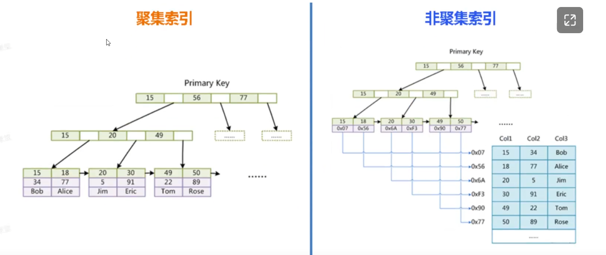

# 索引

### 索引基础概念

**索引的本质**索引是数据库表中一个或多个列的值的有序结构，类似于书本的目录，用于快速定位和访问数据。索引存储了指向实际数据行的指针。

**索引的作用**

- 大幅提升查询速度
- 加速ORDER BY和GROUP BY操作
- 加快表连接速度
- 帮助实现唯一性约束


**索引的物理存储**

**聚集索引（主键索引）**：数据行和索引存储在一起，叶子节点包含完整的数据行

**非聚集索引（二级索引）**：索引和数据分开存储，叶子节点包含主键值


### 索引类型

#### **按数据结构分类**

- **B-Tree索引**：最常用的索引类型，适合等值查询和范围查询
- **Hash索引**：适合等值查询，不支持范围查询
- **Full-text索引**：用于全文搜索
- **空间索引**：用于地理数据类型

**B+Tree结构（InnoDB默认）**

```markdown
特点：
- 所有数据都在叶子节点
- 叶子节点通过指针连接，支持范围查询
- 非叶子节点只存储键值和指针
- 树的高度通常为3-4层，查询效率稳定
```

**B-Tree vs B+Tree**

- B-Tree：每个节点都可能包含数据
- B+Tree：只有叶子节点包含数据，非叶子节点只做索引

**Hash索引（Memory引擎）**

- 等值查询非常快 O(1)
- 不支持范围查询
- 不支持排序
- 存在Hash冲突问题


#### **按字段特性分类**

- **主键索引**：PRIMARY KEY自动创建，唯一且非空
- **唯一索引**：UNIQUE约束，保证字段值唯一
- **普通索引**：最基本的索引类型
- **复合索引**：包含多个字段的索引


### 索引分类详解

#### **按存储结构分类**

**聚集索引**（Clustered Index） 

数据行和索引存储在一起，叶子节点包含完整的数据行

```sql
-- 主键自动创建聚集索引
CREATE TABLE users (
    id INT PRIMARY KEY,
    name VARCHAR(50),
    age INT
);
```


**非聚集索引**（Non-Clustered Index）

索引和数据分开存储，叶子节点包含主键值

```sql
-- 在非主键字段创建
CREATE INDEX idx_name ON users(name);
```

```
InnoDB的存储方式是聚集索引，MyISAM的存储方式是非聚集索引。
```


**模型图对比**

两者都是用的 `B+Tree` 结构




#### **按字段数量分类**

**单列索引**

```sql
CREATE INDEX idx_age ON users(age);
```

**复合索引（联合索引）**

```sql
CREATE INDEX idx_name_age_city ON users(name, age, city);
```

**覆盖索引** 索引包含查询所需的所有字段，无需回表查询：

实际开发尽量不用 `select * from`  尽量将查询的内容字段设置为索引字段，这就是覆盖索引，无需回表查询非索引数据。

```sql
-- 索引覆盖查询 
SELECT name, age FROM users WHERE name = 'John';
-- 如果存在索引 idx_name_age，则无需回表
```

 

#### **按功能特性分类**

**唯一索引**

```sql
CREATE UNIQUE INDEX idx_email ON users(email);
```

**前缀索引**

```sql
-- 只索引字符串的前10个字符
CREATE INDEX idx_name_prefix ON users(name(10));
```

**部分索引（条件索引）**

```sql
-- MySQL 8.0支持函数索引
CREATE INDEX idx_email_domain ON users((SUBSTRING(email, LOCATE('@', email) + 1)));
```


#### **复合索引深入解析**

 **最左前缀原则**

```sql
-- 创建复合索引
CREATE INDEX idx_abc ON table_name(a, b, c);

-- 以下查询可以使用索引：
SELECT * FROM table_name WHERE a = 1;
SELECT * FROM table_name WHERE a = 1 AND b = 2;
SELECT * FROM table_name WHERE a = 1 AND b = 2 AND c = 3;
SELECT * FROM table_name WHERE a = 1 AND c = 3; -- 只能用到a

-- 以下查询不能使用索引：
SELECT * FROM table_name WHERE b = 2;
SELECT * FROM table_name WHERE c = 3;
SELECT * FROM table_name WHERE b = 2 AND c = 3;
```

**索引字段顺序优化**

```sql
-- 区分度高的字段放前面
CREATE INDEX idx_status_create_time ON orders(status, create_time);
-- 而不是
CREATE INDEX idx_create_time_status ON orders(create_time, status);
```

**范围查询字段位置**

```sql
-- 范围查询字段应放在复合索引的最后
CREATE INDEX idx_city_age_salary ON employees(city, age, salary);

-- 好的查询
SELECT * FROM employees WHERE city = 'Beijing' AND age BETWEEN 25 AND 35;

-- 不好的查询（salary后面的索引无法使用）
SELECT * FROM employees WHERE city = 'Beijing' AND age BETWEEN 25 AND 35 AND salary > 10000;
```


### 索引优化策略

#### 选择合适的字段创建索引

**应该创建索引的字段：**

- WHERE子句中的字段
- ORDER BY字段
- GROUP BY字段
- JOIN连接字段
- 经常用于排序的字段

**不应该创建索引的字段：**

- 更新频繁的字段
- 区分度很低的字段
- 表数据量很少的情况
- 不经常使用的字段


#### **字符串索引长度选择**

```sql
-- 分析字段的区分度
SELECT 
    COUNT(DISTINCT LEFT(column_name, 3)) / COUNT(*) AS sel3,
    COUNT(DISTINCT LEFT(column_name, 4)) / COUNT(*) AS sel4,
    COUNT(DISTINCT LEFT(column_name, 5)) / COUNT(*) AS sel5
FROM table_name;

-- 选择区分度接近1的最短长度
CREATE INDEX idx_name_prefix ON table_name(column_name(4));
```

**核心概念：区分度（Selectivity）**

区分度 = 不重复值的数量 / 总记录数

- 区分度越接近1，说明字段的唯一性越高
- 区分度越接近0，说明字段重复值越多


#### **避免索引失效**

- 函数操作导致索引失效

```sql
-- 不会使用索引
SELECT * FROM users WHERE UPPER(name) = 'JOHN';
SELECT * FROM users WHERE age + 1 = 25;

-- 会使用索引
SELECT * FROM users WHERE name = 'john';
SELECT * FROM users WHERE age = 24;
```

- 隐式类型转换

```sql
-- phone字段是VARCHAR类型，不会使用索引
SELECT * FROM users WHERE phone = 13812345678;

-- 正确写法
SELECT * FROM users WHERE phone = '13812345678';
```

- 模糊查询优化

```sql
-- 不会使用索引
SELECT * FROM users WHERE name LIKE '%john%';

-- 会使用索引
SELECT * FROM users WHERE name LIKE 'john%';
```


####  **索引监控和维护**

- **查看索引使用情况**

```sql
-- 查看表的索引信息
SHOW INDEX FROM table_name;

-- 查看索引统计信息
SELECT * FROM information_schema.STATISTICS 
WHERE TABLE_NAME = 'your_table';

-- 查看未使用的索引
SELECT * FROM sys.schema_unused_indexes;
```

- **分析查询执行计划**

```sql
-- 基本执行计划
EXPLAIN SELECT * FROM users WHERE name = 'John';

-- 详细执行计划
EXPLAIN FORMAT=JSON SELECT * FROM users WHERE name = 'John';

-- 实际执行统计
EXPLAIN ANALYZE SELECT * FROM users WHERE name = 'John';
```

**EXPLAIN重要字段解释：**

- **type**: 连接类型（system > const > eq_ref > ref > range > index > ALL）
- **key**: 实际使用的索引
- **rows**: 扫描的行数
- **Extra**: 额外信息（Using index, Using filesort等）