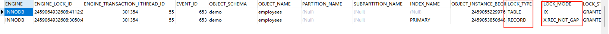

# 锁

### 锁的分类维度

MySQL 的锁可以从不同角度去划分：

#### 按操作范围

- **全局锁**：对整个数据库实例加锁（所有库的所有表都不能读写）。
- **表级锁**：对某张表加锁。
- **行级锁**：对某行数据加锁。

#### 按操作类型

- **共享锁（S 锁，读锁）**：允许多个事务同时读取，不允许修改。
- **排他锁（X 锁，写锁）**：一个事务独占，其他事务不能读写。

#### 按实现方式

- **乐观锁**：通过版本号或时间戳检查冲突。
- **悲观锁**：直接依赖数据库的锁机制。


### 全局锁

全局锁是MySQL中粒度最大的锁，它会锁定整个数据库实例，让整个数据库处于只读状态

```sql
FLUSH TABLES WITH READ LOCK; -- 全局锁
```

会让整个实例只读，阻止 DDL 和 DML。

一般用于 **全库备份**。

```sql
UNLOCK TABLES; -- 释放锁
```


### 表级锁

```sql
LOCK TABLES t1 READ, t2 WRITE; -- 表级锁
```

`READ`：（当前/其他）会话只能读数据。

`WRITE`：当前会话可读写，其他会话不能读写。

```sql
UNLOCK TABLES; -- 释放锁
```


### 行锁（InnoDB 特有）

InnoDB 存储引擎支持 **行锁**，粒度更小，并发更高。

#### 只能在事务中使用

```sql
-- 无事务 sql 运行完直接释放锁
SELECT * FROM employees WHERE id = 1 LOCK IN SHARE MODE;
select * from performance_schema.data_locks; -- 查询被锁的记录 null

BEGIN; -- 开启事务
SELECT * FROM employees WHERE id = 1 LOCK IN SHARE MODE;
select * from performance_schema.data_locks; -- 查询被锁的记录 两条数据
COMMIT; -- 提交事务 只有事务提交后这个行锁才会被释放。
```


#### **行级锁的类型**

1. **共享锁（S锁，Shared Lock）读锁**

   ```sql
   -- 显式加共享锁
   BEGIN; -- 开启事务
   SELECT * FROM users WHERE id = 1 LOCK IN SHARE MODE;
   -- 事务内也可以获得写锁 修改数据
   COMMIT; -- 提交事务 只有事务提交后这个行锁才会被释放。
   
   -- 特点：
   -- 1. 多个事务可同时持有同一行的共享锁（读锁）
   -- 2. 持有共享锁时，其他事务无法获得该行的排他锁（也就是写锁）
   -- 3. 主要用于读取操作
   ```

   

2. **排他锁（X锁，Exclusive Lock）写锁**

   ```sql
   BEGIN; -- 开启事务
   
   -- 显式加排他锁
   SELECT * FROM users WHERE id = 1 FOR UPDATE;
   
   -- 隐式加排他锁的操作
   UPDATE users SET name = 'Alice' WHERE id = 1;
   DELETE FROM users WHERE id = 1;
   INSERT INTO users VALUES (1, 'Alice');
   
   -- 自身事务内也无法获取读锁
   
   COMMIT; -- 提交事务 只有事务提交后这个行锁才会被释放。
   -- 特点：
   -- 1. 同一时间只有一个事务可以持有排他锁
   -- 2. 持有排他锁时，其他事务无法获得该行的任何锁
   -- 3. 用于修改操作
   ```

   

### 悲观锁 (Pessimistic Locking)

悲观锁假设并发冲突一定会发生，因此在读取数据时就加锁，直到事务结束才释放。

实现方式：

```sql
-- 共享锁（读锁）
SELECT * FROM table_name WHERE id = 1 LOCK IN SHARE MODE;

-- 排他锁（写锁）
SELECT * FROM table_name WHERE id = 1 FOR UPDATE;
```

**特点：**

- 数据被锁定期间，其他事务无法修改（排他锁）或无法获得排他锁（共享锁）
- 能够避免数据不一致，但可能导致死锁
- 适用于冲突频繁的场景


### 乐观锁 (Optimistic Locking)

乐观锁本质上是一种**无锁的并发控制策略**，它通过数据版本控制来检测冲突，而不是通过加锁来阻止冲突。

**实现方式：**

1. 版本号机制

   ```sql
   -- 添加版本字段
   ALTER TABLE table_name ADD COLUMN version INT DEFAULT 1;
   
   -- 查询时获取版本号
   SELECT id, name, version FROM table_name WHERE id = 1;
   
   -- 更新时检查版本号
   UPDATE table_name 
   SET name = 'new_value', version = version + 1 
   WHERE id = 1 AND version = 原版本号;
   ```

   

2. 时间戳机制

   ```sql
   -- 添加更新时间字段
   ALTER TABLE table_name ADD COLUMN update_time TIMESTAMP DEFAULT CURRENT_TIMESTAMP ON UPDATE CURRENT_TIMESTAMP;
   
   -- 更新时检查时间戳
   UPDATE table_name 
   SET name = 'new_value', update_time = NOW() 
   WHERE id = 1 AND update_time = 原时间戳;
   ```


### 悲观锁 `VS` 乐观锁

#### 本质区别

**悲观锁**：真正使用了数据库锁机制（如`FOR UPDATE`、`LOCK IN SHARE MODE`）

**乐观锁**：只是一种乐观的**冲突检测机制**，更准确的叫法应该是"乐观并发控制"


#### 对比分析

| 特性       | 悲观锁     | 乐观锁       |
| ---------- | ---------- | ------------ |
| 冲突假设   | 冲突频繁   | 冲突较少     |
| 锁定时机   | 读取时加锁 | 更新时检查   |
| 并发性能   | 较低       | 较高         |
| 实现复杂度 | 简单       | 需要额外字段 |
| 适用场景   | 写多读少   | 读多写少     |


#### 使用建议

**选择悲观锁的场景：**

- 数据更新冲突频繁
- 对数据一致性要求极高
- 不能容忍更新失败的情况

**选择乐观锁的场景：**

- 读操作远多于写操作
- 数据冲突较少
- 需要更好的并发性能
- 可以接受偶尔的更新重试

在实际应用中，可以根据具体的业务场景和性能要求来选择合适的锁机制，有时甚至可以在同一个系统中混合使用两种策略。


### 意向锁

意向锁是**表级锁**，用来表明事务准备在表的某些行上加什么类型的锁。它不会阻塞除全表扫描以外的任何操作。

#### 意向锁的类型

1. **IS锁（意向共享锁，Intention Shared Lock）**

   表示事务准备在表中的某些行上加共享锁

   

2. **IX锁（意向排他锁，Intention Exclusive Lock）**

   表示事务准备在表中的某些行上加排他锁


#### 意向锁的作用

意向锁主要解决**表锁与行锁的冲突检测**问题：

```sql
-- 事务A：对某行加排他锁
BEGIN;
SELECT * FROM users WHERE id = 1 FOR UPDATE;  -- 行级排他锁

-- 事务B：想要对整个表加共享锁
LOCK TABLES users READ;  -- 需要检查是否与行锁冲突
```

**没有意向锁的问题：**

- 事务B需要检查表中每一行是否被锁定
- 性能开销巨大

**有了意向锁：**

- 事务A在对行加排他锁前，先对表加IX锁（意向排他锁） 这也是为什么加一个行锁会出现两天锁的记录。
- 事务B只需检查表级的意向锁即可快速判断冲突


#### 意向锁的工作机制

```sql
BEGIN;
-- 当执行这个语句时：
update employees set age = 2 where id = 11;
-- InnoDB自动执行：
-- 1. 对users表加IX锁（意向排他锁）
-- 2. 对id=1的行加X锁（排他锁）
select * from performance_schema.data_locks; -- 查询锁记录
```




### 临界锁（Critical Lock)

在 MySQL 官方文档里其实没有“临界锁”这个正式名词，它更多是从并发编程借过来的概念：

**含义**：保证某个“临界区”在同一时刻只能被一个事务/线程访问。

在 MySQL 里的对应：

- **表级锁**（一次锁住整张表 → 整个表的操作临界区只有一个事务能进）
- **行级锁**（一次锁住一行 → 这行数据的修改临界区只能有一个事务）
- **`GET_LOCK(name, timeout)`**（用户级的互斥锁 → 模拟一个全局临界区）

所以“临界锁”可以理解为一个 **抽象层面的锁**，强调的是“互斥”与“独占”。


### 记录锁（Record Lock）

InnoDB 的行级锁类型之一。

**定义**：锁定 **索引中的一条记录**（准确说是索引条目，不是物理行）。

**分类**：

- **共享锁 (S)**：允许其他事务读，不允许写。
- **排他锁 (X)**：不允许其他事务读/写。

**场景**：

```sql
SELECT * FROM user WHERE id = 10 FOR UPDATE; -- 排他锁
```


### 间隙锁（Gap Lock）

InnoDB 的另一种行锁机制。

**定义**：锁定 **索引记录之间的“间隙”**（不包含记录本身）。

**用途**：防止“幻读” —— 其他事务往间隙里插入新记录。

**场景**：

```sql
-- age 数据：20, 23, 24, 26, 28, 29, 30, 35
SELECT age FROM employees WHERE age >= 24 AND age <= 29 LOCK IN SHARE MODE;
-- 间隙锁锁定的间隙：
-- (23, 24), (24, 26), (26, 28), (28, 29), (29, 30)

-- 会话2：尝试各种操作
-- 1. 插入操作（会被阻塞）
INSERT INTO employees (age, name) VALUES (25, 'New1'); -- 阻塞：在(24,26)间隙
INSERT INTO employees (age, name) VALUES (27, 'New2'); -- 阻塞：在(26,28)间隙

-- 2. 更新现有记录（如果只是Gap Lock则不会被阻塞）
UPDATE employees SET name = 'Updated' WHERE age = 26; -- 取决于锁类型
```

**在你的查询中，间隙锁会锁定：**

- `(23, 24)` - 23和24之间的间隙
- `(24, 26)` - 24和26之间的间隙
- `(26, 28)` - 26和28之间的间隙
- `(28, 29)` - 28和29之间的间隙
- `(29, 30)` - 29和30之间的间隙


### Next-Key Lock（记录锁 + 间隙锁）

InnoDB 真实执行时常用的是 **Next-Key Lock**

**定义**：= 记录锁 + 前一个记录和它之间的间隙锁。

```sql
-- age 数据：20, 23, 24, 26, 28, 29, 30, 35
SELECT age FROM employees WHERE age >= 24 AND age <= 29 LOCK IN SHARE MODE;
```

**在你的查询中，Next-Key Lock会锁定：**

- `(23, 24]` - 23到24的间隙 + 24这条记录
- `(24, 26]` - 24到26的间隙 + 26这条记录
- `(26, 28]` - 26到28的间隙 + 28这条记录
- `(28, 29]` - 28到29的间隙 + 29这条记录
- `(29, 30)` - 29到30的间隙（因为30不在范围内）


### Gap Lock `VS` Next-Key Lock

| 特性                 | Gap Lock           | Next-Key Lock |
| -------------------- | ------------------ | ------------- |
| **锁定内容**         | 只锁间隙，不锁记录 | 锁间隙 + 记录 |
| **防止插入**         | ✅                  | ✅             |
| **防止更新现有记录** | ❌                  | ✅             |
| **防止删除现有记录** | ❌                  | ✅             |
| **MySQL默认**        | 特定场景           | InnoDB默认    |