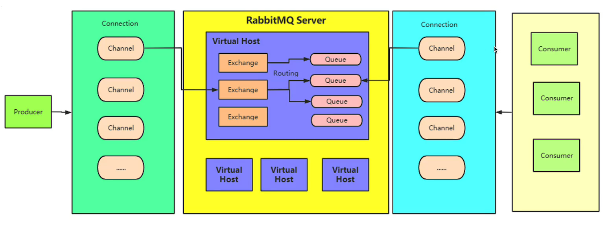
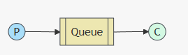
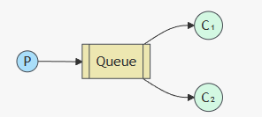
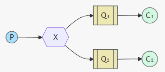
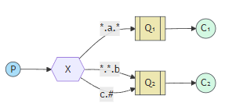

# RabbitMQ

## 一、docker 运行 RabbitMQ

#### 1. 卸载旧版本（避免冲突）

```sh
sudo yum remove docker \
                  docker-client \
                  docker-client-latest \
                  docker-common \
                  docker-latest \
                  docker-latest-logrotate \
                  docker-logrotate \
                  docker-engine
```

#### 2. 安装依赖包

安装 yum 工具和证书相关依赖，用于通过 HTTPS 拉取软件包：

```sh
sudo yum install -y yum-utils device-mapper-persistent-data lvm2
```

#### 3. 添加 Docker 官方 yum 源

替换默认的 CentOS 源为 Docker 官方源（国内可选用阿里云镜像源，速度更快）：

```sh
# 官方源（通用）
sudo yum-config-manager --add-repo https://download.docker.com/linux/centos/docker-ce.repo
```

```sh
# 阿里云源（国内推荐）
sudo yum-config-manager --add-repo http://mirrors.aliyun.com/docker-ce/linux/centos/docker-ce.repo
```

####  4. 安装最新稳定版（推荐）

```sh
sudo yum install -y docker-ce docker-ce-cli containerd.io docker-buildx-plugin docker-compose-plugin
```

- `docker-ce`：Docker 引擎核心包；
- `containerd.io`：容器运行时；
- `docker-buildx-plugin`/`docker-compose-plugin`：构建和编排插件（可选，建议安装）。

#### 5. 启动并配置 Docker

```sh
# 启动服务
sudo systemctl start docker
# 设置开机自启
sudo systemctl enable docker
# 查看状态（确认运行）
sudo systemctl status docker
```

```sh
# 创建目录
sudo mkdir -p /etc/docker

# 配置镜像
sudo tee /etc/docker/daemon.json <<-'EOF'
{
    "registry-mirrors": [
        "https://docker.1ms.run"
    ]
}
EOF

# 重新加载配置
sudo systemctl daemon-reload
# 重启 Docker 服务
sudo systemctl restart docker
```

#### 6. 拉取运行镜像

```sh
# 拉取镜像
docker pull rabbitmq:3.13-management

# 拉取运行镜像
docker run -d \
  --name rabbitmq \
  --hostname rabbitmq-server \
  -p 5672:5672 \
  -p 15672:15672 \
  -e RABBITMQ_DEFAULT_USER=root \
  -e RABBITMQ_DEFAULT_PASS=root \
  -v rabbitmq-data:/var/lib/rabbitmq \
  rabbitmq:3.13-management
```

- **后台跑**：`-d` 让 RabbitMQ 在后台默默运行；
- **好管理**：`--name` 给容器起名字，不用记冗长的容器 ID；
- **能访问**：`-p` 开放两个端口，一个给程序连，一个给浏览器看管理界面；
- **有权限**：`-e` 设置用户名密码（root/root），不用用默认的 guest（只能本地访问）；
- **不丢数据**：`-v` 把 RabbitMQ 的数据存在 Docker 数据卷里，删了容器数据也还在；
- **带管理界面**：镜像后缀 `management` 表示包含 Web 控制台，能可视化操作。


## 二、RabbitMQ常见消费场景

#### 生产者、消费者模型



- 生产者根据 `connection` 获取 `channel`  通道，通过通道给 `exchange` 交换机发送消息，交换机根据与 `queue` 队列的绑定关系发送给对应的队列。
- 消费者也是通过 `channel` 通道 去访问交换机，从而访问到对应的队列，然后拿到消息消费。


### 1.基础消费场景：单消费者（简单队列）

最简单的消费模式：1 个生产者 → 1 个队列 → 1 个消费者，消息一对一消费，无分发策略，适用于简单的任务处理。



 **核心实现（以 Java/AMQP 客户端为例）**

```java
// 消费者代码核心片段
Channel channel = connection.createChannel();
// 声明队列（幂等）
channel.queueDeclare("simple_queue", true, false, false, null);
// 定义消费者
DefaultConsumer consumer = new DefaultConsumer(channel) {
    @Override
    public void handleDelivery(String consumerTag, Envelope envelope, AMQP.BasicProperties properties, byte[] body) throws IOException {
        String msg = new String(body, "UTF-8");
        System.out.println("单消费者接收到消息：" + msg);
        // 手动确认消息（关键：避免消息丢失）
        channel.basicAck(envelope.getDeliveryTag(), false);
    }
};
// 启动消费：autoAck=false（手动确认）
channel.basicConsume("simple_queue", false, consumer);
```

 **适用场景**

- 轻量任务处理（如日志写入、简单通知）；
- 对并发无要求，单实例即可处理的场景。

 **注意事项**

- 必须开启**手动消息确认（autoAck=false）**，否则消费者崩溃会导致消息丢失；
- 单消费者存在性能瓶颈，无法应对高并发消息。


### 2. 负载均衡：多消费者竞争消费（工作队列 / Work Queue）

1 个队列绑定多个消费者，RabbitMQ 默认采用**轮询（Round-Robin）** 策略分发消息，每个消息仅被 1 个消费者处理，实现消费能力的水平扩展。



**核心特性**

- 轮询分发：默认按消费者连接顺序依次分发，不考虑消费者处理能力；
- 公平分发：通过 `basicQos(1)` 开启 “预取数限制”，确保消费者处理完 1 条消息后才接收下 1 条，避免 “忙的忙死、闲的闲死”

**核心实现（公平分发）**

```java
// 每个消费者都执行以下配置
Channel channel = connection.createChannel();
channel.queueDeclare("work_queue", true, false, false, null);
// 开启公平分发：预取数=1（每次只取1条）
channel.basicQos(1); 
DefaultConsumer consumer = new DefaultConsumer(channel) {
    @Override
    public void handleDelivery(String consumerTag, Envelope envelope, AMQP.BasicProperties properties, byte[] body) throws IOException {
        String msg = new String(body, "UTF-8");
        // 模拟耗时处理
        Thread.sleep(1000);
        System.out.println("消费者" + Thread.currentThread().getId() + "处理消息：" + msg);
        channel.basicAck(envelope.getDeliveryTag(), false);
    }
};
channel.basicConsume("work_queue", false, consumer);
```

**适用场景**

- 任务并行处理（如订单处理、数据计算）；
- 需要提高消费吞吐量，通过增加消费者实例扩容的场景。

**注意事项**

- 队列必须是**非排他、非自动删除**的，确保多消费者能绑定；
- 若消费者处理时间差异大，必须开启 `basicQos` 实现公平分发；
- 消费者崩溃未确认的消息，会重新分发到其他消费者。


### 3. 广播 / 组播：发布订阅（Fanout Exchange）

生产者将消息发送到 Fanout 交换机，交换机将消息**广播到所有绑定的队列**，每个队列的消费者都能收到全量消息（1 条消息被多消费）。

生产者 → Fanout 交换机 → 多个队列（每个队列绑定交换机）→ 每个队列对应 1 个消费者。



**核心实现**

```Java
// 生产者：发送到Fanout交换机
Channel channel = connection.createChannel();
String fanoutExchange = "fanout_exchange";
channel.exchangeDeclare(fanoutExchange, BuiltinExchangeType.FANOUT, true);
// 消息发送到交换机（无需指定队列）
channel.basicPublish(fanoutExchange, "", null, "广播消息".getBytes());

// 消费者1：绑定队列1到交换机
String queue1 = "fanout_queue1";
channel.queueDeclare(queue1, true, false, false, null);
channel.queueBind(queue1, fanoutExchange, ""); // Fanout忽略RoutingKey
channel.basicConsume(queue1, false, new DefaultConsumer(channel) {
    @Override
    public void handleDelivery(String consumerTag, Envelope envelope, AMQP.BasicProperties properties, byte[] body) throws IOException {
        System.out.println("消费者1收到广播消息：" + new String(body));
        channel.basicAck(envelope.getDeliveryTag(), false);
    }
});

// 消费者2：绑定队列2到交换机（同理，收到相同消息）
```

**适用场景**

- 消息广播（如系统通知、状态同步、日志同步）；
- 多系统需要接收同一份消息的场景（如订单创建后，库存、支付、物流都需感知）。

**注意事项**

- Fanout 交换机**忽略 RoutingKey**，所有绑定的队列都会收到消息；
- 新增消费者需新建队列并绑定交换机，才能接收后续消息。


### 4. 精准路由：定向消费（Direct Exchange）

生产者通过 `RoutingKey` 发送消息到 Direct 交换机，交换机根据 `RoutingKey` 精准路由到**绑定了相同 RoutingKey** 的队列，实现 “按规则定向消费”

- 1 个 RoutingKey 可绑定多个队列（实现 “组播 + 定向”）；
- 精准匹配：只有队列的绑定 Key 与消息的 RoutingKey 完全一致，才会收到消息。


**核心实现**

```java
// 生产者：指定RoutingKey发送
String directExchange = "direct_exchange";
channel.exchangeDeclare(directExchange, BuiltinExchangeType.DIRECT, true);
String routingKey = "order.pay"; // 订单支付路由键
channel.basicPublish(directExchange, routingKey, null, "订单支付消息".getBytes());

// 消费者1：绑定"order.pay"路由键，接收支付相关消息
String payQueue = "pay_queue";
channel.queueDeclare(payQueue, true, false, false, null);
channel.queueBind(payQueue, directExchange, "order.pay");
channel.basicConsume(payQueue, false, new DefaultConsumer(channel) {
    @Override
    public void handleDelivery(String consumerTag, Envelope envelope, AMQP.BasicProperties properties, byte[] body) throws IOException {
        System.out.println("支付服务收到消息：" + new String(body));
        channel.basicAck(envelope.getDeliveryTag(), false);
    }
});

// 消费者2：绑定"order.refund"路由键，无法收到pay消息
```

**适用场景**

- 按业务类型定向消费（如订单支付、退款、取消分别路由到不同服务）；
- 消息分类处理（如日志按级别：info、error 路由到不同日志处理队列）。

**注意事项**

- RoutingKey 需提前约定（如 “业务。操作” 格式）；
- 若没有队列匹配 RoutingKey，消息会被丢弃（需开启交换机的 “死信” 或 “备份队列”）。


### 5. 模糊匹配：主题消费（Topic Exchange）

基于 Direct 扩展，支持 `RoutingKey` 的**模糊匹配**（通配符：`*` 匹配 1 个单词，`#` 匹配 0 或多个单词），实现更灵活的路由规则。

- `*`：匹配一个单词（如 `order.*` 匹配 `order.pay`、`order.refund`，但不匹配 `order.pay.success`）；
- `#`：匹配任意单词（如 `order.#` 匹配 `order.pay`、`order.pay.success`、`order.refund`）。



**核心实现**

```java
// 生产者：发送RoutingKey=order.pay.success的消息
String topicExchange = "topic_exchange";
channel.exchangeDeclare(topicExchange, BuiltinExchangeType.TOPIC, true);
channel.basicPublish(topicExchange, "order.pay.success", null, "支付成功消息".getBytes());

// 消费者1：绑定order.#，接收所有订单相关消息
String allOrderQueue = "all_order_queue";
channel.queueBind(allOrderQueue, topicExchange, "order.#");

// 消费者2：绑定order.pay.*，仅接收支付相关的二级消息（如order.pay.success、order.pay.fail）
String payOrderQueue = "pay_order_queue";
channel.queueBind(payOrderQueue, topicExchange, "order.pay.*");
```

**适用场景**

- 复杂业务路由（如按 “业务。操作。状态” 分级路由）；
- 多维度消息过滤（如电商场景：订单、商品、用户不同维度的消息分类）。

**注意事项**

- RoutingKey 建议按 “层级” 设计（用`.`分隔），便于通配符匹配；
- 避免过度使用 `#`，可能导致消息扩散到不必要的队列。


### 6. 可靠性保障：死信消费（DLX / 死信队列）

原理：类似与普通队列消费失败删除的消息会进入垃圾箱里面，用于后续业务逻辑操作。这个垃圾箱就是死信队列

当消息满足 “死信条件” 时，会被路由到**死信交换机（DLX）** 绑定的死信队列，专门处理失败 / 过期的消息（如重试失败、过期、被拒绝的消息）。

**死信触发条件**

- 消息被消费者拒绝（`basicNack/basicReject`）且不重新入队（`requeue=false`）；
- 消息过期（设置了 `expiration` 或队列 TTL）；
- 队列达到最大长度（`x-max-length`），旧消息被挤掉。

**核心实现**

```java
// 1. 声明死信交换机和死信队列
String dlxExchange = "dlx_exchange";
String dlxQueue = "dlx_queue";
channel.exchangeDeclare(dlxExchange, BuiltinExchangeType.DIRECT, true);
channel.queueDeclare(dlxQueue, true, false, false, null);
channel.queueBind(dlxQueue, dlxExchange, "dlx.key");

// 2. 声明普通队列，并绑定死信交换机
Map<String, Object> args = new HashMap<>();
args.put("x-dead-letter-exchange", dlxExchange); // 指定死信交换机
args.put("x-dead-letter-routing-key", "dlx.key"); // 死信RoutingKey
args.put("x-message-ttl", 60000); // 消息过期时间60s
String normalQueue = "normal_queue";
channel.queueDeclare(normalQueue, true, false, false, args);

// 3. 普通消费者：拒绝消息并标记为死信
channel.basicConsume(normalQueue, false, new DefaultConsumer(channel) {
    @Override
    public void handleDelivery(String consumerTag, Envelope envelope, AMQP.BasicProperties properties, byte[] body) throws IOException {
        String msg = new String(body);
        // 处理失败，拒绝消息并不重新入队（触发死信）
        if (msg.contains("error")) {
            channel.basicReject(envelope.getDeliveryTag(), false);
        } else {
            channel.basicAck(envelope.getDeliveryTag(), false);
        }
    }
});

// 4. 死信消费者：处理死信消息（如重试、记录、人工介入）
channel.basicConsume(dlxQueue, false, new DefaultConsumer(channel) {
    @Override
    public void handleDelivery(String consumerTag, Envelope envelope, AMQP.BasicProperties properties, byte[] body) throws IOException {
        System.out.println("处理死信消息：" + new String(body));
        channel.basicAck(envelope.getDeliveryTag(), false);
    }
});
```

**适用场景**

- 消息消费失败后的兜底处理（如支付回调失败、订单处理超时）；
- 过期消息清理（如限时优惠券过期后处理）；
- 避免无效消息堆积在普通队列。

**注意事项**

- 死信队列需单独消费，避免与普通消息混处理；
- 建议为死信消息添加 “失败原因”“重试次数” 等属性，便于排查。


#### 核心消费场景对比表

| 场景             | 交换机类型     | 核心特性                    | 典型适用场景                |
| ---------------- | -------------- | --------------------------- | --------------------------- |
| 单消费者         | 无（直连队列） | 一对一消费，无分发          | 简单轻量任务                |
| 多消费者竞争     | 无（直连队列） | 轮询 / 公平分发，提高吞吐量 | 订单处理、并行计算          |
| 发布订阅（广播） | Fanout         | 全量广播，多队列接收        | 系统通知、日志同步          |
| 精准路由         | Direct         | 按 RoutingKey 精准匹配      | 业务分类消费（支付 / 退款） |
| 模糊路由         | Topic          | 通配符匹配，灵活路由        | 复杂业务分级路由            |
| 死信消费         | Direct/Fanout  | 处理失败 / 过期消息         | 消息失败兜底、过期清理      |
| 延迟消费         | 结合 DLX       | 延迟指定时间消费            | 订单超时取消、定时提醒      |
| 幂等消费         | 任意           | 防止重复处理                | 支付、订单等核心业务        |


#### 消费场景代码实现 Spring Boot 整合 [RabbitMQ](https://github.com/hollobot/study.git)


## 三、SpringBoot 整合 RabbitMQ 各队列类型

**依赖和配置**

```xml
<!-- pom.xml 核心依赖 -->
<dependency>
    <groupId>org.springframework.boot</groupId>
    <artifactId>spring-boot-starter-amqp</artifactId>
</dependency>
```

```yaml
spring:
  rabbitmq:
    host: 192.168.30.129 # 如 192.168.1.100
    port: 5672
    username: root # 对应启动容器时的 RABBITMQ_DEFAULT_USER
    password: root # 对应启动容器时的 RABBITMQ_DEFAULT_PASS
    virtual-host: /hello # 默认虚拟主机
    # 消费端核心配置（关键）
    listener:
      simple:
        prefetch: 1 # 每次从队列中获取消息数量
        acknowledge-mode: manual # 手动确认（保证消息不丢失，核心！）
        concurrency: 1 # 最小消费线程数
        max-concurrency: 5 # 最大消费线程数
        retry:
          enabled: true # 开启消费重试
          max-attempts: 3 # 最大重试次数
          initial-interval: 1000ms # 首次重试间隔
```


### 1. 普通队列（Classic Queue）

#### 核心特点

- 最基础的队列类型，遵循**FIFO（先进先出）** 原则，消息按投递顺序消费；
- 支持持久化（队列 / 消息）、排他性（仅创建连接可见）、自动删除（无消费者时自动删除）；
- 适配绝大多数通用场景，无特殊附加功能，轻量且稳定；
- 支持手动 / 自动确认、预取数（Qos）等基础可靠性配置。

#### 核心作用

- 解耦生产者和消费者：生产者无需关注消费端状态，消息暂存队列，消费端按需处理；
- 削峰填谷：应对突发流量（如秒杀下单），消息堆积在队列中，消费端按能力匀速处理；
- 基础消息分发：适用于无特殊要求的业务（如普通通知、日志采集、数据同步）。

#### SpringBoot 核心代码

```java
// 配置类：声明普通队列
@Configuration
public class ClassicQueueConfig {
    @Bean
    public Queue classicQueue() {
        // 队列名、是否持久化、是否排他、是否自动删除
        return new Queue("classic_queue", true, false, false);
    }
}

// 生产者
@Component
public class ClassicProducer {
    @Autowired
    private RabbitTemplate rabbitTemplate;

    public void sendMsg(String msg) {
        rabbitTemplate.convertAndSend("classic_queue", msg, message -> {
            message.getMessageProperties().setDeliveryMode(MessageDeliveryMode.PERSISTENT); // 消息持久化
            return message;
        });
    }
}

// 消费者
@Component
public class ClassicConsumer {
    @RabbitListener(queues = "classic_queue")
    public void consume(String msg, Channel channel, Message message) throws Exception {
        try {
            System.out.println("普通队列消费：" + msg);
            // 手动确认
            channel.basicAck(message.getMessageProperties().getDeliveryTag(), false);
        } catch (Exception e) {
            // 消费失败，拒绝并重新入队
            channel.basicNack(message.getMessageProperties().getDeliveryTag(), false, true);
        }
    }
}
```


### 2. 镜像队列（Mirror Queue）

#### 核心特点

- 基于普通队列的**高可用扩展**，仅在 RabbitMQ 集群中生效；
- 队列数据自动同步到集群多个节点（主从镜像），主节点故障时，从节点自动切换；
- 同步数据会增加网络 / 存储开销，性能略低于普通队列；
- 需通过 RabbitMQ 策略（Policy）配置，代码层面与普通队列无差异。

#### 核心作用

- 保障核心业务高可用：避免单节点故障导致队列不可用（如支付、交易、订单核心队列）；
- 数据容灾：队列数据多节点备份，防止节点宕机导致消息丢失；
- 集群层面的可靠性增强：适用于对可用性要求极高的核心业务。

#### SpringBoot 核心代码

```java
// 配置类：声明镜像队列（队列名匹配集群策略前缀）
@Configuration
public class MirrorQueueConfig {
    @Bean
    public Queue mirrorQueue() {
        // 队列名以"mirror_"开头，匹配集群镜像策略
        return new Queue("mirror_queue", true, false, false);
    }
}

// 生产/消费代码与普通队列完全一致（略）
```


### 3. 惰性队列（Lazy Queue）

#### 核心特点

- 优先将消息存储到**磁盘**而非内存，大幅降低 RabbitMQ 内存占用；
- 消费时从磁盘读取消息，延迟略高于普通队列，但内存稳定性大幅提升；
- 适配消息堆积场景（如峰值期堆积数万 / 数十万条消息）；
- 配置简单，仅需添加`x-queue-mode: lazy`参数。

#### 核心作用

- 解决内存溢出问题：避免大量消息堆积导致 RabbitMQ 内存耗尽触发流控（Flow Control）或崩溃；
- 适配高堆积低延迟敏感度场景：如日志收集、离线数据处理、非实时统计分析；
- 降低运维成本：无需频繁扩容 RabbitMQ 内存，利用磁盘存储实现低成本扩容。

#### SpringBoot 核心代码

```java
// 配置类：声明惰性队列
@Configuration
public class LazyQueueConfig {
    @Bean
    public Queue lazyQueue() {
        Map<String, Object> args = new HashMap<>();
        args.put("x-queue-mode", "lazy"); // 核心：开启惰性模式
        return new Queue("lazy_queue", true, false, false, args);
    }
}

// 生产/消费代码与普通队列一致（略）
```


### 4. 优先级队列

#### 核心特点

- 消息按**优先级数值（0-255，越高优先级越高）** 分发，高优先级消息优先消费；
- 需在队列声明时指定最大优先级，消息发送时设置优先级；
- 仅在队列有消息堆积时生效（无堆积则直接消费，优先级无意义）；
- 优先级排序仅在队列层面生效，不影响交换机路由。

#### 核心作用

- 紧急任务优先处理：如系统故障告警、VIP 用户订单、风控规则校验等需优先响应的业务；
- 任务分级处理：按业务重要性划分消息优先级，保障核心任务优先执行；
- 资源按需分配：消费端有限资源下，优先处理高价值消息（如支付回调＞普通通知）。

#### SpringBoot 核心代码

```java
// 配置类：声明优先级队列
@Configuration
public class PriorityQueueConfig {
    @Bean
    public Queue priorityQueue() {
        Map<String, Object> args = new HashMap<>();
        args.put("x-max-priority", 10); // 最大优先级（0-10）
        return new Queue("priority_queue", true, false, false, args);
    }
}

// 生产者：发送不同优先级消息
@Component
public class PriorityProducer {
    @Autowired
    private RabbitTemplate rabbitTemplate;

    public void sendHighPriorityMsg(String msg) {
        rabbitTemplate.convertAndSend("priority_queue", msg, message -> {
            message.getMessageProperties().setPriority(10); // 高优先级
            return message;
        });
    }

    public void sendLowPriorityMsg(String msg) {
        rabbitTemplate.convertAndSend("priority_queue", msg, message -> {
            message.getMessageProperties().setPriority(1); // 低优先级
            return message;
        });
    }
}

// 消费者
@Component
public class PriorityConsumer {
    @RabbitListener(queues = "priority_queue")
    public void consume(String msg, Channel channel, Message message) throws Exception {
        System.out.println("优先级队列消费：" + msg);
        channel.basicAck(message.getMessageProperties().getDeliveryTag(), false);
    }
}
```


### 5. 死信队列（DLQ）

原理：类似与普通队列消费失败删除的消息会进入垃圾箱里面，用于后续业务逻辑操作。这个垃圾箱就是死信队列

#### 核心特点

- 非独立队列类型，基于普通队列扩展，专门接收 “死信消息”；
- 死信触发条件：消息被拒绝且不重新入队、消息过期（TTL）、队列达到最大长度；
- 需为普通队列绑定死信交换机（DLX），死信消息通过路由键转发到死信队列；
- 实现消息失败兜底，避免无效消息堆积在普通队列。

#### 核心作用

- 失败消息兜底处理：消费失败的消息（如业务异常、网络超时）进入死信队列，便于后续重试 / 人工介入；
- 过期消息清理：如限时优惠券、订单超时未支付等过期消息自动进入死信队列处理；
- 异常排查：死信队列集中存储异常消息，便于定位消费失败原因（如参数错误、业务逻辑漏洞）。

#### SpringBoot 核心代码

```java
// 配置类：声明死信队列+普通队列
@Configuration
public class DLQConfig {
    // 死信交换机
    @Bean
    public DirectExchange dlxExchange() {
        return new DirectExchange("dlx_exchange", true, false);
    }

    // 死信队列
    @Bean
    public Queue dlxQueue() {
        return new Queue("dlx_queue", true, false, false);
    }

    // 绑定死信队列到死信交换机
    @Bean
    public Binding dlxBinding() {
        return BindingBuilder.bind(dlxQueue()).to(dlxExchange()).with("dlx_key");
    }

    // 普通队列（绑定死信交换机）
    @Bean
    public Queue normalQueue() {
        Map<String, Object> args = new HashMap<>();
        args.put("x-dead-letter-exchange", "dlx_exchange"); // 死信交换机
        args.put("x-dead-letter-routing-key", "dlx_key"); // 死信路由键
        args.put("x-message-ttl", 60000); // 消息过期时间（60s）
        return new Queue("normal_queue", true, false, false, args);
    }
}

// 生产者：发送消息到普通队列
@Component
public class NormalProducer {
    @Autowired
    private RabbitTemplate rabbitTemplate;

    public void sendMsg(String msg) {
        rabbitTemplate.convertAndSend("normal_queue", msg);
    }
}

// 普通队列消费者：拒绝消息触发死信
@Component
public class NormalConsumer {
    @RabbitListener(queues = "normal_queue")
    public void consume(String msg, Channel channel, Message message) throws Exception {
        try {
            // 模拟业务处理失败
            throw new Exception("业务处理异常");
        } catch (Exception e) {
            // 拒绝消息，不重新入队（触发死信）
            channel.basicReject(message.getMessageProperties().getDeliveryTag(), false);
        }
    }
}

// 死信队列消费者：处理失败消息
@Component
public class DLQConsumer {
    @RabbitListener(queues = "dlx_queue")
    public void consume(String msg, Channel channel, Message message) throws Exception {
        System.out.println("死信队列消费（失败消息）：" + msg);
        // 记录失败日志/重试/人工介入
        channel.basicAck(message.getMessageProperties().getDeliveryTag(), false);
    }
}
```


### 6. 延迟队列（基于 TTL + 死信队列）

原理：通过设置消息消费过期时间，超过过期时间进入死信队列，然后消费死信队列，实现延迟队列消费。

#### 核心特点

- RabbitMQ 无原生延迟队列，需结合 “TTL（消息过期时间）+ 死信队列” 实现；
- 普通队列无消费者，消息过期后成为死信，路由到死信队列，死信队列消费者实现延迟消费；
- 支持消息级 TTL（单条消息不同延迟）和队列级 TTL（所有消息同延迟），消息级更灵活；
- 延迟精度受消息堆积影响，适合低精准度定时场景（高精准建议用 XXL-Job/Quartz）。

#### 核心作用

- 定时任务处理：如订单超时未支付自动取消、优惠券过期失效、退款审核超时处理；
- 延迟通知：如下单后 30 分钟提醒付款、注册后 24 小时推送新人福利；
- 业务异步延迟处理：避免同步等待（如支付成功后延迟 5 分钟检查订单状态）。

#### SpringBoot 核心代码

```java
// 配置类：声明延迟队列（复用死信队列配置，调整普通队列无消费者）
@Configuration
public class DelayQueueConfig {
    // 死信交换机
    @Bean
    public DirectExchange dlxExchange() {
        return new DirectExchange("delay_dlx_exchange", true, false);
    }

    // 死信队列
    @Bean
    public Queue delayConsumeQueue() {
        return new Queue("delay_consume_queue", true, false, false);
    }

    // 绑定死信队列到死信交换机
    @Bean
    public Binding delayBinding() {
        return BindingBuilder.bind(delayConsumeQueue()).to(dlxExchange()).with("delay_key");
    }

    // 延迟队列（无消费者，仅存储延迟消息）
    @Bean
    public Queue delayQueue() {
        Map<String, Object> args = new HashMap<>();
        args.put("x-dead-letter-exchange", "delay_dlx_exchange");
        args.put("x-dead-letter-routing-key", "delay_key");
        return new Queue("delay_queue", true, false, false, args);
    }
}

// 生产者：发送延迟5秒的消息
@Component
public class DelayProducer {
    @Autowired
    private RabbitTemplate rabbitTemplate;

    public void sendDelayMsg(String msg) {
        rabbitTemplate.convertAndSend("delay_queue", msg, message -> {
            message.getMessageProperties().setExpiration("5000"); // 消息延迟5秒
            return message;
        });
    }
}

// 延迟消费消费者（消费死信队列）
@Component
public class DelayConsumer {
    @RabbitListener(queues = "delay_consume_queue")
    public void consume(String msg, Channel channel, Message message) throws Exception {
        System.out.println("延迟消费：" + msg + "，当前时间：" + System.currentTimeMillis());
        channel.basicAck(message.getMessageProperties().getDeliveryTag(), false);
    }
}
```

### 各队列类型核心特性 & 作用总结表

| 队列类型   | 核心特性                               | 核心作用                             | 典型场景                     |
| ---------- | -------------------------------------- | ------------------------------------ | ---------------------------- |
| 普通队列   | FIFO、轻量、支持基础持久化 / 确认      | 解耦、削峰填谷、通用消息分发         | 普通通知、日志采集、数据同步 |
| 镜像队列   | 集群同步、高可用、性能略降             | 核心业务容灾、避免单节点故障         | 支付、交易、订单核心队列     |
| 惰性队列   | 磁盘优先存储、低内存占用、延迟略高     | 高堆积场景、避免内存溢出             | 日志收集、离线数据处理       |
| 优先级队列 | 按优先级分发、仅堆积时生效             | 紧急任务优先、任务分级处理           | 告警、VIP 订单、风控校验     |
| 死信队列   | 接收失败 / 过期 / 超长度消息、兜底处理 | 失败消息重试、异常排查、过期消息清理 | 消费失败兜底、订单超时       |
| 延迟队列   | 基于 TTL + 死信、延迟消费、精度一般    | 定时任务、延迟通知、异步延迟处理     | 订单取消、延迟提醒、状态复检 |


## 四、RabbitMQ 三种核心队列类型（Classic/Quorum/Stream）详解

### 1. Classic 经典队列

#### 核心特点

- 最基础的队列类型，遵循**FIFO（先进先出）**，消息被消费后从队列中删除；
- 支持**持久化（可选）和 镜像队列**（集群高可用；
- 轻量高效，但消息堆积过多时性能会明显下降；
- 支持 TTL、优先级、死信等高级特性。

#### 核心作用

- 通用消息解耦：适用于大多数无特殊要求的场景（如订单通知、系统日志）；
- 轻量任务调度：简单异步任务的分发与处理；
- 快速部署：配置简单，学习成本低。

#### SpringBoot 代码

```java
// 配置类：声明经典队列
@Configuration
public class ClassicQueueConfig {
    @Bean
    public Queue classicQueue() {
        // 队列名、持久化、非排他、非自动删除
        return new Queue("classic_queue", true, false, false);
    }
}

// 生产者
@Component
public class ClassicProducer {
    @Autowired
    private RabbitTemplate rabbitTemplate;

    public void sendMsg(String msg) {
        rabbitTemplate.convertAndSend("classic_queue", msg, message -> {
            message.getMessageProperties().setDeliveryMode(MessageDeliveryMode.PERSISTENT); // 消息持久化
            return message;
        });
    }
}

// 消费者
@Component
public class ClassicConsumer {
    @RabbitListener(queues = "classic_queue")
    public void consume(String msg, Channel channel, Message message) throws Exception {
        try {
            System.out.println("经典队列消费：" + msg);
            channel.basicAck(message.getMessageProperties().getDeliveryTag(), false); // 手动确认
        } catch (Exception e) {
            channel.basicNack(message.getMessageProperties().getDeliveryTag(), false, true); // 失败重试
        }
    }
}
```

### 2. Quorum 仲裁队列

#### 核心特点

- 基于**Raft 分布式共识协议**，消息需多数节点确认后才写入，保证**强一致性**；
- 天然支持多副本（默认 3 副本），主节点故障后自动选主，高可用无脑裂；
- 消息强制持久化，不支持 TTL、优先级、惰性队列等特性；
- 性能略低于经典队列，但可靠性更高。

#### 核心作用

- 核心业务高可用：金融支付、交易订单等 “消息不丢” 的场景；
- 跨机房数据同步：Raft 协议保障多节点一致性，适合跨地域部署；
- 替代镜像队列：官方推荐用 Quorum 替代传统镜像队列（镜像队列是异步复制，可能丢消息）。

#### SpringBoot 代码

```java
// 配置类：声明仲裁队列
@Configuration
public class QuorumQueueConfig {
    @Bean
    public Queue quorumQueue() {
        Map<String, Object> args = new HashMap<>();
        args.put("x-queue-type", "quorum"); // 核心：指定为仲裁队列
        // 可选：设置副本数（默认3）
        args.put("x-quorum-initial-group-size", 3);
        return new Queue("quorum_queue", true, false, false, args);
    }
}

// 生产/消费代码与经典队列一致（略）
```

### 3. Stream 流式队列

#### 核心特点

- 基于**日志式存储**（Append-Only），消息写入磁盘后生成唯一 Offset；
- 支持**消息回溯 / 回放**（消费者可指定 Offset 重新消费历史消息）；
- 高吞吐、低内存占用，支持百万级消息堆积；
- 不支持 TTL、死信队列，消息需通过 “保留策略”（时间 / 大小）自动清理。

#### 核心作用

- 高吞吐场景：日志采集、实时监控数据、IoT 设备消息；
- 事件溯源：记录系统操作日志，支持历史事件回放；
- 多消费者共享队列：无需为每个消费者绑定单独队列，直接共享同一个 Stream 队列。

#### SpringBoot 代码

```java
// 配置类：声明流式队列
@Configuration
public class StreamQueueConfig {
    @Bean
    public Queue streamQueue() {
        Map<String, Object> args = new HashMap<>();
        args.put("x-queue-type", "stream"); // 核心：指定为流式队列
        args.put("x-max-length-bytes", 20_000_000_000L); // 最大存储20GB
        args.put("x-stream-max-segment-size-bytes", 536_870_912L); // 每个日志段512MB
        return new Queue("stream_queue", true, false, false, args);
    }
}

// 生产者
@Component
public class StreamProducer {
    @Autowired
    private RabbitTemplate rabbitTemplate;

    public void sendStreamMsg(String msg) {
        rabbitTemplate.convertAndSend("stream_queue", msg);
    }
}

// 消费者（支持指定Offset回溯）
@Component
public class StreamConsumer {
    @RabbitListener(queues = "stream_queue", arguments = {
            @Argument(name = "x-stream-offset", value = "first") // 从第一条消息开始消费
            // 可选值：last（最后一条）、Offset数值、Timestamp（指定时间）
    })
    public void consumeStream(String msg, Channel channel, Message message) throws Exception {
        System.out.println("流式队列消费：" + msg);
        channel.basicAck(message.getMessageProperties().getDeliveryTag(), false);
    }
}
```


### 三种队列类型对比总览

| 队列类型        | 核心定位              | 核心特点                                       | 典型适用场景                         |
| --------------- | --------------------- | ---------------------------------------------- | ------------------------------------ |
| Classic（经典） | 通用基础队列          | FIFO、轻量、支持持久化 / 镜像，消息消费后删除  | 普通通知、轻量解耦、低堆积场景       |
| Quorum（仲裁）  | 强一致高可用队列      | 基于 Raft 协议、多副本同步、强一致性、消息不丢 | 金融交易、核心业务、跨机房高可用场景 |
| Stream（流式）  | 高吞吐 + 消息回溯队列 | 日志式存储、支持 Offset、消息可回放、高吞吐    | 日志采集                             |
