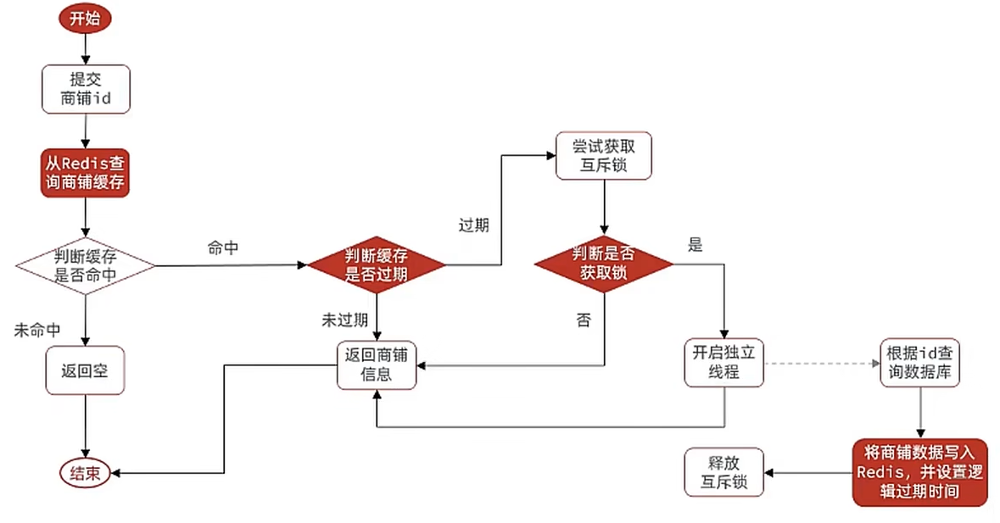
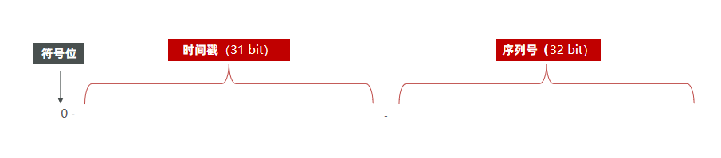
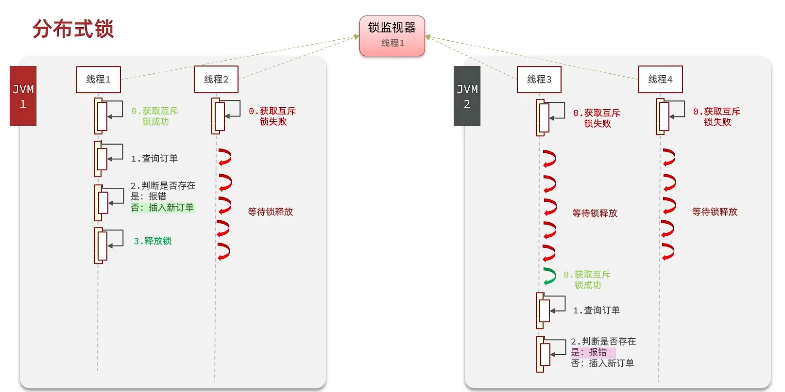

# Redis 使用场景


## 1. 短信登录

**1. 发送验证码**

```java
@Override
public Result sendCode(String phone) {

    // 1、校验手机号
    if (RegexUtils.isPhoneInvalid(phone)) {
        return Result.fail("手机号格式错误");
    }

    String code = RandomUtil.randomNumbers(6);

    // 2、保存验证码到redis
    stringRedisTemplate.opsForValue().set(LOGIN_CODE_KEY + "phone", code, 1);

    // 3、发送验证码
    log.info("发送短信验证码成功，验证码：{}", code);
    return Result.ok();
}
```


**2. 登录注册**

```java
@Override
public Result login(LoginFormDTO loginForm, HttpSession session) {
    // 1.校验手机号
    String phone = loginForm.getPhone();
    if (RegexUtils.isPhoneInvalid(phone)) {
        // 2.如果不符合，返回错误信息
        return Result.fail("手机号格式错误！");
    }
    // 3.从redis获取验证码并校验
    String cacheCode = stringRedisTemplate.opsForValue().get(LOGIN_CODE_KEY + phone);
    String code = loginForm.getCode();
    if (cacheCode == null || !cacheCode.equals(code)) {
        // 不一致，报错
        return Result.fail("验证码错误");
    }

    // 4.一致，根据手机号查询用户 select * from tb_user where phone = ?
    User user = query().eq("phone", phone).one();

    // 5.判断用户是否存在
    if (user == null) {
        // 6.不存在，创建新用户并保存
        user = createUserWithPhone(phone);
    }

    // 7.保存用户信息到 redis中
    // 7.1.随机生成token，作为登录令牌
    String token = UUID.randomUUID().toString(true);
    // 7.2.将User对象转为HashMap存储
    UserDTO userDTO = BeanUtil.copyProperties(user, UserDTO.class);
    Map<String, Object> userMap = BeanUtil.beanToMap(userDTO, new HashMap<>(),
            CopyOptions.create()
                    .setIgnoreNullValue(true)
                    .setFieldValueEditor((fieldName, fieldValue) -> fieldValue.toString()));
    // 7.3.存储
    String tokenKey = LOGIN_USER_KEY + token;
    stringRedisTemplate.opsForHash().putAll(tokenKey, userMap);
    // 7.4.设置token有效期
    stringRedisTemplate.expire(tokenKey, LOGIN_USER_TTL, TimeUnit.MINUTES);

    // 8.返回token
    return Result.ok(token);
}
```


**3. 校验**

```java
public class RefreshTokenInterceptor implements HandlerInterceptor {

@Autowired
private StringRedisTemplate stringRedisTemplate;

/**
 * 目标方法执行之前
 * @return true 放行， false 拦截
 */
    @Override
    public boolean preHandle(HttpServletRequest request, HttpServletResponse response, Object handler)
        throws Exception {

        // 1、拿到token
        String token = request.getHeader("authorization");

        // 2、用token去redis中查询用户
        Map<Object, Object> userMap = stringRedisTemplate.opsForHash().entries(LOGIN_USER_KEY+token);

        if(userMap.isEmpty()){
            response.setStatus(HttpServletResponse.SC_UNAUTHORIZED);
            return false;
        }

        // 3、将查询到的Hash数据转为UserDTO对象
        UserDTO userDTO = BeanUtil.fillBeanWithMap(userMap, new UserDTO(), false);

        // 4、存在，保存用户信息到ThreadLocal
        UserContextHolder.setUser(userDTO);

        // 存在刷新token有效期 30min
        stringRedisTemplate.expire(LOGIN_USER_KEY+token,30, TimeUnit.MINUTES);
        return true;
    }
}
```


## 2. 查询缓存

缓存数据存储于代码中,而代码运行在内存中,内存的读写性能远高于磁盘,缓存可以大大降低**用户访问并发量带来的**服务器读写压力

**缓存(**Cache),就是数据交换的**缓冲区**,俗称的缓存就是**缓冲区内的数据**,一般从数据库中获取,存储于本地代码(例如:

```java
例1:Static final ConcurrentHashMap<K,V> map = new ConcurrentHashMap<>(); 本地用于高并发

例2:static final Cache<K,V> USER_CACHE = CacheBuilder.newBuilder().build(); 用于redis等缓存

例3:Static final Map<K,V> map =  new HashMap(); 本地缓存
```

由于其被**Static**修饰,所以随着类的加载而被加载到**内存之中**,作为本地缓存,由于其又被**final**修饰,所以其引用(例3:map)和对象(例3:new HashMap())之间的关系是固定的,不能改变,因此不用担心赋值(=)导致缓存失效;


### 添加商户缓存

在我们查询商户信息时，我们是直接操作从数据库中去进行查询的，大致逻辑是这样，直接查询数据库那肯定慢咯，所以我们需要增加缓存

**缓存模型和思路**


**代码实现**

```java
@Override
public Result shopInfo(Long id) {

    String key = CACHE_SHOP_KEY + id;
    // 1、查询redis缓存
    String shopString = stringRedisTemplate.opsForValue().get(key);

    // 2、缓存中存在，直接返回
    if(shopString!=null){
        Shop shop  = JSONUtil.toBean(shopString, Shop.class);
        return Result.ok(shop);
    }
    // 3、缓存中不存在，查询数据库
    Shop byId = getById(id);

    // 4、设置缓存
    stringRedisTemplate.opsForValue().set(key,JSONUtil.toJsonStr(byId));

    return Result.ok(byId);
}
```


### 缓存更新策略

**内存淘汰：**redis自动进行，当redis内存达到咱们设定的max-memery的时候，会自动触发淘汰机制，淘汰掉一些不重要的数据(可以自己设置策略方式)

**超时剔除：**当我们给redis设置了过期时间ttl之后，redis会将超时的数据进行删除，方便咱们继续使用缓存

**主动更新：**我们可以手动调用方法把缓存删掉，通常用于解决缓存和数据库不一致问题


**数据库缓存不一致解决方案**

由于我们的**缓存的数据源来自于数据库**,而数据库的**数据是会发生变化的**,因此,如果当数据库中**数据发生变化,而缓存却没有同步**,此时就会有**一致性问题存在**。

**解决方案:**

**Cache Aside Pattern** 人工编码方式：缓存调用者在更新完数据库后再去更新缓存，也称之为双写方案

**Read/Write Through Pattern** : 由系统本身完成，数据库与缓存的问题交由系统本身去处理

**Write Behind Caching Pattern** ：调用者只操作缓存，其他线程去异步处理数据库，实现最终一致


综合考虑使用方案一 **Cache Aside Pattern 人工编码方式**

如果采用第一个方案，那么假设我们每次操作数据库后，都操作缓存，但是中间如果没有人查询，那么这个更新动作实际上只有最后一次生效，中间的更新动作意义并不大，我们可以把缓存删除，等待再次查询时，将缓存中的数据加载出来。

**1. 删除缓存还是更新缓存？**

* 更新缓存：每次更新数据库都更新缓存，无效写操作较多
* 删除缓存：更新数据库时让缓存失效，查询时再更新缓存

**2. 先操作缓存还是先操作数据库？下面图片给出答案**


**代码实现**

```java
/**
 * 查询店铺数据
 * @param id
 * @return
 */
@Override
public Result shopInfo(Long id) {

    String key = CACHE_SHOP_KEY + id;
    // 1、查询redis缓存
    String shopString = stringRedisTemplate.opsForValue().get(key);

    // 2、缓存中存在，直接返回
    if(shopString!=null){
        Shop shop  = JSONUtil.toBean(shopString, Shop.class);
        return Result.ok(shop);
    }
    // 3、缓存中不存在，查询数据库
    Shop byId = getById(id);

    // 4、设置缓存
    stringRedisTemplate.opsForValue().set(key,JSONUtil.toJsonStr(byId),30L, TimeUnit.MINUTES);

    return Result.ok(byId);
}

/**
 * 更新商铺信息
 * @param shop
 * @return
 */
@Transactional
@Override
public Result update(Shop shop) {
    Long id = shop.getId();

    if(id == null){
        return Result.fail("店铺id不能为空");
    }
    // 1、更新数据库
    updateById(shop);
    // 2、删除缓存(用于下次查询缓存跟新)
    stringRedisTemplate.delete(CACHE_SHOP_KEY + id);

    return Result.ok("跟新成功");
}
```


### 缓存穿透

缓存穿透是指客户端请求的数据在缓存中和数据库中都不存在，这样缓存永远不会生效，这些请求都会打到数据库。

常见的解决方案有两种：

**缓存空对象思路分析：**当我们客户端访问不存在的数据时，先请求redis，但是此时redis中没有数据，此时会访问到数据库，但是数据库中也没有数据，这个数据穿透了缓存，直击数据库，我们都知道数据库能够承载的并发不如redis这么高，如果大量的请求同时过来访问这种不存在的数据，这些请求就都会访问到数据库，简单的解决方案就是哪怕这个数据在数据库中也不存在，我们也把这个数据存入到redis中去，这样，下次用户过来访问这个不存在的数据，那么在redis中也能找到这个数据就不会进入到缓存了


**布隆过滤：**布隆过滤器其实采用的是哈希思想来解决这个问题，通过一个庞大的二进制数组，走哈希思想去判断当前这个要查询的这个数据是否存在，如果布隆过滤器判断存在，则放行，这个请求会去访问redis，哪怕此时redis中的数据过期了，但是数据库中一定存在这个数据，在数据库中查询出来这个数据后，再将其放入到redis中，


* 缓存空对象
  * 优点：实现简单，维护方便
  * 缺点：
    * 额外的内存消耗
    * 可能造成短期的不一致
* 布隆过滤
  * 优点：内存占用较少，没有多余key
  * 缺点：
    * 实现复杂
    * 存在误判可能


**缓存空对象代码实现**

```java
/**
 * 查询店铺数据
 * @param id
 * @return
 */
@Override
public Result shopInfo(Long id) {

    String key = CACHE_SHOP_KEY + id;
    // 1、查询redis缓存
    String shopString = stringRedisTemplate.opsForValue().get(key);

    // 2、缓存中存在空字符串，返回店铺不存在 防止缓存穿透
    if("".equals(shopString)){
        return Result.fail("店铺不存在");
    }

    // 3、缓存中存在，直接返回
    if(shopString!=null){
        Shop shop  = JSONUtil.toBean(shopString, Shop.class);
        return Result.ok(shop);
    }

    // 4、缓存中不存在，查询数据库
    Shop byId = getById(id);

    // 5、数据库中不存在，缓存空字符串 防止缓存穿透
    if(byId == null){
        stringRedisTemplate.opsForValue().set(key,"",2L, TimeUnit.MINUTES);
        return Result.fail("店铺不存在");
    }

    // 设置真是缓存数据
    stringRedisTemplate.opsForValue().set(key,JSONUtil.toJsonStr(byId),30L, TimeUnit.MINUTES);

    return Result.ok(byId);
}
```


**小总结：**

缓存穿透产生的原因是什么？

* 用户请求的数据在缓存中和数据库中都不存在，不断发起这样的请求，给数据库带来巨大压力

缓存穿透的解决方案有哪些？

* 缓存null值
* 布隆过滤
* 增强id的复杂度，避免被猜测id规律
* 做好数据的基础格式校验
* 加强用户权限校验
* 做好热点参数的限流


### 缓存雪崩

缓存雪崩是指在同一时段大量的缓存key同时失效或者Redis服务宕机，导致大量请求到达数据库，带来巨大压力。

解决方案：

* 给不同的Key的TTL添加随机值
* 利用Redis集群提高服务的可用性
* 给缓存业务添加降级限流策略
* 给业务添加多级缓存


### 缓存击穿（热点key）

缓存击穿问题也叫热点Key问题，就是一个被高并发访问并且缓存重建业务较复杂的key突然失效了，无数的请求访问会在瞬间给数据库带来巨大的冲击。

常见的解决方案有两种：

* 互斥锁
* 逻辑过期

逻辑分析：假设线程1在查询缓存之后，本来应该去查询数据库，然后把这个数据重新加载到缓存的，此时只要线程1走完这个逻辑，其他线程就都能从缓存中加载这些数据了，但是假设在线程1没有走完的时候，后续的线程2，线程3，线程4同时过来访问当前这个方法， 那么这些线程都不能从缓存中查询到数据，那么他们就会同一时刻来访问查询缓存，都没查到，接着同一时间去访问数据库，同时的去执行数据库代码，对数据库访问压力过大


**1、使用锁来解决：**

核心思路：相较于原来从缓存中查询不到数据后直接查询数据库而言，现在的方案是 进行查询之后，如果从缓存没有查询到数据，则进行互斥锁的获取，获取互斥锁后，判断是否获得到了锁，如果没有获得到，则休眠，过一会再进行尝试，直到获取到锁为止，才能进行查询

如果获取到了锁的线程，再去进行查询，查询后将数据写入redis，再释放锁，返回数据，利用互斥锁就能保证只有一个线程去执行操作数据库的逻辑，防止缓存击穿

流程图:


代码实现

```java
/**
 * 查询店铺数据
 * @param id
 * @return
 */
@Override
public Result shopInfo(Long id) {

    String key = CACHE_SHOP_KEY + id;
    // 1、查询redis缓存
    String shopString = stringRedisTemplate.opsForValue().get(key);

    // 2、缓存中存在空字符串，返回店铺不存在 防止缓存穿透
    if("".equals(shopString)){
        return Result.fail("店铺不存在");
    }

    // 3、缓存中存在，直接返回
    if(shopString!=null){
        Shop shop  = JSONUtil.toBean(shopString, Shop.class);
        return Result.ok(shop);
    }


    String lockKey = "lock:shop:" + id;
    Shop byId = null;

    try {
        // 4、缓存中不存在，尝试获取互斥锁
        if(!tryLock(lockKey)){
            Thread.sleep(5000);
            return shopInfo(id);
        }

        // 5、缓存中不存在，查询数据库
        byId = getById(id);

        // 6、数据库中不存在，缓存空字符串 防止缓存穿透
        if(byId == null){
            stringRedisTemplate.opsForValue().set(key,"",2L, TimeUnit.MINUTES);
            return Result.fail("店铺不存在");
        }

        // 设置真是缓存数据
        stringRedisTemplate.opsForValue().set(key,JSONUtil.toJsonStr(byId),30L, TimeUnit.MINUTES);
    }catch (Exception e){
        log.error(e.getMessage());
    }finally {
        // 7、释放锁
        unlock(lockKey);
    }

    return Result.ok(byId);
}
```

操作锁

```java
// 尝试获取锁
private boolean tryLock(String key) {
    Boolean flag = stringRedisTemplate.opsForValue().setIfAbsent(key, "1", 10, TimeUnit.SECONDS);
    return Boolean.TRUE.equals(flag);
}

// 释放锁
private boolean unlock(String key) {
    return stringRedisTemplate.delete(key);
}
```


**2、利用逻辑过期解决缓存击穿问题**

需求：修改根据id查询商铺的业务，基于逻辑过期方式来解决缓存击穿问题

思路分析：当用户开始查询redis时，判断是否命中，如果没有命中则直接返回空数据，不查询数据库，而一旦命中后，将value取出，判断value中的过期时间是否满足，如果没有过期，则直接返回redis中的数据，如果过期，则在开启独立线程后直接返回之前的数据，独立线程去重构数据，重构完成后释放互斥锁。



**步骤一、**

新建一个实体类，我们采用第二个方案，这个方案，对原来代码没有侵入性。

```java
/**
 * redis 逻辑过期实体类
 * @param <T>
 */
@Data
public class RedisData<T> {
    private LocalDateTime expireTime;
    private T data;

    public RedisData(){
    }

    public RedisData(LocalDateTime expireTime, T data) {
        this.expireTime = expireTime;
        this.data = data;
    }
}

```


**步骤二、**

锁操作、跟新缓存

```java
// 将店铺数据存入redis
public void saveShop2Redis(Long id, Long expireSeconds) throws InterruptedException {
    Thread.sleep(1000);
    // 1. 查询店铺数据
    Shop shop = getById(id);
    // 2. 封装逻辑过期店铺数据
    RedisData<Shop> shopRedisData = new RedisData(LocalDateTime.now().plusSeconds(expireSeconds), shop);
    // 3. 将店铺数据写入 Redis
    stringRedisTemplate.opsForValue().set(CACHE_SHOP_KEY + id, JSONUtil.toJsonStr(shopRedisData));
}

// 尝试获取锁
private boolean tryLock(String key) {
    Boolean flag = stringRedisTemplate.opsForValue().setIfAbsent(key, "1", 10, TimeUnit.SECONDS);
    return Boolean.TRUE.equals(flag);
}

// 释放锁
private boolean unlock(String key) {
    return stringRedisTemplate.delete(key);
}
```


**步骤二、**

核心代码实现

```java
// 创建一个包含10个工作线程的固定线程池 ExecutorService - Java并发框架中的接口，用于管理和控制线程执行
private static final ExecutorService executorService = Executors.newFixedThreadPool(10);

/**
 * 查询店铺数据
 * @param id
 * @return
 */
@Override
public Result shopInfo(Long id)  {

    String key = CACHE_SHOP_KEY + id;
    // 1、查询redis缓存
    String shopString = stringRedisTemplate.opsForValue().get(key);

    // 2、缓存未命中，直接返回
    if(shopString==null){
        return Result.ok(null);
    }

    // 3、命中，判断是否过期
    RedisData redisData = JSONUtil.toBean(shopString, RedisData.class);
    Shop shop = JSONUtil.toBean((JSONObject)redisData.getData(), Shop.class);

    LocalDateTime expireTime = redisData.getExpireTime();

    if(expireTime.isAfter(LocalDateTime.now())){
        // 3.1、未过期，直接返回店铺信息
        return Result.ok(shop);
    }

    // 3.2、已过期，缓存重建
    String lockKey = "lock:shop:" + id;
    if(tryLock(lockKey)){
        // 获取锁成功，开启独立线程，实现缓存重建
        executorService.submit(() -> {
            try {
                // 重建缓存
                this.saveShop2Redis(id, 20L);
            } catch (Exception e) {
                log.error(e.getMessage());
            } finally {
                // 7、释放锁
                unlock(lockKey);
            }
        });

    }

    // 4、返回过期的商铺信息
    return Result.ok(shop);
}
```


### 封装Redis工具类

基于StringRedisTemplate封装一个缓存工具类，满足下列需求：

* 方法1：将任意Java对象序列化为json并存储在string类型的key中，并且可以设置TTL过期时间
* 方法2：将任意Java对象序列化为json并存储在string类型的key中，并且可以设置逻辑过期时间，用于处理缓

存击穿问题

* 方法3：根据指定的key查询缓存，并反序列化为指定类型，利用缓存空值的方式解决缓存穿透问题
* 方法4：根据指定的key查询缓存，并反序列化为指定类型，需要利用逻辑过期解决缓存击穿问题

将逻辑进行封装

```java
package com.hmdp.utils;

import cn.hutool.core.util.StrUtil;
import cn.hutool.json.JSONObject;
import cn.hutool.json.JSONUtil;
import lombok.Data;
import lombok.extern.slf4j.Slf4j;
import org.springframework.data.redis.core.StringRedisTemplate;
import org.springframework.stereotype.Component;

import java.time.LocalDateTime;
import java.util.concurrent.ExecutorService;
import java.util.concurrent.Executors;
import java.util.concurrent.TimeUnit;
import java.util.function.Function;

@Slf4j
@Component
public class CacheClient {

    private final StringRedisTemplate stringRedisTemplate;

    // 线程池
    private static final ExecutorService CACHE_REBUILD_EXECUTOR = Executors.newFixedThreadPool(10);

    public CacheClient(StringRedisTemplate stringRedisTemplate) {
        this.stringRedisTemplate = stringRedisTemplate;
    }

    /**
     * 写入缓存
     * @param key 键
     * @param value 值
     * @param time 时间大小
     * @param unit 时间类型
     */
    public void set(String key, Object value, Long time, TimeUnit unit) {
        stringRedisTemplate.opsForValue().set(key, JSONUtil.toJsonStr(value), time, unit);
    }

    /**
     * 写入逻辑过期缓存
     * @param key 键
     * @param value 值
     * @param time 时间大小
     * @param unit 时间类型
     */
    public void setWithLogicalExpire(String key, Object value, Long time, TimeUnit unit) {
        // 设置逻辑过期
        RedisData redisData = new RedisData();
        redisData.setData(value);
        // 逻辑过期时间
        redisData.setExpireTime(LocalDateTime.now().plusSeconds(unit.toSeconds(time)));
        // 写入Redis
        stringRedisTemplate.opsForValue().set(key, JSONUtil.toJsonStr(redisData));
    }

    /**
     * 缓存穿透
     * @param keyPrefix key 前缀
     * @param id id
     * @param type 返回类型
     * @param dbFallback 数据库查询函数
     * @param time 过期时间
     * @param unit 过期时间单位
     * @return R
     * @param <R> 返回类型
     * @param <ID> 回调函数参数类型
     */
    public <R, ID> R queryWithPassThrough(String keyPrefix, ID id, Class<R> type, Function<ID, R> dbFallback, Long time,
        TimeUnit unit) {
        String key = keyPrefix + id;
        // 1.从redis查询商铺缓存
        String json = stringRedisTemplate.opsForValue().get(key);
        // 2.判断是否存在
        if (StrUtil.isNotBlank(json)) {
            // 3.存在，直接返回
            return JSONUtil.toBean(json, type);
        }
        // 判断命中的是否是空值
        if (json != null) {
            // 返回一个错误信息
            return null;
        }

        // 4.不存在，根据id查询数据库 （回调函数调用）
        R r = dbFallback.apply(id);
        // 5.不存在，返回错误
        if (r == null) {
            // 将空值写入redis
            stringRedisTemplate.opsForValue().set(key, "", 10L, TimeUnit.MINUTES);
            // 返回错误信息
            return null;
        }
        // 6.存在，写入redis
        this.set(key, r, time, unit);
        return r;
    }

    /**
     * 缓存击穿（利用逻辑过期解决）
     * @param keyPrefix key 前缀
     * @param id id
     * @param type 返回类型
     * @param dbFallback 数据库查询函数
     * @param time 过期时间
     * @param unit 过期时间单位
     * @return R
     * @param <R> 返回类型
     * @param <ID> 回调函数参数类型
     */
    public <R, ID> R queryWithLogicalExpire(String keyPrefix, ID id, Class<R> type, Function<ID, R> dbFallback,
        Long time, TimeUnit unit) {
        String key = keyPrefix + id;
        // 1.从redis查询商铺缓存
        String json = stringRedisTemplate.opsForValue().get(key);
        // 2.判断是否存在
        if (StrUtil.isBlank(json)) {
            // 3.存在，直接返回
            return null;
        }
        // 4.命中，需要先把json反序列化为对象
        RedisData redisData = JSONUtil.toBean(json, RedisData.class);
        R r = JSONUtil.toBean((JSONObject)redisData.getData(), type);
        LocalDateTime expireTime = redisData.getExpireTime();
        // 5.判断是否过期
        if (expireTime.isAfter(LocalDateTime.now())) {
            // 5.1.未过期，直接返回店铺信息
            return r;
        }
        // 5.2.已过期，需要缓存重建
        // 6.缓存重建
        // 6.1.获取互斥锁
        String lockKey = "lockKey" + id;
        boolean isLock = tryLock(lockKey);
        // 6.2.判断是否获取锁成功
        if (isLock) {
            // 6.3.成功，开启独立线程，实现缓存重建
            CACHE_REBUILD_EXECUTOR.submit(() -> {
                try {
                    // 查询数据库（回调函数调用）
                    R newR = dbFallback.apply(id);
                    // 重建缓存
                    this.setWithLogicalExpire(key, newR, time, unit);
                } catch (Exception e) {
                    throw new RuntimeException(e);
                } finally {
                    // 释放锁
                    unlock(lockKey);
                }
            });
        }
        // 6.4.返回过期的商铺信息
        return r;
    }

    /**
     * 缓存击穿（利用互斥锁解决）
     * @param keyPrefix key 前缀
     * @param id id
     * @param type 返回类型
     * @param dbFallback 数据库查询函数
     * @param time 过期时间
     * @param unit 过期时间单位
     * @return R
     * @param <R> 返回类型
     * @param <ID> 回调函数参数类型
     */
    public <R, ID> R queryWithMutex(String keyPrefix, ID id, Class<R> type, Function<ID, R> dbFallback, Long time,
        TimeUnit unit) {
        String key = keyPrefix + id;
        // 1.从redis查询商铺缓存
        String shopJson = stringRedisTemplate.opsForValue().get(key);
        // 2.判断是否存在
        if (StrUtil.isNotBlank(shopJson)) {
            // 3.存在，直接返回
            return JSONUtil.toBean(shopJson, type);
        }
        // 判断命中的是否是空值
        if (shopJson != null) {
            // 返回一个错误信息
            return null;
        }

        // 4.实现缓存重建
        // 4.1.获取互斥锁
        String lockKey = "lockKey" + id;
        R r = null;
        try {
            boolean isLock = tryLock(lockKey);
            // 4.2.判断是否获取成功
            if (!isLock) {
                // 4.3.获取锁失败，休眠并重试
                Thread.sleep(50);
                return queryWithMutex(keyPrefix, id, type, dbFallback, time, unit);
            }
            // 4.4.获取锁成功，根据id查询数据库
            r = dbFallback.apply(id);
            // 5.不存在，返回错误
            if (r == null) {
                // 将空值写入redis
                stringRedisTemplate.opsForValue().set(key, "", 10L, TimeUnit.MINUTES);
                // 返回错误信息
                return null;
            }
            // 6.存在，写入redis
            this.set(key, r, time, unit);
        } catch (InterruptedException e) {
            throw new RuntimeException(e);
        } finally {
            // 7.释放锁
            unlock(lockKey);
        }
        // 8.返回
        return r;
    }

    private boolean tryLock(String key) {
        Boolean flag = stringRedisTemplate.opsForValue().setIfAbsent(key, "1", 10, TimeUnit.SECONDS);
        return Boolean.TRUE.equals(flag);
    }

    private void unlock(String key) {
        stringRedisTemplate.delete(key);
    }

    // 逻辑过期实体类
    @Data
    class RedisData<T> {
        private LocalDateTime expireTime;
        private T data;
    }
}
```


## 3. 秒杀场景

### 全局唯一ID

**全局ID生成器**，是一种在分布式系统下用来生成全局唯一ID的工具，一般要满足下列特性：


为了增加ID的安全性，我们可以不直接使用Redis自增的数值，而是拼接一些其它信息：



永远为0

时间戳：31bit，以秒为单位，可以使用69年

序列号：32bit，秒内的计数器，支持每秒产生2^32个不同ID

**Redis实现全局唯一Id**

```java
/**
 * redis 全局唯一id生成器
 */
@Component
public class RedisIdWorker {

    @Autowired
    private StringRedisTemplate stringRedisTemplate;

    // 开始时间 2023-01-01 00:00:00
    private static final long BEGIN_TIMESTAMP = 1052269261L;

    /**
     * 生成全局唯一id
     *
     * @param keyPrefix key前缀
     * @return
     */
    public Long nextId(String keyPrefix) {
        // 1.生成时间戳
        LocalDateTime now = LocalDateTime.now();
        long nowEpochSecond = now.toEpochSecond(java.time.ZoneOffset.UTC);
        long timestamp = nowEpochSecond - BEGIN_TIMESTAMP;

        // 2.生成序列号
        String key = "icr:" + keyPrefix + ":" + now.format(DateTimeFormatter.ofPattern("yyyy:MM:dd"));
        // 自增长
        long count = stringRedisTemplate.opsForValue().increment(key);

        // 3.拼接并返回 或运算左移动32为，与序列号做或或运算
        return (timestamp << 32) | count;
    }

    public static void main(String[] args) {
        // 生成起始时间戳
        LocalDateTime localDateTime = LocalDateTime.of(2003, 5, 7, 1, 1, 1);
        System.out.println(localDateTime);
        long l = localDateTime.toEpochSecond(java.time.ZoneOffset.UTC);
        System.out.println(l);
    }
}
```


### 库存超卖问题

使用MySQL的锁机制，防止超卖问题。

```java
// 4、扣减库存
boolean success = seckillVoucherService.update()
        .setSql("stock = stock - 1") // set stock = stock - 1
        .eq("voucher_id", id).gt("stock", 0) // where voucher_id = ? and stock > 0
        .update();
if(!success){
    return Result.fail("库存不足");
}
```


### 一人一单

需求：修改秒杀业务，要求同一个优惠券，一个用户只能下一单

```java
/**
 * 秒杀优惠券
 * @param id 优惠卷id
 * @return
 */
@Override
public Result seckillVoucher(Long id) {

    // 1、查询优惠卷信息
    SeckillVoucher seckillVoucher = seckillVoucherService.getById(id);

    // 2、判断是否在活动时间内
    if(seckillVoucher.getBeginTime().isAfter(LocalDateTime.now())){
        return Result.fail("秒杀尚未开始");
    }

    if(seckillVoucher.getEndTime().isBefore(LocalDateTime.now())){
        return Result.fail("秒杀已经结束");
    }

    // 3、判断库存是否充足
    if(seckillVoucher.getStock()<1){
        return Result.fail("库存不足");
    }

    Long userId = UserContextHolder.getUser().getId();

    // 一人一单锁,多用户id的值为锁
    synchronized (userId.toString().intern()){

        // 获取代理对象事务
        IVoucherOrderService proxy = (IVoucherOrderService)AopContext.currentProxy();

        // 创建订单、扣减库存
        return proxy.createVoucherOrder(id,userId);
    }
}

/**
 * 创建订单、扣减库存
 * @param id 优惠卷id
 * @param userId 用户id
 * @return
 */
@Transactional
public Result createVoucherOrder(Long id,Long userId) {
    // 4、查询订单是否存在
    int count = query().eq("user_id", userId).eq("voucher_id", id).count();
    if (count > 0) {
        // 用户已经购买过了
        return Result.fail("用户已经购买过一次！");
    }

    // 5、扣减库存
    boolean success = seckillVoucherService.update()
        .setSql("stock = stock - 1") // set stock = stock - 1
        .eq("voucher_id", id).gt("stock", 0) // where voucher_id = ? and stock > 0
        .update();
    if(!success){
        return Result.fail("库存不足");
    }

    // 6、创建订单
    VoucherOrder voucherOrder = new VoucherOrder();
    // 订单id
    Long voucherOrderId = redisIdWorker.nextId("order");
    voucherOrder.setId(voucherOrderId);
    // 用户id 通过 ThreadLocal 获取用户id
    voucherOrder.setUserId(userId);
    voucherOrder.setVoucherId(id);
    boolean save = save(voucherOrder);
    // 7、返回订单id
    return Result.ok(voucherOrderId);
}
```

这里会造成事务失效，我们需要获得原始的代理事务对象，还需要开启暴露代理对象。

```java
@EnableAspectJAutoProxy(exposeProxy = true) // 开启代理暴露
@MapperScan("com.hmdp.mapper")
@SpringBootApplication
public class HmDianPingApplication {

    public static void main(String[] args) {
        SpringApplication.run(HmDianPingApplication.class, args);
    }

}
```

```xml
<!--暴露代理对象注解需要导入下面这个依赖-->
<dependency>
    <groupId>org.aspectj</groupId>
    <artifactId>aspectjweaver</artifactId>
    <version>1.9.7</version>
</dependency>
```


### 集群环境下的并发问题

由于现在我们部署了多个tomcat，每个tomcat都有一个属于自己的jvm，那么假设在服务器A的tomcat内部，有两个线程，这两个线程由于使用的是同一份代码，那么他们的锁对象是同一个，是可以实现互斥的，但是如果现在是服务器B的tomcat内部，又有两个线程，但是他们的锁对象写的虽然和服务器A一样，但是锁对象却不是同一个，所以线程3和线程4可以实现互斥，但是却无法和线程1和线程2实现互斥，这就是 集群环境下，syn锁失效的原因，在这种情况下，我们就需要使用分布式锁来解决这个问题。


## 4. 分布式锁

### 基本原理和实现方式对比

分布式锁：满足分布式系统或集群模式下多进程可见并且互斥的锁。

分布式锁的核心思想就是让大家都使用同一把锁，只要大家使用的是同一把锁，那么我们就能锁住线程，不让线程进行，让程序串行执行，这就是分布式锁的核心思路



那么分布式锁他应该满足一些什么样的条件呢？

可见性：多个线程都能看到相同的结果，注意：这个地方说的可见性并不是并发编程中指的内存可见性，只是说多个进程之间都能感知到变化的意思

互斥：互斥是分布式锁的最基本的条件，使得程序串行执行

高可用：程序不易崩溃，时时刻刻都保证较高的可用性

高性能：由于加锁本身就让性能降低，所有对于分布式锁本身需要他就较高的加锁性能和释放锁性能

安全性：安全也是程序中必不可少的一环


常见的分布式锁有三种

- `MySQL`：MySQL本身就带有锁机制，但是由于MySQL性能本身一般，所以采用分布式锁的情况下，其实使用MySQL作为分布式锁比较少见
- `Redis`：redis作为分布式锁是非常常见的一种使用方式，现在企业级开发中基本都使用redis或者zookeeper作为分布式锁，利用setnx这个方法，如果插入key成功，则表示获得到了锁，如果有人插入成功，其他人插入失败则表示无法获得到锁，利用这套逻辑来实现分布式锁
- `Zookeeper`：zookeeper也是企业级开发中较好的一个实现分布式锁的方案，由于本套视频并不讲解zookeeper的原理和分布式锁的实现，所以不过多阐述


### Redis分布式锁的实现核心

实现分布式锁时需要实现的两个基本方法：

* **获取锁**：

  * 互斥：确保只能有一个线程获取锁 

  * 非阻塞：尝试一次，成功返回true，失败返回false

    

* **释放锁**：

  * 手动释放
  * 超时释放：获取锁时添加一个超时时间


核心思路：

我们利用redis 的setNx 方法，当有多个线程进入时，我们就利用该方法，第一个线程进入时，redis 中就有这个key 了，返回了1，如果结果是1，则表示他抢到了锁，那么他去执行业务，然后再删除锁，退出锁逻辑，没有抢到锁的哥们，等待一定时间后重试即可


### **分布式锁实现**

**编写锁的基本操作**

```java
/**
 * redis 锁操作
 */
@Component
public class SimpleRedisLock implements Lock {

    @Autowired
    private StringRedisTemplate stringRedisTemplate;

    private static final String KEY_PREFIX = "lock:";

    @Override
    public boolean tryLock(String name, long timeoutSec) {
        long id = Thread.currentThread().getId();
        Boolean b = stringRedisTemplate.opsForValue()
            .setIfAbsent(KEY_PREFIX + name, id + "", timeoutSec, TimeUnit.SECONDS);
        return Boolean.TRUE.equals(b);
    }

    @Override
    public void unlock(String name) {
        stringRedisTemplate.delete(KEY_PREFIX + name);
    }
}
```

**使用redis分布式锁**

```java
// 4、获取redis分布式锁
if (!simpleRedisLock.tryLock("order:" + userId,10)){
    return Result.fail("不允许重复下单");
}

try{
    // 获取代理对象事务
    IVoucherOrderService proxy = (IVoucherOrderService)AopContext.currentProxy();
    // 创建订单、扣减库存
    return proxy.createVoucherOrder(id,userId);
}catch (Exception e){
    e.printStackTrace();
    return Result.fail("下单失败");
}finally {
    // 释放锁
    simpleRedisLock.unlock("order:" + userId);
}
```


### Redis分布式锁误删问题

逻辑说明：

持有锁的线程在锁的内部出现了阻塞，导致他的锁自动释放，这时其他线程，线程2来尝试获得锁，就拿到了这把锁，然后线程2在持有锁执行过程中，线程1反应过来，继续执行，而线程1执行过程中，走到了删除锁逻辑，此时就会把本应该属于线程2的锁进行删除，这就是误删别人锁的情况说明

解决方案：解决方案就是在每个线程释放锁的时候，去判断一下当前这把锁是否属于自己，如果属于自己，则不进行锁的删除，假设还是上边的情况，线程1卡顿，锁自动释放，线程2进入到锁的内部执行逻辑，此时线程1反应过来，然后删除锁，但是线程1，一看当前这把锁不是属于自己，于是不进行删除锁逻辑，当线程2走到删除锁逻辑时，如果没有卡过自动释放锁的时间点，则判断当前这把锁是属于自己的，于是删除这把锁。


**解决锁误删问题**

需求：修改之前的分布式锁实现，满足：在获取锁时存入线程标示（可以用UUID表示）
在释放锁时先获取锁中的线程标示，判断是否与当前线程标示一致

* 如果一致则释放锁
* 如果不一致则不释放锁

核心逻辑：在存入锁时，放入自己线程的标识，在删除锁时，判断当前这把锁的标识是不是自己存入的，如果是，则进行删除，如果不是，则不进行删除。


```java
/**
 * redis 锁操作
 */
@Component
public class SimpleRedisLock implements Lock {

    @Autowired
    private StringRedisTemplate stringRedisTemplate;

    private static final String KEY_PREFIX = "lock:";

    private static final String UUID_VALUE = UUID.randomUUID().toString(true) + "-";

    @Override
    public boolean tryLock(String name, long timeoutSec) {
        long threadId = Thread.currentThread().getId();
        Boolean b = stringRedisTemplate.opsForValue()
                .setIfAbsent(KEY_PREFIX + name, UUID_VALUE + threadId, timeoutSec, TimeUnit.SECONDS);
        return Boolean.TRUE.equals(b);
    }

    @Override
    public void unlock(String name) {
        // 获取标识
        String value = UUID_VALUE + Thread.currentThread().getId();;
        // 获取锁的值
        String lockValue = stringRedisTemplate.opsForValue().get(KEY_PREFIX + name);

        // 判断是否是自己的锁
        if(value.equals(lockValue)){
            stringRedisTemplate.delete(KEY_PREFIX + name);
        }
    }
}
```

更为极端的误删逻辑说明：

线程1现在持有锁之后，在执行业务逻辑过程中，他正准备删除锁，而且已经走到了条件判断的过程中，比如他已经拿到了当前这把锁确实是属于他自己的，正准备删除锁，但是此时他的锁到期了，那么此时线程2进来，但是线程1他会接着往后执行，当他卡顿结束后，他直接就会执行删除锁那行代码，相当于条件判断并没有起到作用，这就是删锁时的原子性问题，之所以有这个问题，是因为线程1的拿锁，比锁，删锁，实际上并不是原子性的，我们要防止刚才的情况发生，


### Lua脚本实现原子性

lua脚本本身并不需要大家花费太多时间去研究，只需要知道如何调用，大致是什么意思即可，所以在笔记中并不会详细的去解释这些lua表达式的含义。

我们的RedisTemplate中，可以利用execute方法去执行lua脚本，参数对应关系就如下图股

`unlock.lua` 脚本

```lua
-- 这里的 KEYS[1] 就是锁的key，这里的ARGV[1] 就是当前线程标示
-- 获取锁中的标示，判断是否与当前线程标示一致
if (redis.call('GET', KEYS[1]) == ARGV[1]) then
  -- 一致，则删除锁
  return redis.call('DEL', KEYS[1])
end
-- 不一致，则直接返回
return 0
```


**原子性释放锁**

```java
// lua脚本对象
private static final DefaultRedisScript<Long> UNLOCK_SCRIPT;

static {
    UNLOCK_SCRIPT = new DefaultRedisScript<>();
    // 获取resources目录下的unlock.lua脚本
    UNLOCK_SCRIPT.setLocation(new ClassPathResource("unlock.lua"));
    // 设置脚本返回值类型
    UNLOCK_SCRIPT.setResultType(Long.class);
}

/**
 * 原子性释放锁
 * @param name
 */
@Override
public void unlock(String name) {
    // 调用lua脚本
    stringRedisTemplate.execute(
            UNLOCK_SCRIPT,
            Collections.singletonList(KEY_PREFIX + name),
            UUID_VALUE + Thread.currentThread().getId());
}
```


## 5. 分布式锁-redission

基于setnx实现的分布式锁存在下面的问题：

**重入问题**：重入问题是指 获得锁的线程可以再次进入到相同的锁的代码块中，可重入锁的意义在于防止死锁，比如HashTable这样的代码中，他的方法都是使用synchronized修饰的，假如他在一个方法内，调用另一个方法，那么此时如果是不可重入的，不就死锁了吗？所以可重入锁他的主要意义是防止死锁，我们的synchronized和Lock锁都是可重入的。

**不可重试**：是指目前的分布式只能尝试一次，我们认为合理的情况是：当线程在获得锁失败后，他应该能再次尝试获得锁。

**超时释放：**我们在加锁时增加了过期时间，这样的我们可以防止死锁，但是如果卡顿的时间超长，虽然我们采用了lua表达式防止删锁的时候，误删别人的锁，但是毕竟没有锁住，有安全隐患

**主从一致性：** 如果Redis提供了主从集群，当我们向集群写数据时，主机需要异步的将数据同步给从机，而万一在同步过去之前，主机宕机了，就会出现死锁问题。


那么什么是Redission呢

Redisson是一个在Redis的基础上实现的Java驻内存数据网格（In-Memory Data Grid）。它不仅提供了一系列的分布式的Java常用对象，还提供了许多分布式服务，其中就包含了各种分布式锁的实现。

Redission提供了分布式锁的多种多样的功能


### Redission 快速入门

引入依赖：

```xml
<dependency>
	<groupId>org.redisson</groupId>
	<artifactId>redisson</artifactId>
	<version>3.13.6</version>
</dependency>
```

配置Redisson客户端：

```java
@Configuration
public class RedissonConfig {

    @Bean
    public RedissonClient redissonClient(){
        // 配置
        Config config = new Config();
        config.useSingleServer().setAddress("redis://192.168.150.101:6379")
            .setPassword("123321");
        // 创建RedissonClient对象
        return Redisson.create(config);
    }
}
```

使用Redisson锁：

```java
@Resource
private RedissionClient redissonClient;

@Test
void testRedisson() throws Exception{
    //获取锁(可重入)，指定锁的名称
    RLock lock = redissonClient.getLock("anyLock");
    //尝试获取锁，参数分别是：获取锁的最大等待时间(期间会重试)，锁自动释放时间，时间单位
    boolean isLock = lock.tryLock(1,10,TimeUnit.SECONDS);
    //判断获取锁成功
    if(isLock){
        try{
            System.out.println("执行业务");          
        }finally{
            //释放锁
            lock.unlock();
        }
        
    } 
}
```


### Redission 可重入锁原理

在Lock锁中，他是借助于底层的一个voaltile的一个state变量来记录重入的状态的，比如当前没有人持有这把锁，那么state=0，假如有人持有这把锁，那么state=1，如果持有这把锁的人再次持有这把锁，那么state就会+1 ，如果是对于synchronized而言，他在c语言代码中会有一个count，原理和state类似，也是重入一次就加一，释放一次就-1 ，直到减少成0 时，表示当前这把锁没有被人持有。  


### Redission锁的MutiLock原理

为了提高redis的可用性，我们会搭建集群或者主从，现在以主从为例

此时我们去写命令，写在主机上， 主机会将数据同步给从机，但是假设在主机还没有来得及把数据写入到从机去的时候，此时主机宕机，哨兵会发现主机宕机，并且选举一个slave变成master，而此时新的master中实际上并没有锁信息，此时锁信息就已经丢掉了。


为了解决这个问题，redission提出来了MutiLock锁，MultiLock 是 Redisson 提供的一种**联锁机制**，可以同时对多个资源进行加锁，只有当**所有锁都获取成功**时才算成功，这样可以避免死锁问题。

使用这把锁咱们就不使用主从了，每个节点的地位都是一样的， 这把锁加锁的逻辑需要写入到每一个主丛节点上，只有所有的服务器都写入成功，此时才是加锁成功，假设现在某个节点挂了，那么他去获得锁的时候，只要有一个节点拿不到，都不能算是加锁成功，就保证了加锁的可靠性。


## 6. Redis 消息队列

什么是消息队列：字面意思就是存放消息的队列。最简单的消息队列模型包括3个角色：

* 消息队列：存储和管理消息，也被称为消息代理（Message Broker）
* 生产者：发送消息到消息队列
* 消费者：从消息队列获取消息并处理消息


使用队列的好处在于 **解耦：**所谓解耦，举一个生活中的例子就是：快递员(生产者)把快递放到快递柜里边(Message Queue)去，我们(消费者)从快递柜里边去拿东西，这就是一个异步，如果耦合，那么这个快递员相当于直接把快递交给你，这事固然好，但是万一你不在家，那么快递员就会一直等你，这就浪费了快递员的时间，所以这种思想在我们日常开发中，是非常有必要的。

这种场景在我们秒杀中就变成了：我们下单之后，利用redis去进行校验下单条件，再通过队列把消息发送出去，然后再启动一个线程去消费这个消息，完成解耦，同时也加快我们的响应速度。

这里我们可以使用一些现成的mq，比如kafka，rabbitmq等等，但是呢，如果没有安装mq，我们也可以直接使用redis提供的mq方案，降低我们的部署和学习成本。


### List 实现消息队列

消息队列（Message Queue），字面意思就是存放消息的队列。而Redis的list数据结构是一个双向链表，很容易模拟出队列效果。

队列是入口和出口不在一边，因此我们可以利用：LPUSH 结合 RPOP、或者 RPUSH 结合 LPOP来实现。
不过要注意的是，当队列中没有消息时RPOP或LPOP操作会返回null，并不像JVM的阻塞队列那样会阻塞并等待消息。因此这里应该使用BRPOP或者BLPOP来实现阻塞效果。


### 基于PubSub的消息队列
