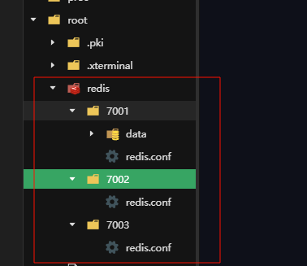

# Redis 集群


## Redis 主从集群

我们搭建的主从集群结构如图：


共包含三个节点，一个主节点，两个从节点。

这里我们会在同一台虚拟机中开启3个redis实例，模拟主从集群，信息如下：

|       IP       | PORT |  角色  |
| :------------: | :--: | :----: |
| 192.168.30.129 | 7001 | master |
| 192.168.30.129 | 7002 | slave  |
| 192.168.30.129 | 7003 | slave  |


**文件结构**



**redis.conf **

```sh
requirepass 123456
bind 0.0.0.0
port 7001
dir /data
save 900 1
save 300 10
save 60 10000

# 关闭AOF
appendonly no

replica-announce-ip 192.168.30.129
```


**启动容器实例**

```sh
docker run -d --name redis-7001 \
  -p 7001:7001 \
  -v /root/redis/7001/redis.conf:/usr/local/etc/redis/redis.conf \
  redis:latest \
  redis-server /usr/local/etc/redis/redis.conf
```


**分别运行容器**

```sh
docker start redis-7001
docker start redis-7002
docker start redis-7003
```


**开启主从关系**

```sh
# 连接 7002
redis-cli -p 7002

# 如果主节点有密码，从节点需要提供主节点密码
CONFIG SET masterauth 123456

# 执行slaveof
slaveof 192.168.30.129 7001
```


**然后连接 7001节点，查看集群状态：**

```sh
# 连接 7001
redis-cli -p 7001
# 查看状态
info replication
```


