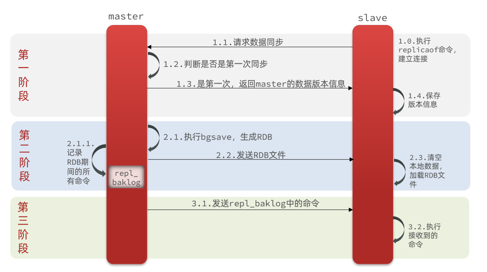
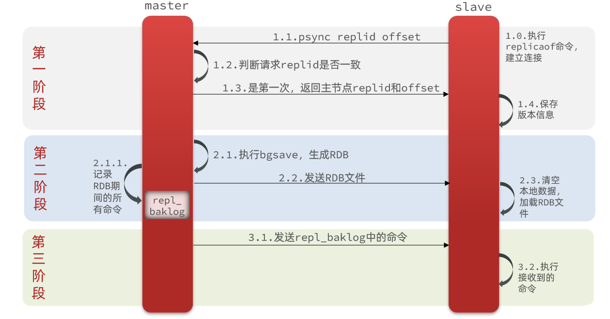
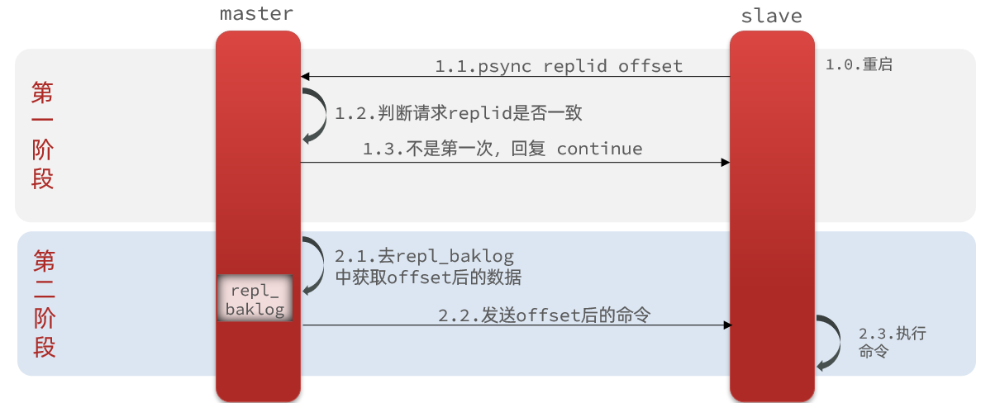

# 分布式缓存

单机的Redis存在四大问题：


## Redis持久化

Redis有两种持久化方案：

- RDB持久化
- AOF持久化


### RDB 持久化

RDB全称Redis Database Backup file（Redis数据备份文件），也被叫做Redis数据快照。简单来说就是把内存中的所有数据都记录到磁盘中。当Redis实例故障重启后，从磁盘读取快照文件，恢复数据。快照文件称为RDB文件，默认是保存在当前运行目录。


**执行时机**

RDB持久化在四种情况下会执行：

- 执行save命令
- 执行bgsave命令
- Redis 正常关闭（SHUTDOWN）
- 触发RDB条件时


**1）save命令**

执行下面的命令，可以立即执行一次RDB：


save命令会导致主进程执行RDB，这个过程中其它所有命令都会被阻塞。只有在数据迁移时可能用到。


**2）bgsave命令**

下面的命令可以异步执行RDB：


这个命令执行后会开启独立进程完成RDB，主进程可以持续处理用户请求，不受影响。


**3）停机时**

Redis停机时会执行一次save命令，实现RDB持久化。


**4）触发RDB条件**

Redis内部有触发RDB的机制，可以在redis.conf文件中找到，格式如下：

```sh
# 900秒内，如果至少有1个key被修改，则执行bgsave ， 如果是save "" 则表示禁用RDB
save 900 1  
save 300 10  
save 60 10000 
```


RDB的其它配置也可以在redis.conf文件中设置：

```sh
# 是否压缩 ,建议不开启，压缩也会消耗cpu，磁盘的话不值钱
rdbcompression yes

# RDB文件名称
dbfilename dump.rdb  

# 文件保存的路径目录
dir ./ 
```


**bgsave 原理**

bgsave开始时会fork主进程得到子进程，子进程共享主进程的内存数据。完成fork后读取内存数据并写入 RDB 文件。

fork采用的是copy-on-write技术：

- 当主进程执行读操作时，访问共享内存；
- 当主进程执行写操作时，则会拷贝一份数据，执行写操作。


**小结**

RDB方式bgsave的基本流程？

- fork主进程得到一个子进程，共享内存空间
- 子进程读取内存数据并写入新的RDB文件
- 用新RDB文件替换旧的RDB文件

RDB会在什么时候执行？save 60 1000代表什么含义？

- 默认是服务停止时
- 代表60秒内至少执行1000次修改则触发RDB

RDB的缺点？

- RDB执行间隔时间长，两次RDB之间写入数据有丢失的风险
- fork子进程、压缩、写出RDB文件都比较耗时


### AOF 持久化

AOF全称为Append Only File（追加文件）。Redis处理的每一个写命令都会记录在AOF文件，可以看做是命令日志文件。


**AOF 配置**

AOF默认是关闭的，需要修改 `redis.conf` 配置文件来开启AOF：

```properties
# 是否开启AOF功能，默认是no
appendonly yes
# AOF文件的名称
appendfilename "appendonly.aof"
```


AOF的命令记录的频率也可以通过redis.conf文件来配：

```properties
# 表示每执行一次写命令，立即记录到AOF文件
appendfsync always 
# 写命令执行完先放入AOF缓冲区，然后表示每隔1秒将缓冲区数据写到AOF文件，是默认方案
appendfsync everysec 
# 写命令执行完先放入AOF缓冲区，由操作系统决定何时将缓冲区内容写回磁盘
appendfsync no
```


三种策略对比：


**AOF文件重写**

因为是记录命令，AOF文件会比RDB文件大的多。而且AOF会记录对同一个key的多次写操作，但只有最后一次写操作才有意义。通过执行`bgrewriteaof`命令，可以让AOF文件执行重写功能，用最少的命令达到相同效果。


如图，AOF原本有三个命令，但是`set num 123 和 set num 666`都是对num的操作，第二次会覆盖第一次的值，因此第一个命令记录下来没有意义。

所以重写命令后，AOF文件内容就是：`mset name jack num 666`


Redis也会在触发阈值时自动去重写AOF文件。阈值也可以在redis.conf中配置：

```properties
# AOF文件比上次文件 增长超过多少百分比则触发重写
auto-aof-rewrite-percentage 100
# AOF文件体积最小多大以上才触发重写 
auto-aof-rewrite-min-size 64mb 
```


### RDB与AOF对比

RDB和AOF各有自己的优缺点，如果对数据安全性要求较高，在实际开发中往往会**结合**两者来使用。


### **启动时的读取优先级**

**第一优先级：AOF文件**

```
条件：appendonly = yes 且 appendonly.aof 文件存在
行为：优先载入AOF文件，忽略RDB文件
原因：AOF通常包含更完整、更新的数据
```

**第二优先级：RDB文件**

```
条件：AOF未开启 或 AOF文件不存在，但dump.rdb文件存在
行为：载入RDB文件
```

**第三优先级：空数据库启动**

```
条件：既没有AOF文件也没有RDB文件
行为：以空数据库状态启动
```


## Redis 主从集群

### 主从集群搭建

单节点Redis的并发能力是有上限的，要进一步提高Redis的并发能力，就需要搭建主从集群，实现读写分离。

我们搭建的主从集群结构如图：


共包含三个节点，一个主节点，两个从节点。

这里我们会在同一台虚拟机中开启3个redis实例，模拟主从集群，信息如下：

|       IP       | PORT |  角色  |
| :------------: | :--: | :----: |
| 192.168.30.129 | 7001 | master |
| 192.168.30.129 | 7002 | slave  |
| 192.168.30.129 | 7003 | slave  |


**文件结构**


**redis.conf **

```sh
requirepass 123456
bind 0.0.0.0
port 7001
dir /data
save 900 1
save 300 10
save 60 10000
# 关闭AOF
appendonly no

# 向主节点通告的IP地址
replica-announce-ip 192.168.30.129
```


**启动容器实例**

```sh
docker run -d --name redis-7001 \
  -p 7001:7001 \
  -v /root/redis/7001/redis.conf:/usr/local/etc/redis/redis.conf \
  redis:latest \
  redis-server /usr/local/etc/redis/redis.conf
  
docker run -d --name redis-7002 \
  -p 7002:7002 \
  -v /root/redis/7002/redis.conf:/usr/local/etc/redis/redis.conf \
  redis:latest \
  redis-server /usr/local/etc/redis/redis.conf
 
docker run -d --name redis-7003 \
  -p 7003:7003 \
  -v /root/redis/7003/redis.conf:/usr/local/etc/redis/redis.conf \
  redis:latest \
  redis-server /usr/local/etc/redis/redis.conf
```


**运行容器**

```sh
docker start redis-7001
docker start redis-7002
docker start redis-7003

docker stop redis-7001
docker stop redis-7002
docker stop redis-7003

docker rm redis-7001
docker rm redis-7002
docker rm redis-7003
```


**开启主从关系**

```sh
# 连接 7002
redis-cli -p 7002 -a 123456

# 如果主节点有密码，从节点需要提供主节点密码
CONFIG SET masterauth 123456

# 执行slaveof
slaveof 192.168.30.129 7001
```


**然后连接 7001节点，查看集群状态：**

```sh
# 连接 7001
redis-cli -p 7001 -a 123456
# 查看状态
info replication
```


### 主从数据同步原理


#### **全量同步**

主从第一次建立连接时，会执行**全量同步**，将master节点的所有数据都拷贝给slave节点，流程：



这里有一个问题，master如何得知salve是第一次来连接呢？？

有几个概念，可以作为判断依据：

- **Replication Id**：简称replid，是数据集的标记，id一致则说明是同一数据集。每一个master都有唯一的replid，slave则会继承master节点的replid
- **offset**：偏移量，随着记录在repl_baklog中的数据增多而逐渐增大。slave完成同步时也会记录当前同步的offset。如果slave的offset小于master的offset，说明slave数据落后于master，需要更新。

因此slave做数据同步，必须向master声明自己的replication id 和offset，master才可以判断到底需要同步哪些数据。


因为slave原本也是一个master，有自己的replid和offset，当第一次变成slave，与master建立连接时，发送的replid和offset是自己的replid和offset。

master判断发现slave发送来的replid与自己的不一致，说明这是一个全新的slave，就知道要做全量同步了。

master会将自己的replid和offset都发送给这个slave，slave保存这些信息。以后slave的replid就与master一致了。

因此，**master判断一个节点是否是第一次同步的依据，就是看replid是否一致**。

如图：



完整流程描述：

- slave节点请求增量同步
- master节点判断replid，发现不一致，拒绝增量同步
- master将完整内存数据生成RDB，发送RDB到slave
- slave清空本地数据，加载master的RDB
- master将RDB期间的命令记录在repl_baklog，并持续将log中的命令发送给slave
- slave执行接收到的命令，保持与master之间的同步


#### 增量同步

全量同步需要先做RDB，然后将RDB文件通过网络传输个slave，成本太高了。因此除了第一次做全量同步，其它大多数时候slave与master都是做**增量同步**。

什么是增量同步？就是只更新slave与master存在差异的部分数据。如图：



那么master怎么知道slave与自己的数据差异在哪里呢?


#### epl_backlog 原理

master怎么知道slave与自己的数据差异在哪里呢?

这就要说到全量同步时的repl_baklog文件了。

这个文件是一个固定大小的数组，只不过数组是环形，也就是说**角标到达数组末尾后，会再次从0开始读写**，这样数组头部的数据就会被覆盖。

repl_baklog中会记录Redis处理过的命令日志及offset，包括master当前的offset，和slave已经拷贝到的offset：

 

slave与master的offset之间的差异，就是salve需要增量拷贝的数据了。

随着不断有数据写入，master的offset逐渐变大，slave也不断的拷贝，追赶master的offset：

 


直到数组被填满：

 

此时，如果有新的数据写入，就会覆盖数组中的旧数据。不过，旧的数据只要是绿色的，说明是已经被同步到slave的数据，即便被覆盖了也没什么影响。因为未同步的仅仅是红色部分。


但是，如果slave出现网络阻塞，导致master的offset远远超过了slave的offset： 

 

如果master继续写入新数据，其offset就会覆盖旧的数据，直到将slave现在的offset也覆盖：

 


棕色框中的红色部分，就是尚未同步，但是却已经被覆盖的数据。此时如果slave恢复，需要同步，却发现自己的offset都没有了，无法完成增量同步了。只能做全量同步。


### 主从同步优化

主从同步可以保证主从数据的一致性，非常重要。

可以从以下几个方面来优化Redis主从就集群：

- 在master中配置repl-diskless-sync yes启用无磁盘复制，避免全量同步时的磁盘IO。
- Redis单节点上的内存占用不要太大，减少RDB导致的过多磁盘IO
- 适当提高repl_baklog的大小，发现slave宕机时尽快实现故障恢复，尽可能避免全量同步
- 限制一个master上的slave节点数量，如果实在是太多slave，则可以采用主-从-从链式结构，减少master压力

主从从架构图：


### 小结

简述全量同步和增量同步区别？

- 全量同步：master将完整内存数据生成RDB，发送RDB到slave。后续命令则记录在repl_baklog，逐个发送给slave。
- 增量同步：slave提交自己的offset到master，master获取repl_baklog中从offset之后的命令给slave

什么时候执行全量同步？

- slave节点第一次连接master节点时
- slave节点断开时间太久，repl_baklog中的offset已经被覆盖时

什么时候执行增量同步？

- slave节点断开又恢复，并且在repl_baklog中能找到offset时


## Redis哨兵


### 哨兵原理

#### 集群结构和作用

哨兵的结构如图：


哨兵的作用如下：

- **监控**：Sentinel 会不断检查您的master和slave是否按预期工作
- **自动故障恢复**：如果master故障，Sentinel会将一个slave提升为master。当故障实例恢复后也以新的master为主
- **通知**：Sentinel充当Redis客户端的服务发现来源，当集群发生故障转移时，会将最新信息推送给Redis的客户端


#### 集群监控原理

Sentinel基于心跳机制监测服务状态，每隔1秒向集群的每个实例发送ping命令：

- **主观下线**：如果某sentinel节点发现某实例未在规定时间响应，则认为该实例**主观下线**。
- **客观下线**：若超过指定数量（`quorum`）的sentinel都认为该实例主观下线，则该实例**客观下线**。quorum值最好超过Sentinel实例数量的一半。


#### 集群故障恢复原理

一旦发现master故障，sentinel需要在salve中选择一个作为新的master，选择依据是这样的：

- 首先会判断slave节点与master节点断开时间长短，如果超过指定值（down-after-milliseconds * 10）则会排除该slave节点（断开时间太长，丢失数据过多）

- 然后判断slave节点的slave-priority值，越小优先级越高，如果是0则永不参与选举 (默认都是1)
- 如果slave-prority一样，则判断slave节点的offset值，越大说明数据越新，优先级越高
- 最后是判断slave节点的运行id大小，越小优先级越高。（随机挑选没有什么区别）


当选出一个新的master后，该如何实现切换呢？

流程如下：

- sentinel给备选的slave1节点发送slaveof no one命令，让该节点成为master
- sentinel `广播`给所有其它slave发送slaveof 192.168.150.101 7002 命令，让这些slave成为新master的从节点，开始从新的master上同步数据。
- 最后，sentinel将故障节点标记为slave，当故障节点恢复后会自动成为新的master的slave节点


#### 小结

Sentinel的三个作用是什么？

- 监控
- 故障转移
- 通知

Sentinel如何判断一个redis实例是否健康？

- 每隔1秒发送一次ping命令，如果超过一定时间没有相向则认为是主观下线
- 如果大多数sentinel都认为实例主观下线，则判定服务下线

故障转移步骤有哪些？

- 首先选定一个slave作为新的master，执行slaveof no one
- 然后让所有节点都执行slaveof 新master
- 修改故障节点配置，添加slaveof 新master


### 搭建哨兵集群

**文件结构**


**sentinel.conf**

```sh
port 27001
sentinel announce-ip 192.168.30.129
sentinel monitor mymaster 192.168.30.129 7001 2
# 如果主节点在此时间内无响应，则判定为主观下线
sentinel down-after-milliseconds mymaster 5000 
# 故障转移过程的最大等待时间
sentinel failover-timeout mymaster 60000 
# 如果主节点设置了 requirepass，这里必须配置相应密码
sentinel auth-pass mymaster 123456 
```

解读：

- `port 27001`：是当前sentinel实例的端口
- `sentinel monitor mymaster 192.168.150.101 7001 2`：指定主节点信息
  - `mymaster`：主节点名称，自定义，任意写
  - `192.168.30.129 7001`：主节点的ip和端口
  - `2`：选举master时的quorum值


**启动容器**

```sh
docker run -d --name redis-sentinel1 \
  -p 27001:27001 \
  -v /root/redis/7001/sentinel.conf:/usr/local/etc/redis/sentinel.conf \
  redis:latest \
  redis-sentinel /usr/local/etc/redis/sentinel.conf

docker run -d --name redis-sentinel2 \
  -p 27002:27002 \
  -v /root/redis/7002/sentinel.conf:/usr/local/etc/redis/sentinel.conf \
  redis:latest \
  redis-sentinel /usr/local/etc/redis/sentinel.conf
  
docker run -d --name redis-sentinel3 \
  -p 27003:27003 \
  -v /root/redis/7003/sentinel.conf:/usr/local/etc/redis/sentinel.conf \
  redis:latest \
  redis-sentinel /usr/local/etc/redis/sentinel.conf
```


**运行容器**

```sh
docker start redis-sentinel1
docker start redis-sentinel2
docker start redis-sentinel3

docker stop redis-sentinel1
docker stop redis-sentinel2
docker stop redis-sentinel3

docker rm redis-sentinel1
docker rm redis-sentinel2
docker rm redis-sentinel3
```

