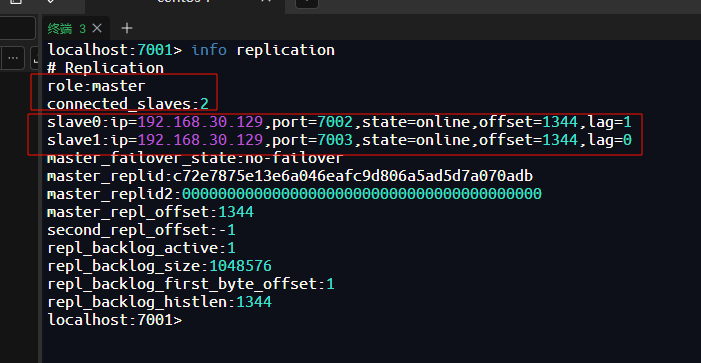
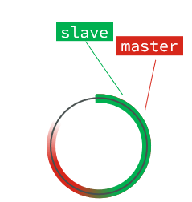

# 分布式缓存

单机的Redis存在四大问题：


## Redis持久化

Redis有两种持久化方案：

- RDB持久化
- AOF持久化


### RDB 持久化

RDB全称Redis Database Backup file（Redis数据备份文件），也被叫做Redis数据快照。简单来说就是把内存中的所有数据都记录到磁盘中。当Redis实例故障重启后，从磁盘读取快照文件，恢复数据。快照文件称为RDB文件，默认是保存在当前运行目录。


**执行时机**

RDB持久化在四种情况下会执行：

- 执行save命令
- 执行bgsave命令
- Redis 正常关闭（SHUTDOWN）
- 触发RDB条件时


**1）save命令**

执行下面的命令，可以立即执行一次RDB：


save命令会导致主进程执行RDB，这个过程中其它所有命令都会被阻塞。只有在数据迁移时可能用到。


**2）bgsave命令**

下面的命令可以异步执行RDB：


这个命令执行后会开启独立进程完成RDB，主进程可以持续处理用户请求，不受影响。


**3）停机时**

Redis停机时会执行一次save命令，实现RDB持久化。


**4）触发RDB条件**

Redis内部有触发RDB的机制，可以在redis.conf文件中找到，格式如下：

```sh
# 900秒内，如果至少有1个key被修改，则执行bgsave ， 如果是save "" 则表示禁用RDB
save 900 1  
save 300 10  
save 60 10000 
```


RDB的其它配置也可以在redis.conf文件中设置：

```sh
# 是否压缩 ,建议不开启，压缩也会消耗cpu，磁盘的话不值钱
rdbcompression yes

# RDB文件名称
dbfilename dump.rdb  

# 文件保存的路径目录
dir ./ 
```


**bgsave 原理**

bgsave开始时会fork主进程得到子进程，子进程共享主进程的内存数据。完成fork后读取内存数据并写入 RDB 文件。

fork采用的是copy-on-write技术：

- 当主进程执行读操作时，访问共享内存；
- 当主进程执行写操作时，则会拷贝一份数据，执行写操作。


**小结**

RDB方式bgsave的基本流程？

- fork主进程得到一个子进程，共享内存空间
- 子进程读取内存数据并写入新的RDB文件
- 用新RDB文件替换旧的RDB文件

RDB会在什么时候执行？save 60 1000代表什么含义？

- 默认是服务停止时
- 代表60秒内至少执行1000次修改则触发RDB

RDB的缺点？

- RDB执行间隔时间长，两次RDB之间写入数据有丢失的风险
- fork子进程、压缩、写出RDB文件都比较耗时


### AOF 持久化

AOF全称为Append Only File（追加文件）。Redis处理的每一个写命令都会记录在AOF文件，可以看做是命令日志文件。


**AOF 配置**

AOF默认是关闭的，需要修改 `redis.conf` 配置文件来开启AOF：

```properties
# 是否开启AOF功能，默认是no
appendonly yes
# AOF文件的名称
appendfilename "appendonly.aof"
```


AOF的命令记录的频率也可以通过redis.conf文件来配：

```properties
# 表示每执行一次写命令，立即记录到AOF文件
appendfsync always 
# 写命令执行完先放入AOF缓冲区，然后表示每隔1秒将缓冲区数据写到AOF文件，是默认方案
appendfsync everysec 
# 写命令执行完先放入AOF缓冲区，由操作系统决定何时将缓冲区内容写回磁盘
appendfsync no
```


三种策略对比：


**AOF文件重写**

因为是记录命令，AOF文件会比RDB文件大的多。而且AOF会记录对同一个key的多次写操作，但只有最后一次写操作才有意义。通过执行`bgrewriteaof`命令，可以让AOF文件执行重写功能，用最少的命令达到相同效果。


如图，AOF原本有三个命令，但是`set num 123 和 set num 666`都是对num的操作，第二次会覆盖第一次的值，因此第一个命令记录下来没有意义。

所以重写命令后，AOF文件内容就是：`mset name jack num 666`


Redis也会在触发阈值时自动去重写AOF文件。阈值也可以在redis.conf中配置：

```properties
# AOF文件比上次文件 增长超过多少百分比则触发重写
auto-aof-rewrite-percentage 100
# AOF文件体积最小多大以上才触发重写 
auto-aof-rewrite-min-size 64mb 
```


### RDB与AOF对比

RDB和AOF各有自己的优缺点，如果对数据安全性要求较高，在实际开发中往往会**结合**两者来使用。


### **启动时的读取优先级**

**第一优先级：AOF文件**

```
条件：appendonly = yes 且 appendonly.aof 文件存在
行为：优先载入AOF文件，忽略RDB文件
原因：AOF通常包含更完整、更新的数据
```

**第二优先级：RDB文件**

```
条件：AOF未开启 或 AOF文件不存在，但dump.rdb文件存在
行为：载入RDB文件
```

**第三优先级：空数据库启动**

```
条件：既没有AOF文件也没有RDB文件
行为：以空数据库状态启动
```


## Redis 主从集群

### 主从集群搭建

单节点Redis的并发能力是有上限的，要进一步提高Redis的并发能力，就需要搭建主从集群，实现读写分离。

我们搭建的主从集群结构如图：


共包含三个节点，一个主节点，两个从节点。

这里我们会在同一台虚拟机中开启3个redis实例，模拟主从集群，信息如下：

|       IP       | PORT |  角色  |
| :------------: | :--: | :----: |
| 192.168.30.129 | 7001 | master |
| 192.168.30.129 | 7002 | slave  |
| 192.168.30.129 | 7003 | slave  |


**文件结构**


**redis.conf **

```sh
requirepass 123456
bind 0.0.0.0
port 7001
dir /data
save 900 1
save 300 10
save 60 10000
# 关闭AOF
appendonly no

# 向主节点通告的IP地址
replica-announce-ip 192.168.30.129
```


**启动容器实例**

```sh
docker run -d --name redis-7001 \
  -p 7001:7001 \
  -v /root/redis/7001/redis.conf:/usr/local/etc/redis/redis.conf \
  redis:latest \
  redis-server /usr/local/etc/redis/redis.conf
  
docker run -d --name redis-7002 \
  -p 7002:7002 \
  -v /root/redis/7002/redis.conf:/usr/local/etc/redis/redis.conf \
  redis:latest \
  redis-server /usr/local/etc/redis/redis.conf
 
docker run -d --name redis-7003 \
  -p 7003:7003 \
  -v /root/redis/7003/redis.conf:/usr/local/etc/redis/redis.conf \
  redis:latest \
  redis-server /usr/local/etc/redis/redis.conf
```


**运行容器**

```sh
docker start redis-7001 redis-7002 redis-7003

docker stop redis-7001 redis-7002 redis-7003

docker rm redis-7001 redis-7002 redis-7003
```


**开启主从关系**

```sh
# 连接 7002
redis-cli -p 7002 -a 123456

# 如果主节点有密码，从节点需要提供主节点密码
CONFIG SET masterauth 123456

# 执行slaveof
slaveof 192.168.30.129 7001
```


**然后连接 7001节点，查看集群状态：**

```sh
# 连接 7001
redis-cli -p 7001 -a 123456
# 查看状态
info replication
```




### 主从数据同步原理


#### **全量同步**

主从第一次建立连接时，会执行**全量同步**，将master节点的所有数据都拷贝给slave节点，流程：


这里有一个问题，master如何得知salve是第一次来连接呢？？

有几个概念，可以作为判断依据：

- **Replication Id**：简称replid，是数据集的标记，id一致则说明是同一数据集。每一个master都有唯一的replid，slave则会继承master节点的replid
- **offset**：偏移量，随着记录在repl_baklog中的数据增多而逐渐增大。slave完成同步时也会记录当前同步的offset。如果slave的offset小于master的offset，说明slave数据落后于master，需要更新。

因此slave做数据同步，必须向master声明自己的replication id 和offset，master才可以判断到底需要同步哪些数据。


因为slave原本也是一个master，有自己的replid和offset，当第一次变成slave，与master建立连接时，发送的replid和offset是自己的replid和offset。

master判断发现slave发送来的replid与自己的不一致，说明这是一个全新的slave，就知道要做全量同步了。

master会将自己的replid和offset都发送给这个slave，slave保存这些信息。以后slave的replid就与master一致了。

因此，**master判断一个节点是否是第一次同步的依据，就是看replid是否一致**。

如图：


完整流程描述：

- slave节点请求增量同步
- master节点判断replid，发现不一致，拒绝增量同步
- master将完整内存数据生成RDB，发送RDB到slave
- slave清空本地数据，加载master的RDB
- master将RDB期间的命令记录在repl_baklog，并持续将log中的命令发送给slave
- slave执行接收到的命令，保持与master之间的同步


#### 增量同步

全量同步需要先做RDB，然后将RDB文件通过网络传输个slave，成本太高了。因此除了第一次做全量同步，其它大多数时候slave与master都是做**增量同步**。

什么是增量同步？就是只更新slave与master存在差异的部分数据。如图：


那么master怎么知道slave与自己的数据差异在哪里呢?


#### epl_backlog 原理

master怎么知道slave与自己的数据差异在哪里呢?

这就要说到全量同步时的repl_baklog文件了。

这个文件是一个固定大小的数组，只不过数组是环形，也就是说**角标到达数组末尾后，会再次从0开始读写**，这样数组头部的数据就会被覆盖。

repl_baklog中会记录Redis处理过的命令日志及offset，包括master当前的offset，和slave已经拷贝到的offset：

 

slave与master的offset之间的差异，就是salve需要增量拷贝的数据了。

随着不断有数据写入，master的offset逐渐变大，slave也不断的拷贝，追赶master的offset：

 


直到数组被填满：

 

此时，如果有新的数据写入，就会覆盖数组中的旧数据。不过，旧的数据只要是绿色的，说明是已经被同步到slave的数据，即便被覆盖了也没什么影响。因为未同步的仅仅是红色部分。


但是，如果slave出现网络阻塞，导致master的offset远远超过了slave的offset： 

 

如果master继续写入新数据，其offset就会覆盖旧的数据，直到将slave现在的offset也覆盖：

 


棕色框中的红色部分，就是尚未同步，但是却已经被覆盖的数据。此时如果slave恢复，需要同步，却发现自己的offset都没有了，无法完成增量同步了。只能做全量同步。


### 主从同步优化

主从同步可以保证主从数据的一致性，非常重要。

可以从以下几个方面来优化Redis主从就集群：

- 在master中配置repl-diskless-sync yes启用无磁盘复制，避免全量同步时的磁盘IO。
- Redis单节点上的内存占用不要太大，减少RDB导致的过多磁盘IO
- 适当提高repl_baklog的大小，发现slave宕机时尽快实现故障恢复，尽可能避免全量同步
- 限制一个master上的slave节点数量，如果实在是太多slave，则可以采用主-从-从链式结构，减少master压力

主从从架构图：


### 小结

简述全量同步和增量同步区别？

- 全量同步：master将完整内存数据生成RDB，发送RDB到slave。后续命令则记录在repl_baklog，逐个发送给slave。
- 增量同步：slave提交自己的offset到master，master获取repl_baklog中从offset之后的命令给slave

什么时候执行全量同步？

- slave节点第一次连接master节点时
- slave节点断开时间太久，repl_baklog中的offset已经被覆盖时

什么时候执行增量同步？

- slave节点断开又恢复，并且在repl_baklog中能找到offset时


## Redis 哨兵


### 哨兵原理

#### 集群结构和作用

哨兵的结构如图：


哨兵的作用如下：

- **监控**：Sentinel 会不断检查您的master和slave是否按预期工作
- **自动故障恢复**：如果master故障，Sentinel会将一个slave提升为master。当故障实例恢复后也以新的master为主
- **通知**：Sentinel充当Redis客户端的服务发现来源，当集群发生故障转移时，会将最新信息推送给Redis的客户端


#### 集群监控原理

Sentinel基于心跳机制监测服务状态，每隔1秒向集群的每个实例发送ping命令：

- **主观下线**：如果某sentinel节点发现某实例未在规定时间响应，则认为该实例**主观下线**。
- **客观下线**：若超过指定数量（`quorum`）的sentinel都认为该实例主观下线，则该实例**客观下线**。quorum值最好超过Sentinel实例数量的一半。


#### 集群故障恢复原理

一旦发现master故障，sentinel需要在salve中选择一个作为新的master，选择依据是这样的：

- 首先会判断slave节点与master节点断开时间长短，如果超过指定值（down-after-milliseconds * 10）则会排除该slave节点（断开时间太长，丢失数据过多）

- 然后判断slave节点的slave-priority值，越小优先级越高，如果是0则永不参与选举 (默认都是1)
- 如果slave-prority一样，则判断slave节点的offset值，越大说明数据越新，优先级越高
- 最后是判断slave节点的运行id大小，越小优先级越高。（随机挑选没有什么区别）


当选出一个新的master后，该如何实现切换呢？

流程如下：

- sentinel给备选的slave1节点发送slaveof no one命令，让该节点成为master
- sentinel `广播`给所有其它slave发送slaveof 192.168.30.129 7002 命令，让这些slave成为新master的从节点，开始从新的master上同步数据。
- 最后，sentinel将故障节点标记为slave，当故障节点恢复后会自动成为新的master的slave节点


#### 小结

Sentinel的三个作用是什么？

- 监控
- 故障转移
- 通知

Sentinel如何判断一个redis实例是否健康？

- 每隔1秒发送一次ping命令，如果超过一定时间没有相向则认为是主观下线
- 如果大多数sentinel都认为实例主观下线，则判定服务下线

故障转移步骤有哪些？

- 首先选定一个slave作为新的master，执行slaveof no one
- 然后让所有节点都执行slaveof 新master
- 修改故障节点配置，添加slaveof 新master


### 搭建哨兵集群

**文件结构**


**sentinel.conf**

```sh
port 27001
sentinel announce-ip 192.168.30.129
sentinel monitor mymaster 192.168.30.129 7001 2
# 如果主节点在此时间内无响应，则判定为主观下线
sentinel down-after-milliseconds mymaster 5000 
# 故障转移过程的最大等待时间
sentinel failover-timeout mymaster 60000 
# 如果主节点设置了 requirepass，这里必须配置相应密码
sentinel auth-pass mymaster 123456 
```

解读：

- `port 27001`：是当前sentinel实例的端口
- `sentinel monitor mymaster 192.168.30.129 7001 2`：指定主节点信息
  - `mymaster`：主节点名称，自定义，任意写
  - `192.168.30.129 7001`：主节点的ip和端口
  - `2`：选举master时的quorum值


**启动容器**

```sh
docker run -d --name redis-sentinel1 \
  -p 27001:27001 \
  -v /root/redis/7001/sentinel.conf:/usr/local/etc/redis/sentinel.conf \
  redis:latest \
  redis-sentinel /usr/local/etc/redis/sentinel.conf

docker run -d --name redis-sentinel2 \
  -p 27002:27002 \
  -v /root/redis/7002/sentinel.conf:/usr/local/etc/redis/sentinel.conf \
  redis:latest \
  redis-sentinel /usr/local/etc/redis/sentinel.conf
  
docker run -d --name redis-sentinel3 \
  -p 27003:27003 \
  -v /root/redis/7003/sentinel.conf:/usr/local/etc/redis/sentinel.conf \
  redis:latest \
  redis-sentinel /usr/local/etc/redis/sentinel.conf
```


**运行容器**

```sh
docker start redis-sentinel1 redis-sentinel2 redis-sentinel3

docker stop redis-sentinel1 redis-sentinel2 redis-sentinel3

docker rm redis-sentinel1 redis-sentinel2 redis-sentinel3
```


### RedisTemplate

在Sentinel集群监管下的Redis主从集群，其节点会因为自动故障转移而发生变化，Redis的客户端必须感知这种变化，及时更新连接信息。Spring的RedisTemplate底层利用lettuce实现了节点的感知和自动切换。

#### 引入依赖

```xml
<dependency>
    <groupId>org.springframework.boot</groupId>
    <artifactId>spring-boot-starter-data-redis</artifactId>
</dependency>
```


#### 配置Redis地址

然后在配置文件application.yml中指定redis的sentinel相关信息：

```yaml
spring:
  redis:
    password: 123456 # Redis密码
    sentinel:
      master: mymaster # 主节点名称
      nodes:
        - 192.168.30.129:27001
        - 192.168.30.129:27002
        - 192.168.30.129:27003
```


#### 配置读写分离

在项目的启动类中，添加一个新的bean：

```java
@Bean
public LettuceClientConfigurationBuilderCustomizer clientConfigurationBuilderCustomizer(){
    return clientConfigurationBuilder -> clientConfigurationBuilder.readFrom(ReadFrom.REPLICA_PREFERRED);
}
```

这个bean中配置的就是读写策略，包括四种：

- MASTER：从主节点读取
- MASTER_PREFERRED：优先从master节点读取，master不可用才读取replica
- REPLICA：从slave（replica）节点读取
- REPLICA _PREFERRED：优先从slave（replica）节点读取，所有的slave都不可用才读取master


## Redis 分片集群

### 搭建分片集群

主从和哨兵可以解决高可用、高并发读的问题。但是然有两个问题没有解决：

- 海量数据存储问题

- 高并发写的问题

使用分片集群可以解决上述问题，如图:


分片集群特征：

- 集群中有多个master，每个master保存不同数据

- 每个master都可以有多个slave节点

- master之间通过ping监测彼此健康状态

- 客户端请求可以访问集群任意节点，最终都会被转发到正确节点


**项目结构**


**redis.conf**

```ini
port 8001
# 开启集群功能
cluster-enabled yes
# 集群的配置文件名称，不需要我们创建，由redis自己维护
cluster-config-file /data/nodes.conf
# 节点心跳失败的超时时间
cluster-node-timeout 5000
# 持久化文件存放目录
dir /data
# 绑定地址
bind 0.0.0.0
# 让redis后台运行 （适用docker必须设置no）
daemonize no
# 注册的实例ip
cluster-announce-ip 192.168.30.129
# 保护模式
protected-mode no
# 数据库数量
databases 1
# 日志
logfile /data/redis.log
```


**启动容器**

```ini
# Redis 8001
docker run -d --name redis-8001 \
  -p 8001:8001 \
  -p 18001:18001 \
  -v /root/redis-cluster/8001/redis.conf:/usr/local/etc/redis/redis.conf \
  redis:latest \
  redis-server /usr/local/etc/redis/redis.conf

# Redis 8002  
docker run -d --name redis-8002 \
  -p 8002:8002 \
  -p 18002:18002 \
  -v /root/redis-cluster/8002/redis.conf:/usr/local/etc/redis/redis.conf \
  redis:latest \
  redis-server /usr/local/etc/redis/redis.conf

# Redis 8003
docker run -d --name redis-8003 \
  -p 8003:8003 \
  -p 18003:18003 \
  -v /root/redis-cluster/8003/redis.conf:/usr/local/etc/redis/redis.conf \
  redis:latest \
  redis-server /usr/local/etc/redis/redis.conf

# Redis 9001
docker run -d --name redis-9001 \
  -p 9001:9001 \
  -p 19001:19001 \
  -v /root/redis-cluster/9001/redis.conf:/usr/local/etc/redis/redis.conf \
  redis:latest \
  redis-server /usr/local/etc/redis/redis.conf

# Redis 9002
docker run -d --name redis-9002 \
  -p 9002:9002 \
  -p 19002:19002 \
  -v /root/redis-cluster/9002/redis.conf:/usr/local/etc/redis/redis.conf \
  redis:latest \
  redis-server /usr/local/etc/redis/redis.conf

# Redis 9003
docker run -d --name redis-9003 \
  -p 9003:9003 \
  -p 19003:19003 \
  -v /root/redis-cluster/9003/redis.conf:/usr/local/etc/redis/redis.conf \
  redis:latest \
  redis-server /usr/local/etc/redis/redis.conf
```


**运行容器**

```ini
docker start redis-8001 redis-8002 redis-8003 redis-9001 redis-9002 redis-9003

docker stop redis-8001 redis-8002 redis-8003 redis-9001 redis-9002 redis-9003

docker rm redis-8001 redis-8002 redis-8003 redis-9001 redis-9002 redis-9003
```


**创建集群**

虽然服务启动了，但是目前每个服务之间都是独立的，没有任何关联。
我们需要执行命令来创建集群，在Redis5.0之前创建集群比较麻烦，5.0之后集群管理命令都集成到了redis-cli中。


集群管理以及集成到了redis-cli中，格式如下：

```ini
redis-cli --cluster create --cluster-replicas 1 192.168.30.129:8001 192.168.30.129:8002 192.168.30.129:8003 192.168.30.129:9001 192.168.30.129:9002 192.168.30.129:9003
```

命令说明：

- `redis-cli --cluster` ：代表集群操作命令
- `create`：代表是创建集群
- `--cluster-replicas 1` ：指定集群中每个master的副本个数为1，此时`节点总数 ÷ (replicas + 1)` 得到的就是master的数量。因此节点列表中的前n个就是master，其它节点都是slave节点，随机分配到不同master


**测试**

集群操作时，需要给`redis-cli`加上`-c`参数才可以：

```sh
redis-cli -c -p 8001
```


他会根据key计算插槽数自动切换到对应节点


### 散列插槽

#### 插槽原理

Redis会把每一个master节点映射到0~16383共16384个插槽（hash slot）上，查看集群信息时就能看到：


数据key不是与节点绑定，而是与插槽绑定。redis会根据key的<u>**`有效部`**</u>分计算插槽值，<u>**`有效部`**</u>分两种情况：

- key中包含"{}"，且“{}”中至少包含1个字符，“{}”中的部分是有效部分
- key中不包含“{}”，整个key都是有效部分


例如：key是num，那么就根据num计算，如果是{itcast}num，则根据itcast计算。计算方式是利用CRC16算法得到一个hash值，然后对16384取余，得到的结果就是slot值。

 

如图，在7001这个节点执行set a 1时，对a做hash运算，对16384取余，得到的结果是15495，因此要存储到7003节点。

到了7003后，执行`get num`时，对num做hash运算，对16384取余，得到的结果是2765，因此需要切换到7001节点


#### 小结

Redis如何判断某个key应该在哪个实例？

- 将16384个插槽分配到不同的实例
- 根据key的有效部分计算哈希值，对16384取余
- 余数作为插槽，寻找插槽所在实例即可

如何将同一类数据固定的保存在同一个Redis实例？

- 这一类数据使用相同的有效部分，例如key都以{typeId}为前缀


### 集群伸缩

redis-cli --cluster提供了很多操作集群的命令，可以通过下面方式查看：

```sh
redis-cli --cluster help
```


#### 需求分析

需求：向集群中添加一个新的master节点，并向其中存储 num = 10

- 启动一个新的redis实例，端口为8004
- 添加8004到之前的集群，并作为一个master节点
- 给8004节点分配插槽，使得num这个key可以存储到8004实例


这里需要两个新的功能：

- 添加一个节点到集群中
- 将部分插槽分配到新插槽


#### 创建新的 Redis 实例

创建一个Redis实例根据上面集群部署创建即可。

```sh
docker run -d --name redis-8004 \
  -p 8004:8004 \
  -p 18004:18004 \
  -v /root/redis-cluster/8004/redis.conf:/usr/local/etc/redis/redis.conf \
  redis:latest \
  redis-server /usr/local/etc/redis/redis.conf
```


#### 添加新节点到 Redis

执行命令：

```sh
redis-cli --cluster add-node  192.168.30.129:8004 192.168.30.129:8001
```

- `redis-cli --cluster add-node`: Redis 集群管理命令，用于添加节点
- `192.168.30.129:8004`: 要添加的新节点的 IP 地址和端口
- `192.168.30.129:8001`: 集群中已存在的任意一个节点的 IP 地址和端口（作为集群的入口点）

通过命令查看集群状态：

```sh
redis-cli -p 8004 cluster nodes
```


#### 转移插槽

我们要将num存储到8004节点，因此需要先看看num的插槽是多少：


如上图所示，num的插槽为2765.


我们可以将0~3000的插槽从7001转移到7004，命令格式如下：


建立连接：

```sh
redis-cli --cluster reshard 192.168.30.129:8001
```

得到下面的反馈：


询问要移动多少个插槽，我们计划是3000个：

那个node来接收这些插槽？显然用的是8004节点ID


这里询问，你的插槽是从哪里移动过来的？

- all：代表全部，也就是三个节点各转移一部分
- 具体的id：目标节点的id
- done：没有了

填完后，点击done，这样插槽转移就准备好了：


确认要转移吗？输入yes：

检查是否成功转移插槽：

 

显然8004节点插槽位0--2999，而8001：3000-5460。


### 故障转移

#### 自动故障转移

当集群中有一个master宕机会发生什么呢？

直接停止一个redis实例，例如8002：

```sh
redis-cli -p 8002 shutdown
```

1. 首先是该实例与其它实例失去连接，然后是疑似宕机
2. 最后是确定下线，自动提升一个slave为新的master
3. 当8002再次启动，就会变为一个slave节点了


#### 手动故障转移

利用cluster failover命令可以手动让集群中的某个master宕机，切换到执行cluster failover命令的这个slave节点，实现无感知的数据迁移。其流程如下：


这种failover命令可以指定三种模式：

- 缺省：默认的流程，如图1~6歩
- force：省略了对offset的一致性校验
- takeover：直接执行第5歩，忽略数据一致性、忽略master状态和其它master的意见


**案例需求**：在8002这个slave节点执行手动故障转移，重新夺回master地位

```sh
redis-cli -p 8002

cluster failover
```


8002和19002实现主从切换了。


### RedisTemplate访问分片集群

RedisTemplate底层同样基于lettuce实现了分片集群的支持，而使用的步骤与哨兵模式基本一致：

1）引入redis的starter依赖

2）配置分片集群地址

3）配置读写分离

与哨兵模式相比，其中只有分片集群的配置方式略有差异，如下：

```yaml
spring:
  redis:
#    password: 123456 # Redis密码 （Redis是否设置密码）
    cluster:
      nodes:
        - 192.168.30.129:8001
        - 192.168.30.129:8002
        - 192.168.30.129:8003
        - 192.168.30.129:8004
        - 192.168.30.129:9001
        - 192.168.30.129:9002
        - 192.168.30.129:9003
```

