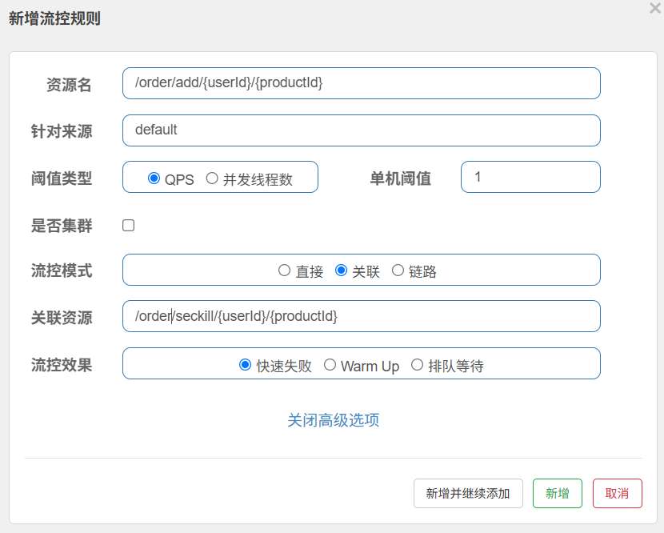

# Spring Cloud 快速入门

### 技术配置

**Spring Cloud 系列：**

- 官⽹：https://spring.io/projects/spring-cloud
- 远程调⽤：OpenFeign
- ⽹关：Gateway

**Spring Cloud Alibaba 系列：**

- 官⽹：https://sca.aliyun.com/
- 注册中⼼/配置中⼼：Nacos
- 服务保护：Sentinel
- 分布式事务：Seata

**构建对应版本**

https://github.com/alibaba/spring-cloud-alibaba


**项目选择对应版本**


### 项目创建

**创建一个springboot 项目 项目名为spring-cloud-demo**

```xml
<?xml version="1.0" encoding="UTF-8"?>
<project xmlns="http://maven.apache.org/POM/4.0.0" xmlns:xsi="http://www.w3.org/2001/XMLSchema-instance"
         xsi:schemaLocation="http://maven.apache.org/POM/4.0.0 https://maven.apache.org/xsd/maven-4.0.0.xsd">
    <modelVersion>4.0.0</modelVersion>
    <groupId>com.example</groupId>
    <artifactId>spring-cloud-demo</artifactId>
    <version>0.0.1-SNAPSHOT</version>
    <name>spring-cloud-demo</name>
    <description>spring-cloud-demo</description>
    <modules>
        <module>server</module>
    </modules>
    <packaging>pom</packaging>

    <parent>
        <groupId>org.springframework.boot</groupId>
        <artifactId>spring-boot-starter-parent</artifactId>
        <version>3.3.4</version>
        <relativePath/> <!-- lookup parent from repository -->
    </parent>

    <properties>
        <maven.compiler.source>17</maven.compiler.source>
        <maven.compiler.target>17</maven.compiler.target>
        <project.build.sourceEncoding>UTF-8</project.build.sourceEncoding>
        <spring-cloud.version>2023.0.3</spring-cloud.version>
        <spring-cloud-alibaba.version>2023.0.3.2</spring-cloud-alibaba.version>
    </properties>

    <dependencyManagement>
        <dependencies>
            <dependency>
                <groupId>org.springframework.cloud</groupId>
                <artifactId>spring-cloud-dependencies</artifactId>
                <version>${spring-cloud.version}</version>
                <type>pom</type><!--表示这个依赖是一个 POM 类型的文件，而不是 JAR-->
                <scope>import</scope> <!--将该 POM 中定义的所有依赖版本信息导入到当前项目中-->
            </dependency>
            <dependency>
                <groupId>com.alibaba.cloud</groupId>
                <artifactId>spring-cloud-alibaba-dependencies</artifactId>
                <version>${spring-cloud-alibaba.version}</version>
                <type>pom</type>
                <scope>import</scope>
            </dependency>
        </dependencies>
    </dependencyManagement>

</project>

```

**项目结构**


**server pom.xml 配置**

```xml
<?xml version="1.0" encoding="UTF-8"?>
<project xmlns="http://maven.apache.org/POM/4.0.0"
         xmlns:xsi="http://www.w3.org/2001/XMLSchema-instance"
         xsi:schemaLocation="http://maven.apache.org/POM/4.0.0 http://maven.apache.org/xsd/maven-4.0.0.xsd">
    <modelVersion>4.0.0</modelVersion>

    <parent>
        <groupId>com.example</groupId>
        <artifactId>spring-cloud-demo</artifactId>
        <version>0.0.1-SNAPSHOT</version>
    </parent>

    <packaging>pom</packaging>
    <modules>
        <module>server-product</module>
        <module>server-order</module>
    </modules>

    <artifactId>server</artifactId>

    <properties>
        <maven.compiler.source>17</maven.compiler.source>
        <maven.compiler.target>17</maven.compiler.target>
        <project.build.sourceEncoding>UTF-8</project.build.sourceEncoding>
    </properties>

    <dependencies>
        <!--服务注册 服务发现-->
        <dependency>
            <groupId>com.alibaba.cloud</groupId>
            <artifactId>spring-cloud-starter-alibaba-nacos-discovery</artifactId>
        </dependency>

        <!--远程调用-->
        <dependency>
            <groupId>org.springframework.cloud</groupId>
            <artifactId>spring-cloud-starter-openfeign</artifactId>
        </dependency>
    </dependencies>

</project>
```

### Nacos

#### 配置

**什么是Nacos**

Nacos `/nɑ:kəʊs/` 是 `Dynamic Naming and Configuration Service` 的首字母简称，一个易于构建 AI Agent 应用的动态服务发现、配置管理和AI智能体管理平台。


启动命令(standalone代表着单机模式运行，非集群模式):

```powershell
startup.cmd -m standalone
```

随后启动程序会提示您输入`3个`鉴权相关配置（Nacos从3.0.0版本开始默认启用控制台鉴权功能，因此如下3个鉴权相关配置必须填写）如下所示：

```powershell
`nacos.core.auth.plugin.nacos.token.secret.key` is missing, please set with Base64 string: ${your_input_token_secret_key}
nacos.core.auth.plugin.nacos.token.secret.key` Updated:
----------------------------------
`nacos.core.auth.server.identity.key` is missing, please set: ${your_input_server_identity_key}
`nacos.core.auth.server.identity.key` Updated:
----------------------------------
`nacos.core.auth.server.identity.value` is missing, please set: ${your_input_server_identity_key}
`nacos.core.auth.server.identity.value` Updated:
----------------------------------
```

**密钥长度要求**：Base64 编码后的密钥必须 ≥ 32 字节

**生成密钥**

```powershell
[Convert]::ToBase64String((1..32 | ForEach-Object { Get-Random -Maximum 256 }))
```


**修改 `application.properties`**

在 Nacos 安装目录的 `conf/application.properties` 文件中添加


**Nacos控制台页面**

打开任意浏览器，输入地址：`http://127.0.0.1:8080/index.html`, 即可进入Nacos控制台页面。

> 注意：首次打开会要求初始化管理员用户`nacos`的密码。

注册中心&发现服务端口是8848

**关闭服务器**

```powershell
shutdown.cmd

# 或者双击shutdown.cmd运行文件。  或者直接关掉命令面板
```

#### 发现服务

**导入依赖**

```xml
    <!--服务注册 服务发现-->
    <dependency>
        <groupId>com.alibaba.cloud</groupId>
        <artifactId>spring-cloud-starter-alibaba-nacos-discovery</artifactId>
    </dependency>
```

**配置nacos连接**

```yml
spring:
  application:
  # 注册服务名
    name: server-order
  cloud:
    nacos:
        server-addr: 127.0.0.1:8848

server:
  port: 8000

```

**使用 @EnableDiscoveryClient 注解开启服务注册与发现功能**：

```java
@EnableDiscoveryClient
@SpringBootApplication
public class OrderMainApplication {
    public static void main(String[] args) {
        SpringApplication.run(OrderMainApplication.class,args);
    }
}
```

**启动服务**


**获取所有服务地址**

```java
@SpringBootTest
public class TestMain {

    /*spring-cloud 发现服务*/
    @Resource
    private DiscoveryClient discoveryClient;

    /*NacosDiscoveryClient 实际上就是 DiscoveryClient 的 Nacos 实现*/
    @Resource
    private NacosDiscoveryClient nacosDiscoveryClient;

    @Test
    void discoveryClientTest(){
        /*获取所有服务*/
        for(String server:discoveryClient.getServices()){
            System.out.println("server:"+server);
            List<ServiceInstance> instances = discoveryClient.getInstances(server);
            /*获取每个服务里的启动实例*/
            for (ServiceInstance instance:instances){
                System.out.println("ip"+instance.getHost()+":"+instance.getPort());
            }
            System.out.println();
        }
    }


    @Test
    void nacosDiscoveryClientTest(){
        /*获取所有服务*/
        for(String server:nacosDiscoveryClient.getServices()){
            System.out.println("server:"+server);
            List<ServiceInstance> instances = nacosDiscoveryClient.getInstances(server);
            /*获取每个服务里的启动实例*/
            for (ServiceInstance instance:instances){
                System.out.println("ip"+instance.getHost()+":"+instance.getPort());
            }
            System.out.println();
        }
    }
}
//这两的作用是一样的都是返回nacos上的所有服务
```

**返回结果**


#### **远程调用**

```java
@Configuration
public class ProductServerConfig {


    /*将restTemplate远程调用放入spring管理*/
    @Bean
    public RestTemplate restTemplate() {
        return new RestTemplate();
    }
}

```

```java
@Service
public class OrderServerImpl implements OrderServer {

    @Autowired
    private DiscoveryClient discoveryClient;

    @Autowired
    private RestTemplate restTemplate;

    /*远程调用拿到商品*/
    public Product getProduct(String productId) {
        /*获取该服务的所有实例*/
        List<ServiceInstance> instances = discoveryClient.getInstances("server-product");
        /*获取服务第一个实例*/
        ServiceInstance instance = instances.get(0);
        /*远程url*/
        String url = "http://"+instance.getHost() + ":" + instance.getPort()+"/product/"+productId;
        /*远程发送请求拿到商品*/
        Product product = restTemplate.getForObject(url, Product.class);
        return product;
    }

    @Override
    public Order insertOrder(String userId,String productId) {
        /*1、获取调用商品服务获取商品*/
        Product product = getProduct(productId);

        Order order = new Order();
        order.setId("1");
        /*计算金额*/
        BigDecimal price = product.getPrice();
        BigDecimal priceSum = price.multiply(new BigDecimal(product.getNum()));
        order.setTotalAmount(priceSum);
        order.setUserId(userId);
        order.setNickName("hello");
        order.setAddress("湖南 长沙");
        /*商品列表*/
        order.setPrdoctList(Lists.newArrayList(product,product,product));
        return order;
    }


}

```

**返回数据**

```json
{
    "id": "1",
    "totalAmount": 2806.5576,
    "userId": "2",
    "nickName": "hello",
    "address": "湖南 长沙",
    "prdoctList": [
        {
            "id": "4853",
            "price": 100.2342,
            "productName": "衬衫",
            "num": 28
        },
        {
            "id": "4853",
            "price": 100.2342,
            "productName": "衬衫",
            "num": 28
        },
        {
            "id": "4853",
            "price": 100.2342,
            "productName": "衬衫",
            "num": 28
        }
    ]
}
```

#### 负载均衡

**导入依赖**

```xml
<!--负载均衡-->
<dependency>
    <groupId>org.springframework.cloud</groupId>
    <artifactId>spring-cloud-starter-loadbalancer</artifactId>
</dependency>
```

**实现代码**

```java
    /*负载均衡*/
    @Autowired
    private LoadBalancerClient loadBalancer;

    /*负载均衡调用商品*/
    public Product getLoadBalancerProduct(String productId) {

        /*负载均衡获取这个服务的某一个实例*/
        ServiceInstance choose = loadBalancer.choose("server-product");
        /*远程url*/
        String url = "http://" + choose.getHost() + ":" + choose.getPort() + "/product/" + productId;
        System.out.println("url:" + url);
        /*远程发送请求拿到商品*/
        Product product = restTemplate.getForObject(url, Product.class);
        return product;
    }
```

**输出结果**


**注解负载均衡**

```java
@Configuration
public class ProductServerConfig {
    
    /*添加注解实现远程调用负载均衡*/
    @LoadBalanced
    @Bean
    public RestTemplate restTemplate() {
        return new RestTemplate();
    }
}

```

```java
/*负载均衡*/
@Autowired
private LoadBalancerClient loadBalancer;

/*注解式负载均衡*/
public Product getLoadBalancerProductAnnotation(String productId) {
    String url = "http://server-product/product/" + productId;
    /*远程调用请求会自动替换server-product成ip进行负载均衡调用*/
    Product product = restTemplate.getForObject(url, Product.class);
    return product;
}
```

**总结**

​		负载均衡其实就是在restTemplate进行远程调用时，将获取的这个服务所有实例进行顺序调用进行负载均衡。
自己也可以写个实现算法进行顺序调用该服务的实例

#### 配置中心

**导入依赖**

```xml
<!--nacos 配置中心-->
<dependency>
    <groupId>com.alibaba.cloud</groupId>
    <artifactId>spring-cloud-starter-alibaba-nacos-config</artifactId>
</dependency>
```

**添加数据集(data-id、配置文件名)**


**导入数据集**

```yaml
spring:
  cloud:
    nacos:
      serverAddr: 127.0.0.1:8848 #如果用的云上托管版本，输入可访问的Nacos Server地址即可
  config:
    import:
      - nacos:common.properties?group=order
```

**接受数据**


```java
@Component
@ConfigurationProperties(prefix = "order")
@Data
public class OrderProperties {
    private String timeOut;
    private String environment;
}

```

**实现 数据隔离 环境切换**


**spring配置application.yml 导入数据集**

```yaml
server:
  port: 8000

spring:
  profiles:
    # 选择运行环境 
    active: prod
  application:
    name: server-order
  cloud:
    nacos:
      server-addr: 127.0.0.1:8848
      config:
        import-check:
          # 导入nacos配置中心就会检测是否引入nacos配置文件，现在关闭检测
          enabled: false
        # nacos命名空间 根据spring active选择的环境命名，没有选择就默认nacos public默认命名空间
        namespace: ${spring.profiles.active:public}

# 开发环境
---
spring:
  config:
    import:
      # nacos:data-id（配置文件名）?group=分组名（一般用于微服务名如订单服务、商品服务）
      - nacos:common.yaml?group=order
      - nacos:database.yaml?group=database
      - nacos:db.yaml?group=database
    activate:
      on-profile: dev


# 测试环境
---
spring:
  config:
    import:
      - nacos:common.yaml?group=order
      - nacos:database.yaml?group=database
    activate:
      on-profile: test

# 生产环境
---
spring:
  config:
    import:
      - nacos:common.yaml?group=order
      - nacos:database.yaml?group=database
    activate:
      on-profile: prod
```

#### 总结


#### 跟多

nacos 官方快速开始：https://nacos.io/docs/latest/quickstart/quick-start/

alibaba-nacos 快速开始：https://sca.aliyun.com/docs/2023/user-guide/nacos/quick-start/

#### 面试题

**1、注册中心宕机（nacos 宕机），远程调用还可以成功吗？**

​	如果之前调用过这个服务，那么这个服务的所有实例会到实例缓存里，就算注册中心宕机也时可以通过。

​	如果从来没有调用过那么会去注册中心拿这个服务，因为注册中心已经宕机所有无法通过。

**远程调用流程图**


### OpenFeign

#### 快速开始

**引入依赖**

```xml
<!--远程调用-->
<dependency>
    <groupId>org.springframework.cloud</groupId>
    <artifactId>spring-cloud-starter-openfeign</artifactId>
</dependency>
```

**开启远程调用**

```java
@EnableFeignClients  //开启feign远程调用
@EnableDiscoveryClient // 开启nacos发现服务
@SpringBootApplication
public class OrderMainApplication {
    public static void main(String[] args) {
        SpringApplication.run(OrderMainApplication.class,args);
    }
}
```

**编写feign客户端**

```java
// feign客户端
@FeignClient(value = "server-product") // feign 客户端
public interface ProductFeignClient {

    @GetMapping("/product/{id}")
    Product getProduct(@PathVariable String id);

}

// 请求接口
@RestController
@RequestMapping("product")
public class ProductController {

    @Autowired
    private ProductServer productServer;

    @GetMapping("/{id}")
    public Product getProduct(@PathVariable String id) {
        System.out.println("hello");
        return productServer.getProductById(id);
    }
}

// 调用
@Autowired
private ProductFeignClient productFeignClient;
/*feign 远程调用自带负载均衡*/
Product product = productFeignClient.getProduct(productId);
```

#### **远程调用 第三方API**

**编写第三方API调用feign客户端** 

```java
/*远程调用第三方API*/
@FeignClient(value = "joke-client", url = "http://v.juhe.cn")
public interface JokeFeignClient {

    @GetMapping("/joke/randJoke")
    Object getJoke(@RequestParam("key") String key);
}
```

**调用**

```java
@Autowired
private JokeFeignClient jokeFeignClient;

@Override
public Object getJoke() {
    Object joke = jokeFeignClient.getJoke("${key}");
    return joke;
}
```

**返回数据**

```json
{
    "reason": "success",
    "result": [
        {
            "content": "小伙子带着现任女友走在路上,碰到了前女友于是给前女友介绍说:这是你嫂子。现任女友说问小伙子:这位是…小伙子还没想好怎么回答,前女友就抢着说;我以前是你嫂子",
            "hashId": "9c0cbb884e5e2bebb8d533cdbc65e9f0",
            "unixtime": 1473635632
        },
        {
            "content": "昨天一对貌似20出头的小情侣来开房，男的上来就问有没有电脑房，本人摇头说没有，那男的一听就要走，女的不乐意了对那男的吼到你他妈的都换几个宾馆了，没电脑怎么了你是玩它还是玩我。",
            "hashId": "1947ca3ba5850115f85f6dd09f5327b6",
            "unixtime": 1473646430
        }
    ],
    "error_code": 0
}
```

#### **日志**

  **开启日志级别**

```yaml
# 开启feign日志级别
logging:
  level:
    com.example.feign: debug
```

**配置日志bean**

```java
/*配置日志bean*/
@Bean
Logger.Level feignLogLevel() {
    return Logger.Level.FULL;
}
```

#### 超时控制

**超时配置**

```yaml
spring:
  cloud:
    openfeign:
      client:
        config:
          # 默认设置
          default:
            logger-level: full
            connect-timeout: 4000
            read-timeout: 10000
          # 指定配置那个feign客户端
          server-product:
            logger-level: full
            connect-timeout: 3000
            read-timeout: 5000
```

**重传机制**

```java
/*重传机制*/
@Bean
Retryer retryer(){
    /*请求间隔（每次间隔是前面的1.5倍）、最大间隔时间、请求次数*/
    return new Retryer.Default(100,SECONDS.toMillis(1),5);
}
```

#### 拦截器

**编写拦截器**

```java
public class TokenRequestInterceptor implements RequestInterceptor {
    /**
     * 请求拦截器
     * @param requestTemplate 请求模板
     */
    @Override
    public void apply(RequestTemplate requestTemplate) {
        System.out.println("拦截器启动");
        requestTemplate.header("token", UUID.randomUUID().toString());
    }
}
```

**yml配置**

```yaml
spring:
  cloud:
    openfeign:
      client:
        config:
          # 默认设置
          default:
            logger-level: full
            connect-timeout: 4000
            read-timeout: 10000
          # 指定配置那个feign客户端
          server-product:
            logger-level: full
            # 连接超时
            connect-timeout: 3000
            # 读取超时
            read-timeout: 5000
            # 配置拦截的feign客户端参数为数组可以多个 可以直接配置在default里这样就默认拦截
            request-interceptors:
              - com.example.interceptor.TokenRequestInterceptor
```

**注解配置**

```java
/*把拦截器放入spring管理就直接对全部的请求进行拦截*/
@Component
public class TokenRequestInterceptor implements RequestInterceptor {
    /**
     * 请求拦截器
     * @param requestTemplate 请求模板
     */
    @Override
    public void apply(RequestTemplate requestTemplate) {
        System.out.println("拦截器启动");
        requestTemplate.header("token", UUID.randomUUID().toString());
    }
}
```


#### 跟多

文档：https://springdoc.cn/spring-cloud-openfeign

#### **面试题**

**1、客户端负载均衡和服务端负载均衡的区别**

​		调用自己的内部的业务，首先feign回去nacos寻找这个服务所有的实例，然后进行负载均衡拿到一个实例进行调用业务接口，那么这个负载均衡就发生在feign客户端，这就是客户端负载均衡。

​		而调用第三方api就是直接通过接口url方式发送请求，然后拿到数据，这个负载均衡实际是发生在这个第三方api的服务器里面，这就是服务端负载均衡。


### Sentinel

[quick-start | Sentinel](https://sentinelguard.io/zh-cn/docs/quick-start.html)

#### **快速开始**

**导入依赖**

```xml
<dependency>
    <groupId>com.alibaba.cloud</groupId>
    <artifactId>spring-cloud-starter-alibaba-sentinel</artifactId>
</dependency>
```

**下载Sentinel控制台**

```http
#下载sentinel-dashboard-1.8.8.jar 运行jar包
https://github.com/alibaba/Sentinel/releases
```

**配置yml**

```yaml
# sentinel 配置
spring:
  cloud:
    sentinel:
      transport:
        dashboard: localhost:8080  # Sentinel 控制台地址
      eager: true                  # 饥饿加载模式 默认false：只有在第一次请求时才会初始化 Sentinel
```


#### 异常处理

**异常处理流程图**  sentinel 会对一下四种资源进行异常处理


**控制层接口资源**

```java
/**
 * 实现 BlockExceptionHandler接口 重写 handle方法 自定义业务
 */
@Component
public class MyBlockExceptionHandel implements BlockExceptionHandler {

    private ObjectMapper objectMapper = new ObjectMapper();

    @Override
    public void handle(HttpServletRequest request, HttpServletResponse response, String resourceName, BlockException e)
        throws Exception {

        response.setStatus(429);
        response.setContentType("application/json; charset=utf-8");
        PrintWriter out = response.getWriter();
        Result no = Result.no(500, "web接口："+resourceName + " -- 流量限制");
        String jsonString = objectMapper.writeValueAsString(no);
        out.print(jsonString);
        out.flush();
        out.close();
    }
}
```

**注解SentinelResource资源**

```java
// 原本的业务方法.
@SentinelResource(blockHandler = "blockHandlerForGetUser")
public User getUserById(String id) {
    throw new RuntimeException("getUserById command failed");
}

// blockHandler 函数，原方法调用被限流/降级/系统保护的时候调用
public User blockHandlerForGetUser(String id, BlockException ex) {
    return new User("admin");
}
```

**远程调用openfeign资源**

```yaml
# 需要开启才能支持 Sentinel
feign:
  sentinel:
    enabled: true  # 开启 Feign 对 Sentinel 的支持
```

```java
@FeignClient(value = "server-product",fallback = ProductFeignClientFallback.class) // feign 客户端
public interface ProductFeignClient {

    /*这个实际就是对应调用controller的接口*/
    @GetMapping("/product/{id}")
    Product getProduct(@PathVariable String id);

}

@Component
public class ProductFeignClientFallback implements ProductFeignClient {

    @Override
    public Product getProduct(String id) {
        System.out.println("fallback 商品兜底数据");
        Product product = new Product();
        product.setId("");
        product.setPrice(new BigDecimal("0"));
        product.setProductName("兜底数据");
        product.setNum(0);
        return product;
    }
}
```

**SphU硬编码资源**

```java
Entry entry = null;
// 务必保证finally会被执行
try {
  // 资源名可使用任意有业务语义的字符串
  entry = SphU.entry("自定义资源名");
  // 被保护的业务逻辑
  // do something...
} catch (BlockException e1) {
  // 资源访问阻止，被限流或被降级
  // 进行相应的处理操作
} finally {
  if (entry != null) {
    entry.exit();
  }
}
```

#### **流量控制**

**流控规则默认直接模式**


**链路模式**

A资源和C资源都调用B资源，现在设置A资源下的B资源，进行链路模式限制C资源。

```java
@GetMapping("/add/{userId}/{productId}")
Order createOrder(@PathVariable("userId") String userId, @PathVariable("productId") String productId) {
    return orderServer.insertOrder(productId, userId);
}

@GetMapping("/seckill/{userId}/{productId}")
Order seckill(@PathVariable("userId") String userId, @PathVariable("productId") String productId) {
    Order order = orderServer.insertOrder(productId, userId);
    order.setNickName("链路模式");
    return order;
}
```


**关联模式**

A资源和B资源关联后就会资源共享，如果A资源把服务沾满那么B资源在访问就会报异常



