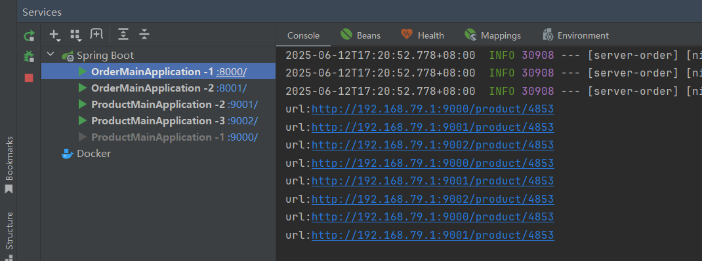

# Spring Cloud 快速入门

### 技术配置

**Spring Cloud 系列：**

- 官⽹：https://spring.io/projects/spring-cloud
- 远程调⽤：OpenFeign
- ⽹关：Gateway

**Spring Cloud Alibaba 系列：**

- 官⽹：https://sca.aliyun.com/
- 注册中⼼/配置中⼼：Nacos
- 服务保护：Sentinel
- 分布式事务：Seata

**构建对应版本**

https://github.com/alibaba/spring-cloud-alibaba


**项目选择对应版本**


### 项目创建

**创建一个springboot 项目 项目名为spring-cloud-demo**

```xml
<?xml version="1.0" encoding="UTF-8"?>
<project xmlns="http://maven.apache.org/POM/4.0.0" xmlns:xsi="http://www.w3.org/2001/XMLSchema-instance"
         xsi:schemaLocation="http://maven.apache.org/POM/4.0.0 https://maven.apache.org/xsd/maven-4.0.0.xsd">
    <modelVersion>4.0.0</modelVersion>
    <groupId>com.example</groupId>
    <artifactId>spring-cloud-demo</artifactId>
    <version>0.0.1-SNAPSHOT</version>
    <name>spring-cloud-demo</name>
    <description>spring-cloud-demo</description>
    <modules>
        <module>server</module>
    </modules>
    <packaging>pom</packaging>

    <parent>
        <groupId>org.springframework.boot</groupId>
        <artifactId>spring-boot-starter-parent</artifactId>
        <version>3.3.4</version>
        <relativePath/> <!-- lookup parent from repository -->
    </parent>

    <properties>
        <maven.compiler.source>17</maven.compiler.source>
        <maven.compiler.target>17</maven.compiler.target>
        <project.build.sourceEncoding>UTF-8</project.build.sourceEncoding>
        <spring-cloud.version>2023.0.3</spring-cloud.version>
        <spring-cloud-alibaba.version>2023.0.3.2</spring-cloud-alibaba.version>
    </properties>

    <dependencyManagement>
        <dependencies>
            <dependency>
                <groupId>org.springframework.cloud</groupId>
                <artifactId>spring-cloud-dependencies</artifactId>
                <version>${spring-cloud.version}</version>
                <type>pom</type><!--表示这个依赖是一个 POM 类型的文件，而不是 JAR-->
                <scope>import</scope> <!--将该 POM 中定义的所有依赖版本信息导入到当前项目中-->
            </dependency>
            <dependency>
                <groupId>com.alibaba.cloud</groupId>
                <artifactId>spring-cloud-alibaba-dependencies</artifactId>
                <version>${spring-cloud-alibaba.version}</version>
                <type>pom</type>
                <scope>import</scope>
            </dependency>
        </dependencies>
    </dependencyManagement>

</project>

```

**项目结构**


**server pom.xml 配置**

```xml
<?xml version="1.0" encoding="UTF-8"?>
<project xmlns="http://maven.apache.org/POM/4.0.0"
         xmlns:xsi="http://www.w3.org/2001/XMLSchema-instance"
         xsi:schemaLocation="http://maven.apache.org/POM/4.0.0 http://maven.apache.org/xsd/maven-4.0.0.xsd">
    <modelVersion>4.0.0</modelVersion>

    <parent>
        <groupId>com.example</groupId>
        <artifactId>spring-cloud-demo</artifactId>
        <version>0.0.1-SNAPSHOT</version>
    </parent>

    <packaging>pom</packaging>
    <modules>
        <module>server-product</module>
        <module>server-order</module>
    </modules>

    <artifactId>server</artifactId>

    <properties>
        <maven.compiler.source>17</maven.compiler.source>
        <maven.compiler.target>17</maven.compiler.target>
        <project.build.sourceEncoding>UTF-8</project.build.sourceEncoding>
    </properties>

    <dependencies>
        <!--服务注册 服务发现-->
        <dependency>
            <groupId>com.alibaba.cloud</groupId>
            <artifactId>spring-cloud-starter-alibaba-nacos-discovery</artifactId>
        </dependency>

        <!--远程调用-->
        <dependency>
            <groupId>org.springframework.cloud</groupId>
            <artifactId>spring-cloud-starter-openfeign</artifactId>
        </dependency>
    </dependencies>

</project>
```

### Nacos

**官网：*https://nacos.io/download/nacos-server*

#### 配置

**什么是Nacos**

Nacos `/nɑ:kəʊs/` 是 `Dynamic Naming and Configuration Service` 的首字母简称，一个易于构建 AI Agent 应用的动态服务发现、配置管理和AI智能体管理平台。


启动命令(standalone代表着单机模式运行，非集群模式):

```powershell
startup.cmd -m standalone
```

随后启动程序会提示您输入`3个`鉴权相关配置（Nacos从3.0.0版本开始默认启用控制台鉴权功能，因此如下3个鉴权相关配置必须填写）如下所示：

```powershell
`nacos.core.auth.plugin.nacos.token.secret.key` is missing, please set with Base64 string: ${your_input_token_secret_key}
nacos.core.auth.plugin.nacos.token.secret.key` Updated:
----------------------------------
`nacos.core.auth.server.identity.key` is missing, please set: ${your_input_server_identity_key}
`nacos.core.auth.server.identity.key` Updated:
----------------------------------
`nacos.core.auth.server.identity.value` is missing, please set: ${your_input_server_identity_key}
`nacos.core.auth.server.identity.value` Updated:
----------------------------------
```

**密钥长度要求**：Base64 编码后的密钥必须 ≥ 32 字节

**生成密钥**

```powershell
[Convert]::ToBase64String((1..32 | ForEach-Object { Get-Random -Maximum 256 }))
```


**修改 `application.properties`**

在 Nacos 安装目录的 `conf/application.properties` 文件中添加


**Nacos控制台页面**

打开任意浏览器，输入地址：`http://127.0.0.1:8080/index.html`, 即可进入Nacos控制台页面。

> 注意：首次打开会要求初始化管理员用户`nacos`的密码。

注册中心&发现服务端口是8848

**关闭服务器**

```powershell
shutdown.cmd

# 或者双击shutdown.cmd运行文件。  或者直接关掉命令面板
```

跟多

快速开始：https://nacos.io/docs/latest/quickstart/quick-start/

#### 注册

**导入依赖**

```xml
    <!--服务注册 服务发现-->
    <dependency>
        <groupId>com.alibaba.cloud</groupId>
        <artifactId>spring-cloud-starter-alibaba-nacos-discovery</artifactId>
    </dependency>
```

**配置nacos连接**

```yml
spring:
  application:
    name: server-order
  cloud:
    nacos:
      discovery:
        server-addr: 127.0.0.1:8848

server:
  port: 8000

```

#### 发现服务

**启动服务**


**获取所有服务地址**

```java
@SpringBootTest
public class TestMain {

    /*spring-cloud 发现服务*/
    @Resource
    private DiscoveryClient discoveryClient;

    /*NacosDiscoveryClient 实际上就是 DiscoveryClient 的 Nacos 实现*/
    @Resource
    private NacosDiscoveryClient nacosDiscoveryClient;

    @Test
    void discoveryClientTest(){
        /*获取所有服务*/
        for(String server:discoveryClient.getServices()){
            System.out.println("server:"+server);
            List<ServiceInstance> instances = discoveryClient.getInstances(server);
            /*获取每个服务里的启动实例*/
            for (ServiceInstance instance:instances){
                System.out.println("ip"+instance.getHost()+":"+instance.getPort());
            }
            System.out.println();
        }
    }


    @Test
    void nacosDiscoveryClientTest(){
        /*获取所有服务*/
        for(String server:nacosDiscoveryClient.getServices()){
            System.out.println("server:"+server);
            List<ServiceInstance> instances = nacosDiscoveryClient.getInstances(server);
            /*获取每个服务里的启动实例*/
            for (ServiceInstance instance:instances){
                System.out.println("ip"+instance.getHost()+":"+instance.getPort());
            }
            System.out.println();
        }
    }
}
//这两的作用是一样的都是返回nacos上的所有服务
```

**返回结果**


#### **远程调用**

```java
@Configuration
public class ProductServerConfig {


    /*将restTemplate远程调用放入spring管理*/
    @Bean
    public RestTemplate restTemplate() {
        return new RestTemplate();
    }
}

```

```java
@Service
public class OrderServerImpl implements OrderServer {

    @Autowired
    private DiscoveryClient discoveryClient;

    @Autowired
    private RestTemplate restTemplate;

    /*远程调用拿到商品*/
    public Product getProduct(String productId) {
        /*获取该服务的所有实例*/
        List<ServiceInstance> instances = discoveryClient.getInstances("server-product");
        /*获取服务第一个实例*/
        ServiceInstance instance = instances.get(0);
        /*远程url*/
        String url = "http://"+instance.getHost() + ":" + instance.getPort()+"/product/"+productId;
        /*远程发送请求拿到商品*/
        Product product = restTemplate.getForObject(url, Product.class);
        return product;
    }

    @Override
    public Order insertOrder(String userId,String productId) {
        /*1、获取调用商品服务获取商品*/
        Product product = getProduct(productId);

        Order order = new Order();
        order.setId("1");
        /*计算金额*/
        BigDecimal price = product.getPrice();
        BigDecimal priceSum = price.multiply(new BigDecimal(product.getNum()));
        order.setTotalAmount(priceSum);
        order.setUserId(userId);
        order.setNickName("hello");
        order.setAddress("湖南 长沙");
        /*商品列表*/
        order.setPrdoctList(Lists.newArrayList(product,product,product));
        return order;
    }


}

```

**返回数据**

```json
{
    "id": "1",
    "totalAmount": 2806.5576,
    "userId": "2",
    "nickName": "hello",
    "address": "湖南 长沙",
    "prdoctList": [
        {
            "id": "4853",
            "price": 100.2342,
            "productName": "衬衫",
            "num": 28
        },
        {
            "id": "4853",
            "price": 100.2342,
            "productName": "衬衫",
            "num": 28
        },
        {
            "id": "4853",
            "price": 100.2342,
            "productName": "衬衫",
            "num": 28
        }
    ]
}
```

#### 负载均衡

**导入依赖**

```xml
<!--负载均衡-->
<dependency>
    <groupId>org.springframework.cloud</groupId>
    <artifactId>spring-cloud-starter-loadbalancer</artifactId>
</dependency>
```

**实现代码**

```java
    /*负载均衡*/
    @Autowired
    private LoadBalancerClient loadBalancer;

    /*负载均衡调用商品*/
    public Product getLoadBalancerProduct(String productId) {

        /*负载均衡获取这个服务的某一个实例*/
        ServiceInstance choose = loadBalancer.choose("server-product");
        /*远程url*/
        String url = "http://" + choose.getHost() + ":" + choose.getPort() + "/product/" + productId;
        System.out.println("url:" + url);
        /*远程发送请求拿到商品*/
        Product product = restTemplate.getForObject(url, Product.class);
        return product;
    }
```

**输出结果**



**注解负载均衡**

```java
@Configuration
public class ProductServerConfig {
    
    /*添加注解实现远程调用负载均衡*/
    @LoadBalanced
    @Bean
    public RestTemplate restTemplate() {
        return new RestTemplate();
    }
}

```

```java
/*负载均衡*/
@Autowired
private LoadBalancerClient loadBalancer;

/*注解式负载均衡*/
public Product getLoadBalancerProductAnnotation(String productId) {
    String url = "http://server-product/product/" + productId;
    /*远程调用请求会自动替换server-product成ip进行负载均衡调用*/
    Product product = restTemplate.getForObject(url, Product.class);
    return product;
}
```

**总结**

负载均衡其实就是在restTemplate进行远程调用时，将获取的这个服务所有实例进行顺序调用进行负载均衡。
自己也可以写个实现算法进行顺序调用该服务的实例
