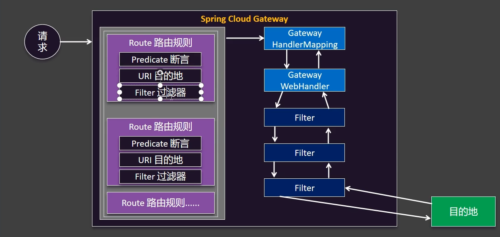

# Spring Cloud 快速入门

## 1. 技术配置

**Spring Cloud 系列：**

- 官⽹：https://spring.io/projects/spring-cloud
- 远程调⽤：OpenFeign
- ⽹关：Gateway

**Spring Cloud Alibaba 系列：**

- 官⽹：https://sca.aliyun.com/
- 注册中⼼/配置中⼼：Nacos
- 服务保护：Sentinel
- 分布式事务：Seata

**构建对应版本**

https://github.com/alibaba/spring-cloud-alibaba


**项目选择对应版本**


## 2. 项目创建

**创建一个springboot 项目 项目名为spring-cloud-demo**

```xml
<?xml version="1.0" encoding="UTF-8"?>
<project xmlns="http://maven.apache.org/POM/4.0.0" xmlns:xsi="http://www.w3.org/2001/XMLSchema-instance"
         xsi:schemaLocation="http://maven.apache.org/POM/4.0.0 https://maven.apache.org/xsd/maven-4.0.0.xsd">
    <modelVersion>4.0.0</modelVersion>
    <groupId>com.example</groupId>
    <artifactId>spring-cloud-demo</artifactId>
    <version>0.0.1-SNAPSHOT</version>
    <name>spring-cloud-demo</name>
    <description>spring-cloud-demo</description>
    <modules>
        <module>server</module>
    </modules>
    <packaging>pom</packaging>

    <parent>
        <groupId>org.springframework.boot</groupId>
        <artifactId>spring-boot-starter-parent</artifactId>
        <version>3.3.4</version>
        <relativePath/> <!-- lookup parent from repository -->
    </parent>

    <properties>
        <maven.compiler.source>17</maven.compiler.source>
        <maven.compiler.target>17</maven.compiler.target>
        <project.build.sourceEncoding>UTF-8</project.build.sourceEncoding>
        <spring-cloud.version>2023.0.3</spring-cloud.version>
        <spring-cloud-alibaba.version>2023.0.3.2</spring-cloud-alibaba.version>
    </properties>

    <dependencyManagement>
        <dependencies>
            <dependency>
                <groupId>org.springframework.cloud</groupId>
                <artifactId>spring-cloud-dependencies</artifactId>
                <version>${spring-cloud.version}</version>
                <type>pom</type><!--表示这个依赖是一个 POM 类型的文件，而不是 JAR-->
                <scope>import</scope> <!--将该 POM 中定义的所有依赖版本信息导入到当前项目中-->
            </dependency>
            <dependency>
                <groupId>com.alibaba.cloud</groupId>
                <artifactId>spring-cloud-alibaba-dependencies</artifactId>
                <version>${spring-cloud-alibaba.version}</version>
                <type>pom</type>
                <scope>import</scope>
            </dependency>
        </dependencies>
    </dependencyManagement>

</project>

```

**项目结构**


**server pom.xml 配置**

```xml
<?xml version="1.0" encoding="UTF-8"?>
<project xmlns="http://maven.apache.org/POM/4.0.0"
         xmlns:xsi="http://www.w3.org/2001/XMLSchema-instance"
         xsi:schemaLocation="http://maven.apache.org/POM/4.0.0 http://maven.apache.org/xsd/maven-4.0.0.xsd">
    <modelVersion>4.0.0</modelVersion>

    <parent>
        <groupId>com.example</groupId>
        <artifactId>spring-cloud-demo</artifactId>
        <version>0.0.1-SNAPSHOT</version>
    </parent>

    <packaging>pom</packaging>
    <modules>
        <module>server-product</module>
        <module>server-order</module>
    </modules>

    <artifactId>server</artifactId>

    <properties>
        <maven.compiler.source>17</maven.compiler.source>
        <maven.compiler.target>17</maven.compiler.target>
        <project.build.sourceEncoding>UTF-8</project.build.sourceEncoding>
    </properties>

    <dependencies>
        <!--服务注册 服务发现-->
        <dependency>
            <groupId>com.alibaba.cloud</groupId>
            <artifactId>spring-cloud-starter-alibaba-nacos-discovery</artifactId>
        </dependency>

        <!--远程调用-->
        <dependency>
            <groupId>org.springframework.cloud</groupId>
            <artifactId>spring-cloud-starter-openfeign</artifactId>
        </dependency>
    </dependencies>

</project>
```

## 3. Nacos

### 配置

**什么是Nacos**

Nacos `/nɑ:kəʊs/` 是 `Dynamic Naming and Configuration Service` 的首字母简称，一个易于构建 AI Agent 应用的动态服务发现、配置管理和AI智能体管理平台。


启动命令(standalone代表着单机模式运行，非集群模式):

```powershell
startup.cmd -m standalone
```

随后启动程序会提示您输入`3个`鉴权相关配置（Nacos从3.0.0版本开始默认启用控制台鉴权功能，因此如下3个鉴权相关配置必须填写）如下所示：

```powershell
`nacos.core.auth.plugin.nacos.token.secret.key` is missing, please set with Base64 string: ${your_input_token_secret_key}
nacos.core.auth.plugin.nacos.token.secret.key` Updated:
----------------------------------
`nacos.core.auth.server.identity.key` is missing, please set: ${your_input_server_identity_key}
`nacos.core.auth.server.identity.key` Updated:
----------------------------------
`nacos.core.auth.server.identity.value` is missing, please set: ${your_input_server_identity_key}
`nacos.core.auth.server.identity.value` Updated:
----------------------------------
```

**密钥长度要求**：Base64 编码后的密钥必须 ≥ 32 字节

**生成密钥**

```powershell
[Convert]::ToBase64String((1..32 | ForEach-Object { Get-Random -Maximum 256 }))
```


**修改 `application.properties`**

在 Nacos 安装目录的 `conf/application.properties` 文件中添加


**Nacos控制台页面**

打开任意浏览器，输入地址：`http://127.0.0.1:8080/index.html`, 即可进入Nacos控制台页面。

> 注意：首次打开会要求初始化管理员用户`nacos`的密码。

注册中心&发现服务端口是8848

**关闭服务器**

```powershell
shutdown.cmd

# 或者双击shutdown.cmd运行文件。  或者直接关掉命令面板
```

### 发现服务

**导入依赖**

```xml
    <!--服务注册 服务发现-->
    <dependency>
        <groupId>com.alibaba.cloud</groupId>
        <artifactId>spring-cloud-starter-alibaba-nacos-discovery</artifactId>
    </dependency>
```

**配置nacos连接**

```yml
spring:
  application:
  # 注册服务名
    name: server-order
  cloud:
    nacos:
        server-addr: 127.0.0.1:8848

server:
  port: 8000

```

**使用 @EnableDiscoveryClient 注解开启服务注册与发现功能**：

```java
@EnableDiscoveryClient
@SpringBootApplication
public class OrderMainApplication {
    public static void main(String[] args) {
        SpringApplication.run(OrderMainApplication.class,args);
    }
}
```

**启动服务**


**获取所有服务地址**

```java
@SpringBootTest
public class TestMain {

    /*spring-cloud 发现服务*/
    @Resource
    private DiscoveryClient discoveryClient;

    /*NacosDiscoveryClient 实际上就是 DiscoveryClient 的 Nacos 实现*/
    @Resource
    private NacosDiscoveryClient nacosDiscoveryClient;

    @Test
    void discoveryClientTest(){
        /*获取所有服务*/
        for(String server:discoveryClient.getServices()){
            System.out.println("server:"+server);
            List<ServiceInstance> instances = discoveryClient.getInstances(server);
            /*获取每个服务里的启动实例*/
            for (ServiceInstance instance:instances){
                System.out.println("ip"+instance.getHost()+":"+instance.getPort());
            }
            System.out.println();
        }
    }


    @Test
    void nacosDiscoveryClientTest(){
        /*获取所有服务*/
        for(String server:nacosDiscoveryClient.getServices()){
            System.out.println("server:"+server);
            List<ServiceInstance> instances = nacosDiscoveryClient.getInstances(server);
            /*获取每个服务里的启动实例*/
            for (ServiceInstance instance:instances){
                System.out.println("ip"+instance.getHost()+":"+instance.getPort());
            }
            System.out.println();
        }
    }
}
//这两的作用是一样的都是返回nacos上的所有服务
```

**返回结果**


### **远程调用**

```java
@Configuration
public class ProductServerConfig {


    /*将restTemplate远程调用放入spring管理*/
    @Bean
    public RestTemplate restTemplate() {
        return new RestTemplate();
    }
}

```

```java
@Service
public class OrderServerImpl implements OrderServer {

    @Autowired
    private DiscoveryClient discoveryClient;

    @Autowired
    private RestTemplate restTemplate;

    /*远程调用拿到商品*/
    public Product getProduct(String productId) {
        /*获取该服务的所有实例*/
        List<ServiceInstance> instances = discoveryClient.getInstances("server-product");
        /*获取服务第一个实例*/
        ServiceInstance instance = instances.get(0);
        /*远程url*/
        String url = "http://"+instance.getHost() + ":" + instance.getPort()+"/product/"+productId;
        /*远程发送请求拿到商品*/
        Product product = restTemplate.getForObject(url, Product.class);
        return product;
    }

    @Override
    public Order insertOrder(String userId,String productId) {
        /*1、获取调用商品服务获取商品*/
        Product product = getProduct(productId);

        Order order = new Order();
        order.setId("1");
        /*计算金额*/
        BigDecimal price = product.getPrice();
        BigDecimal priceSum = price.multiply(new BigDecimal(product.getNum()));
        order.setTotalAmount(priceSum);
        order.setUserId(userId);
        order.setNickName("hello");
        order.setAddress("湖南 长沙");
        /*商品列表*/
        order.setPrdoctList(Lists.newArrayList(product,product,product));
        return order;
    }


}

```

**返回数据**

```json
{
    "id": "1",
    "totalAmount": 2806.5576,
    "userId": "2",
    "nickName": "hello",
    "address": "湖南 长沙",
    "prdoctList": [
        {
            "id": "4853",
            "price": 100.2342,
            "productName": "衬衫",
            "num": 28
        },
        {
            "id": "4853",
            "price": 100.2342,
            "productName": "衬衫",
            "num": 28
        },
        {
            "id": "4853",
            "price": 100.2342,
            "productName": "衬衫",
            "num": 28
        }
    ]
}
```

### 负载均衡

**导入依赖**

```xml
<!--负载均衡-->
<dependency>
    <groupId>org.springframework.cloud</groupId>
    <artifactId>spring-cloud-starter-loadbalancer</artifactId>
</dependency>
```

**实现代码**

```java
    /*负载均衡*/
    @Autowired
    private LoadBalancerClient loadBalancer;

    /*负载均衡调用商品*/
    public Product getLoadBalancerProduct(String productId) {

        /*负载均衡获取这个服务的某一个实例*/
        ServiceInstance choose = loadBalancer.choose("server-product");
        /*远程url*/
        String url = "http://" + choose.getHost() + ":" + choose.getPort() + "/product/" + productId;
        System.out.println("url:" + url);
        /*远程发送请求拿到商品*/
        Product product = restTemplate.getForObject(url, Product.class);
        return product;
    }
```

**输出结果**


**注解负载均衡**

```java
@Configuration
public class ProductServerConfig {
    
    /*添加注解实现远程调用负载均衡*/
    @LoadBalanced
    @Bean
    public RestTemplate restTemplate() {
        return new RestTemplate();
    }
}

```

```java
/*负载均衡*/
@Autowired
private LoadBalancerClient loadBalancer;

/*注解式负载均衡*/
public Product getLoadBalancerProductAnnotation(String productId) {
    String url = "http://server-product/product/" + productId;
    /*远程调用请求会自动替换server-product成ip进行负载均衡调用*/
    Product product = restTemplate.getForObject(url, Product.class);
    return product;
}
```

**总结**

​		负载均衡其实就是在restTemplate进行远程调用时，将获取的这个服务所有实例进行顺序调用进行负载均衡。
自己也可以写个实现算法进行顺序调用该服务的实例

### 配置中心

**导入依赖**

```xml
<!--nacos 配置中心-->
<dependency>
    <groupId>com.alibaba.cloud</groupId>
    <artifactId>spring-cloud-starter-alibaba-nacos-config</artifactId>
</dependency>
```

**添加数据集(data-id、配置文件名)**


**导入数据集**

```yaml
spring:
  cloud:
    nacos:
      serverAddr: 127.0.0.1:8848 #如果用的云上托管版本，输入可访问的Nacos Server地址即可
  config:
    import:
      - nacos:common.properties?group=order
```

**接受数据**


```java
@Component
@ConfigurationProperties(prefix = "order")
@Data
public class OrderProperties {
    private String timeOut;
    private String environment;
}

```

**实现 数据隔离 环境切换**


**spring配置application.yml 导入数据集**

```yaml
server:
  port: 8000

spring:
  profiles:
    # 选择运行环境 
    active: prod
  application:
    name: server-order
  cloud:
    nacos:
      server-addr: 127.0.0.1:8848
      config:
        import-check:
          # 导入nacos配置中心就会检测是否引入nacos配置文件，现在关闭检测
          enabled: false
        # nacos命名空间 根据spring active选择的环境命名，没有选择就默认nacos public默认命名空间
        namespace: ${spring.profiles.active:public}

# 开发环境
---
spring:
  config:
    import:
      # nacos:data-id（配置文件名）?group=分组名（一般用于微服务名如订单服务、商品服务）
      - nacos:common.yaml?group=order
      - nacos:database.yaml?group=database
      - nacos:db.yaml?group=database
    activate:
      on-profile: dev


# 测试环境
---
spring:
  config:
    import:
      - nacos:common.yaml?group=order
      - nacos:database.yaml?group=database
    activate:
      on-profile: test

# 生产环境
---
spring:
  config:
    import:
      - nacos:common.yaml?group=order
      - nacos:database.yaml?group=database
    activate:
      on-profile: prod
```

### 总结


### 跟多

nacos 官方快速开始：https://nacos.io/docs/latest/quickstart/quick-start/

alibaba-nacos 快速开始：https://sca.aliyun.com/docs/2023/user-guide/nacos/quick-start/

### 面试题

**1、注册中心宕机（nacos 宕机），远程调用还可以成功吗？**

​	如果之前调用过这个服务，那么这个服务的所有实例会到实例缓存里，就算注册中心宕机也时可以通过。

​	如果从来没有调用过那么会去注册中心拿这个服务，因为注册中心已经宕机所有无法通过。

**远程调用流程图**


## 4. OpenFeign

### 快速开始

**引入依赖**

```xml
<!--远程调用-->
<dependency>
    <groupId>org.springframework.cloud</groupId>
    <artifactId>spring-cloud-starter-openfeign</artifactId>
</dependency>
```

**开启远程调用**

```java
@EnableFeignClients  //开启feign远程调用
@EnableDiscoveryClient // 开启nacos发现服务
@SpringBootApplication
public class OrderMainApplication {
    public static void main(String[] args) {
        SpringApplication.run(OrderMainApplication.class,args);
    }
}
```

**编写feign客户端**

```java
// feign客户端
@FeignClient(value = "server-product") // feign 客户端
public interface ProductFeignClient {

    @GetMapping("/product/{id}")
    Product getProduct(@PathVariable String id);

}

// 请求接口
@RestController
@RequestMapping("product")
public class ProductController {

    @Autowired
    private ProductServer productServer;

    @GetMapping("/{id}")
    public Product getProduct(@PathVariable String id) {
        System.out.println("hello");
        return productServer.getProductById(id);
    }
}

// 调用
@Autowired
private ProductFeignClient productFeignClient;
/*feign 远程调用自带负载均衡*/
Product product = productFeignClient.getProduct(productId);
```


### **远程调用 第三方API**

**编写第三方API调用feign客户端** 

```java
/*远程调用第三方API*/
@FeignClient(value = "joke-client", url = "http://v.juhe.cn")
public interface JokeFeignClient {

    @GetMapping("/joke/randJoke")
    Object getJoke(@RequestParam("key") String key);
}
```

**调用**

```java
@Autowired
private JokeFeignClient jokeFeignClient;

@Override
public Object getJoke() {
    Object joke = jokeFeignClient.getJoke("${key}");
    return joke;
}
```

**返回数据**

```json
{
    "reason": "success",
    "result": [
        {
            "content": "小伙子带着现任女友走在路上,碰到了前女友于是给前女友介绍说:这是你嫂子。现任女友说问小伙子:这位是…小伙子还没想好怎么回答,前女友就抢着说;我以前是你嫂子",
            "hashId": "9c0cbb884e5e2bebb8d533cdbc65e9f0",
            "unixtime": 1473635632
        },
        {
            "content": "昨天一对貌似20出头的小情侣来开房，男的上来就问有没有电脑房，本人摇头说没有，那男的一听就要走，女的不乐意了对那男的吼到你他妈的都换几个宾馆了，没电脑怎么了你是玩它还是玩我。",
            "hashId": "1947ca3ba5850115f85f6dd09f5327b6",
            "unixtime": 1473646430
        }
    ],
    "error_code": 0
}
```


### **日志**

  **开启日志级别**

```yaml
# 开启feign日志级别
logging:
  level:
    com.example.feign: debug
```

**配置日志bean**

```java
/*配置日志bean*/
@Bean
Logger.Level feignLogLevel() {
    return Logger.Level.FULL;
}
```


### 超时控制

**超时配置**

```yaml
spring:
  cloud:
    openfeign:
      client:
        config:
          # 默认设置
          default:
            logger-level: full
            connect-timeout: 4000
            read-timeout: 10000
          # 指定配置那个feign客户端
          server-product:
            logger-level: full
            connect-timeout: 3000
            read-timeout: 5000
```

**重传机制**

```java
/*重传机制*/
@Bean
Retryer retryer(){
    /*请求间隔（每次间隔是前面的1.5倍）、最大间隔时间、请求次数*/
    return new Retryer.Default(100,SECONDS.toMillis(1),5);
}
```


### 拦截器

**编写拦截器**

```java
public class TokenRequestInterceptor implements RequestInterceptor {
    /**
     * 请求拦截器
     * @param requestTemplate 请求模板
     */
    @Override
    public void apply(RequestTemplate requestTemplate) {
        System.out.println("拦截器启动");
        requestTemplate.header("token", UUID.randomUUID().toString());
    }
}
```

**yml配置**

```yaml
spring:
  cloud:
    openfeign:
      client:
        config:
          # 默认设置
          default:
            logger-level: full
            connect-timeout: 4000
            read-timeout: 10000
          # 指定配置那个feign客户端
          server-product:
            logger-level: full
            # 连接超时
            connect-timeout: 3000
            # 读取超时
            read-timeout: 5000
            # 配置拦截的feign客户端参数为数组可以多个 可以直接配置在default里这样就默认拦截
            request-interceptors:
              - com.example.interceptor.TokenRequestInterceptor
```

**注解配置**

```java
/*把拦截器放入spring管理就直接对全部的请求进行拦截*/
@Component
public class TokenRequestInterceptor implements RequestInterceptor {
    /**
     * 请求拦截器
     * @param requestTemplate 请求模板
     */
    @Override
    public void apply(RequestTemplate requestTemplate) {
        System.out.println("拦截器启动");
        requestTemplate.header("token", UUID.randomUUID().toString());
    }
}
```


### 跟多

文档：https://springdoc.cn/spring-cloud-openfeign

### **面试题**

**1、客户端负载均衡和服务端负载均衡的区别**

​		调用自己的内部的业务，首先feign回去nacos寻找这个服务所有的实例，然后进行负载均衡拿到一个实例进行调用业务接口，那么这个负载均衡就发生在feign客户端，这就是客户端负载均衡。

​		而调用第三方api就是直接通过接口url方式发送请求，然后拿到数据，这个负载均衡实际是发生在这个第三方api的服务器里面，这就是服务端负载均衡。


## 5. Sentinel

[quick-start | Sentinel](https://sentinelguard.io/zh-cn/docs/quick-start.html)

### **快速开始**

**导入依赖**

```xml
<dependency>
    <groupId>com.alibaba.cloud</groupId>
    <artifactId>spring-cloud-starter-alibaba-sentinel</artifactId>
</dependency>
```

**下载Sentinel控制台**

```http
#下载sentinel-dashboard-1.8.8.jar 运行jar包
https://github.com/alibaba/Sentinel/releases
```

**配置yml**

```yaml
# sentinel 配置
spring:
  cloud:
    sentinel:
      transport:
        dashboard: localhost:8080  # Sentinel 控制台地址
      eager: true                  # 饥饿加载模式 默认false：只有在第一次请求时才会初始化 Sentinel
```


### 异常处理

**异常处理流程图**  sentinel 会对一下四种资源进行异常处理


**控制层接口资源**

```java
/**
 * 实现 BlockExceptionHandler接口 重写 handle方法 自定义业务
 */
@Component
public class MyBlockExceptionHandel implements BlockExceptionHandler {

    private ObjectMapper objectMapper = new ObjectMapper();

    @Override
    public void handle(HttpServletRequest request, HttpServletResponse response, String resourceName, BlockException e)
        throws Exception {

        response.setStatus(429);
        response.setContentType("application/json; charset=utf-8");
        PrintWriter out = response.getWriter();
        Result no = Result.no(500, "web接口："+resourceName + " -- 流量限制");
        String jsonString = objectMapper.writeValueAsString(no);
        out.print(jsonString);
        out.flush();
        out.close();
    }
}
```

**注解SentinelResource资源**

```java
// 原本的业务方法.
@SentinelResource(blockHandler = "blockHandlerForGetUser")
public User getUserById(String id) {
    throw new RuntimeException("getUserById command failed");
}

// blockHandler 函数，原方法调用被限流/降级/系统保护的时候调用
public User blockHandlerForGetUser(String id, BlockException ex) {
    return new User("admin");
}
```

**远程调用openfeign资源**

```yaml
# 需要开启才能支持 Sentinel
feign:
  sentinel:
    enabled: true  # 开启 Feign 对 Sentinel 的支持
```

```java
@FeignClient(value = "server-product",fallback = ProductFeignClientFallback.class) // feign 客户端
public interface ProductFeignClient {

    /*这个实际就是对应调用controller的接口*/
    @GetMapping("/product/{id}")
    Product getProduct(@PathVariable String id);

}

@Component
public class ProductFeignClientFallback implements ProductFeignClient {

    @Override
    public Product getProduct(String id) {
        System.out.println("fallback 商品兜底数据");
        Product product = new Product();
        product.setId("");
        product.setPrice(new BigDecimal("0"));
        product.setProductName("兜底数据");
        product.setNum(0);
        return product;
    }
}
```

**SphU硬编码资源**

```java
Entry entry = null;
// 务必保证finally会被执行
try {
  // 资源名可使用任意有业务语义的字符串
  entry = SphU.entry("自定义资源名");
  // 被保护的业务逻辑
  // do something...
} catch (BlockException e1) {
  // 资源访问阻止，被限流或被降级
  // 进行相应的处理操作
} finally {
  if (entry != null) {
    entry.exit();
  }
}
```

### 流控规则

**流控规则默认直接模式**


**链路模式**

A资源和C资源都调用B资源，现在设置A资源下的B资源，进行链路模式限制C资源。

```java
@GetMapping("/add/{userId}/{productId}")
Order createOrder(@PathVariable("userId") String userId, @PathVariable("productId") String productId) {
    return orderServer.insertOrder(productId, userId);
}

@GetMapping("/seckill/{userId}/{productId}")
Order seckill(@PathVariable("userId") String userId, @PathVariable("productId") String productId) {
    Order order = orderServer.insertOrder(productId, userId);
    order.setNickName("链路模式");
    return order;
}
```


**关联模式**

A资源和B资源关联后就会资源共享，如果A资源把服务沾满那么B资源在访问就会报异常


### **熔断规则**

**作用**：切断不稳定调用、快速返回不积压、避免雪崩效应


**断路器工作原理**

默认熔断器是关闭的，如果不满足设置条件则就会熔断，这时处于熔断期间，这个时间是可以设置的，熔断时长期间再有请求访问直接就返回兜底不会再请求访问资源，熔断时长结束此时处于一个半开状态，这是有请求访问会去正常访问资源，如果访问出现问题又会进入熔断时长期间，访问没有问题就处于最开始的状态默认闭合。


**有熔断和无熔断的区别**

有熔断规则访问出现问题，后续会开启一个熔断时长在这期间就不会去调用这个资源了，直接返回兜底数据

没有熔断会出现每次请求都会去访问远程资源，然后发送错误防护兜底数据，这样就多此一举了，明知是错误资源，每次还是去请求。


**熔断规则设置**

**慢调用比列**：5s期间请求数大于5，有80%的请求时长超过RT 3s 就会触发熔断机制，这是就会处于熔断30s时长。后续访问这个资源的请求直接就放回一个异常，不会造成阻塞，如果设置了兜底数据就会直接放回兜底数据。


`异常比例`   `异常数` 这个两就是根据异常来确定规则，前者是请总数的异常比例，后者就是异常数总和规则。

### 热点规则

热点规则相当于在流控规则基础上填加参数限制规则

**接口资源代码设计**

```java
    @GetMapping("/{id}")
	// 设置sentinel资源名,还有兜底方式和兜底方法
    @SentinelResource(value = "add-product",fallback = "addProductFallback")
    public Product getProduct(@PathVariable String id) {
        System.out.println("hello");
//        TimeUnit.SECONDS.sleep(2);
        return productServer.getProductById(id);
    }

    /**
     * 兜底数据
     * @param id 热点参数
     * @param exception 匹配绑定的接口出现异常，直接用最大异常Throwable就可以匹配所以异常
     * @return
     */
    public Product addProductFallback(String id, Throwable exception)   {
        System.out.println("兜底数据 product");
        Product product = new Product();
        product.setId("兜底数据");
        product.setPrice(new BigDecimal("0"));
        product.setProductName("异常休息"+exception.getMessage());
        product.setNum(0);
        return product;
    }
```

**需求案例：**


**需求一**：直接用sentinel 设置热点规则，通过参数索引为0的也就是第一个参数，只要第一个参数不是null那么就会收限制，1秒里相同的参数只可以访问一次。


**需求二**：添加一个参数额外设置，对一个参数为6的请求设置阈值为100000，这样只要是id为6的就不会限制成1s一个请求了。


**需求三**：需求三跟需求二是一样的。只需要对商品id为666的设置一个流量阈值为1的就可以了，其他阈值设置10000。

## 6. Gateway

### 配置依赖

```xml
<!--网关-->
<dependency>
    <groupId>org.springframework.cloud</groupId>
    <artifactId>spring-cloud-starter-gateway</artifactId>
</dependency>

<!--服务注册 服务发现-->
<dependency>
    <groupId>com.alibaba.cloud</groupId>
    <artifactId>spring-cloud-starter-alibaba-nacos-discovery</artifactId>
</dependency>

<!--负载均衡-->
<dependency>
    <groupId>org.springframework.cloud</groupId>
    <artifactId>spring-cloud-starter-loadbalancer</artifactId>
</dependency>
```

### **开启服务**

```java
@EnableDiscoveryClient // 开启nacos发现服务
@SpringBootApplication
public class GatewayMainApplication {

    public static void main(String[] args) {
        SpringApplication.run(GatewayMainApplication.class, args);
    }
}
```

### 路由规则



### **路由断言**


**断言配置**

```yaml
spring:
  cloud:
    gateway:
      routes:
        - id: order-service
          uri: lb://server-order # 使用负载均衡的方式访问订单服务
          predicates:
            - Path=/order/** # 匹配/order/**路径
          filters:
            - StripPrefix=1 # 去掉前缀/order

        - id: product-service
          uri: lb://server-product # 使用负载均衡的方式访问商品服务
          predicates:
            - Path=/product/** # 匹配/product/**路径
          filters:
            - StripPrefix=1 # 去掉前缀/product
```

### 自定义断言

**编写断言工厂**

```java
/**
 * VIP路由断言工厂
 * 用于根据请求参数进行路由匹配  这个名称固定xxx RoutePredicateFactory
 */
@Component
public class VipRoutePredicateFactory extends AbstractRoutePredicateFactory<VipRoutePredicateFactory.Config> {

    public VipRoutePredicateFactory() {
        super(VipRoutePredicateFactory.Config.class);
    }

    /**
     * 获取断言工厂名称
     * @return
     */
    @Override
    public List<String> shortcutFieldOrder() {
        return Arrays.asList("param", "value");
    }

    /**
     * 应用断言逻辑
     * @param config
     * @return
     */
    @Override
    public Predicate<ServerWebExchange> apply(Config config) {
        return new GatewayPredicate() {
            /**
             * 断言方法逻辑
             * @param serverWebExchange the input argument
             * @return
             */
            @Override
            public boolean test(ServerWebExchange serverWebExchange) {
                // 获取请求对象
                ServerHttpRequest request = serverWebExchange.getRequest();
                String first = request.getQueryParams().getFirst(config.param);
                // 不为空且与配置值相等
                return StringUtils.hasText(first) && first.equals(config.value);
            }
        };
    }

    @Validated
    public static class Config {

        @NotEmpty
        private String param;

        private String value;

        public String getParam() {
            return param;
        }

        public VipRoutePredicateFactory.Config setParam(String param) {
            this.param = param;
            return this;
        }

        public String getValue() {
            return value;
        }

        public void setValue(String value) {
            this.value = value;
        }
    }

}

```

**配置自定义断言**

```yaml
spring:
  cloud:
    gateway:
      routes:
        - id: bong-service
          uri: https://cn.bing.com # 直接访问Bing搜索引擎
          predicates:
            # 自定义断言
            - name: Vip # 使用VIP断言
              args:
                param: user # 匹配VIP用户
                value: taoxiao # VIP用户为taoxiao

            - Vip=pwd,123456  # 使用VIP断言，匹配密码为123456的用户 简化写法
```

### **过滤器**

**常见的过滤配置、默认过滤器**

```yaml
spring:
  cloud:
    gateway:
      routes:
        - id: order-service
          uri: lb://server-order # 使用负载均衡的方式访问订单服务
          predicates:
            - Path=/order/** # 匹配/order/**路径
          # 过滤器配置  
          filters:
            # 1. 路径处理
            - StripPrefix=1  # 去除前缀/api
            - PrefixPath=/rest  # 添加前缀/rest
            - RewritePath=/api/(?<segment>.*), /$\{segment}  # 重写路径
            
            # 2. 请求响应头处理
            - AddRequestHeader=X-Request-Id, ${random.uuid}  # 添加请求头
            - AddResponseHeader=X-Response-Time, ${now}  # 添加响应头
            - RemoveRequestHeader=X-Forwarded-Host  # 移除请求头
            
            # 3. 请求参数处理
            - AddRequestParameter=timestamp, ${now}  # 添加请求参数
            - RemoveRequestParameter=version  # 移除请求参数
            
      # 默认过滤器 相当于 全局过滤器
      default-filters:
        - AddResponseHeader=Server,SpringCloudGateway # 添加响应头Server
```

**全局过滤器**

```java
/**
 * 全局日志过滤器
 * 用于记录请求的开始和结束时间
 */
@Slf4j
@Component
public class logGlobalFilter implements GlobalFilter, Ordered {

    /**
     * 全局过滤器的核心方法
     *
     * @param exchange the current server exchange
     * @param chain    provides a way to delegate to the next filter
     * @return
     */
    @Override
    public Mono<Void> filter(ServerWebExchange exchange, GatewayFilterChain chain) {
        // 在这里可以添加日志记录、请求修改等逻辑
        ServerHttpRequest request = exchange.getRequest();
        ServerHttpResponse response = exchange.getResponse();

        String uri = request.getURI().toString();
        long startTime = System.currentTimeMillis();
        log.info("请求开始: URI = {}, 开始时间 = {}", uri, startTime);

        // 放行,  由于这个放行执行是异步的所有需要用流式处理编写业务逻辑
        Mono<Void> filter = chain.filter(exchange).doFinally(s -> {
            // 放行后逻辑
            long endTime = System.currentTimeMillis();
            log.info("请求结束: URI = {}, 耗时 = {} ms", uri, (endTime - startTime));
        });

        return filter;
    }

    /**
     * 设置过滤器的执行顺序
     *
     * @return
     */
    @Override
    public int getOrder() {
        return 0;
    }
}
```

**自定义过滤器**

```java
/**
 * 一次性令牌网关过滤器工厂
 * 用于生成一次性令牌并添加到响应头中 命名限制 xxx GatewayFilterFactory
 */
@Component
public class OnceTokenGatewayFilterFactory extends AbstractNameValueGatewayFilterFactory {

    @Override
    public GatewayFilter apply(NameValueConfig config) {
        return new GatewayFilter() {
            @Override
            public Mono<Void> filter(ServerWebExchange exchange, GatewayFilterChain chain) {

                return chain.filter(exchange).then(Mono.fromRunnable(() -> {
                    // 在这里可以添加逻辑来处理一次性令牌
                    ServerHttpResponse response = exchange.getResponse();
                    HttpHeaders headers = response.getHeaders();
                    String name = config.getName();
                    String type = config.getValue();
                    String value = null;
                    switch (type) {
                        case "uuid":
                            value = UUID.randomUUID().toString();
                            break;
                        case "JWT":
                            value = "JWT_Token"; // 这里可以生成JWT令牌
                            break;
                        default:
                            value = "default_value"; // 默认值或其他类型的令牌
                    }
                    // 设置响应头
                    headers.add(name, value);
                }));
            }

        };
    }

}
```

```yaml
spring:
  cloud:
    gateway:
      routes:
        - id: order-service
          uri: lb://server-order # 使用负载均衡的方式访问订单服务
          predicates:
            - Path=/order/** # 匹配/order/**路径
          filters:
            - StripPrefix=1 # 去掉前缀/order
            # 自定义配置过滤器
            - OnceToken=token,uuid # 使用OnceToken过滤器
```

### 跨域

```yaml
spring:
  cloud:
    gateway:
      # 全局跨域配置
      global-cors:
        cors-configurations:
          '[/**]': # 匹配所有路径
            allowed-origins: # 明确指定允许的源
              - http://localhost:8080
              - http://localhost:3000
              - http://127.0.0.1:8080
              - http://127.0.0.1:3000
            allowed-methods: # 允许的HTTP方法
              - GET
              - POST
              - PUT
              - DELETE
            allowed-headers: '*' # 允许所有请求头
            allow-credentials: true # 允许携带凭证
            exposed-headers: # 允许前端访问的响应头
              - Authorization
            max-age: 3600 # 预检请求的有效期，单位为秒
```

## 7. seata

### Seata 是什么?

Seata 是一款开源的分布式事务解决方案，致力于提供高性能和简单易用的分布式事务服务。Seata 将为用户提供了 AT、TCC、SAGA 和 XA 事务模式，为用户打造一站式的分布式解决方案。


### 快速开始

让我们从一个微服务示例开始。

**用例**	

用户购买商品的业务逻辑。整个业务逻辑由 3 个微服务提供支持：

- 仓储服务：对给定的商品扣除仓储数量。
- 订单服务：根据采购需求创建订单。
- 帐户服务：从用户帐户中扣除余额。

**架构图**


**仓储服务**

```java
@Service
public class StorageServiceImpl implements StorageService {

    @Autowired
    StorageTblMapper storageTblMapper;

    @Override
    public void deduct(String commodityCode, int count) {
        storageTblMapper.deduct(commodityCode, count);
        if (count == 5) {
            throw new RuntimeException("库存不足");
        }
    }
}
```

**订单服务**

```java
@Service
public class OrderServiceImpl implements OrderService {

    @Autowired
    OrderTblMapper orderTblMapper;

    @Autowired
    AccountFeignClient accountFeignClient;

    @Override
    public OrderTbl create(String userId, String commodityCode, int orderCount) {
        //1、计算订单价格
        int orderMoney = calculate(commodityCode, orderCount);

        //2、扣减账户余额 通过openFeign调用account服务
        accountFeignClient.debit(userId, orderMoney);
        //3、保存订单
        OrderTbl orderTbl = new OrderTbl();
        orderTbl.setUserId(userId);
        orderTbl.setCommodityCode(commodityCode);
        orderTbl.setCount(orderCount);
        orderTbl.setMoney(orderMoney);

        //3、保存订单
        orderTblMapper.insert(orderTbl);

        // 触发异常，测试分布式事务
        int i = 10/0;

        return orderTbl;
    }

    // 计算价格
    private int calculate(String commodityCode, int orderCount) {
        return 9*orderCount;
    }
}
```

**帐户服务**

```java
@Service
public class AccountServiceImpl implements AccountService {

    @Autowired
    AccountTblMapper accountTblMapper;

    @Override
    public void debit(String userId, int money) {
        // 扣减账户余额
        accountTblMapper.debit(userId,money);
    }
}
```

**主要业务逻辑**

```java
@Service
public class BusinessServiceImpl implements BusinessService {

    @Autowired
    StorageFeignClient storageFeignClient;

    @Autowired
    OrderFeignClient orderFeignClient;

    // 采购
    @GlobalTransactional // 分布式事务注解
    @Override
    public void purchase(String userId, String commodityCode, int orderCount) {
        //1. 扣减库存 通过openFeign调用库存服务
        storageFeignClient.deduct(commodityCode, orderCount);

        //2. 创建订单 通过openFeign调用订单服务
        orderFeignClient.create(userId, commodityCode, orderCount);
    }
}
```

**使用一个 `@GlobalTransactional` 注解在业务方法上:**

```java
@GlobalTransactional
public void purchase(String userId, String commodityCode, int orderCount) {
    ......
}
```

**创建 UNDO_LOG 表**

SEATA AT 模式需要 `UNDO_LOG` 表。你可以通过 github 获取到指定版本的undo log SQL [脚本](https://github.com/apache/incubator-seata/tree/2.x/script/client/at/db).

```sql
-- 注意此处0.3.0+ 增加唯一索引 ux_undo_log
CREATE TABLE `undo_log` (
  `id` bigint(20) NOT NULL AUTO_INCREMENT,
  `branch_id` bigint(20) NOT NULL,
  `xid` varchar(100) NOT NULL,
  `context` varchar(128) NOT NULL,
  `rollback_info` longblob NOT NULL,
  `log_status` int(11) NOT NULL,
  `log_created` datetime NOT NULL,
  `log_modified` datetime NOT NULL,
  `ext` varchar(100) DEFAULT NULL,
  PRIMARY KEY (`id`),
  UNIQUE KEY `ux_undo_log` (`xid`,`branch_id`)
) ENGINE=InnoDB AUTO_INCREMENT=1 DEFAULT CHARSET=utf8;
```

**AT模式工作原理**

```txt
1. 一阶段：业务SQL执行前，自动生成UNDO日志
2. 二阶段提交：删除UNDO日志
3. 二阶段回滚：使用UNDO日志进行数据恢复
```

**为示例业务创建表**

```sql
# 注意 这里每个表都是不同数据库的，然后每个数据库插入UNDO_LOG表
DROP TABLE IF EXISTS `storage_tbl`;
CREATE TABLE `storage_tbl` (
  `id` int(11) NOT NULL AUTO_INCREMENT,
  `commodity_code` varchar(255) DEFAULT NULL,
  `count` int(11) DEFAULT 0,
  PRIMARY KEY (`id`),
  UNIQUE KEY (`commodity_code`)
) ENGINE=InnoDB DEFAULT CHARSET=utf8;


DROP TABLE IF EXISTS `order_tbl`;
CREATE TABLE `order_tbl` (
  `id` int(11) NOT NULL AUTO_INCREMENT,
  `user_id` varchar(255) DEFAULT NULL,
  `commodity_code` varchar(255) DEFAULT NULL,
  `count` int(11) DEFAULT 0,
  `money` int(11) DEFAULT 0,
  PRIMARY KEY (`id`)
) ENGINE=InnoDB DEFAULT CHARSET=utf8;


DROP TABLE IF EXISTS `account_tbl`;
CREATE TABLE `account_tbl` (
  `id` int(11) NOT NULL AUTO_INCREMENT,
  `user_id` varchar(255) DEFAULT NULL,
  `money` int(11) DEFAULT 0,
  PRIMARY KEY (`id`)
) ENGINE=InnoDB DEFAULT CHARSET=utf8;
```

**seata客户端配置，就是springboot项目配置**

在 [**application.yml**](https://github.com/apache/incubator-seata/blob/develop/script/client/spring/application.yml) 中加入对应的配置中心,其余[配置参考](https://github.com/apache/incubator-seata/tree/develop/script/client)

```yml
# 注意 这里的 空间、分组名 必须与其他服务保持一致
seata:
  config:
    type: nacos
    nacos:
      server-addr: 127.0.0.1:8091 # nacos 注册中心地址
      group: 'SEATA_GROUP' # 分组名
      namespace: ''        # 空间名
      username: 'nacos'
      password: 'nacos'
```

**或者直接使用`file.conf`、`registry.conf` 文件放入与`application.yml`同级别目录下**

```js
 service {
   #transaction service group mapping
   vgroupMapping.default_tx_group = "default"
   #only support when registry.type=file, please don't set multiple addresses
   default.grouplist = "127.0.0.1:8091"
   #degrade, current not support
   enableDegrade = false
   #disable seata
   disableGlobalTransaction = false
 }
```

**依赖**

```xml
<!--seata 分布式事务-->
<dependency>
    <groupId>com.alibaba.cloud</groupId>
    <artifactId>spring-cloud-starter-alibaba-seata</artifactId>
</dependency>
```

### **其他**

以上是根据官网编写的，具体请参考官网

https://seata.apache.org/zh-cn/docs/next/user/quickstart

## 8. **demo 源码地址**

https://github.com/hollobot
