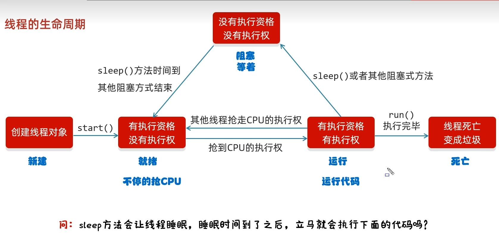

# 多线程

#### 基础概念

**进程（Process）**：操作系统资源分配的最小单位（独立内存空间）。

**线程（Thread）**：CPU 调度和执行的最小单位（共享进程资源），也是进程的实际运作单位。

**并发（Concurrency）**：在**一段时间内**多个任务交替执行。

**并行（Parallelism）**：多个任务**同时执行**（依赖多核 CPU）。


#### 创建线程

**继承Thread类**

```java
class MyThread extends Thread {
    private String threadName;
    
    public MyThread(String name) {
        this.threadName = name;
    }
    
    @Override
    public void run() {
        for (int i = 0; i < 5; i++) {
            System.out.println(threadName + " - " + i);
            try {
                Thread.sleep(1000);
            } catch (InterruptedException e) {
                e.printStackTrace();
            }
        }
    }
}

// 使用
MyThread t1 = new MyThread("Thread-1");
MyThread t2 = new MyThread("Thread-2");
t1.start();
t2.start();
```

**实现Runnable接口**

```java
class MyRunnable implements Runnable {
    private String threadName;
    
    public MyRunnable(String name) {
        this.threadName = name;
    }
    
    @Override
    public void run() {
        for (int i = 0; i < 5; i++) {
            System.out.println(threadName + " - " + i);
            try {
                Thread.sleep(1000);
            } catch (InterruptedException e) {
                e.printStackTrace();
            }
        }
    }
}

// 使用
Thread t1 = new Thread(new MyRunnable("Thread-1"));
Thread t2 = new Thread(new MyRunnable("Thread-2"));
t1.start();
t2.start();

// Lambda表达式方式
Thread t3 = new Thread(() -> {
    System.out.println("Lambda线程运行中...");
});
t3.start();
```

**实现Callable接口（可以拿到运行结果）**

```java
import java.util.concurrent.*;

class MyCallable implements Callable<String> {
    private String taskName;
    
    public MyCallable(String name) {
        this.taskName = name;
    }
    
    
    // 相当于run()的补充，可以返回数据。
    @Override
    public String call() throws Exception {
        Thread.sleep(2000);
        return "任务 " + taskName + " 完成";
    }
}

// 使用
ExecutorService executor = Executors.newFixedThreadPool(2);
Future<String> future1 = executor.submit(new MyCallable("Task-1")); 	
Future<String> future2 = executor.submit(new MyCallable("Task-2"));

try {
    String result1 = future1.get(); // 阻塞等待结果
    String result2 = future2.get();
    System.out.println(result1);
    System.out.println(result2);
} catch (InterruptedException | ExecutionException e) {
    e.printStackTrace();
} finally {
    executor.shutdown();
}
```


#### 多线程常见的成员方法

`Thread` 类常用方法

| 方法                                 | 作用                                                         |
| ------------------------------------ | ------------------------------------------------------------ |
| `start()`                            | 启动线程，进入就绪状态，不能重复调用。                       |
| `run()`                              | 线程执行体（用户逻辑），不能直接调用来启动线程。             |
| `sleep(long millis)`                 | 当前线程休眠指定时间，不释放锁。                             |
| `yield()`  `出让线程\礼让线程`       | 让出 CPU 执行权，进入就绪状态（可能立即又被调度回来）<br />会让多线线程执行尽可能均匀。 |
| `join()`  `插入线程`                 | 等待该线程执行完成后，调用方线程才继续执行。                 |
| `setDaemon(true)`   `守护线程`       | 将线程设置为守护线程（JVM 不会等待守护线程结束）<br />(其他线程执行完毕，守护线程也会陆续停止，并不会执行完)。 |
| `interrupt()`                        | 中断线程（设置中断标志，不会立刻停止线程）。                 |
| `isInterrupted()`                    | 判断线程是否被中断（不清除中断状态）。                       |
| `interrupted()`                      | 判断是否被中断（**静态方法**，会清除中断状态）。             |
| `setName(String name)` / `getName()` | 设置/获取线程名。                                            |
| `getId()`                            | 获取线程 ID（唯一）。                                        |
| `getPriority()` / `setPriority(int)` | 获取/设置线程优先级（1~10，默认 5）。                        |
| `getState()`                         | 获取线程状态（`Thread.State`）。                             |
| `currentThread()`                    | 获取当前正在执行的线程对象。                                 |


`Object` 类的线程通信方法（和锁相关）

| 方法                 | 作用                                                         |
| -------------------- | ------------------------------------------------------------ |
| `wait()`             | 让当前线程进入等待状态，并释放锁，必须在同步代码块/方法中使用。 |
| `wait(long timeout)` | 等待指定时间，超时后自动唤醒。                               |
| `notify()`           | 唤醒等待队列中的一个线程。                                   |
| `notifyAll()`        | 唤醒等待队列中的所有线程。                                   |


`ThreadLocal` 常用方法（线程本地变量）

| 方法           | 作用                                   |
| -------------- | -------------------------------------- |
| `get()`        | 获取当前线程的局部变量副本。           |
| `set(T value)` | 设置当前线程的局部变量值。             |
| `remove()`     | 移除当前线程的局部变量，避免内存泄漏。 |


`ThreadGroup` 相关

| 方法            | 作用                     |
| --------------- | ------------------------ |
| `activeCount()` | 获取线程组中活跃线程数。 |
| `list()`        | 列出线程组中的线程信息。 |


JUC `ThreadPoolExecutor` 常用方法

| 方法                        | 作用                                     |
| --------------------------- | ---------------------------------------- |
| `execute(Runnable command)` | 提交任务（无返回值）。                   |
| `submit(Callable<T> task)`  | 提交任务（有返回值）。                   |
| `shutdown()`                | 平滑关闭线程池，执行完已提交任务后关闭。 |
| `shutdownNow()`             | 立即停止线程池，返回未执行的任务列表。   |
| `getActiveCount()`          | 获取线程池中正在执行任务的线程数。       |
| `getQueue()`                | 获取等待队列中的任务。                   |


#### 线程的生命周期

在 Java 中，线程的生命周期由 **`Thread.State` 枚举类**表示，一共有 **6 种状态**：

**1.NEW（新建）**
线程对象被创建，但还没有调用 `start()` 方法。

```java
Thread t = new Thread(() -> {
    System.out.println("Hello Thread");
});
System.out.println(t.getState()); // NEW
```


**2.RUNNABLE（就绪/可运行）**

调用 `start()` 后进入该状态，等待 CPU 调度。

注意：**就绪状态不代表一定在运行**，只表示有资格被调度。

```java
t.start();
System.out.println(t.getState()); // RUNNABLE
```


**3.RUNNING（运行）**

实际上 Java **没有单独的 RUNNING 状态**，在 `Thread.State` 中它被包含在 **RUNNABLE（就绪/可运行）**。

一旦 CPU 调度该线程，它就处于运行状态

注意：线程只能从 RUNNABLE（就绪/可运行） → RUNNING（运行），由 CPU 决定。


**4.BLOCKED（阻塞）**

线程在等待 **获取某个对象锁** 时进入此状态。

特点：**没有超时机制，必须等到锁释放。**

```java
synchronized(obj) {  // 一个线程已经持有 obj 锁
    // 其他线程进入时会进入 BLOCKED
}
```


**5.WAITING（无限期等待）**

线程进入等待状态，**必须被其他线程显式唤醒**（`notify()` / `notifyAll()`）。

不会自动返回，就像“沉睡”一样。

```java
synchronized(obj) {
    obj.wait(); // WAITING
}
```


**6.TIMED_WAITING（限时等待）**

和 WAITING 类似，但可以在 **超时后自动返回**。

常见方法：`sleep(long millis)`、`join(long millis)`、`wait(long millis)`、`parkNanos()` / `parkUntil()`（JUC 里的 LockSupport）

```java
Thread.sleep(1000); // TIMED_WAITING
```


**7.TERMINATED（终止）**

线程执行完 `run()` 方法后，进入终止状态。

```java
t.join(); 
System.out.println(t.getState()); // TERMINATED
```


**流程图**




**面试常考点**

**NEW 和 RUNNABLE 的区别？**

- NEW：对象创建还未 start()
- RUNNABLE：调用了 start()，进入就绪队列等待 CPU 调度

**WAITING 和 TIMED_WAITING 区别？**

- WAITING：无限期等待，必须 notify/notifyAll 唤醒
- TIMED_WAITING：有超时时间，到期自动恢复 RUNNABLE

**BLOCKED 和 WAITING 区别？**

- BLOCKED：等待 **获取锁**
- WAITING：等待 **被唤醒（notify/notifyAll）**


#### 线程安全


# JUC 并发编程