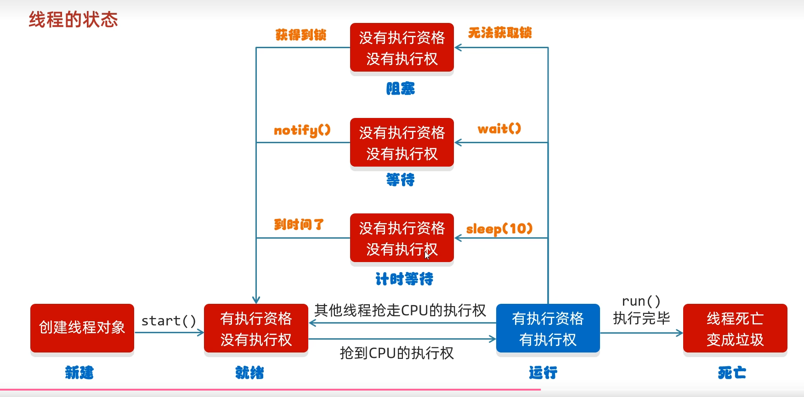

# 并发编程

## 多线程

#### 基础概念

**进程（Process）**：操作系统资源分配的最小单位（独立内存空间）。

**线程（Thread）**：CPU 调度和执行的最小单位（共享进程资源），也是进程的实际运作单位。

**并发（Concurrency）**：在**一段时间内**多个任务交替执行。

**并行（Parallelism）**：多个任务**同时执行**（依赖多核 CPU）。


#### 创建线程

**继承Thread类**

```java
class MyThread extends Thread {
    private String threadName;
    
    public MyThread(String name) {
        this.threadName = name;
    }
    
    @Override
    public void run() {
        for (int i = 0; i < 5; i++) {
            System.out.println(threadName + " - " + i);
            try {
                Thread.sleep(1000);
            } catch (InterruptedException e) {
                e.printStackTrace();
            }
        }
    }
}

// 使用
MyThread t1 = new MyThread("Thread-1");
MyThread t2 = new MyThread("Thread-2");
t1.start();
t2.start();
```

**实现Runnable接口**

```java
class MyRunnable implements Runnable {
    private String threadName;
    
    public MyRunnable(String name) {
        this.threadName = name;
    }
    
    @Override
    public void run() {
        for (int i = 0; i < 5; i++) {
            System.out.println(threadName + " - " + i);
            try {
                Thread.sleep(1000);
            } catch (InterruptedException e) {
                e.printStackTrace();
            }
        }
    }
}

// 使用
Thread t1 = new Thread(new MyRunnable("Thread-1"));
Thread t2 = new Thread(new MyRunnable("Thread-2"));
t1.start();
t2.start();

// Lambda表达式方式
Thread t3 = new Thread(() -> {
    System.out.println("Lambda线程运行中...");
});
t3.start();
```

**实现Callable接口（可以拿到运行结果）**

```java
import java.util.concurrent.*;

class MyCallable implements Callable<String> {
    private String taskName;
    
    public MyCallable(String name) {
        this.taskName = name;
    }
    
    
    // 相当于run()的补充，可以返回数据。
    @Override
    public String call() throws Exception {
        Thread.sleep(2000);
        return "任务 " + taskName + " 完成";
    }
}

// 使用
ExecutorService executor = Executors.newFixedThreadPool(2);
Future<String> future1 = executor.submit(new MyCallable("Task-1")); 	
Future<String> future2 = executor.submit(new MyCallable("Task-2"));

try {
    String result1 = future1.get(); // 阻塞等待结果
    String result2 = future2.get();
    System.out.println(result1);
    System.out.println(result2);
} catch (InterruptedException | ExecutionException e) {
    e.printStackTrace();
} finally {
    executor.shutdown();
}
```


#### 多线程常见的成员方法

`Thread` 类常用方法

| 方法                                 | 作用                                                         |
| ------------------------------------ | ------------------------------------------------------------ |
| `start()`                            | 启动线程，进入就绪状态，不能重复调用。                       |
| `run()`                              | 线程执行体（用户逻辑），不能直接调用来启动线程。             |
| `sleep(long millis)`                 | 当前线程休眠指定时间，不释放锁。                             |
| `yield()`  `出让线程\礼让线程`       | 让出 CPU 执行权，进入就绪状态（可能立即又被调度回来）<br />会让多线线程执行尽可能均匀。 |
| `join()`  `插入线程`                 | 等待该线程执行完成后，调用方线程才继续执行。                 |
| `setDaemon(true)`   `守护线程`       | 将线程设置为守护线程（JVM 不会等待守护线程结束）<br />(其他线程执行完毕，守护线程也会陆续停止，并不会执行完)。 |
| `interrupt()`                        | 中断线程（设置中断标志，不会立刻停止线程）。                 |
| `isInterrupted()`                    | 判断线程是否被中断（不清除中断状态）。                       |
| `interrupted()`                      | 判断是否被中断（**静态方法**，会清除中断状态）。             |
| `setName(String name)` / `getName()` | 设置/获取线程名。                                            |
| `getId()`                            | 获取线程 ID（唯一）。                                        |
| `getPriority()` / `setPriority(int)` | 获取/设置线程优先级（1~10，默认 5）。                        |
| `getState()`                         | 获取线程状态（`Thread.State`）。                             |
| `currentThread()`                    | 获取当前正在执行的线程对象。                                 |


`Object` 类的线程通信方法（和锁相关）

| 方法                 | 作用                                                         |
| -------------------- | ------------------------------------------------------------ |
| `wait()`             | 让当前线程进入等待状态，并释放锁，必须在同步代码块/方法中使用。 |
| `wait(long timeout)` | 等待指定时间，超时后自动唤醒。                               |
| `notify()`           | 唤醒等待队列中的一个线程。                                   |
| `notifyAll()`        | 唤醒等待队列中的所有线程。                                   |


`ThreadLocal` 常用方法（线程本地变量）

| 方法           | 作用                                   |
| -------------- | -------------------------------------- |
| `get()`        | 获取当前线程的局部变量副本。           |
| `set(T value)` | 设置当前线程的局部变量值。             |
| `remove()`     | 移除当前线程的局部变量，避免内存泄漏。 |


`ThreadGroup` 相关

| 方法            | 作用                     |
| --------------- | ------------------------ |
| `activeCount()` | 获取线程组中活跃线程数。 |
| `list()`        | 列出线程组中的线程信息。 |


JUC `ThreadPoolExecutor` 常用方法

| 方法                        | 作用                                     |
| --------------------------- | ---------------------------------------- |
| `execute(Runnable command)` | 提交任务（无返回值）。                   |
| `submit(Callable<T> task)`  | 提交任务（有返回值）。                   |
| `shutdown()`                | 平滑关闭线程池，执行完已提交任务后关闭。 |
| `shutdownNow()`             | 立即停止线程池，返回未执行的任务列表。   |
| `getActiveCount()`          | 获取线程池中正在执行任务的线程数。       |
| `getQueue()`                | 获取等待队列中的任务。                   |


#### 线程的生命周期

在 Java 中，线程的生命周期由 **`Thread.State` 枚举类**表示，一共有 **6 种状态**：

**1.NEW（新建）**
线程对象被创建，但还没有调用 `start()` 方法。

```java
Thread t = new Thread(() -> {
    System.out.println("Hello Thread");
});
System.out.println(t.getState()); // NEW
```


**2.RUNNABLE（就绪/可运行）**

调用 `start()` 后进入该状态，等待 CPU 调度。

注意：**就绪状态不代表一定在运行**，只表示有资格被调度。

```java
t.start();
System.out.println(t.getState()); // RUNNABLE
```


**3.RUNNING（运行）**

实际上 Java **没有单独的 RUNNING 状态**，在 `Thread.State` 中它被包含在 **RUNNABLE（就绪/可运行）**。

一旦 CPU 调度该线程，它就处于运行状态

注意：线程只能从 RUNNABLE（就绪/可运行） → RUNNING（运行），由 CPU 决定。


**4.BLOCKED（阻塞）**

线程在等待 **获取某个对象锁** 时进入此状态。

特点：**没有超时机制，必须等到锁释放。**

```java
synchronized(obj) {  // 一个线程已经持有 obj 锁
    // 其他线程进入时会进入 BLOCKED
}
```


**5.WAITING（无限期等待）**

线程进入等待状态，**必须被其他线程显式唤醒**（`notify()` / `notifyAll()`）。

不会自动返回，就像“沉睡”一样。

```java
synchronized(obj) {
    obj.wait(); // WAITING
}
```


**6.TIMED_WAITING（限时等待）**

和 WAITING 类似，但可以在 **超时后自动返回**。

常见方法：`sleep(long millis)`、`join(long millis)`、`wait(long millis)`、`parkNanos()` / `parkUntil()`（JUC 里的 LockSupport）

```java
Thread.sleep(1000); // TIMED_WAITING
```


**7.TERMINATED（终止）**

线程执行完 `run()` 方法后，进入终止状态。

```java
t.join(); 
System.out.println(t.getState()); // TERMINATED
```


**流程图**




**面试常考点**

**NEW 和 RUNNABLE 的区别？**

- NEW：对象创建还未 start()
- RUNNABLE：调用了 start()，进入就绪队列等待 CPU 调度

**WAITING 和 TIMED_WAITING 区别？**

- WAITING：无限期等待，必须 notify/notifyAll 唤醒
- TIMED_WAITING：有超时时间，到期自动恢复 RUNNABLE

**BLOCKED 和 WAITING 区别？**

- BLOCKED：等待 **获取锁**
- WAITING：等待 **被唤醒（notify/notifyAll）**


#### **synchronized**

`synchronized` 提供互斥锁机制，确保同一时刻只有一个线程能够访问被保护的代码块或方法。

```java
public class SynchronizedMethod {
    private int count = 0;
    private final Object lock = new Object();
    
    // 同步方法 锁的是当前对象实例(this)
    public synchronized void increment() {
        count++;
    }
    
    // 同步静态方法 锁的是类对象(SynchronizedStaticMethod.class) 这个是唯一的
    public static synchronized void increment() {
        count++;
    }
    
    // 同步代码块
    public void decrement() {
        // 使用this作为锁
        synchronized (this) {
            count++;
        }
        
        // 使用自定义对象作为锁
        synchronized (lock) {
            count--;
        }
        
        // 使用类对象作为锁
        synchronized (SynchronizedBlock.class) {
            // 静态操作
        }
    }

}
```


#### lock 锁

Java中的Lock锁是比`synchronized`更灵活的同步机制，提供了更多的控制选项。

```java
// 非公平锁
private static Lock lock = new ReentrantLock(); // 默认非公平锁
// 公平锁
private static Lock lock = new ReentrantLock(true); 
```

`ReentrantLock`默认是**非公平锁**

当一个线程释放锁后，正在等待的线程中**任何一个**都可能获得锁

但由于线程调度和系统实现，往往是**刚释放锁的线程更容易再次获得锁**

```java
public class MyLock extends Thread {
    // 仓库剩余票数
    private static int ticket = 100;

    // 使用 ReentrantLock 替代 synchronized
    private static Lock lock = new ReentrantLock();

    public MyLock(String name,int level){
        super(name); // 设置线程名称
        super.setPriority(level); // 设置线程优先级
    }

    public static void main(String[] args) {
        new MyLock("小明",1).start();
        new MyLock("小红",1).start();
        new MyLock("小绿",1).start();
    }


    @Override
    public void run() {
        while(true){
            lock.lock(); // 上锁
            try {
                Thread.sleep(10);
                if(ticket>0){
                    Thread currentThread =  Thread.currentThread();
                    System.out.println(currentThread.getName()+":"+ticket--+"张票");
                }else{
                    break;
                }
            } catch (InterruptedException e) {
                throw new RuntimeException(e);
            }finally {
                lock.unlock(); // 确保解锁操作一定会执行
            }

        }
    }
}
```


#### **死锁**

```java
public class DeadlockAvoidance {
    private final Object lock1 = new Object();
    private final Object lock2 = new Object();
    
    // ❌ 可能导致死锁
    public void method1() {
        synchronized (lock1) {
            synchronized (lock2) {
                // 业务逻辑
            }
        }
    }
    
    public void method2() {
        synchronized (lock2) {
            synchronized (lock1) {
                // 业务逻辑
            }
        }
    }
    
    // ✅ 正确做法：统一锁的获取顺序
    public void safeMethod1() {
        synchronized (lock1) {
            synchronized (lock2) {
                // 业务逻辑
            }
        }
    }
    
    public void safeMethod2() {
        synchronized (lock1) { // 保持相同顺序
            synchronized (lock2) {
                // 业务逻辑
            }
        }
    }
}
```


**多线程购票程序**

```java
/**
 * 多线程买票程序
 */
public class MyThread extends Thread{

    // 仓库剩余票数
    private static int ticket = 100;

    public MyThread(String name,int level){
        super(name); // 设置线程名称
        super.setPriority(level); // 设置线程优先级
    }

    public static void main(String[] args) {
        new MyThread("小明",1).start();
        new MyThread("小红",1).start();
        new MyThread("小绿",1).start();
    }


    @Override
    public void run() {
        Thread currentThread =  Thread.currentThread();
        while(ticket>0){
            // 同步代码块 synchronized 传入的锁需要是唯一的
            synchronized (MyThread.class) {
                if(ticket>0){
                    System.out.println(currentThread.getName()+":"+ticket--+"张票");
                }
            }
        }
    }
}
```


**synchronized的特点：**

- 互斥性：同一时刻只有一个线程能够执行
- 可见性：修改对其他线程立即可见
- 可重入：同一线程可以多次获取同一个锁
- 原子性：被保护的代码块作为一个整体执行

**使用建议：**

1. 尽量缩小同步范围，提高并发性能
2. 避免在锁内调用其他对象的方法，防止死锁
3. 考虑使用更高级的并发工具类（如ReentrantLock、CountDownLatch等）
4. 注意锁的粒度，平衡安全性和性能


#### 等待唤醒机制

这些方法定义在`Object`类中，必须在同步代码块或同步方法中使用：

- `wait()` - 让当前线程等待，释放锁
- `notify()` - 唤醒一个等待的线程
- `notifyAll()` - 唤醒所有等待的线程

**简单的等待唤醒示例**

```java
public class WaitNotifyBasic {
    private static final Object lock = new Object();
    private static boolean condition = false;
    
    // 等待者
    static class Waiter extends Thread {
        @Override
        public void run() {
            synchronized (lock) {
                while (!condition) {
                    try {
                        System.out.println("Waiter: 条件不满足，开始等待...");
                        lock.wait(); // 等待并释放锁
                    } catch (InterruptedException e) {
                        Thread.currentThread().interrupt();
                        return;
                    }
                }
                System.out.println("Waiter: 条件满足，继续执行！");
            }
        }
    }
    
    // 通知者
    static class Notifier extends Thread {
        @Override
        public void run() {
            synchronized (lock) {
                System.out.println("Notifier: 设置条件为true");
                condition = true;
                lock.notify(); // 唤醒等待的线程
                System.out.println("Notifier: 已发送通知");
            }
        }
    }
    
    public static void main(String[] args) throws InterruptedException {
        new Waiter().start();
        Thread.sleep(1000); // 确保等待者先运行
        new Notifier().start();
    }
}
```


#### 线程安全的三个问题：可见性、原子性、有序性

**1. 可见性（Visibility）**

**问题描述**

一个线程对共享变量的修改，其他线程能否立即看到。

**产生原因**

- CPU缓存：每个CPU核心都有自己的缓存
- JMM（Java内存模型）：线程有自己的工作内存

**问题示例**

```java
public class VisibilityExample {
    private boolean flag = false;
    
    // 线程1执行
    public void writer() {
        flag = true;  // 可能只写入了线程1的工作内存
    }
    
    // 线程2执行
    public void reader() {
        while (!flag) {  // 可能一直读取的是线程2工作内存中的旧值
            // 可能死循环
        }
    }
}
```

**解决方案**

- `volatile` 关键字
- `synchronized` 块
- `Lock` 接口
- `Atomic` 类

```java
private volatile boolean flag = false;  // 保证可见性
```


**2. 原子性（Atomicity）**

**问题描述**

一个或多个操作要么全部执行完成，要么全部不执行，中间不能被打断。

**产生原因**

- 操作被分解为多个机器指令
- 线程切换发生在操作执行过程中

**问题示例**

```java
public class AtomicityExample {
    private int count = 0;
    
    // 非原子操作
    public void increment() {
        count++;  // 实际分为三步：读取、计算、写入
        // 1. temp = count;     (读取)
        // 2. temp = temp + 1;  (计算)  
        // 3. count = temp;     (写入)
    }
}

// 两个线程同时执行可能出现：
// 线程1读取count=0，线程2也读取count=0
// 线程1计算1，线程2计算1
// 线程1写入1，线程2写入1
// 结果：count=1（应该是2）
```

**解决方案**

```java
// 方案1：synchronized
public synchronized void increment() {
    count++;
}

// 方案2：AtomicInteger
private AtomicInteger count = new AtomicInteger(0);
public void increment() {
    count.incrementAndGet();
}

// 方案3：Lock
private final ReentrantLock lock = new ReentrantLock();
public void increment() {
    lock.lock();
    try {
        count++;
    } finally {
        lock.unlock();
    }
}
```


**3. 有序性（Ordering）**

**问题描述**

程序执行的顺序按照代码的先后顺序执行。

**产生原因**

- **编译器优化**：重排指令顺序
- **CPU指令重排**：CPU为了`提高性能` `重排` `执行` 顺序

**问题示例**

```java
public class OrderingExample {
    private boolean ready = false;
    private int data = 0;
    
    // 线程1执行
    public void writer() {
        data = 42;        // 操作1
        ready = true;     // 操作2
        // 可能被重排为：ready = true; data = 42;
    }
    
    // 线程2执行
    public void reader() {
        if (ready) {          // 如果发生重排，ready可能先为true
            System.out.println(data);  // 但data可能还是0
        }
    }
}
```

**解决方案**

```java
// 方案1：volatile（禁止重排序）
private volatile boolean ready = false;

// 方案2：synchronized
public synchronized void writer() {
    data = 42;
    ready = true;
}

// 方案3：happens-before规则
// 使用CountDownLatch、CyclicBarrier等同步工具
```


**综合解决方案**

**1. volatile**

```java
// 解决可见性和有序性，但不能保证原子性
private volatile boolean flag = false;
```

**2. synchronized**

```java
// 同时解决三个问题
public synchronized void method() {
    // 代码块
}
```

**3. Atomic类**

```java
// 解决原子性和可见性
private AtomicInteger count = new AtomicInteger(0);
```

**4. Lock接口**

```java
private final ReentrantLock lock = new ReentrantLock();

public void method() {
    lock.lock();
    try {
        // 同时解决三个问题
    } finally {
        lock.unlock();
    }
}
```

**总结对比**

| 解决方案      | 可见性 | 原子性 | 有序性 | 性能 | 适用场景         |
| ------------- | ------ | ------ | ------ | ---- | ---------------- |
| volatile      | ✓      | ✗      | ✓      | 高   | 标志位、状态变量 |
| synchronized  | ✓      | ✓      | ✓      | 中   | 通用同步         |
| ReentrantLock | ✓      | ✓      | ✓      | 中   | 需要高级功能时   |
| Atomic类      | ✓      | ✓      | 部分   | 高   | 简单数值操作     |

理解这三个问题是掌握Java并发编程的基础，实际开发中需要根据具体场景选择合适的解决方案。