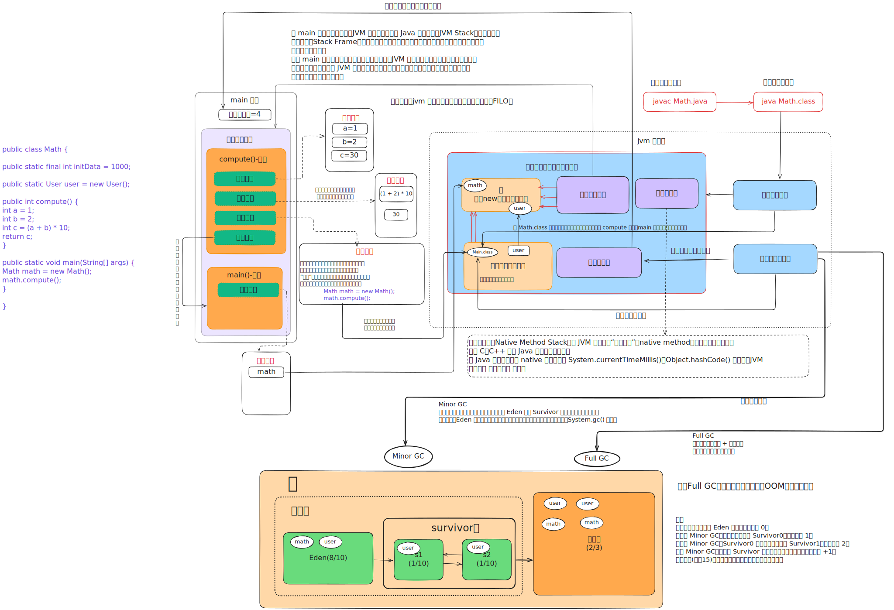

# JVM 入门

## jvm 介绍

`JVM` 是 `Java Virtual Machine` 的缩写，它是一个虚构出来的计算机，一种规范。通过在实际的计算机上仿真模拟各类计算机功能实现···

好，其实抛开这么专业的句子不说，就知道 JVM 其实就类似于一台小电脑运行在 `windows` 或者 `linux` 这些操作系统环境下即可。它直接和操作系统进行交互，与硬件不直接交互，而操作系统可以帮我们完成和硬件进行交互的工作。

## jvm 模型图




## java 文件运行过程

比如我们现在写了一个 `HelloWorld.java` 好了，那这个 `HelloWorld.java` 抛开所有东西不谈，那是不是就类似于一个文本文件，只是这个文本文件它写的都是英文，而且有一定的缩进而已。

那我们的 `JVM` 是不认识文本文件的，所以它需要一个 `编译` ，让其成为一个它会读二进制文件的 `HelloWorld.class`


### 1.类加载器

如果 **JVM** 想要执行这个 **.class** 文件，我们需要将其装进一个 **类加载器** 中，它就像一个搬运工一样，会把所有的 **.class** 文件全部搬进 JVM 里面来。


### 2.方法区

**方法区** 是用于存放类似于元数据信息方面的数据的，比如类信息，常量，静态变量，编译后代码···等

类加载器将 .class 文件搬过来就是先丢到这一块上


### 3.堆

**堆** 主要放了一些存储的数据，比如对象实例，数组···等，它和方法区都同属于 **线程共享区域** 。也就是说它们都是 **线程不安全** 的


### 4.栈

**栈** 这是我们的代码运行空间。我们编写的每一个方法都会放到 **栈** 里面运行。


### 5.程序计数器

主要就是完成一个加载工作，类似于一个指针一样的，指向下一行我们需要执行的代码。和栈一样，都是 **线程独享** 的，就是说每一个线程都会有自己对应的一块区域而不会存在并发和多线程的问题。


## JVM 类加载过程

加载 → 链接（验证、准备、解析） → 初始化

### 1. **加载（Loading）**

- 通过类加载器把 `.class` 字节码文件读入内存。
- 在方法区（JDK8 之后是元空间 Metaspace）创建 `Class` 对象。
- **目的**：把字节码转换为 JVM 能识别的数据结构。

------

### 2. **链接（Linking）**

把类的二进制数据合并到 JVM 运行时环境中，分 3 步：

1. **验证（Verification）**

   - 确保字节码文件格式正确、安全。
   - 例如：栈帧匹配、方法调用是否合法。

2. **准备（Preparation）**

   - 给 **静态变量（static）** 分配内存，并赋 **零值**。
   - 注意：不会赋程序员写的初始值。

   ```
   static int a = 10;
   // 准备阶段：a = 0
   ```

3. **解析（Resolution）**

   - 把常量池里的 **符号引用**（字符串形式，如 `"java/lang/String"`）转为 **直接引用**（内存地址）。
   - 例如：（符号引用比如我现在 `import java.util.ArrayList` 这就算符号引用，直接引用就是指针或者对象地址，注意引用对象一定是在内存进行）。

------

### 3. **初始化（Initialization）**

- 执行类的 `<clinit>` 方法：

  - 给静态变量赋编写时的初始值。
  - 执行静态代码块。

- 初始化只会执行一次（类首次主动使用时）。

  ```
  static int a = 10;   // 赋值在这里生效
  static { b = 20; }  // 静态代码块在这里运行
  ```

------

### 🔹 总结口诀

```
加载字节码 → 链接（验证安全、准备零值、解析地址）
→ 初始化（执行<clinit>：静态变量赋值 + 静态代码块）
```
