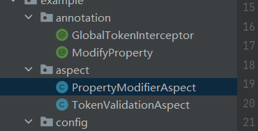

## AOP 自定义注解

### 基础自定义注解

```java
// 定义注解
@Target({ElementType.METHOD,ElementType.TYPE}) // 可以用在方法上，也可以在类上使用
@Retention(RetentionPolicy.RUNTIME) // 运行时保留
public @interface MyCustomAnnotation {
    String value() default ""; // 注解属性
    boolean enabled() default true;
}

// 使用注解
@RestController
public class MyController {
    
    @MyCustomAnnotation(value = "示例", enabled = true)
    @GetMapping("/test")
    public String test() {
        return "Hello World";
    }
}
```

###  处理自定义注解的aop切面

```java
@Aspect
@Component
public class MyCustomAnnotationAspect {
    
    // 定义切点：所有带有@MyCustomAnnotation注解的方法
    @Pointcut("@annotation(com.example.MyCustomAnnotation)")
    public void myCustomAnnotationPointcut() {}
    
    // 环绕通知
    @Around("myCustomAnnotationPointcut()")
    // 这里可以直接使用把切点放在通知里面，这样就可以不用额外定义切点了
    public Object aroundAdvice(ProceedingJoinPoint joinPoint) throws Throwable {
        // 获取方法上的注解
        // 获取连接点(JoinPoint)的签名信息
        MethodSignature signature = (MethodSignature) joinPoint.getSignature();
        // 获取被拦截的原始方法对象 包含信息：方法名、返回类型、参数类型、注解信息等
        Method method = signature.getMethod();
        // 从方法上获取特定类型的注解
        MyCustomAnnotation annotation = method.getAnnotation(MyCustomAnnotation.class);
        
        // 执行前逻辑
        System.out.println("Before method execution. Annotation value: " + annotation.value());
        
        // 执行原方法
        Object result = joinPoint.proceed();
        
        // 执行后逻辑
        System.out.println("After method execution");
        
        return result;
    }
}
```

### 自定义注解示例

```java
/* 日志记录注解 */
@Target(ElementType.METHOD)
@Retention(RetentionPolicy.RUNTIME) // 运行时保留
public @interface Loggable {
	//属性
    String operation() default "";  
    boolean logParameters() default true; //日志参数
    boolean logResult() default false;    //日志结果
}

// 切面处理
@Aspect
@Component
public class LoggingAspect {
    
    private final Logger logger = LoggerFactory.getLogger(this.getClass());
    
    // 将切点与通知定义在一起
    @Around("@annotation(com.example.Loggable)")//annotation执行在方法上
    public Object logMethod(ProceedingJoinPoint joinPoint) throws Throwable {
    	// 获取注解
        MethodSignature signature = (MethodSignature) joinPoint.getSignature();
        Loggable loggable = signature.getMethod().getAnnotation(Loggable.class);
        
        String methodName = signature.getDeclaringTypeName() + "." + signature.getName();
        String operation = loggable.operation().isEmpty() ? methodName : loggable.operation();
        
        if (loggable.logParameters()) {
            logger.info("{} - 参数: {}", operation, Arrays.toString(joinPoint.getArgs()));
        }
        
        long start = System.currentTimeMillis();
        Object result = joinPoint.proceed();
        long executionTime = System.currentTimeMillis() - start;
        
        if (loggable.logResult()) {
            logger.info("{} - 执行时间: {}ms - 结果: {}", operation, executionTime, result);
        } else {
            logger.info("{} - 执行时间: {}ms", operation, executionTime);
        }
        
        return result;
    }
}
```

```java
/* token鉴权 */

/**
 * @Target 作用在哪里 method:方法，type：类
 */
@Target({ElementType.METHOD,ElementType.TYPE})
@Retention(RetentionPolicy.RUNTIME)
public @interface GlobalTokenInterceptor {
}


/**
 * Aspect 声明当前类为一个切面类 （它告诉 Spring 这个类是一个切面类）
 * Component 见这个类用于 spring 管理
 */
@Aspect
@Component
public class TokenValidationAspect {

    @Resource
    private RedisUtils redisUtils;
    /**
     * Spring 如何管理 HttpServletRequest
     * 在 Spring 中，HttpServletRequest 并不像普通的 Spring Bean
     * 一样通过 @Autowired 注解直接注入。它是由 Servlet 容器（如 Tomcat、
     * Jetty 等）提供并管理的。每次 HTTP 请求进入时，Spring 会将当前请求的
     * HttpServletRequest 绑定到当前的线程中，以便后续处理。
     *
     * Web 环境中的请求作用域
     * Spring 在 web 环境下有一个称为 请求作用域（Request scope） 的概念，
     * 这意味着 HttpServletRequest 对象是与当前的 HTTP 请求关联的，
     * 并且每个请求都会有一个独立的 HttpServletRequest 实例。
     */
    private final HttpServletRequest request;

    // 使用构造器注入 HttpServletRequest
    public TokenValidationAspect(HttpServletRequest request) {
        this.request = request;
    }

    /**
     * @annotation注解方法
     * @within注解类
     * @return
     */
    @Before("@annotation(com.example.annotation.GlobalTokenInterceptor)||" +
            "@within(com.example.annotation.GlobalTokenInterceptor)")
    public void validateToken(){
        /*1、判断是否携带token*/
        String token = request.getHeader("authorization");
        if (token==null){
            throw  new CustomException(ExceptionCodeEnum.CODE_401);
        }

        TokenUserInfoDto tokenUserInfoDto = redisUtils.getTokenInfo(token);
        /*2、判断是否过时*/
        if(tokenUserInfoDto==null){
            throw new CustomException(ExceptionCodeEnum.CODE_402);
        }
    }
}
```

### aop实现跟新类里面的属性值



```java
/**
 * 修改类的属性值 自定义注解
 */
@Target(ElementType.METHOD)
@Retention(RetentionPolicy.RUNTIME)
public @interface ModifyProperty {
}
```


```java
/**
 * aop 属性修改器 自定义切面
 */
@Aspect
@Component
public class PropertyModifierAspect {

    @Resource
    private RedisUtils redisUtils;

    /*这种写法可以将modifyProperty传递给下面的方法参数里*/
    @Before("@annotation(com.example.annotation.ModifyProperty)")
    public void modifyProperty(JoinPoint joinPoint) throws Exception {

        Object target = joinPoint.getTarget();

        /*注意这里必须做异常处理，一定会报错*/
        try{
            // 使用反射修改属性
            // target.getClass() - 获取目标对象的 Class 对象
            //getDeclaredField("setSettingDto") - 根据字段名获取该类声明的字段（包括私有字段）
            Field field = target.getClass().getDeclaredField("sysSettingDto");
            field.setAccessible(true); //设置字段可访问

            // 获取redis跟新后的配置信息
            SysSettingDto sysSetting = redisUtils.getSysSetting();
            if (sysSetting != null) {
                // 更新字段值
                field.set(target, sysSetting);
            }

        }catch (Exception e){
            throw new CustomException(ExceptionCodeEnum.CODE_500.setMessage("属性修改失败"));
        }

    }
}
```

**server 层**

```java
@Slf4j
@Service
public class ChatMessageServiceImpl implements ChatMessageService {
    
    // 这个就是我需要更该的属性
	private SysSettingDto sysSettingDto;

	@ModifyProperty
    @Override
    public SysSettingDto fileConfig() {
        return sysSettingDto;
    }
}

```

## **AOP进阶**

### 暂未跟新