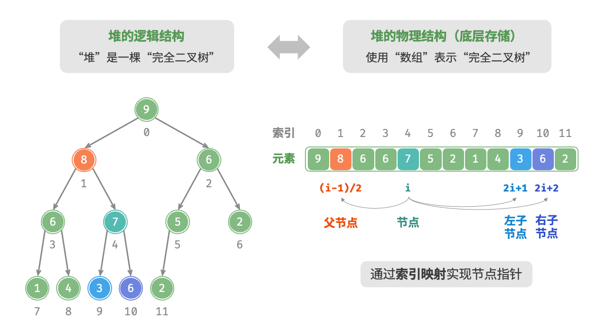

# 堆（Heap）

堆（heap）是一种满足特定性质的完全二叉树，核心分为小顶堆和大顶堆两类，也是实现优先队列的底层核心数据结构。

- 小顶堆（min heap）：任意节点的值 ≤ 其子节点的值，堆顶（根节点）为整个堆的最小值。
- 大顶堆（max heap）：任意节点的值 ≥ 其子节点的值，堆顶（根节点）为整个堆的最大值。


#### **堆的核心特性**

堆作为完全二叉树的特殊形式，具备以下关键特性：

1. 结构特性：最底层节点靠左填充，其他层节点完全填满，无空洞；
2. 节点定义：二叉树的根节点称为 “堆顶”，底层最右侧的节点称为 “堆底”；
3. 数值特性：大顶堆的堆顶是最大值，小顶堆的堆顶是最小值，且该特性递归适用于每个子树。

**堆的存储方式**

堆本质是完全二叉树，因此**最优存储方式是数组**（顺序存储）—— 完全二叉树的节点索引具备严格的数学映射关系，无需额外存储指针，空间效率更高。

给定数组中索引为 i 的节点（索引从 0 开始），其父子节点索引满足：

- 父节点索引：parent(i)=⌊(i−1)/2⌋（向下取整）；
- 左子节点索引：left(i)=2i+1；
- 右子节点索引：right(i)=2i+2。

如下图所示，给定索引 i ，其左子节点的索引为 2i+1 ，右子节点的索引为 2i+2 ，父节点的索引为 (i−1)/2（向下整除）。当索引越界时，表示空节点或节点不存在。




**堆的常用操作**

堆的操作围绕 “维持堆的性质” 展开，Java 中通过 `PriorityQueue`（优先队列）实现堆的功能，优先队列是抽象数据结构，堆是其底层实现，从使用角度可等价看待。

<p align="center">表 堆的操作效率</p>

|   方法名    |                     描述                     | 时间复杂度 |
| :---------: | :------------------------------------------: | :--------: |
|  `offer()`  |    元素入堆（推荐使用，失败时返回 false）    |  O(logn)   |
|  `poll()`   |       堆顶元素出堆（堆空时返回 null）        |  O(logn)   |
|  `peek()`   | 访问堆顶元素（大 / 小顶堆对应最大 / 最小值） |    O(1)    |
|  `size()`   |               获取堆的元素数量               |    O(1)    |
| `isEmpty()` |                判断堆是否为空                |    O(1)    |
|   `add()`   |          元素入堆（失败时抛出异常）          |  O(logn)   |
| `remove()`  |       移除指定元素（非堆顶操作效率低）       |    O(n)    |


#### 堆的实现原理

以下是手动实现大顶堆的完整代码，帮助理解堆的底层原理（Java 内置 `PriorityQueue` 已做优化，工程中优先使用内置类）。

```Java
/**
 * 手动实现大顶堆（底层原理）
 */
public class MaxHeap {
    private int[] heap; // 存储堆的数组
    private int size;   // 堆中元素数量
    private int capacity; // 堆的容量

    // 构造函数：初始化指定容量的堆
    public MaxHeap(int capacity) {
        this.capacity = capacity;
        this.size = 0;
        this.heap = new int[capacity];
    }

    // 构造函数：从数组构建堆
    public MaxHeap(int[] arr) {
        this.capacity = arr.length;
        this.size = arr.length;
        this.heap = arr.clone();
        // 从最后一个非叶节点开始堆化
        for (int i = (size - 2) / 2; i >= 0; i--) {
            siftDown(i);
        }
    }

    // 获取父节点索引
    private int parent(int i) {
        return (i - 1) / 2;
    }

    // 获取左子节点索引
    private int leftChild(int i) {
        return 2 * i + 1;
    }

    // 获取右子节点索引
    private int rightChild(int i) {
        return 2 * i + 2;
    }

    // 交换两个节点的值
    private void swap(int i, int j) {
        int temp = heap[i];
        heap[i] = heap[j];
        heap[j] = temp;
    }

    // 从底至顶堆化（入堆时使用）
    private void siftUp(int i) {
        // 当当前节点大于父节点时，交换并继续向上堆化
        while (i > 0 && heap[i] > heap[parent(i)]) {
            swap(i, parent(i));
            i = parent(i);
        }
    }

    // 从顶至底堆化（出堆时使用）
    private void siftDown(int i) {
        int maxIndex = i; // 初始化最大值索引为当前节点
        while (true) {
            int left = leftChild(i);
            int right = rightChild(i);

            // 比较左子节点
            if (left < size && heap[left] > heap[maxIndex]) {
                maxIndex = left;
            }

            // 比较右子节点
            if (right < size && heap[right] > heap[maxIndex]) {
                maxIndex = right;
            }

            // 如果最大值索引就是当前节点，堆化完成
            if (maxIndex == i) {
                break;
            }

            // 交换当前节点与最大值节点
            swap(i, maxIndex);
            i = maxIndex; // 继续向下堆化
        }
    }

    // 元素入堆
    public boolean offer(int val) {
        if (size == capacity) {
            return false; // 堆已满，入堆失败
        }
        heap[size] = val; // 将元素添加到堆底
        siftUp(size);     // 从底至顶堆化
        size++;           // 元素数量加1
        return true;
    }

    // 堆顶元素出堆
    public Integer poll() {
        if (isEmpty()) {
            return null; // 堆空，返回null
        }
        int top = heap[0]; // 保存堆顶元素
        heap[0] = heap[size - 1]; // 将堆底元素移到堆顶
        size--; // 元素数量减1
        siftDown(0); // 从顶至底堆化
        return top;
    }

    // 访问堆顶元素
    public Integer peek() {
        if (isEmpty()) {
            return null;
        }
        return heap[0];
    }

    // 获取堆的大小
    public int size() {
        return size;
    }

    // 判断堆是否为空
    public boolean isEmpty() {
        return size == 0;
    }

    // 清空堆
    public void clear() {
        size = 0;
    }

    // 测试手动实现的大顶堆
    public static void main(String[] args) {
        MaxHeap maxHeap = new MaxHeap(10);
        
        // 元素入堆
        maxHeap.offer(3);
        maxHeap.offer(1);
        maxHeap.offer(2);
        maxHeap.offer(5);
        maxHeap.offer(4);
        
        System.out.println("堆顶元素: " + maxHeap.peek()); // 输出 5
        System.out.println("堆大小: " + maxHeap.size());   // 输出 5
        
        // 堆顶出堆
        System.out.println("出堆序列:");
        while (!maxHeap.isEmpty()) {
            System.out.print(maxHeap.poll() + " "); // 输出 5 4 3 2 1
        }
        
        // 从数组构建堆
        int[] arr = {7, 1, 9, 3, 5};
        MaxHeap heapFromArr = new MaxHeap(arr);
        System.out.println("\n从数组构建的堆顶: " + heapFromArr.peek()); // 输出 9
    }
}
```


#### Java 实现堆（优先队列）

Java 的 `java.util.PriorityQueue` 是基于堆实现的优先队列，默认实现小顶堆，通过自定义 `Comparator` 可实现大顶堆。

```java
/* 初始化堆 */
// 初始化小顶堆
Queue<Integer> minHeap = new PriorityQueue<>();
// 初始化大顶堆（使用 lambda 表达式修改 Comparator 即可）
Queue<Integer> maxHeap = new PriorityQueue<>((a, b) -> b - a);

/* 元素入堆 */
maxHeap.offer(1);
maxHeap.offer(3);
maxHeap.offer(2);
maxHeap.offer(5);
maxHeap.offer(4);

/* 获取堆顶元素 */
int peek = maxHeap.peek(); // 5

/* 堆顶元素出堆 */
// 出堆元素会形成一个从大到小的序列
peek = maxHeap.poll(); // 5
peek = maxHeap.poll(); // 4
peek = maxHeap.poll(); // 3
peek = maxHeap.poll(); // 2
peek = maxHeap.poll(); // 1

/* 获取堆大小 */
int size = maxHeap.size();

/* 判断堆是否为空 */
boolean isEmpty = maxHeap.isEmpty();

/* 输入列表并建堆 */
minHeap = new PriorityQueue<>(Arrays.asList(1, 3, 2, 5, 4));
```


#### 堆的常见应用

**1.优先队列场景**

- 任务调度：高优先级任务（如紧急订单、系统告警）优先执行；
- 事件驱动系统：按事件时间戳先后处理事件；
- 线程池：核心线程池的任务队列可使用优先队列实现优先级执行。

**2.Top K 问题**

- 找最大的 K 个元素：用大小为 K 的小顶堆，遍历数组时保留前 K 大的元素，时间复杂度 O(nlogK)；
- 找最小的 K 个元素：用大小为 K 的大顶堆，时间复杂度 O(nlogK)；
- 典型场景：微博热搜（热度前 10）、商品销量榜（销量前 10）、考试成绩前 N 名。

**3.堆排序**

- 先构建堆，再逐个弹出堆顶元素，时间复杂度 O(nlogn)，空间复杂度可优化至 O(1)。

**4.数据流中位数**

- 用大顶堆存左半部分（较小值），小顶堆存右半部分（较大值），动态维护中位数，支持实时插入和查询。


#### 总结

1. Java 中通过 `PriorityQueue` 实现堆功能，默认是小顶堆，自定义 `Comparator` 可实现大顶堆；
2. 堆的核心操作（入堆 / 出堆）时间复杂度为 O(logn)，访问堆顶为 O(1)，批量建堆为 O(n)；
3. 工程中优先使用 Java 内置 `PriorityQueue`（已做性能优化），手动实现仅用于理解底层原理；
4. 堆的核心价值是高效维护极值，典型应用包括优先队列、Top K 问题、堆排序、数据流中位数等。
