# 树


## 二叉树

二叉树（binary tree）是一种非线性数据结构，代表“祖先”与“后代”之间的派生关系，体现了“一分为二”的分治逻辑。与链表类似，二叉树的基本单元是节点，每个节点包含值、左子节点引用和右子节点引用

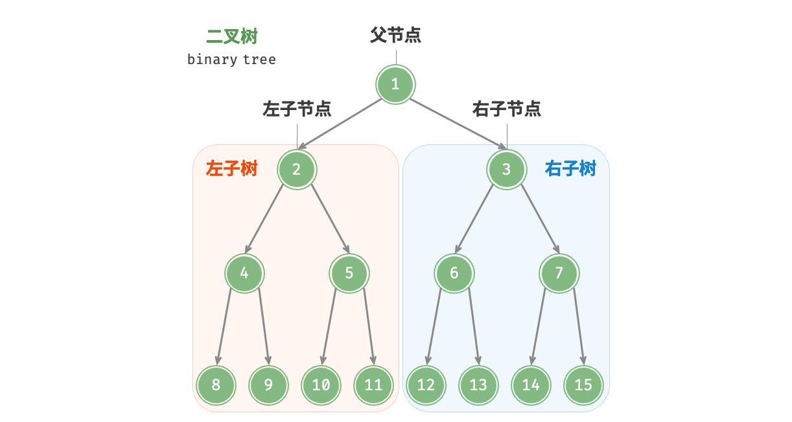


## 二叉树常见术语

- 根节点（root node）：位于二叉树顶层的节点，没有父节点。
- 叶节点（leaf node）：没有子节点的节点，其两个指针均指向 `None` 。
- 边（edge）：连接两个节点的线段，即节点引用（指针）。
- 节点所在的层（level）：从顶至底递增，根节点所在层为 1 。
- 节点的度（degree）：节点的子节点的数量。在二叉树中，度的取值范围是 0、1、2 。
- 二叉树的高度（height）：从根节点到最远叶节点所经过的边的数量。
- 节点的深度（depth）：从根节点到该节点所经过的边的数量。
- 节点的高度（height）：从距离该节点最远的叶节点到该节点所经过的边的数量。

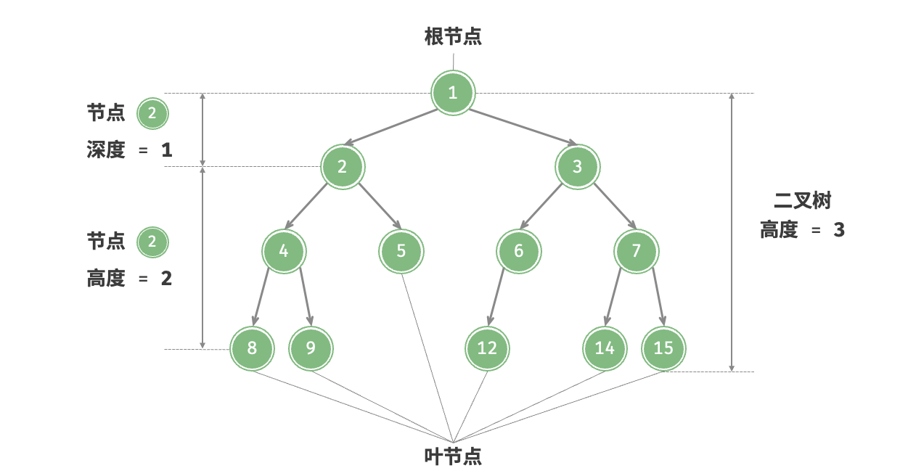


## 二叉树常见类型

####  完美二叉树

完美二叉树 (perfect binary tree) 所有层的节点都被完全填满，在完美二叉树中，叶节点的度为 $0$，其余所有节点的度都为 $2$；若树的高度为 $h$，则节点总数为 $2^{h+1} - 1$，呈现标准的指数级关系，反映了自然界中常见的细胞分裂现象。

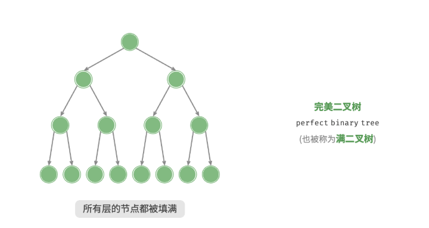


#### 完全二叉树

完全二叉树（complete binary tree）仅允许最底层的节点不完全填满，且最底层的节点必须从左至右依次连续填充。请注意，完美二叉树也是一棵完全二叉树。

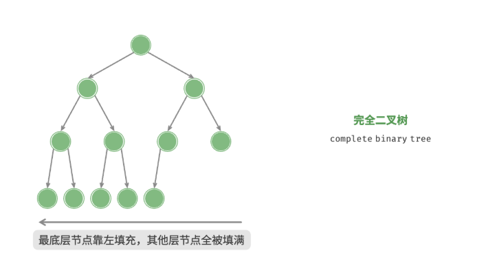


#### 完满二叉树

完满二叉树（full binary tree）除了叶节点之外，其余所有节点都有两个子节点。

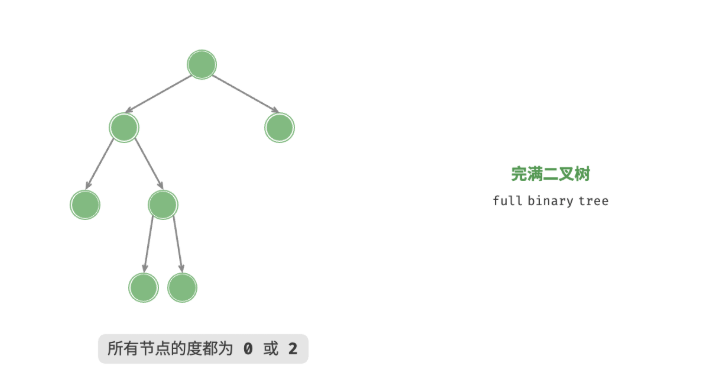


#### 平衡二叉树

平衡二叉树（balanced binary tree）中任意节点的左子树和右子树的高度之差的绝对值不超过 1 。

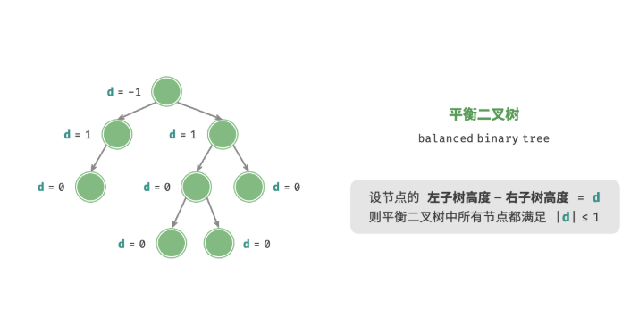


## 二叉树遍历

#### 深度优先遍历（DFS）

**前序遍历（Pre-order）**

- 访问顺序：根节点 → 左子树 → 右子树
- 应用：复制树结构、表达式求值的前缀表示

**中序遍历（In-order）**

- 访问顺序：左子树 → 根节点 → 右子树
- 应用：二叉搜索树的中序遍历可得到有序序列

**后序遍历（Post-order）**

- 访问顺序：左子树 → 右子树 → 根节点
- 应用：计算目录大小、删除树节点、表达式求值的后缀表示


**代码实现**

前序、中序和后序遍历都属于深度优先遍历（depth-first traversal），也称深度优先搜索（depth-first search, DFS），它体现了一种“先走到尽头，再回溯继续”的遍历方式。

```java
/* 前序遍历 */
void preOrder(TreeNode root) {
    if (root == null)
        return;
    // 访问优先级：根节点 -> 左子树 -> 右子树
    list.add(root.val);
    preOrder(root.left);
    preOrder(root.right);
}

/* 中序遍历 */
void inOrder(TreeNode root) {
    if (root == null)
        return;
    // 访问优先级：左子树 -> 根节点 -> 右子树
    inOrder(root.left);
    list.add(root.val);
    inOrder(root.right);
}

/* 后序遍历 */
void postOrder(TreeNode root) {
    if (root == null)
        return;
    // 访问优先级：左子树 -> 右子树 -> 根节点
    postOrder(root.left);
    postOrder(root.right);
    list.add(root.val);
}
```


#### 广度优先遍历（BFS）

**层序遍历（Level-order）**

- 访问顺序：按层级从上到下、从左到右逐层访问
- 实现方式：通常使用队列
- 应用：寻找最短路径、打印树的层级结构


**代码实现**

广度优先遍历通常借助“队列”来实现。队列遵循“先进先出”的规则，而广度优先遍历则遵循“逐层推进”的规则，两者背后的思想是一致的

```java
/* 层序遍历 */
List<Integer> levelOrder(TreeNode root) {
    // 初始化队列，加入根节点
    Queue<TreeNode> queue = new LinkedList<>();
    queue.add(root);
    // 初始化一个列表，用于保存遍历序列
    List<Integer> list = new ArrayList<>();
    while (!queue.isEmpty()) {
        TreeNode node = queue.poll(); // 队列出队
        list.add(node.val);           // 保存节点值
        if (node.left != null)
            queue.offer(node.left);   // 左子节点入队
        if (node.right != null)
            queue.offer(node.right);  // 右子节点入队
    }
    return list;
}
```


## 二叉搜索树

**二叉搜索树（binary search tree）满足以下条件。**

- 对于根节点，左子树中所有节点的值 根节点的值 右子树中所有节点的值。
- 任意节点的左、右子树也是二叉搜索树，即同样满足条件 `1.` 。


#### 二叉搜索树的操作

**查找节点**

给定目标节点值 `num` ，可以根据二叉搜索树的性质来查找。如图 7-17 所示，我们声明一个节点 `cur` ，从二叉树的根节点 `root` 出发，循环比较节点值 `cur.val` 和 `num` 之间的大小关系。

- 若 `cur.val < num` ，说明目标节点在 `cur` 的右子树中，因此执行 `cur = cur.right` 。
- 若 `cur.val > num` ，说明目标节点在 `cur` 的左子树中，因此执行 `cur = cur.left` 。
- 若 `cur.val = num` ，说明找到目标节点，跳出循环并返回该节点。

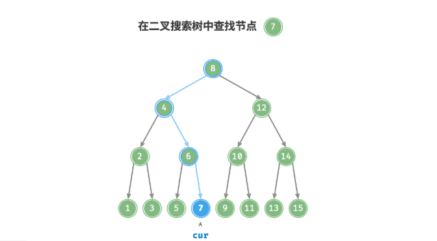

```java
/* 查找节点 */
TreeNode search(int num) {
    TreeNode cur = root;
    // 循环查找，越过叶节点后跳出
    while (cur != null) {
        // 目标节点在 cur 的右子树中
        if (cur.val < num)
            cur = cur.right;
        // 目标节点在 cur 的左子树中
        else if (cur.val > num)
            cur = cur.left;
        // 找到目标节点，跳出循环
        else
            break;
    }
    // 返回目标节点
    return cur;
}
```


**插入节点**

1. **查找插入位置**：与查找操作相似，从根节点出发，根据当前节点值和 `num` 的大小关系循环向下搜索，直到越过叶节点（遍历至 `None` ）时跳出循环。
2. **在该位置插入节点**：初始化节点 `num` ，将该节点置于 `None` 的位置。

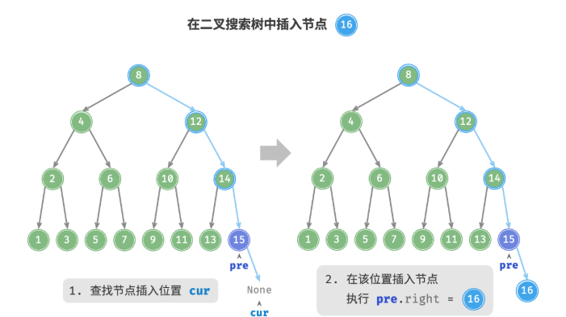

```java
/* 插入节点 */
void insert(int num) {
    // 若树为空，则初始化根节点
    if (root == null) {
        root = new TreeNode(num);
        return;
    }
    TreeNode cur = root, pre = null;
    // 循环查找，越过叶节点后跳出
    while (cur != null) {
        // 找到重复节点，直接返回
        if (cur.val == num)
            return;
        pre = cur;
        // 插入位置在 cur 的右子树中
        if (cur.val < num)
            cur = cur.right;
        // 插入位置在 cur 的左子树中
        else
            cur = cur.left;
    }
    // 插入节点
    TreeNode node = new TreeNode(num);
    if (pre.val < num)
        pre.right = node;
    else
        pre.left = node;
}
```


**删除节点**

先在二叉树中查找到目标节点，再将其删除。与插入节点类似，我们需要保证在删除操作完成后，二叉搜索树的“左子树 < 根节点 < 右子树”的性质仍然满足。因此，我们根据目标节点的子节点数量，分 0、1 和 2 三种情况，执行对应的删除节点操作。

- 当待删除节点的度为 0 时，表示该节点是叶节点，可以直接删除。
- 当待删除节点的度为 1 时，将待删除节点替换为其子节点即可。
- 当待删除节点的度为 时，我们无法直接删除它，而需要使用一个节点替换该节点。由于要保持二叉搜索树“左子树 根节点 右子树”的性质，因此这个节点可以是右子树的最小节点或左子树的最大节点。

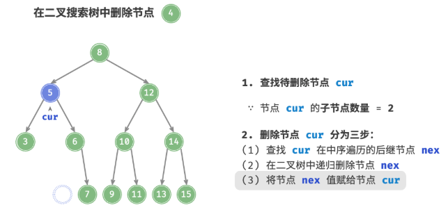

```java
/* 删除节点 */
void remove(int num) {
    // 若树为空，直接提前返回
    if (root == null)
        return;
    TreeNode cur = root, pre = null;
    // 循环查找，越过叶节点后跳出
    while (cur != null) {
        // 找到待删除节点，跳出循环
        if (cur.val == num)
            break;
        pre = cur;
        // 待删除节点在 cur 的右子树中
        if (cur.val < num)
            cur = cur.right;
        // 待删除节点在 cur 的左子树中
        else
            cur = cur.left;
    }
    // 若无待删除节点，则直接返回
    if (cur == null)
        return;
    // 子节点数量 = 0 or 1
    if (cur.left == null || cur.right == null) {
        // 当子节点数量 = 0 / 1 时， child = null / 该子节点
        TreeNode child = cur.left != null ? cur.left : cur.right;
        // 删除节点 cur
        if (cur != root) {
            if (pre.left == cur)
                pre.left = child;
            else
                pre.right = child;
        } else {
            // 若删除节点为根节点，则重新指定根节点
            root = child;
        }
    }
    // 子节点数量 = 2
    else {
        // 获取中序遍历中 cur 的下一个节点
        TreeNode tmp = cur.right;
        while (tmp.left != null) {
            tmp = tmp.left;
        }
        // 递归删除节点 tmp
        remove(tmp.val);
        // 用 tmp 覆盖 cur
        cur.val = tmp.val;
    }
}
```


#### 中序遍历有序

二叉树的中序遍历遵循 `左 ->根 -> 右` 的遍历顺序，而二叉搜索树满足 `左子节点 -> 根节点 ->` 右子节点”的大小关系。

这意味着在二叉搜索树中进行中序遍历时，总是会优先遍历下一个最小节点，从而得出一个重要性质：**二叉搜索树的中序遍历序列是升序的**。

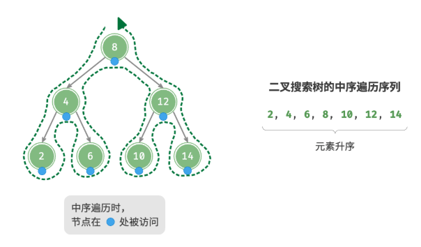


#### 二叉搜索树的效率

给定一组数据，我们考虑使用数组或二叉搜索树存储。二叉搜索树的各项操作的时间复杂度都是对数阶，具有稳定且高效的性能。只有在高频添加、低频查找删除数据的场景下，数组比二叉搜索树的效率更高。

|          | 无序数组 | 二叉搜索树 |
| :------- | :------- | :--------- |
| 查找元素 | $O(n)$   | $O(log n)$ |
| 插入元素 | $O(1)$   | $O(log n)$ |
| 删除元素 | $O(n)$   | $O(log n)$ |


在理想情况下，二叉搜索树是“平衡”的，这样就可以在$O(log n)$ 轮循环内查找任意节点。

然而，如果我们在二叉搜索树中不断地插入和删除节点，可能导致二叉树退化成链表，这时各种操作的时间复杂度也会退化为$O(n)$。

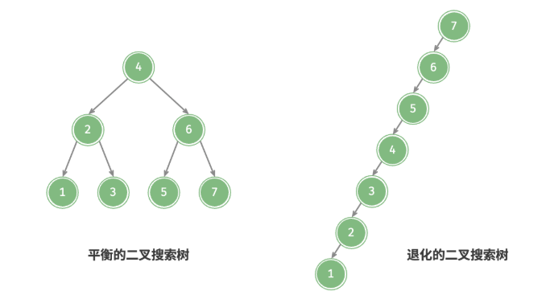
