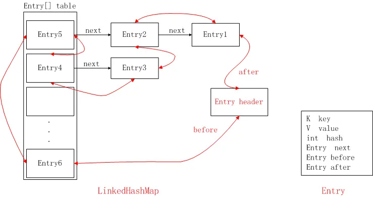

# Java集合常见面试题总结


##  1. 常见的集合有哪些？

Java集合类主要由两个接口**Collection**和**Map**派生出来的，Collection有三个子接口：List、Set、Queue。

Java集合框架图如下：


List代表了有序可重复集合，可直接根据元素的索引来访问；Set代表无序不可重复集合，只能根据元素本身来访问；Queue是队列集合。Map代表的是存储key-value对的集合，可根据元素的key来访问value。

集合体系中常用的实现类有`ArrayList、LinkedList、HashSet、TreeSet、HashMap、TreeMap`等实现类。


## 2. List 、Set和Map 的区别

- List 以索引来存取元素，有序的，元素是允许重复的，可以插入多个null；
- Set 不能存放重复元素，无序的，只允许一个null；
- Map 保存键值对映射；
- List 底层实现有数组、链表两种方式；Set、Map 容器有基于哈希存储和红黑树两种方式实现；
- Set 基于 Map 实现，Set 里的元素值就是 Map的键值。


## 3. ArrayList 了解吗？

ArrayList 是 Java 集合框架中最常用的 `List` 实现类之一，底层基于**动态数组**实现，支持快速随机访问，是日常开发中存储有序、可重复元素的首选容器。以下从底层原理、核心特性、常用操作及面试注意等方面详细解析：

#### 一、底层数据结构

ArrayList 内部维护一个**Object 类型的数组**（`elementData`），用于存储元素。其核心特点是：

- 数组的长度（`capacity`）会根据元素数量动态扩容（扩容以1.5倍）（初始化时可指定初始容量，默认初始容量为 ` 0`，首次添加扩至 10）。
- 支持通过索引（`index`）直接访问元素（类似数组的 `get(index)`），因此**查询效率高**（时间复杂度 `O(1)`）。

#### 二、核心特性

1. **有序性**：元素按插入顺序存储，遍历顺序与插入顺序一致。
2. **可重复性**：允许添加重复元素（通过 `equals()` 判断，相同元素可多次插入）。
3. **允许 null**：可以存储 `null` 值（且可多次添加）。
4. **线程不安全**：未实现同步机制，多线程并发修改时可能导致数据不一致（如需线程安全，可使用 `Collections.synchronizedList(new ArrayList<>())` 或 `CopyOnWriteArrayList`）。
5. **动态扩容**：当元素数量超过当前容量时，会自动扩容以容纳更多元素。


## 4. 怎么在遍历 ArrayList 时移除一个元素？

在遍历 `ArrayList` 时移除元素需要特别注意，若操作不当可能导致 **`ConcurrentModificationException`（并发修改异常）** 或漏删元素。以下是几种安全的实现方式及原理分析：

#### 一、为什么直接遍历删除会出问题？

先看一个错误示例：使用 **for-each 循环（增强 for 循环）** 或 **普通 for 循环正向遍历** 时直接删除元素：

```java
List<String> list = new ArrayList<>(Arrays.asList("A", "B", "C", "D"));

// 错误方式1：for-each循环删除
for (String s : list) {
    if ("B".equals(s)) {
        list.remove(s); // 会抛出 ConcurrentModificationException
    }
}

// 错误方式2：普通for循环正向遍历删除（可能漏删）
for (int i = 0; i < list.size(); i++) {
    if ("B".equals(list.get(i))) {
        list.remove(i); // 删除后元素前移，导致下一个元素被跳过
    }
}
```

**原因分析**：

- `ArrayList` 内部通过 `modCount` 变量记录修改次数（添加、删除等操作会使 `modCount` 递增）。
- for-each 循环底层依赖 `Iterator` 迭代器，迭代器初始化时会记录当前 `modCount`（`expectedModCount`）。若遍历中通过 `list.remove()` 修改了 `modCount`，会导致 `expectedModCount != modCount`，触发 `ConcurrentModificationException`。
- 普通 for 循环正向删除时，删除元素后数组会前移（如删除索引 `i` 的元素后，原索引 `i+1` 的元素会移到 `i`），若 `i` 继续递增，会跳过该元素，导致漏删。

#### 二、安全的删除方式

**1. 使用 `Iterator` 迭代器的 `remove()` 方法（推荐）**

迭代器的 `remove()` 方法会同步更新 `expectedModCount` 和 `modCount`，避免并发修改异常，是最标准的方式：

```java
List<String> list = new ArrayList<>(Arrays.asList("A", "B", "C", "D"));

Iterator<String> iterator = list.iterator();
while (iterator.hasNext()) {
    String s = iterator.next();
    if ("B".equals(s)) {
        iterator.remove(); // 调用迭代器的remove()，而非list.remove()
    }
}

System.out.println(list); // 输出：[A, C, D]（正确删除）
```

**注意**：

- 调用 `iterator.remove()` 前必须先调用 `iterator.next()`（否则会抛 `IllegalStateException`）。
- 每次 `next()` 后只能调用一次 `remove()`（连续调用会报错）。

**2. 普通 for 循环 从后往前遍历 删除**

从后往前遍历可避免元素前移导致的漏删问题（删除当前元素后，前面的元素索引不变）：

```java
List<String> list = new ArrayList<>(Arrays.asList("A", "B", "C", "D"));

for (int i = list.size() - 1; i >= 0; i--) {
    if ("B".equals(list.get(i))) {
        list.remove(i); // 从后往前删，索引不会混乱
    }
}

System.out.println(list); // 输出：[A, C, D]（正确删除）
```

 **3. JDK 8+：使用 `removeIf()` 方法（简洁高效）**

`ArrayList` 实现了 `Collection` 接口的 `removeIf()` 方法，内部通过迭代器实现，可一行代码完成删除：

```java
List<String> list = new ArrayList<>(Arrays.asList("A", "B", "C", "D"));

list.removeIf(s -> "B".equals(s)); // 传入Predicate条件，自动安全删除

System.out.println(list); // 输出：[A, C, D]
```


## 4-1.数组和Arraylist集合怎么相互转换？

#### **一、数组 → ArrayList（两种常用方式）**

**方式 1：Arrays.asList ()（最简单，注意坑点）**

这是 JDK 原生方法，直接将数组转为 List，但返回的是 `Arrays` 内部的固定长度 List（不是真正的 ArrayList），不能执行 add/remove 操作。

```java
import java.util.Arrays;
import java.util.List;

public class ArrayToList {
    public static void main(String[] args) {
        // 1. 原始数组（以 String 数组为例，基本类型数组需注意）
        String[] strArray = {"Java", "Python", "C++"};
        
        // 2. 数组转 List（核心方法）
        List<String> strList = Arrays.asList(strArray);
        
        // ✅ 支持遍历、查询
        System.out.println(strList); // 输出：[Java, Python, C++]
        
        // ❌ 不支持添加/删除（会抛 UnsupportedOperationException）
        // strList.add("Go"); 
        
        // 【避坑】如果需要可修改的 ArrayList，需再包装一层
        List<String> arrayList = new ArrayList<>(strList);
        arrayList.add("Go"); // ✅ 正常执行
        System.out.println(arrayList); // 输出：[Java, Python, C++, Go]
    }
}
```

**方式 2：Collections.addAll ()（推荐，直接转可修改的 ArrayList）**

适合需要直接得到 “可增删” 的 ArrayList 场景，效率比 `new ArrayList(Arrays.asList())` 更高。

```java
import java.util.ArrayList;
import java.util.Collections;

public class ArrayToList2 {
    public static void main(String[] args) {
        String[] strArray = {"Java", "Python", "C++"};
        
        // 1. 创建空的 ArrayList
        List<String> arrayList = new ArrayList<>();
        
        // 2. 批量添加数组元素到集合
        Collections.addAll(arrayList, strArray);
        
        // ✅ 支持所有 ArrayList 操作
        arrayList.add("Go");
        arrayList.remove(0);
        System.out.println(arrayList); // 输出：[Python, C++, Go]
    }
}
```

#### 二、ArrayList → 数组（两种常用方式）

**方式 1：ArrayList.toArray (T [] a)（带参，指定类型，推荐）**

指定数组类型，直接返回对应类型的数组，安全且规范，是实际开发的首选。

```java
import java.util.ArrayList;
import java.util.List;

public class ListToArray2 {
    public static void main(String[] args) {
        List<String> list = new ArrayList<>();
        list.add("Java");
        list.add("Python");
        list.add("C++");
        
        // 方式 1：传入长度为 0 的数组（JDK 1.8+ 推荐，JVM 自动优化长度）
        String[] strArray1 = list.toArray(new String[0]);
        System.out.println(strArray1.length); // 输出：3
        
        // 方式 2：传入和集合长度一致的数组（旧版本推荐，减少数组拷贝）
        String[] strArray2 = list.toArray(new String[list.size()]);
        System.out.println(strArray2[1]); // 输出：Python
        
        // 【基本类型集合转数组】（以 Integer 集合转 int 数组为例）
        List<Integer> intList = new ArrayList<>();
        intList.add(1);
        intList.add(2);
        int[] intArray = intList.stream()
                                .mapToInt(Integer::intValue)
                                .toArray();
        System.out.println(intArray[0]); // 输出：1
    }
}
```


##  5. Arraylist 和 Vector 的区别？

`ArrayList` 和 `Vector` 都是 Java 集合框架中 `List` 接口的实现类，底层均基于**动态数组**实现，支持有序、可重复、允许 `null` 的元素存储，但二者在**线程安全性、性能、扩容机制**等核心维度存在显著差异，以下是详细对比：

| 对比维度         | ArrayList                                                    | Vector                                                       |
| ---------------- | ------------------------------------------------------------ | ------------------------------------------------------------ |
| **线程安全性**   | 线程不安全（无同步机制）                                     | 线程安全（方法加 `synchronized`）                            |
| **性能**         | 效率高（无锁竞争，适合单线程）                               | 效率低（全表锁，多线程竞争激烈）                             |
| **扩容机制**     | JDK 8+：默认初始容量 0（首次添加扩至 10），扩容为**旧容量的 1.5 倍** | 默认初始容量 10，扩容为**旧容量的 2 倍**（或指定增量）       |
| **迭代器安全性** | 迭代器（`Iterator`）是**快速失败（fail-fast）** 的，遍历中修改会抛 `ConcurrentModificationException` | 支持 `Enumeration` 迭代器（慢速失败，遍历中修改不抛异常），也支持 `Iterator`（快速失败） |
| **API 丰富度**   | 无 `elements()`、`capacity()` 等 Vector 特有方法             | 提供 `elements()`（返回 `Enumeration`）、`setSize()`、`capacity()` 等特有方法 |
| **历史版本**     | JDK 1.2 引入（属于 Collections Framework 标准组件）          | JDK 1.0 引入（古老类，后适配 List 接口）                     |


## 6. Arraylist 与 LinkedList的区别？

`ArrayList` 和 `LinkedList` 是 Java 集合框架中 `List` 接口的两大核心实现类，虽然都支持**有序、可重复、允许 null** 的元素存储，但底层数据结构完全不同，导致二者在 **查询效率、增删效率、内存占用** 等维度差异显著。以下从底层原理到实际应用进行全面对比：

| 对比维度         | ArrayList                                                    | LinkedList                                                   |
| ---------------- | ------------------------------------------------------------ | ------------------------------------------------------------ |
| **底层数据结构** | 动态数组（Object [] elementData）                            | 双向链表（节点存储元素 + 前后指针）                          |
| **随机访问效率** | 高（直接通过索引访问，时间复杂度 `O(1)`）                    | 低（需从头 / 尾遍历到目标索引，`O(n)`）                      |
| **增删效率**     | 尾部增删快（`O(1)`）；中间 / 头部增删慢（需移动元素，`O(n)`） | 任意位置增删快（仅需修改节点指针，`O(1)`，前提是已找到目标节点） |
| **内存占用**     | 连续内存空间，可能有冗余容量（数组扩容后未使用的空间）       | 非连续内存空间，每个节点需额外存储前后指针（内存开销更大）   |
| **线程安全性**   | 线程不安全（无同步机制）                                     | 线程不安全（无同步机制）                                     |
| **迭代器支持**   | 仅支持 `Iterator`/`ListIterator`                             | 支持 `Iterator`/`ListIterator`，且实现 `Deque` 接口（可作为双端队列使用） |
| **适用场景**     | 频繁查询、尾部增删的场景                                     | 频繁在中间 / 头部增删、作为队列 / 栈的场景                   |


## 7. 讲讲对HashMap的了解？

`HashMap` 是 Java 集合框架中最常用的 `Map` 实现类，基于**哈希表**（JDK 8+ 为**数组 + 链表 + 红黑树**）实现，用于存储**键值对（key-value）**，具有**查询、插入、删除效率高**（平均 `O(1)`）的特点，是日常开发中处理键值映射的首选容器。

**1. 底层数据结构**

- **JDK 1.7 及之前**：由 **数组 + 链表** 组成。数组（称为「哈希桶」）是主体，每个元素是链表的头节点；当多个 key 哈希冲突时，会通过链表将这些 key-value 节点串起来。

- **JDK 1.8 及之后**：引入 **红黑树** 优化，结构变为 **数组 + 链表 + 红黑树**。当链表长度超过阈值（默认 8），且数组长度 ≥ 64 时，链表会转为红黑树；当红黑树节点数减少到 6 时，会退化为链表。

**2. 核心参数**

- **初始容量**：默认 16（必须是 2 的幂，方便通过位运算计算哈希桶索引）。
- **负载因子**：默认 0.75，用于计算扩容阈值（阈值 = 容量 × 负载因子）。（负载因子过高会减少空间开销，但增加哈希冲突概率；过低则相反，需平衡时间和空间成本）。
- **扩容阈值**：当元素数量超过该值时，触发扩容（容量翻倍，重新计算所有元素的哈希桶索引并迁移）。


## 8. HashMap哈希计算与索引定位

- **步骤 1**：计算 key 的哈希值。通过 `key.hashCode()` 得到初始哈希值，再通过扰动函数（JDK 1.8 简化为 `(h = key.hashCode()) ^ (h >>> 16)`）减少哈希冲突，将高 16 位与低 16 位异或运算，保留高位信息。
- **步骤 2**：计算哈希桶索引。通过 `(n - 1) & hash` 得到索引（n 为数组长度，因 n 是 2 的幂，等价于 `hash % n`，但位运算效率更高）。

```java
1011001010101011011100000010101 // h
101100101010101 // h>>>16
1011001010101011110000101000000 // h^(h>>>16)

h=key.hashCode() //第一步 取hashCode值
h^(h>>>16)  //第二步 高位参与运算，减少冲突
return h&(length-1);  //第三步 取模运算
```


## 9. 为什么建议设置HashMap的容量？

HashMap 的扩容机制是当元素数量超过「阈值」（容量 × 负载因子）时，会将容量翻倍（变为原来的 2 倍），并重新计算所有元素的哈希桶索引，将其迁移到新数组中。这个过程涉及：

- 新建更大的数组（内存分配）；
- 对所有已有元素重新计算哈希和索引（计算开销）；
- 迁移元素到新数组（操作开销）；


## 10. 说说HashMap put()方法的流程？

HashMap 的 `put()` 方法用于将键值对（key-value）存入集合，其流程可分为「哈希计算→定位位桶→插入 / 覆盖→扩容 / 树化」四个核心阶段，具体步骤如下

#### 1. 计算 key 的哈希值

- 首先判断 key 是否为 `null`：若为 `null`，哈希值直接设为 0（HashMap 允许 key 为 null，且仅存一个）。

- 若 key 非 null，通过 `key.hashCode()` 获取原始哈希值，再通过**扰动函数**优化：`(h = key.hashCode()) ^ (h >>> 16)`。

作用：将哈希值的高 16 位与低 16 位异或，保留高位信息，减少因哈希值低位重复导致的哈希冲突。

#### 2. 定位哈希桶索引

- 哈希桶（数组）的长度为 `n`（始终是 2 的幂），通过位运算 `(n - 1) & hash` 计算索引（等价于 `hash % n`，但位运算效率更高），确定 key 对应的数组位置（桶）。

#### 3. 插入或覆盖键值对

根据桶的状态（空、链表、红黑树）执行不同操作：

**情况 1：桶为空（数组该位置无元素）**

- 直接在该位置创建新节点（`Node` 对象，存储 key、value、hash、next 指针），插入后跳到步骤 4。

**情况 2：桶非空（存在哈希冲突）**

- **第一步：检查头节点是否相同**比较头节点的 hash 与当前 key 的 hash，且通过 `equals()` 方法判断 key 是否相等（需同时满足，避免 hash 碰撞导致误判）。

  - 若相同：直接覆盖头节点的 value，流程结束。

- **第二步：遍历桶中元素（链表或红黑树）**

  - 若桶是链表：

    - 遍历链表，对每个节点先判断**hash 值是否相等**（快速粗筛，排除不匹配的 key）；
    - 若哈希值一致，再通过 `==`（引用相同）或 `equals()`（内容相同）判断 key 是否匹配。
    - 若匹配到相同 key：直接覆盖该节点的 value，流程终止；
    - 若遍历至链表尾部仍无匹配：在链表**尾部插入新节点**（JDK 1.8 采用尾插法，解决 JDK 1.7 头插法在扩容时可能引发的死链问题）；

  - 若桶是红黑树：

    调用红黑树的插入方法，若存在相同 key 则覆盖 value，否则插入新节点。

#### 4. 检查是否需要树化或扩容

- **树化判断**：
  - 插入新节点后，若当前桶是链表且长度 ≥ 8，同时数组长度 ≥ 64，则将该链表转为红黑树（优化查询效率）。
  - 若数组长度 < 64，会先触发扩容而非树化，因为小容量下扩容成本更低，扩容也是翻倍。（**提前触发扩容**的特殊场景）

- **扩容判断**：插入后，若 HashMap 的元素总数（`size`）≥ 扩容阈值（`threshold = 容量 × 负载因子`），则触发扩容：
  1. 新容量 = 原容量 × 2（保证仍是 2 的幂）。
  2. 新建一个长度为新容量的数组，重新计算所有元素的哈希索引，并迁移到新数组中（JDK 1.8 通过高低位拆分优化迁移，无需重新计算哈希）。

#### 总结流程图

```plsql
计算 key 的 hash 值 → 计算索引定位桶 →
├─ 桶为空 → 直接插入节点
└─ 桶非空 →
   ├─ 头节点 key 相同 → 覆盖 value
   └─ 头节点不同 →
      ├─ 遍历链表/红黑树 → 找到相同 key 则覆盖
      └─ 未找到 → 尾部插入新节点 →
         ├─ 链表长度 ≥8 且数组 ≥64 → 转红黑树
         └─ 元素总数 ≥ 阈值 → 扩容（容量翻倍，迁移元素）
```


## 10-1. 说说HashMap get()方法的流程？

#### 1. 计算键的哈希值

首先调用`hash(key)`方法计算键的哈希值，目的是减少哈希冲突：

- 如果`key`为`null`，哈希值直接为`0`（HashMap 允许`key`为`null`，固定放在数组索引 0 的位置）。
- 如果`key`不为`null`，先获取`key.hashCode()`的返回值，再对该值进行**扰动处理**（通过位运算：`(h = key.hashCode()) ^ (h >>> 16)`），将哈希值的高位与低位混合，降低哈希冲突概率。

#### 2. 定位数组桶的索引

通过哈希值计算键对应的数组桶（bucket）的索引：

- 公式：`index = (数组长度 - 1) & 哈希值`。
- 利用数组长度为 2 的幂次的特性，通过位运算替代取模，提升效率。

#### 3. 检查桶是否为空

- 如果桶（数组对应索引位置）为`null`，说明该键不存在，返回`null`。
- 如果桶不为空，进入桶内元素匹配流程（桶内元素是链表或红黑树结构）。

#### 4. 匹配桶内元素（链表 / 红黑树）

桶内元素可能是**链表**（元素数量<8）或**红黑树**（元素数量 >= 8且数组长度 ≥64）形式存储，需逐一匹配键：

**（1）链表结构**

- 遍历链表，依次比较每个节点的key与目标key：
  - 哈希值比对：当前节点的 hash 值与目标 key 的 hash 值是否相等；
  - key 匹配：
    - 先通过`==`判断引用是否相同，若相同则匹配成功，返回节点的`value`。
    - 若引用不同，调用`key.equals()`方法判断内容是否相等，相等则返回`value`。

  - 若遍历完链表仍无匹配，返回`null`。


**（2）红黑树结构**

- 调用红黑树的`getTreeNode(hash, key)`方法高效查找，核心逻辑：
  -  以哈希值为核心线索，结合红黑树的有序性遍历节点，进行hash筛选；
  - 对候选节点先比对哈希值，再通过`equals()`（或`compareTo()`，仅当 key 实现`Comparable`时）匹配目标 key；
  - 匹配成功则返回节点的`value`，否则返回`null`。

#### 核心流程图总结

```plaintext
key → 计算哈希值（hash(key)）→ 计算桶索引 → 桶是否为空？
   → 是 → 返回null
   → 否 → 桶内是链表？→ 遍历链表：hash值比对 → ==/equals()匹配key → 返回value/null
        → 桶内是红黑树？→ 红黑树查找：hash值比对 → equals()/compareTo()匹配key → 返回value/null
```

#### 关键注意点

- `key`的`hashCode()`和`equals()`方法的实现直接影响查找效率：若`hashCode()`分布不均匀，会导致哈希冲突加剧，链表 / 树过长，降低`get()`性能；若`equals()`实现不当，可能无法正确匹配键。
- JDK 1.8 引入红黑树优化，解决了链表过长时查找效率低（O (n)→O (logn)）的问题


## 11. 在解决 hash 冲突的时候，为什么选择先用链表，再转红黑树?

- 因为红黑树需要进行左旋，右旋，变色这些操作来保持平衡，而单链表不需要。
- 当元素个数小于8个的时候，采用链表结构可以保证查询性能。而当元素个数大于8个的时候并且数组容量大于等于64，会采用红黑树结构。因为红黑树搜索时间复杂度是 `O(logn)`，而链表是 `O(n)`，在n比较大的时候，使用红黑树可以加快查询速度。


## 12. HashMap 的长度为什么是 2 的幂次方？

**位运算替代取模**

HashMap 中，元素的存储位置（数组索引）由 key 的哈希值映射而来，核心公式为：`index = (n - 1) & hash`

其中 `n` 是哈希表的容量（长度），`hash` 是 key 的哈希值（经过扰动处理后的结果）。

当 `n` 是 2 的幂次方时，`n - 1` 的二进制表示为**全 1**（例如：`n=8` 时，`n-1=7`，二进制为 `0111`；`n=16` 时，`n-1=15`，二进制为 `1111`）。此时，`(n-1) & hash` 等价于 `hash % n`（取模运算），但**位运算的效率远高于取模运算**（计算机底层对位运算的支持更直接，耗时更短）。


## 13. HashMap默认加载因子是多少？为什么是 0.75？

HashMap 的默认加载因子（load factor）是 **0.75**。这一数值的选择是在**哈希表的空间利用率**和**哈希冲突概率**之间进行权衡的结果，背后有明确的工程实践和概率统计依据。


## 14. 一般用什么作为HashMap的key?

一般用`Integer`、`String`这种不可变类当 HashMap 当 key。String类比较常用。

- 因为 String 是不可变的，所以在它创建的时候 `hashcode` 就被缓存了，不需要重新计算。这就是 HashMap 中的key经常使用字符串的原因。
- 获取对象的时候要用到 `equals()` 和 `hashCode()` 方法，而Integer、String这些类都已经重写了 `hashCode()` 以及 `equals()` 方法，不需要自己去重写这两个方法。


## 15. HashMap为什么线程不安全？

HashMap 是线程不安全的，主要源于其内部数据结构（数组、链表、红黑树）的操作未进行同步控制，在多线程环境下并发修改时，可能导致数据不一致、死循环甚至异常等问题。具体原因如下

#### 1. **扩容时的死循环（JDK 7 及之前）**

在 JDK 7 中，HashMap 扩容（`resize`）时会将旧数组中的链表迁移到新数组，迁移过程采用**头插法**（新元素插入链表头部）。多线程并发扩容时，可能导致链表形成**环形结构**，后续查询元素时会陷入无限循环。

举例：

- 线程 A 和线程 B 同时对同一个链表进行迁移，线程 A 暂停时，线程 B 已完成部分节点的迁移并修改了指针方向；
- 线程 A 恢复后，基于已被线程 B 修改的指针继续操作，最终导致链表中两个节点互相指向对方，形成环。

JDK 8 虽将头插法改为**尾插法**避免了死循环，但仍存在其他线程安全问题。

#### 2. **数据覆盖（所有 JDK 版本）**

多线程并发执行 `put` 操作时，可能出现以下数据覆盖场景：

- **场景 1**：两个线程同时计算出相同的索引位置，且该位置原本为空。线程 A 判断位置为空后暂停，线程 B 成功插入元素；线程 A 恢复后，会直接覆盖线程 B 插入的值。
- **场景 2**：当链表或红黑树中存在相同 key 时，理论上应覆盖旧值。但多线程并发判断时，可能导致多个线程同时认为 “需要插入新值”，最终插入重复数据（或覆盖错误）。


## 16. HashMap和HashTable的区别？

HashMap 和 Hashtable 都是 Java 中用于存储键值对的哈希表实现，但两者在设计上有诸多差异，主要体现在**线程安全性**、**功能特性**和**性能**等方面。以下是具体区别：

#### 1. **线程安全性**

- **Hashtable**：是线程安全的。其所有方法（如 `put`、`get`、`remove` 等）都被 `synchronized` 修饰，保证了多线程环境下的操作原子性。但这种 “全表加锁” 的方式效率较低，多线程并发访问时会频繁阻塞，性能较差。
- **HashMap**：是线程不安全的。其方法没有同步机制，多线程并发修改时可能导致数据不一致（如数据覆盖、死循环等，详见前文）。但正因为无需处理同步，单线程环境下的性能优于 Hashtable。

#### 2. **对 null 的支持**

- **Hashtable**：不允许 `key` 或 `value` 为 `null`。若传入 `null`，会直接抛出 `NullPointerException`。原因是其 `put` 方法中会直接使用 `key.hashCode()`，而 `null` 调用 `hashCode()` 会触发异常。
- **HashMap**：允许 `key` 为 `null`（仅允许一个，因为 `key` 唯一），也允许 `value` 为 `null`（可多个）。当 `key` 为 `null` 时，HashMap 会将其固定映射到索引 0 的位置。

#### 3. **初始容量与扩容机制**

- **初始容量**：（负载因子都是0.75）
  - Hashtable 默认初始容量为 **11**（非 2 的幂次方）。
  - HashMap 默认初始容量为 **16**（2 的幂次方，JDK 8 及之后）。
- **扩容机制**：
  - Hashtable 扩容时，新容量 = 旧容量 * 2 + 1（保证容量为奇数，试图优化哈希分布）。
  - HashMap 扩容时，新容量 = 旧容量 * 2（始终保持 2 的幂次方，便于通过位运算计算索引）。

#### 4. **哈希值计算与索引映射**

- **Hashtable**：直接使用 `key.hashCode()` 作为哈希值，索引计算为 `(hash & 0x7FFFFFFF) % capacity`（`0x7FFFFFFF` 用于确保哈希值为正数）。
- **HashMap**：对 `key.hashCode()` 进行**扰动处理**（JDK 8 简化为 `hash = key.hashCode() ^ (key.hashCode() >>> 16)`），减少哈希冲突；索引计算为 `(capacity - 1) & hash`（位运算，效率更高，依赖容量为 2 的幂次方）。

#### 5. **数据结构（冲突处理）**

- **Hashtable**：始终使用**链表**处理哈希冲突，即使链表过长也不会转为红黑树。
- **HashMap**：JDK 8 及之后采用 “链表 + 红黑树” 的混合结构：当链表长度超过 8 时，转为红黑树以优化查询效率；当长度减少到 6 时，转回链表。

#### 总结

| 特性         | Hashtable                | HashMap                                 |
| ------------ | ------------------------ | --------------------------------------- |
| 线程安全     | 是（全表加锁，效率低）   | 否（单线程性能优）                      |
| null 支持    | 不允许 key/value 为 null | 允许 key 为 null（1 个），value 为 null |
| 继承关系     | 继承 Dictionary 类       | 继承 AbstractMap 类                     |
| 初始容量     | 11                       | 16（JDK 8+）                            |
| 扩容机制     | 旧容量 * 2 + 1           | 旧容量 * 2（保持 2 的幂次方）           |
| 哈希冲突处理 | 仅链表                   | 链表 + 红黑树（JDK 8+）                 |
| 性能         | 并发下低                 | 单线程下高                              |


## 17. LinkedHashMap底层原理？

LinkedHashMap 是 HashMap 的子类，它在 HashMap 的基础上通过维护一个**双向链表**，实现了对元素的**有序访问**（插入顺序或访问顺序）。其底层原理可概括为 “**哈希表 + 双向链表**” 的组合结构，既保留了 HashMap 的高效查询特性，又新增了顺序维护能力。

#### 核心结构：哈希表 + 双向链表

- **哈希表**：继承自 HashMap，底层仍是数组（桶）+ 链表 / 红黑树的结构，用于实现 key 的快速定位（O (1) 平均时间复杂度）。
- **双向链表**：这是 LinkedHashMap 独有的结构，所有节点通过 `before` 和 `after` 指针连接，形成一条贯穿所有元素的双向链表，用于记录元素的顺序（插入顺序或访问顺序）。

红色的线就可以表示维护的一个双向列表指针其余的就是`hashMap` 原有结构




## 18. 讲一下TreeMap？

TreeMap 是 Java 中基于**红黑树**实现的 `Map` 接口实现类，它的核心特点是**键（key）有序**，所有键值对会按照 key 的自然排序（或自定义排序规则）进行存储和访问。与 HashMap 不同，TreeMap 不依赖哈希表，而是通过红黑树的特性保证元素的有序性和高效操作。

#### 1. 核心特性

- **有序性**：所有键值对按照 key 的顺序排列（默认自然排序，如 `Integer` 升序、`String` 字典序；或通过 `Comparator` 自定义排序）。
- **无哈希冲突**：因基于红黑树实现，不依赖哈希值，不存在哈希冲突问题。
- **不允许 null 键**：key 不能为 `null`（会抛出 `NullPointerException`），但 value 可以为 `null`。
- **线程不安全**：与 HashMap 类似，多线程并发修改时需额外同步（如使用 `Collections.synchronizedSortedMap`）。

#### 2. 底层数据结构：红黑树

TreeMap 的底层是一棵**红黑树**（自平衡二叉查找树），每个节点 `Entry` 包含以下信息：

- `key`：键（用于排序的核心字段）
- `value`：值
- `left`/`right`：左 / 右子节点（红黑树结构）
- `parent`：父节点
- `color`：节点颜色（红 / 黑，用于维护树的平衡）

红黑树的特性保证了：

- 树的高度始终为 O (log n)，因此查询、插入、删除的时间复杂度均为 O (log n)（优于长链表，但略逊于 HashMap 的 O (1) 平均效率）。
- 中序遍历红黑树可得到 key 的有序序列（这是 TreeMap 有序性的底层实现）。


## 19. HashSet底层原理？

HashSet 基于 HashMap 实现。放入HashSet中的元素实际上由HashMap的key来保存，而HashMap的value则存储了一个静态的Object对象。

```java
public class HashSet<E> extends AbstractSet<E> implements Set<E>, Cloneable, java.io.Serializable {
    private transient HashMap<E, Object> map;
    // 用于填充 HashMap 的 value 的固定空对象（无实际意义）
    private static final Object PRESENT = new Object();

    // 构造函数：初始化内部的 HashMap
    public HashSet() {
        map = new HashMap<>();
    }
    // 其他构造函数（指定初始容量、加载因子等）均直接初始化对应的 HashMap
}
```


## 20. HashSet、LinkedHashSet 和 TreeSet 的区别？

`HashSet` 是 `Set` 接口的主要实现类 ，`HashSet` 的底层是 `HashMap`，线程不安全的，可以存储 null 值；

`LinkedHashSet` 是 `HashSet` 的子类，能够按照添加的顺序遍历；

`TreeSet` 底层使用红黑树，能够按照添加元素的顺序进行遍历，排序的方式可以自定义。


## 21. 讲一下ArrayDeque？

ArrayDeque实现了双端队列，内部使用循环数组实现，默认大小为16。它的特点有：

1. 在两端添加、删除元素的效率较高
2. 根据元素内容查找和删除的效率比较低。
3. 没有索引位置的概念，不能根据索引位置进行操作。

ArrayDeque和LinkedList都实现了Deque接口，如果只需要从两端进行操作，ArrayDeque效率更高一些。如果同时需要根据索引位置进行操作，或者经常需要在中间进行插入和删除（LinkedList有相应的 api，如add(int index, E e)），则应该选LinkedList。

ArrayDeque和LinkedList都是线程不安全的，可以使用Collections工具类中synchronizedXxx()转换成线程同步。


## 22. 哪些集合类是线程安全的？哪些不安全？

线性安全的集合类：

- Vector：比ArrayList多了同步机制。
- Hashtable。
- ConcurrentHashMap：是一种高效并且线程安全的集合。
- Stack：栈，也是线程安全的，继承于Vector。

线性不安全的集合类：

- Hashmap
- Arraylist
- LinkedList
- HashSet
- TreeSet
- TreeMap


## 23. 迭代器 Iterator 是什么？

在 Java 中，`Iterator`（迭代器）是一种**用于遍历集合（如 `List`、`Set`、`Map` 的键 / 值集合等）元素的接口**，它提供了一种统一的方式来访问集合中的元素，而无需暴露集合的底层数据结构（如数组、链表、红黑树等）。

#### Iterator 的核心方法

`java.util.Iterator` 接口定义了 3 个核心方法：

1. `boolean hasNext()`：判断集合中是否还有未遍历的元素，有则返回 `true`，否则返回 `false`。

2. `E next()`：返回集合中的下一个元素，并将迭代器 “游标” 向后移动一位。若没有下一个元素（`hasNext()` 为 `false`），调用此方法会抛出 `NoSuchElementException`。

3. `void remove()`：删除**当前迭代器指向的元素**（即最后一次调用 `next()` 返回的元素）。注意：

   - 调用 `remove()` 前必须先调用 `next()`，否则会抛出 `IllegalStateException`。

   - 一次 `next()` 后只能调用一次 `remove()`，连续调用会报错。

#### 迭代器的使用场景

迭代器主要用于遍历各种集合，替代了传统的 `for` 循环（尤其是对于底层不是数组的集合，如 `LinkedList`，迭代器遍历更高效）。

```java
Set<String> set = new HashSet<>();
set.add("a");
set.add("b");

// 获取迭代器
Iterator<String> iterator = set.iterator();
// 遍历
while (iterator.hasNext()) {
    String element = iterator.next(); // 获取下一个元素
    System.out.println(element);
    if (element.equals("a")) {
        iterator.remove(); // 删除当前元素（"a"）
    }
}
```


## 24. Iterator 和 ListIterator 有什么区别？

`Iterator` 和 `ListIterator` 都是 Java 中用于遍历集合元素的迭代器，但两者的适用范围、功能和使用场景有显著区别。核心差异如下：

#### 1. **适用范围不同**

- **`Iterator`**：是所有**集合（`Collection`）** 都能使用的迭代器，包括 `List`（如 `ArrayList`、`LinkedList`）、`Set`（如 `HashSet`、`TreeSet`）等。调用集合的 `iterator()` 方法即可获取，是最通用的迭代器。
- **`ListIterator`**：仅适用于 **`List` 接口的实现类 **（如 `ArrayList`、`LinkedList`），`Set` 等其他集合无法使用。调用 `List` 的 `listIterator()` 方法获取，是 `List` 专属的迭代器。

#### 2. **遍历方向不同**

- **`Iterator`**：只能**单向遍历**（从集合开头向结尾移动），通过 `next()` 方法获取下一个元素，无法向前移动。
- **`ListIterator`**：支持**双向遍历**，除了 `next()`（向后移动），还提供 `previous()` 方法（向前移动），可在集合中前后穿梭。

```java
List<String> list = new ArrayList<>();
list.add("a");
list.add("b");
ListIterator<String> it = list.listIterator();
// 向后遍历
while (it.hasNext()) {
    System.out.println(it.next()); // 输出 a、b
}
// 向前遍历
while (it.hasPrevious()) {
    System.out.println(it.previous()); // 输出 b、a
}
```


## 25. 如何让一个集合不能被修改？

在 Java 中，若想让一个集合（如 `List`、`Set`、`Map` 等）不能被修改（即禁止添加、删除、修改元素），可以通过以下几种方式实现，核心思路是**返回一个 “不可修改的视图”**（视图本身不存储数据，仅代理原集合，但屏蔽了修改操作）。

#### 1. 利用 `Collections` 工具类（最常用）

`java.util.Collections` 提供了一系列静态方法，可将普通集合包装为**不可修改的集合**，这些方法会返回一个 “只读视图”：

| 集合类型     | 方法                                             | 作用                             |
| ------------ | ------------------------------------------------ | -------------------------------- |
| `List`       | `Collections.unmodifiableList(List)`             | 返回不可修改的 `List` 视图       |
| `Set`        | `Collections.unmodifiableSet(Set)`               | 返回不可修改的 `Set` 视图        |
| `Map`        | `Collections.unmodifiableMap(Map)`               | 返回不可修改的 `Map` 视图        |
| `Collection` | `Collections.unmodifiableCollection(Collection)` | 返回不可修改的 `Collection` 视图 |

**示例**：

```java
import java.util.*;

public class UnmodifiableDemo {
    public static void main(String[] args) {
        List<String> originalList = new ArrayList<>();
        originalList.add("a");
        originalList.add("b");

        // 包装为不可修改的 List
        List<String> unmodifiableList = Collections.unmodifiableList(originalList);

        // 尝试修改会抛出 UnsupportedOperationException
        unmodifiableList.add("c"); // 报错
        unmodifiableList.remove(0); // 报错
        unmodifiableList.set(0, "d"); // 报错（List 特有修改）
    }
}
```

#### 2. 利用 `List.of()`、`Set.of()`、`Map.of()`（JDK 9+）

JDK 9 及以上版本新增了一系列静态工厂方法，可直接创建**不可修改的集合**（这些集合本身就是不可变的，而非视图）：

| 集合类型 | 方法示例                                 | 特点                                                         |
| -------- | ---------------------------------------- | ------------------------------------------------------------ |
| `List`   | `List.of("a", "b")`                      | 不可修改，元素不可为 `null`（`List` 允许单个 `null` 但不推荐） |
| `Set`    | `Set.of("a", "b")`                       | 不可修改，元素不可重复、不可为 `null`                        |
| `Map`    | `Map.of("key1", "val1", "key2", "val2")` | 不可修改，键不可重复、不可为 `null`，值可为 `null`           |

```java
// JDK 9+
List<String> unmodifiableList = List.of("a", "b");
unmodifiableList.add("c"); // 抛出 UnsupportedOperationException

Set<String> unmodifiableSet = Set.of("x", "y");
unmodifiableSet.remove("x"); // 报错

Map<String, Integer> unmodifiableMap = Map.of("a", 1, "b", 2);
unmodifiableMap.put("c", 3); // 报错
```

#### **3. 那使用final关键字进行修饰可以实现吗？**

**答案是不可以。**

- final关键字修饰的成员变量如果是是引用类型的话，则表示这个引用的地址值是不能改变的，但是这个引用所指向的对象里面的内容还是可以改变的。
- 而集合类都是引用类型，用final修饰的话，集合里面的内容还是可以修改的。


## 26. 并发容器

#### 一、写时复制系列（读多写少专属）

**1. CopyOnWriteArrayList**

> 核心安全实现细节

底层基于 `volatile` 修饰的对象数组存储数据，核心逻辑是**写时复制、读写分离**：

1. 所有读操作全程无锁，直接读取当前数组引用，性能与普通 ArrayList 几乎一致。
2. 写操作（增 / 删 / 改）先加 `ReentrantLock` 独占锁，保证同一时间只有一个写线程。
3. 加锁后完整复制原数组生成全新副本，**所有修改只在新副本上执行，原数组全程不做任何改动**，保证写操作期间读线程依然能无锁读取旧数据，不会出现脏读。
4. 修改完成后，将 `volatile` 数组引用原子切换为新副本，后续所有新读请求都会读到最新数据，最后释放锁。

> 正例：网关 IP 黑白名单

为什么不能直接用普通 ArrayList：

- 并发更新 IP 时，`add()` 不是原子操作，会出现 IP 覆盖丢失、数组越界异常，导致安全规则失效。
- 网关请求线程遍历名单校验时，若后台同时修改名单，会触发 `ConcurrentModificationException`，直接导致用户请求报错。
- 普通数组无可见性保障，后台修改的 IP，请求线程可能长时间读不到，封禁 / 放行规则不生效。

为什么用 CopyOnWriteArrayList 合适：

- 场景读多写少：每秒上万次请求读名单，每天仅几次修改操作，读无锁的性能优势完全释放。
- 弱一致性可接受：修改后短暂时间内读到旧数据，不影响业务，IP 名单不需要毫秒级生效。
- 遍历安全：迭代器基于快照生成，永远不会抛出并发修改异常，网关请求链路稳定。

> 反例：电商用户购物车商品列表

为什么不能用 CopyOnWriteArrayList：

- 场景写多读多：用户频繁加购、删改商品，写操作频率极高。
- 每次写都要完整复制数组，会频繁生成大对象，内存开销剧增，Young GC 频率飙升，严重影响接口性能。
- 弱一致性会导致用户刚加购商品，刷新页面却看不到，严重影响用户体验。

**2. CopyOnWriteArraySet**

> 核心安全实现细节

底层完全基于 `CopyOnWriteArrayList` 实现，复用其写时复制的全部安全机制；新增元素时，在独占写锁的保护下遍历全数组做存在性校验，保证并发下不会出现重复元素。

> 正例：系统敏感操作白名单用户集合

为什么不能直接用普通 HashSet：

- HashSet 非线程安全，并发添加用户时，会出现去重失效、元素覆盖，甚至哈希表结构损坏。
- 权限校验时遍历集合，若后台同时修改名单，会触发并发修改异常，导致敏感操作校验失败。
- 无可见性保障，新增的白名单用户无法及时生效。

为什么用 CopyOnWriteArraySet 合适：

- 天然去重，满足白名单用户不重复的需求。
- 读多写少场景适配：每次敏感操作都要校验权限（高频读），管理员仅偶尔增减白名单（低频写），读无锁性能高。
- 遍历安全，权限校验链路不会因并发修改报错。

> 反例：直播间实时在线用户集合

为什么不能用 CopyOnWriteArraySet：

- 用户进出房间频率极高，每秒上百次写操作，频繁复制数组会导致性能雪崩。
- 弱一致性会导致在线人数统计严重不准，用户进入房间后长时间看不到自己在列表中。


#### 二、并发 Map 系列（核心高频）

**ConcurrentHashMap（JDK 8+）**

> 核心安全实现细节

基于数组 + 链表 / 红黑树的哈希结构，通过「volatile 可见性 + CAS 无锁更新 + 细粒度桶锁」实现高并发安全：

1. 哈希桶数组、节点值、节点 next 指针均用 `volatile` 修饰，保证多线程数据可见性。
2. 空哈希桶插入新节点时，通过 CAS 自旋完成，全程无锁。
3. 发生哈希冲突的桶，仅用 `synchronized` 锁定当前桶的首节点，锁粒度为单个哈希桶，不同桶之间的读写完全互不影响。
4. 扩容时支持多线程协助迁移，扩容期间正常提供读写服务，不会全量阻塞。

> 正例：电商商品详情本地缓存

为什么不能直接用普通 HashMap：

- 多线程并发读写时，HashMap 扩容可能导致链表成环，触发死循环，直接打满 CPU，服务宕机。
- 并发写会出现键值对覆盖、数据丢失，导致商品详情查询返回错误数据或空值。
- 多线程下可见性无法保证，缓存更新后，部分线程长期读到旧数据。

为什么用 ConcurrentHashMap 合适：

- 高并发读写性能优异：不同商品命中不同哈希桶，几乎无锁竞争，吞吐量远高于粗粒度锁的同步 Map。
- 支持一定量级的写操作：商品信息更新、缓存失效刷新都能正常支撑，不需要读写完全分离。
- 生产级稳定性：不会出现死循环、数据丢失问题，是本地缓存的标准实现。

> 反例：多线程精准计数统计

为什么不能用 ConcurrentHashMap：

- `size()`、`isEmpty()` 方法返回的是近似值，扩容、并发更新期间统计不准，无法满足精准计数要求。
- `if (!containsKey(key)) put(key, 1)` 这类复合操作不具备原子性，多线程下会出现计数覆盖，导致统计结果偏小。
- 精准计数场景应使用 `LongAdder` 或 `AtomicLong` 实现。


#### 三、并发队列系列

**1. ConcurrentLinkedQueue（非阻塞无界队列）**

> 核心安全实现细节

底层单向链表结构，头、尾节点用 `volatile` 修饰；入队、出队全程通过 CAS 无锁操作实现，没有锁阻塞，高并发写入性能优异。

> 正例：Web 服务请求日志收集队列

为什么不能直接用普通 LinkedList：

- LinkedList 非线程安全，并发入队会导致链表指针错乱、节点丢失，日志数据丢失。
- 多线程同时添加元素，会出现数据覆盖、链表断裂，甚至抛出空指针异常。

为什么用 ConcurrentLinkedQueue 合适：

- 高并发写适配：大量业务线程同时写入日志，CAS 无锁设计支撑高并发写入，性能远高于加锁的同步队列。
- 无界队列适配日志场景：日志允许轻微堆积，不会因为队列满而阻塞业务主线程。
- 后台单线程批量消费写入日志文件，消费速度稳定，不会出现队列无限增长。

> 反例：秒杀库存扣减任务队列

为什么不能用 ConcurrentLinkedQueue：

- 无界队列无法控制长度，秒杀峰值时海量请求涌入，队列无限堆积会直接导致 OOM 内存溢出，服务宕机。
- 不支持阻塞和限流机制，无法控制下游数据库的处理速度，会直接打垮数据库，导致超卖等严重问题。


**2. ArrayBlockingQueue（有界阻塞队列）**

> 核心安全实现细节

底层固定长度数组，全局一把 `ReentrantLock` 独占锁，配合 `notEmpty`、`notFull` 两个 Condition 条件队列，实现队列满时入队阻塞、队列空时出队阻塞，天然支持生产者 - 消费者模型。

> 正例：秒杀系统请求削峰队列

为什么不能直接用普通队列 / 无界队列：

- 普通队列非线程安全，并发下数据错乱。
- 无界队列无法限流，瞬时上万请求直接涌入下游订单系统，数据库连接被打满，服务雪崩。

为什么用 ArrayBlockingQueue 合适：

- 有界容量可控：设置固定队列长度（如 1000），超过容量的请求直接阻塞或快速失败，严格限制下游流量。
- 阻塞削峰：将瞬时尖峰流量摊平为平稳流量，下游订单系统按固定速度处理，保证数据库稳定。
- 单锁 + 数组实现简单，固定容量下稳定性高，适合秒杀这种强限流场景。

> 反例：高并发通用任务调度队列

为什么不能用 ArrayBlockingQueue：

- 读写共用一把锁，入队和出队互斥，高并发下锁竞争激烈，吞吐量低。
- 通用任务队列提交和执行频率都很高，单锁会成为明显的性能瓶颈，任务处理效率差。


**3. LinkedBlockingQueue（通用阻塞队列）**

> 核心安全实现细节

底层链表结构，默认无界，可手动设置容量；采用**读写双锁分离**设计：入队锁 `putLock`、出队锁 `takeLock`，入队和出队互不阻塞，并发吞吐量高于单锁的 ArrayBlockingQueue。

> 正例：Java 线程池默认任务队列

为什么不能直接用普通队列：

- 普通队列非线程安全，多线程提交任务会出现任务丢失、队列结构损坏。
- 普通队列不支持阻塞等待，线程池无任务时工作线程无法阻塞休眠，会持续空转消耗 CPU。

为什么用 LinkedBlockingQueue 合适：

- 双锁读写分离，任务提交和任务执行互不干扰，高并发下吞吐量更高，适配线程池的通用任务场景。
- 链表结构入队出队性能稳定，不会因为数组扩容产生性能波动。
- 可手动设置容量，避免无界堆积，适配大多数业务线程池场景。

> 反例：内存敏感的生产限流场景

为什么不能用 LinkedBlockingQueue：

- 默认是无界队列，若下游消费速度跟不上，任务会无限堆积，最终导致 OOM 内存溢出，服务宕机。
- 生产环境若不手动设置容量上限，在流量突增时极易出现内存泄漏风险。


**4. DelayQueue（延迟阻塞队列）**

> 核心安全实现细节

底层基于优先级队列实现，元素必须实现 `Delayed` 接口，按到期时间自动排序；全局一把独占锁，出队时判断队首元素是否到期，未到期则线程阻塞对应时长，到期后才返回元素。

> 正例：电商订单超时自动取消

为什么不能直接用定时任务轮询：

- 定时任务轮询需要固定间隔扫描全量订单，空耗 CPU 资源，且订单量越大扫描越慢。
- 轮询精度差，最短只能到秒级，订单超时取消的时间误差大。

为什么用 DelayQueue 合适：

- 天然支持延迟触发，订单存入后到期自动取出执行取消逻辑，不需要轮询，CPU 资源占用极低。
- 时间精度高，可精确到毫秒级，超时取消时间准确。
- 线程安全，多线程存入订单不会出现错乱，单线程消费即可支撑大量超时订单。

> 反例：即时消息推送队列

为什么不能用 DelayQueue：

- 底层是二叉堆，每次入队出队都要调整堆结构，性能远低于普通阻塞队列，无法支撑高吞吐量的即时消息。
- 元素必须到期才能取出，完全不适合即时消费的场景，会导致消息严重延迟。

