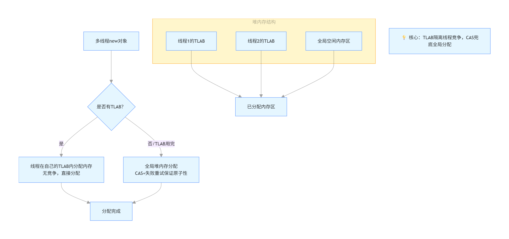

# JVM 面试题


## 1. JVM 到底是什么？

JVM（Java Virtual Machine，Java 虚拟机）本质上是一个**运行在操作系统上的 “虚拟计算机”** —— 它不是真实的硬件设备，而是一段软件程序，专门负责执行 Java 字节码。

你可以把它想象成一个 “翻译官”：

- 你写的 Java 代码（.java 文件）会先被编译成通用的 “中间语言”（字节码，.class 文件），这个字节码不依赖任何操作系统（Windows、Linux、Mac）；
- 不同操作系统上安装的 JVM，会把这份通用的字节码 “翻译” 成当前系统能识别的机器指令，让代码能在对应平台上运行。

这就是 Java“一次编写，到处运行”（Write Once, Run Anywhere）的核心原理 ——**字节码跨平台，JVM 做适配**。


## 2. Jdk和Jre和JVM的区别

JDK、JRE 和 JVM 是 Java 生态中三个核心概念，它们层层递进，分别对应 “开发工具”“运行环境” 和 “执行引擎”，具体区别如下：

#### 1. JVM（Java Virtual Machine，Java 虚拟机）

- **定义**：是运行 Java 字节码（`.class` 文件）的虚拟计算机，是 Java 实现 “一次编写，到处运行（Write Once, Run Anywhere）” 的核心。
- **作用**：负责将字节码翻译成机器码并执行，屏蔽了底层操作系统和硬件的差异（如 Windows、Linux 上的 JVM 实现不同，但能执行相同的字节码）。
- **特点**：本身不包含任何 Java 类库，仅提供字节码执行的基础能力（如类加载、内存管理、垃圾回收等）。

#### 2. JRE（Java Runtime Environment，Java 运行时环境）

- **定义**：是运行 Java 程序的最小环境，包含 JVM 以及**运行 Java 程序必需的类库**。
- 组成
  - JVM（虚拟机，核心执行引擎）；
  - 核心类库（如 `java.lang`、`java.util` 等，位于 `rt.jar` 中）；
  - 其他支持文件（如配置文件、资源文件等）。
- **作用**：若只需运行已编译好的 Java 程序（`.class` 或 `.jar`），安装 JRE 即可，无需 JDK。

#### 3. JDK（Java Development Kit，Java 开发工具包）

- **定义**：是 Java 开发人员使用的工具包，包含 JRE 以及**开发 Java 程序所需的工具**。
- 组成
  - JRE（包含 JVM 和核心类库）；
  - 编译工具（`javac`：将 `.java` 源文件编译为 `.class` 字节码）；
  - 调试工具（`jdb`：用于调试 Java 程序）；
  - 文档工具（`javadoc`：生成 API 文档）；
  - 其他工具（如 `jar`：打包工具，`jps`：查看 Java 进程等）。
- **作用**：用于开发 Java 程序，必须安装 JDK 才能编写、编译和调试代码。

#### 三者关系总结

- **包含关系**：JDK ⊇ JRE ⊇ JVM
  - JDK = JRE + 开发工具；
  - JRE = JVM + 运行类库。
- **使用场景**：
  - 开发 Java 程序 → 需安装 JDK（因为需要 `javac` 等工具）；
  - 仅运行 Java 程序 → 安装 JRE 即可（无需开发工具）；
  - JVM 是底层执行引擎，无法单独安装，随 JRE/JDK 一起部署。

简单来说：

- JVM 是 “运行字节码的机器”；
- JRE 是 “让 Java 程序跑起来的最小环境”；
- JDK 是 “让开发者能写出 Java 程序的工具集”。


## 3. 说一下 JVM由那些部分组成，运行流程是什么？

#### 一、JVM 核心组成（3 大模块 + 2 个辅助）

1. **类加载子系统**：把 `.class` 字节码加载到 JVM，做 3 件事 —— 加载（读字节码）、链接（验证 / 准备 / 解析）、初始化（执行静态代码 / 赋值），遵循双亲委派模型。
2. **运行时数据区**：JVM 内存划分，核心是 5 块 ——
   - 线程私有：程序计数器（记指令地址）、虚拟机栈（存方法栈帧）、本地方法栈（给 native 方法用）；
   - 线程共享：堆（存对象 / 数组，GC 主要区域）、方法区（存类元数据，JDK8 后叫元空间）。
3. **执行引擎**：JVM 的 “CPU”，分解释器（逐行执行，启动快）和 JIT 编译器（把热点代码编译成机器码，执行快），搭配 GC 回收堆内存。
4. **辅助**：本地方法接口（JNI，调用 C/C++ 方法）+ 本地方法库（存 native 实现）。

#### 二、JVM 运行流程（Java 程序执行步骤）

1. 先编译：`javac`把 `.java` 转成 `.class` 字节码；
2. 类加载：类加载子系统把 `.class` 加载到方法区，完成初始化；
3. 执行：执行引擎解释 / 编译字节码，线程在私有内存里跑，对象在堆里分配；
4. 收尾：GC 回收无用对象，所有线程跑完，JVM 退出。


## 4. 说一下 JVM 运行时数据区？

JVM 运行时数据区是 Java 程序执行时内存分配和管理的核心区域，根据《Java 虚拟机规范》，分为 **线程私有** 和 **线程共享** 两大类，具体划分如下：

#### 一、线程私有区域（每个线程独立拥有，随线程生命周期创建 / 销毁）

1. **程序计数器（Program Counter Register）**
   - 作用：记录当前线程正在执行的字节码指令地址（行号），是线程切换后恢复执行的 “路标”。
   - 特点：
     - 线程私有，互不干扰。
     - 若执行的是 native 方法（非 Java 实现），计数器值为 `undefined`。
     - 唯一不会抛出 `OutOfMemoryError` 的区域。
2. **Java 虚拟机栈（Java Virtual Machine Stack）**
   - 作用：存储方法调用时的栈帧（Stack Frame），每个方法从调用到结束对应一个栈帧的入栈和出栈。
   - 栈帧包含：
     - 局部变量表（存放方法参数和局部变量，编译期确定大小）；
     - 操作数栈（临时数据运算的工作区）；
     - 动态链接（指向方法区中该方法的元数据引用）；
     - 方法出口（方法结束后回到调用处的指令地址）。
   - 特点：
     - 线程私有，栈深度有限制（可通过 `-Xss` 调整）。
     - 栈溢出：深度超过限制抛 `StackOverflowError`（如递归调用过深）。
     - 内存不足：动态扩展时无法申请内存抛 `OutOfMemoryError`。
3. **本地方法栈（Native Method Stack）**
   - 作用：类似虚拟机栈，但为 native 方法（如 C/C++ 实现的方法）提供内存支持。
     - 当 Java 代码调用一个 native 方法（比如 System.currentTimeMillis()、Object.hashCode() 这种），JVM会切换到 本地方法栈 执行它
   - 特点：
     - 线程私有，具体实现由 JVM 厂商决定（如 HotSpot 直接将其与虚拟机栈合并）。
     - 可能抛出 `StackOverflowError` 或 `OutOfMemoryError`。

#### 二、线程共享区域（所有线程共享，随 JVM 启动 / 关闭创建 / 销毁）

1. **堆（Heap）**
   - 作用：JVM 中最大的内存区域，**几乎所有对象实例和数组** 都在这里分配内存。
   - 特点：
     - 线程共享，是垃圾回收（GC）的核心区域（“GC 堆”）。
     - 内存划分：通常分为新生代（Eden 区 + 两个 Survivor 区）和老年代，不同区域采用不同 GC 算法（如新生代用复制算法，老年代用标记 - 整理算法）。
     - 内存不足：无法分配对象时抛 `OutOfMemoryError: Java heap space`。
     - 可通过 `-Xms`（初始堆大小）和 `-Xmx`（最大堆大小）调整。
2. **方法区（Method Area）**
   - 作用：存储已加载类的元数据信息，包括：类结构（类名、父类、接口）、常量池（字符串常量、符号引用等）、静态变量、方法字节码、构造函数等。
   - 特点：
     - 线程共享，逻辑上属于堆的一部分，但有独立实现。
     - JDK 8 及以后：用 **元空间（Metaspace）** 实现，元空间使用本地内存（不在 JVM 堆内存中），默认无上限（可通过 `-XX:MaxMetaspaceSize` 限制）。
     - JDK 7 及以前：用 **永久代（Permanent Generation）** 实现，属于 JVM 堆内存，易因类加载过多导致溢出。
     - 内存不足：无法加载类时抛 `OutOfMemoryError: Metaspace`（JDK8+）或 `PermGen space`（JDK7-）。

#### 总结

- **线程私有**：程序计数器、虚拟机栈、本地方法栈 → 随线程生灭，负责方法执行的上下文管理。
- **线程共享**：堆、方法区 → 全局共享，堆存对象数据，方法区存类元数据，是内存优化和 GC 的重点关注区域。


## 5. 谈谈 JVM 中的常量池？

JVM 中的常量池是存储常量信息的关键区域，主要用于存放编译期生成的各种字面量和符号引用，是类加载后进入方法区（JDK 8 后为元空间）的重要数据结构。常量池按阶段可分为 **Class 文件常量池**、**运行时常量池**，此外还有字符串常量池（特殊的运行时常量池），具体如下：

#### 1. Class 文件常量池（Class Constant Pool）

- **定义**：存在于 `.class` 字节码文件中，是编译期生成的静态数据结构，记录类中所有的常量信息。

- 内容

  - **字面量**：如字符串（`"abc"`）、基本类型常量（`123`、`true`）、声明为 `final` 的常量等。

  - 符号引用

    ：编译时无法确定实际内存地址，仅以符号形式存在的引用，包括：

    - 类和接口的全限定名（如 `java/lang/String`）；
    - 方法和字段的名称及描述符（如 `add:(II)I` 表示方法名 `add`，参数为两个 `int`，返回 `int`）。

- **作用**：为类加载后的 “解析” 阶段提供原始数据，后续会被转化为运行时常量池中的直接引用（内存地址）。

#### 2. 运行时常量池（Runtime Constant Pool）

- **定义**：Class 文件常量池被类加载器加载到 JVM 后，进入方法区（元空间）形成的内存结构，是动态的、可扩展的。
- 与 Class 文件常量池的区别
  - 前者是静态的（字节码文件中的数据），后者是动态的（加载到内存后的数据）。
  - 运行时常量池会将 Class 文件中的符号引用解析为**直接引用**（如对象的内存地址、方法的入口地址），供执行引擎直接使用。
- 特点
  - 具备动态性：不仅可以存储编译期常量，还能在运行时新增常量（如通过 `String.intern()` 方法将字符串加入常量池）。
  - 内存限制：属于方法区，若常量过多导致方法区内存不足，会抛出 `OutOfMemoryError`（如 JDK 7 前的永久代溢出，JDK 8+ 的元空间溢出）。

#### 3. 字符串常量池（String Constant Pool）

- **定义**：是运行时常量池的特殊子集，专门用于存储字符串常量，目的是**减少字符串重复创建，节省内存**（享元模式）。

- 位置变化

  - JDK 7 及以前：存在于方法区的永久代中。
  - JDK 7 及以后：迁移到**堆内存**中（因为永久代内存有限，易溢出，堆内存更灵活）。

- 核心机制

  - 字符串常量池中的字符串是唯一的，通过 `String.intern()` 方法可将字符串对象加入常量池（若不存在则创建，存在则返回常量池中的引用）。

  - 示例：

    ```java
    String s1 = "abc"; // "abc" 直接在常量池创建
    String s2 = new String("abc"); // 堆中创建对象，引用常量池的 "abc"
    String s3 = s2.intern(); // 返回常量池中的 "abc" 引用
    System.out.println(s1 == s3); // true（均指向常量池）
    ```

#### 总结

- **Class 文件常量池**：编译期静态数据，存字面量和符号引用。
- **运行时常量池**：加载到内存后的动态结构，将符号引用转为直接引用，支持运行时新增常量。
- **字符串常量池**：特殊的运行时常量池，存唯一字符串，优化内存使用。


## 6. 谈谈动态年龄判断？

动态年龄判断是 JVM 垃圾回收（尤其是新生代 GC）中用于决定对象是否晋升到老年代的一种策略，主要应用于 **SerialGC、Parallel Scavenge** 等采用分代回收的收集器中，目的是灵活处理 Survivor 区空间不足的情况，避免对象频繁在 Survivor 区之间复制。

#### 核心逻辑

在新生代中，对象通常在 Eden 区创建，经过一次 Minor GC 后，存活对象会被复制到 Survivor 区（From 区），并记录年龄（初始为 1）。之后每经历一次 Minor GC 且存活，年龄就 +1。

默认情况下，当对象年龄达到 **-XX:MaxTenuringThreshold**（默认 15，最大值 15，因年龄用 4 位二进制存储）时，会被晋升到老年代。

但 **动态年龄判断** 允许在对象年龄未达阈值时，提前晋升：

- 当 Survivor 区中 **相同年龄区间的所有对象总大小之和 ≥ Survivor 区的一半** 时，即 年龄 ≥ 该年龄的所有对象会直接晋升到老年代。

#### 举例说明

假设 Survivor 区总大小为 100MB，当前各年龄对象占用情况：

- 年龄 1：30MB
- 年龄 2：25MB
- 年龄 3：40MB

此时，年龄 3 的对象总大小（40MB）≥ 100MB 的一半（50MB？不，40 < 50，不满足）。若年龄 2 + 年龄 3 总大小为 65MB（≥50MB），则年龄 ≥2 的所有对象（25MB +40MB）会直接晋升到老年代，无需等待年龄达 15。


## 7. JVM 如何确定垃圾对象？

JVM 判断对象是否为 “垃圾”（即不再被使用的对象），核心是判断对象是否还存在**引用**。目前主流的判断算法有两种：**引用计数法**和**可达性分析算法**，其中后者是 JVM 实际采用的标准方法。

#### 1. 引用计数法（Reference Counting）

- **原理**：给每个对象添加一个 “引用计数器”，每当有一个地方引用该对象时，计数器值 +1；当引用失效时，计数器值 -1。当计数器值为 0 时，认为该对象是垃圾。
- **优点**：实现简单，判断效率高。
- 缺点
  - 无法解决**循环引用**问题（如对象 A 引用对象 B，对象 B 引用对象 A，两者计数器均为 1，但实际已无外部引用，却无法被回收）。
  - 额外的计数器维护会带来性能开销。
- **现状**：JVM 未采用这种算法（因循环引用问题无法解决），一些其他语言（如 Python）会结合其他机制使用。

#### 2. 可达性分析算法（Reachability Analysis）

这是 JVM 普遍采用的垃圾判断算法，核心是通过 “引用链追踪” 判断对象是否可达。

- **原理**：
  - 以一系列称为 **“GC Roots”** 的对象为起点，向下搜索所有可达的对象（即能通过引用链从 GC Roots 直接或间接访问到的对象）。
  - 最终**未被搜索到的对象**（即与 GC Roots 无任何引用链连接），被判定为垃圾，可被回收。
- **GC Roots 的常见类型**（必须是**确定存活的对象**）：
  1. 虚拟机栈（栈帧中的局部变量表）中引用的对象（如方法参数、局部变量）。
  2. 方法区中类静态属性引用的对象（如 `static` 变量引用的对象）。
  3. 方法区中常量引用的对象（如字符串常量池中的引用）。
  4. 本地方法栈中 JNI（Native 方法）引用的对象。
  5. 活跃线程（如正在运行的线程对象）。
- **示例**：若一个对象既不在虚拟机栈的局部变量中，也不被静态变量或常量引用，且没有任何活跃线程持有它的引用，则通过可达性分析会被判定为不可达，成为垃圾。

#### 3. 补充：引用的类型（影响垃圾判断）

JDK 1.2 后，Java 对 “引用” 进行了扩充，分为 4 种类型，不同类型的引用会影响对象被回收的时机：

- **强引用**（默认）：如 `Object obj = new Object()`，只要强引用存在，对象就不会被回收（即使 OOM 也不回收）。
- **软引用**（`SoftReference`）：内存不足时才会被回收，适合缓存场景。
- **弱引用**（`WeakReference`）：只要发生 GC，就会被回收，适合临时关联的对象。
- **虚引用**（`PhantomReference`）：无法通过引用获取对象，仅用于跟踪对象被回收的时机（必须配合引用队列使用）。

可达性分析中，只有**强引用**会使对象被判定为 “可达”；其他类型的引用不会阻止对象被回收（仅影响回收时机）。

#### 总结

JVM 主要通过**可达性分析算法**判断垃圾对象：以 GC Roots 为起点，不可达的对象被标记为垃圾。这种方法解决了循环引用问题，是现代 JVM（如 HotSpot）的标准实现。而引用类型的划分，让开发者可以更灵活地控制对象的生命周期。


## 8. 强引用、软引用、弱引用、虚引用是什么，有什么区别？

强引用、软引用、弱引用、虚引用是 Java 中不同强度的引用类型，核心区别在于**引用与对象的绑定力度**，以及**对象被垃圾回收（GC）的时机**，它们共同决定了对象的生命周期灵活性。

#### 1. 强引用（Strong Reference）

- **定义**：Java 默认的引用类型，是最常见的引用方式（如 `Object obj = new Object()`），代表对象与引用之间的 “强绑定”。

- **GC 行为**：只要强引用存在，即使 JVM 内存不足（OOM 边缘），也**绝对不会回收**被引用的对象。

- **使用场景**：日常开发中最普遍的对象引用，如普通变量、集合元素等（需要确保对象在使用期间不被回收）。

- 示例

  ```java
  Object strongRef = new Object(); // 强引用
  strongRef = null; // 断开强引用，对象才可能被 GC 回收
  ```

#### 2. 软引用（Soft Reference）

- **定义**：通过 `java.lang.ref.SoftReference` 类实现，引用强度弱于强引用，是 “内存敏感型” 引用。

- GC 行为

  - 内存充足时，对象不会被回收；
  - 内存不足（即将发生 OOM）时，GC 会**主动回收**所有被软引用关联的对象。

- **使用场景**：适合作为**缓存**（如图片缓存、数据缓存），既利用缓存提升效率，又避免内存溢出。

- 示例

  ```java
  Object obj = new Object();
  SoftReference<Object> softRef = new SoftReference<>(obj); // 软引用
  obj = null; // 断开强引用，对象仅被软引用关联
  // 内存不足时，softRef 关联的对象会被 GC 回收
  ```

#### 3. 弱引用（Weak Reference）

- **定义**：通过 `java.lang.ref.WeakReference` 类实现，引用强度弱于软引用，是 “临时关联型” 引用。

- **GC 行为**：**只要发生 GC（无论内存是否充足）**，被弱引用关联的对象都会被回收，回收时机比软引用更早。

- **使用场景**：适合存储 “临时有用，但不影响核心逻辑” 的对象，如 `ThreadLocal` 内部的 Entry（避免内存泄漏）、临时数据关联等。

- 示例

  ```java
  Object obj = new Object();
  WeakReference<Object> weakRef = new WeakReference<>(obj); // 弱引用
  obj = null; // 断开强引用
  System.gc(); // 执行 GC 后，weakRef 关联的对象会被回收
  ```

#### 4. 虚引用（Phantom Reference）

- **定义**：通过 `java.lang.ref.PhantomReference` 类实现，是**最弱的引用**，几乎等同于 “没有引用”。

- GC 行为

  - 无法通过虚引用获取对象（`get()` 方法永远返回 `null`）；
  - 只要对象被虚引用关联，**发生 GC 时就会被回收**，且回收后会将虚引用加入绑定的 “引用队列”（`ReferenceQueue`），用于跟踪对象的回收时机。

- **使用场景**：仅用于**监听对象的回收事件**（如释放对象关联的底层资源，避免直接使用 `finalize()` 方法的不确定性）。

- 示例

  ```java
  Object obj = new Object();
  ReferenceQueue<Object> queue = new ReferenceQueue<>();
  PhantomReference<Object> phantomRef = new PhantomReference<>(obj, queue); // 虚引用
  obj = null;
  System.gc();
  // 回收后，phantomRef 会被加入 queue，可通过 queue.poll() 检测
  ```

#### 四种引用的核心区别对比

| 引用类型 | 引用强度 | GC 回收时机                | 能否通过引用获取对象      | 典型使用场景           |
| -------- | -------- | -------------------------- | ------------------------- | ---------------------- |
| 强引用   | 最强     | 仅当强引用断开时才可能回收 | 能（直接访问）            | 普通对象引用、业务数据 |
| 软引用   | 较弱     | 内存不足时回收             | 能（`get()` 方法）        | 缓存（图片、数据）     |
| 弱引用   | 更弱     | 只要发生 GC 就回收         | 能（`get()` 方法）        | 临时数据、避免内存泄漏 |
| 虚引用   | 最弱     | 发生 GC 就回收             | 不能（`get()` 恒为 null） | 监听对象回收事件       |

#### 总结

四种引用的强度从强到弱依次为：**强引用 > 软引用 > 弱引用 > 虚引用**。

- 强引用保证对象 “存活”，是业务逻辑的基础；
- 软 / 弱引用平衡 “缓存效率” 与 “内存安全”；
- 虚引用仅用于 “回收监听”，几乎不直接操作对象。合理使用不同引用类型，可优化内存占用，避免内存泄漏（如ThreadLocal用弱引用、缓存用软引用）。


## 9. 对象创建的过程了解吗？

#### 核心步骤（按执行顺序）

1. 类加载检查 `JVM`  执行 `new` 指令时，先检查类是否已加载（加载 / 验证 / 准备 / 解析 / 初始化），未加载则先完成类加载。

2. 分配内存为对象在堆中分配内存，两种方式：

   - 指针碰撞：内存规整时，指针向空闲区移动对应大小（Serial/ParNew 收集器）；

   - 空闲列表：内存碎片化时，JVM 查空闲列表找适配块（CMS 收集器）。

     并发安全：用 CAS + 失败重试 或 TLAB（线程本地分配缓冲）解决。

3. 初始化零值

   - 分配的内存自动赋零值（int=0、boolean=false、引用 = null），保证对象属性有默认值。

4. 设置对象头

   - 请求头里包含了对象是哪个类的实例、如何才能找到类的元数据信息、对象的哈希码、对象的GC分代年龄等信息。
   - 给对象头赋值（类元信息、哈希码、GC 分代年龄、锁状态等）。

5. 执行 `<init>()`  方法

   - 调用构造器，执行构造器里的逻辑，整合成员变量显式赋值、初始化块逻辑，完成对象真正初始化。

#### 总结

1. 对象创建核心五步：类加载检查 → 分配内存 → 零值初始化 → 设置对象头 → 执行 init；
2. 内存分配分指针碰撞 / 空闲列表，并发安全靠 CAS 或 TLAB；
3. 零值初始化是 JVM 自动完成，<init>() 是程序员逻辑的初始化。


## 10. 什么是指针碰撞？什么是空闲列表？

#### 指针碰撞 vs 空闲列表

**1. 指针碰撞（Bump the Pointer）**

- 核心定义：堆内存规整（已用内存、空闲内存各自连续）时，用一个指针标记已用内存的边界，分配对象内存只需将指针向空闲区移动 “对象大小” 的距离。
- 适用场景：堆内存无碎片（如标记 - 整理 / 复制算法回收后）。
- 关联 GC 收集器：Serial、ParNew（内存回收后规整）。
- 特点：分配效率高，无需额外查找。

**2. 空闲列表（Free List）**

- 核心定义：堆内存碎片化（已用 / 空闲内存交错）时，JVM 维护 “空闲列表”（记录所有空闲内存块的位置、大小），分配时遍历列表找 “足够大且适配” 的块。
- 适用场景：堆内存有碎片（如标记 - 清除算法回收后）。
- 关联 GC 收集器：CMS（标记 - 清除易产生碎片）。
- 特点：需遍历列表匹配块，效率略低于指针碰撞。

#### 总结

1. 二者是 JVM 堆内存分配的两种方式，核心区别在于**堆内存是否规整**；
   - 指针碰撞：内存规整→指针移动，效率高；
   - 空闲列表：内存碎片化→查列表，适配碎片场景；
2. 分配方式由 GC 收集器的内存回收算法（标记 - 清除 / 整理 / 复制）决定。


## 11. JVM 里 new 对象时，堆会发生抢占吗？JVM是怎么设计来保证线程安全的？

#### 堆会发生抢占吗？

**会**。多线程同时 new 对象时，都会向堆申请内存：

- 指针碰撞场景：多个线程同时尝试移动 “内存边界指针”，可能导致指针值被覆盖；

- 空闲列表场景：多个线程同时修改 “空闲内存块列表”，可能导致同一块内存被重复分配。

  这种多线程竞争堆内存的行为就是 “抢占”，会引发线程安全问题（如内存分配错误、数据错乱）。

#### JVM 保证线程安全的两种核心设计



| 方案                   | 核心逻辑                                                     | 特点                                              |
| ---------------------- | ------------------------------------------------------------ | ------------------------------------------------- |
| TLAB（首选）           | 给每个线程分配一块**线程本地分配缓冲区**（Thread Local Allocation Buffer），线程优先在自己的 TLAB 内分配内存，无需竞争。 | 无锁设计，分配效率极高；TLAB 用完后才走全局分配。 |
| CAS + 失败重试（兜底） | 无 TLAB / 全局分配时，用 CAS（Compare And Swap）原子操作保证内存分配的原子性，失败则重试直到成功。 | 有锁竞争但能保证安全，效率略低于 TLAB。           |


## 12. 能说一下对象的内存布局吗？

基于最常用的 HotSpot 虚拟机（64 位、开启压缩指针，生产环境主流配置），Java 对象在堆中的内存布局分为**3 个核心部分**：

| 组成部分       | 核心作用                                        | 大小（64 位开启压缩指针）                      |
| -------------- | ----------------------------------------------- | ---------------------------------------------- |
| 对象头（核心） | 存储对象元数据，是 JVM 管理对象的关键           | 普通对象：12 字节；数组对象：16 字节           |
| 实例数据       | 存储对象的实际业务数据（自身 + 父类的成员变量） | 按字段类型计算（如 int=4 字节、引用 = 4 字节） |
| 对齐填充       | 仅为满足内存对齐规则，无实际业务意义            | 0~7 字节（凑 8 字节整数倍）                    |

#### 补充细节（极简版）

1. 对象头细分：
   - 标记字段（8 字节）：存哈希值、GC 分代年龄、锁状态（偏向锁 / 轻量级锁等）；
   - 类型指针（4 字节）：指向类的 Class 元数据（存在元空间）；
   - 数组长度（仅数组对象，4 字节）：记录数组元素个数。
2. 对齐填充：HotSpot 要求对象总大小必须是 8 字节整数倍，目的是提升 CPU 访问内存的效率。


## 13. 对象怎么访问定位？

对象访问定位是 Java 程序通过**栈帧局部变量表中的对象引用（Reference）**，找到堆中实际对象的过程。HotSpot 虚拟机支持两种核心方式，其中**直接指针访问**是默认且主流的方式。

| 访问方式     | 核心结构                 | 访问流程                                                  | 核心优势                                      | 核心缺点                            |
| ------------ | ------------------------ | --------------------------------------------------------- | --------------------------------------------- | ----------------------------------- |
| 句柄访问     | 堆中开辟 “句柄池”        | 栈引用 → 句柄池（存对象实例地址 + 类元数据地址） → 堆对象 | GC 移动对象时，仅修改句柄池地址，无需改栈引用 | 多一次指针寻址，效率略低            |
| 直接指针访问 | 无句柄池，引用直指向对象 | 栈引用 → 堆对象（对象头存类元数据地址） → 元空间类元数据  | 少一次寻址，访问效率更高                      | GC 移动对象时，需修改栈中的引用地址 |

#### 补充细节

1. 句柄池：堆中专门区域，每个句柄对应一个对象，存储 “对象实例数据地址（堆）” 和 “类元数据地址（元空间）”；
2. 直接指针（HotSpot 默认）：栈引用直接指向堆对象，对象头的类型指针指向元空间的类元数据，是生产环境主流方式。

#### 总结

1. 对象访问定位的核心是通过**栈上的引用**找到堆中的实际对象，HotSpot 支持句柄访问和直接指针访问两种方式；
2. **直接指针访问**是 HotSpot 默认方式，核心优势是少一次寻址、访问效率更高；
3. 句柄访问的优势是 GC 移动对象时仅修改句柄池地址，无需改动栈中的引用，稳定性更好但效率略低。


## 14. HotSpot 是什么？

#### 1. 本质定义

HotSpot（全称 HotSpot Virtual Machine，HotSpot VM）是**Oracle 官方默认的 Java 虚拟机（JVM）具体实现**，也是目前全球使用最广泛的 JVM—— 我们日常开发、生产环境中接触的 JDK（如 JDK8、JDK11、JDK17），默认内置的都是 HotSpot 虚拟机。

#### 2. 命名由来（核心特性）

名字中的 “HotSpot（热点）” 源于其核心技术：**热点代码探测技术**

- 运行时实时监控程序中频繁执行的代码（比如循环、高频调用的方法，即 “热点代码”）；
- 对热点代码进行**即时编译（JIT）**：将原本逐行解释执行的 Java 字节码，编译成机器码直接执行，大幅提升程序运行效率。

#### 3. 核心特性（极简版）

- 混合执行模式：兼顾 “解释执行”（启动快，适合程序初始化阶段）和 “即时编译”（运行快，适合热点代码），平衡启动速度和运行效率；
- 成熟稳定：Oracle 长期维护，生态最完善，是企业级 Java 应用的首选 JVM；
- 跨平台：不同操作系统（Windows、Linux、macOS）都有对应的 HotSpot 实现，保证 Java“一次编写，到处运行”。

#### 4. 关键区分（避坑）

- JVM 是**规范**（定义了 Java 程序运行的内存模型、执行规则等）；
- HotSpot 是 JVM 规范的**具体实现**（类似 “接口” 和 “接口实现类” 的关系）。

#### 总结

1. HotSpot 是 Oracle 官方默认、使用最广泛的 JVM 具体实现，是 JDK 的核心组成部分；
2. 其核心优势是 “热点代码探测 + 即时编译”，兼顾程序启动速度和运行效率；
3. 核心区分：JVM 是规范，HotSpot 是该规范的主流实现，而非 JVM 本身。


## 15. 内存溢出和内存泄漏是什么意思？

#### 1. 内存泄漏（Memory Leak）

- 通俗解释：程序里**用不上的对象**（比如用完的用户数据对象），因为代码问题还被无效引用 “抓着不放”，导致 GC（垃圾回收器）清不掉它们，这些对象就一直占着堆内存，像占着桌子不挪的空水杯。
- 核心特点：不报错、慢慢耗内存，运行越久可用内存越少，隐蔽性强（比如静态 List 一直加对象不清理、用完 IO 流没关闭）。

#### 2. 内存溢出（OOM，Out Of Memory）

- 通俗解释：JVM 的堆内存被占满了（不管是泄漏的对象还是正常大对象），想创建新对象时一点空间都没有了，JVM 直接 “罢工”，抛出`OutOfMemoryError`异常，程序当场崩溃。
- 核心特点：突发崩溃、有明确报错（比如日志里的 “Java heap space”），可能是泄漏久了导致，也可能是一次性创建超大对象、堆内存配太小（比如只给 256M）导致。

#### 3. 两者关联

内存泄漏是导致 OOM 最常见的原因，但 OOM 不一定都是泄漏引起的（比如直接创建 1GB 的大数组，堆内存只有 512M 也会 OOM）。

#### 总结

1. 内存泄漏是 “无用对象占内存不释放”，慢消耗、不报错；内存溢出是 “内存不够用”，突发崩溃、有报错。
2. 内存泄漏是 OOM 的核心诱因，但 OOM 也可能由大对象、堆内存配置过小等非泄漏原因导致。


## 16. 能手写内存溢出的例子吗？

这是开发中最易遇到的 OOM 类型，核心是创建大量对象且不让 GC 回收，占满堆内存。

#### OOM 示例 1：堆内存溢出（最常见场景）

```java
/**
 * 堆内存溢出示例（Java heap space）
 * 运行时需配置JVM参数：-Xmx20m -Xms20m（堆内存限制为20M，快速触发OOM）
 */
public class HeapOOMExample {
    // 自定义大对象（占用内存）
    static class BigObject {
        // 每个对象占1M内存（byte[1024*1024] = 1MB）
        private byte[] data = new byte[1024 * 1024];
    }

    public static void main(String[] args) {
        // 静态集合持有对象引用，GC无法回收
        List<BigObject> list = new ArrayList<>();
        
        try {
            // 循环创建对象并加入集合，直到堆内存满
            while (true) {
                list.add(new BigObject());
            }
        } catch (OutOfMemoryError e) {
            e.printStackTrace();
            // 输出：java.lang.OutOfMemoryError: Java heap space
        }
    }
}
```

**核心解释**

- JVM 参数`-Xmx20m -Xms20m`：把堆内存上限和初始值都设为 20M（正常开发会设更大，这里为了快速触发 OOM）；
- `BigObject`：每个对象占 1M 内存，静态 List 一直持有对象引用，GC 无法回收；
- 循环创建对象：堆内存被占满后，创建新对象时无空间，直接抛出`Java heap space`类型的 OOM。


#### OOM 示例 2：元空间溢出（JDK8+）

```java
import net.sf.cglib.proxy.Enhancer;
import net.sf.cglib.proxy.MethodInterceptor;

/**
 * 元空间溢出示例（Metaspace）
 * 运行时需配置JVM参数：-XX:MaxMetaspaceSize=10m（元空间限制为10M）
 * 需引入cglib依赖（Maven：<dependency><groupId>cglib</groupId><artifactId>cglib</artifactId><version>3.3.0</version></dependency>）
 */
public class MetaspaceOOMExample {
    public static void main(String[] args) {
        // CGLIB动态生成大量子类，占用元空间
        while (true) {
            Enhancer enhancer = new Enhancer();
            enhancer.setSuperclass(AnyClass.class);
            enhancer.setUseCache(false); // 不缓存生成的类，每次都新建
            enhancer.setCallback((MethodInterceptor) (obj, method, args1, proxy) -> proxy.invokeSuper(obj, args1));
            enhancer.create(); // 生成新类，元数据存入元空间
        }
    }

    // 任意普通类，作为动态生成子类的父类
    static class AnyClass {}
}
```

**核心解释**

- JVM 参数`-XX:MaxMetaspaceSize=10m`：限制元空间大小为 10M；
- CGLIB：动态生成`AnyClass`的子类，每个子类的元数据（类结构、方法等）都存在元空间；
- 循环生成且不缓存：元空间被大量类元数据占满，抛出`Metaspace`类型的 OOM。


## 17. 内存泄漏可能由哪些原因导致呢？

所有内存泄漏的本质都是：**无用的对象被无效引用 “抓着不放”，导致 GC（垃圾回收器）无法回收，持续占用堆内存**。以下是最常见的 6 类原因：

#### 1. 静态集合 / 静态引用持有对象（最高频）

- 通俗解释：静态变量的生命周期和 JVM 一致（程序运行全程都在），若静态集合 / 静态变量持有对象引用，这些对象永远不会被 GC 回收。

- 典型例子：

  ```java
  // 静态List一直加对象，从不clear/remove，User对象全泄漏
  private static List<User> userList = new ArrayList<>();
  public void addUser(User user) {
      userList.add(user); 
  }
  ```

#### 2. 未关闭的资源（IO / 连接 / 线程池等）

- 通俗解释：IO 流、数据库连接、Socket、线程池等资源，使用后未调用`close()`/`shutdown()`，资源句柄会一直持有对象引用，导致对象无法回收。

- 典型例子：

  ```java
  // 用完文件流没close，流对象占内存不释放
  FileInputStream fis = new FileInputStream("test.txt");
  // 缺少fis.close();
  ```

#### 3. 内部类 / 匿名类不当引用

- 通俗解释：非静态内部类会**隐式持有外部类对象的引用**，若内部类实例长期存活（比如存入静态集合），外部类对象会被 “绑死” 无法回收。
- 典型例子：外部类中的非静态内部类实例被放入`static Map`，即使外部类对象不用了，也会因内部类的引用无法回收。

#### 4. 缓存未设置过期 / 清理策略

- 通俗解释：用 HashMap、本地缓存框架存储数据时，只添加不删除过期数据，缓存体积持续膨胀，过期数据占着内存不释放。
- 典型例子：用 HashMap 做用户登录缓存，只存新登录用户的信息，从不清理已登出 / 过期的用户数据。

#### 5. 线程未正确终止

- 通俗解释：线程长期运行（比如无限循环的后台线程），且线程内持有大对象引用，只要线程不结束，引用的对象就永远无法回收。
- 典型例子：创建新线程执行无限循环任务，线程内持有`byte[1024*1024]`大数组引用，线程不停止，数组就一直占内存。

#### 6. ThreadLocal / 常量池使用不当

- 通俗解释：`ThreadLocal`用完未调用`remove()`，在线程池场景下，线程复用导致`ThreadLocal`中的对象随线程长期存活；滥用`String.intern()`等常量池方法，导致对象常驻内存。
- 典型例子：`ThreadLocal<BigObject> tl = new ThreadLocal<>();` 存大对象后未`tl.remove()`，线程池里的线程一直复用，大对象永远不回收。

#### 总结

1. 内存泄漏的核心是 “无用对象被无效引用持有”，最常见的诱因是**静态引用、未关闭资源、缓存 / 线程 / 内部类使用不当**；
2. 开发中规避泄漏的关键：及时清理静态集合、用完资源必关闭、ThreadLocal 用后必 remove、缓存设置过期策略；
3. 排查泄漏时，重点检查上述 6 类场景，核心是找到 “谁还在引用本该被回收的对象”。