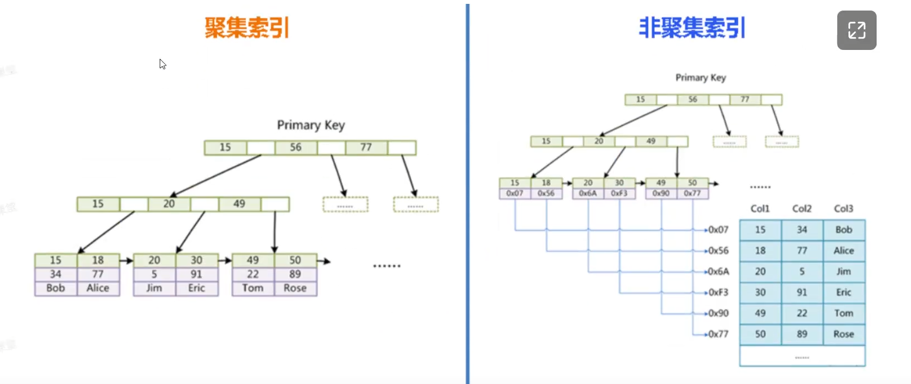

# MySQL常见面试题总结


## 1. 事务的四大特性？

**事务特性ACID**：**原子性**（`Atomicity`）、**一致性**（`Consistency`）、**隔离性**（`Isolation`）、**持久性**（`Durability`）。

- **原子性：**是指事务包含的所有操作要么全部成功，要么全部失败回滚。
- **一致性：**是指一个事务执行之前和执行之后都必须处于一致性状态。比如a与b账户共有1000块，两人之间转账之后无论成功还是失败，它们的账户总和还是1000。
- **隔离性：**。跟隔离级别相关，如`read committed`，一个事务只能读到已经提交的修改。
- **持久性：**是指一个事务一旦被提交了，那么对数据库中的数据的改变就是永久性的，即便是在数据库系统遇到故障的情况下也不会丢失提交事务的操作。


##  2. 事务隔离级别有哪些？

先了解下几个概念：脏读、不可重复读、幻读。

- **脏读：**是指在一个事务处理过程里读取了另一个未提交的事务中的数据。
- **不可重复读：**同一事务内，多次读取同一数据，结果**不一致**（因中间被其他事务**提交**的修改干扰）。
- **幻读：**同一事务内，多次执行相同的范围查询，结果集中的**行数不一致**（因中间被其他事务**提交**的插入 / 删除操作干扰）。

**不可重复读和脏读的区别：**脏读是某一事务读取了另一个事务未提交的脏数据，而不可重复读则是读取了前一事务提交的数据。

事务隔离就是为了解决上面提到的脏读、不可重复读、幻读这几个问题。

MySQL数据库为我们提供的四种隔离级别：

- **Serializable** (串行化)：通过强制事务排序，使之不可能相互冲突，从而解决幻读问题。
- **Repeatable read** (可重复读)：MySQL的默认事务隔离级别，它确保同一事务的多个实例在并发读取数据时，会看到同样的数据行，解决了不可重复读的问题。（整个事务期间只使用第一次创建的Read View 保证同一事务内多次读取同一数据结果一致 通过固定的一致性视图实现可重复读）
- **Read committed** (读已提交)：一个事务只能看见已经提交事务所做的改变。可避免脏读的发生。
- **Read uncommitted** (读未提交)：所有事务都可以看到其他未提交事务的执行结果。


## 3. 编码和字符集的关系

我们平时可以在编辑器上输入各种中文英文字母，但这些都是给人读的，不是给计算机读的，其实计算机真正保存和传输数据都是以**二进制**0101的格式进行的。

那么就需要有一个规则，把中文和英文字母转化为二进制。其中d对应十六进制下的64，它可以转换为01二进制的格式。于是字母和数字就这样一一对应起来了，这就是**ASCII编码**格式。

它用**一个字节**，也就是`8位`来标识字符，基础符号有128个，扩展符号也是128个。也就只能表示下**英文字母和数字**。

这明显不够用。于是，为了标识**中文**，出现了**GB2312**的编码格式。为了标识**希腊语**，出现了**greek**编码格式，为了标识**俄语**，整了**cp866**编码格式。

为了统一它们，于是出现了**Unicode编码格式**，它用了2~4个字节来表示字符，这样理论上所有符号都能被收录进去，并且它还完全兼容ASCII的编码，也就是说，同样是字母d，在ASCII用64表示，在Unicode里还是用64来表示。

但**不同的地方是ASCII编码用1个字节来表示，而Unicode用则两个字节来表示。**

同样都是字母d，unicode比ascii多使用了一个字节，如下：

```mysql
D   ASCII:           01100100
D Unicode:  00000000 01100100
```

可以看到，上面的unicode编码，前面的都是0，其实用不上，但还占了个字节，有点浪费。如果我们能做到该隐藏时隐藏，这样就能省下不少空间，按这个思路，就是就有了**UTF-8编码**。

总结一下，按照一定规则把符号和二进制码对应起来，这就是**编码**。而把n多这种已经编码的字符聚在一起，就是我们常说的**字符集**。

比如utf-8字符集就是所有utf-8编码格式的字符的合集。

想看下mysql支持哪些字符集。可以执行 `show charset`;


## 4. utf8和utf8mb4的区别

UTF-8 和 UTF8mb4 都是 Unicode 字符集的编码方式，主要区别在于对 ** supplementary characters（增补字符）** 的支持能力，以及由此带来的存储范围差异。以下是具体区别：

#### 1. **编码范围不同**

- **UTF-8**：是最常见的 UTF-8 编码实现，支持 **Unicode 基本多文种平面（BMP）** 中的字符，即 U+0000 到 U+FFFF 范围内的字符（包括绝大多数常用字符，如中文、英文、日文等）。每个字符的编码长度为 1~3 字节。
- **UTF8mb4**：是 “UTF-8 most bytes 4” 的缩写，支持 **全部 Unicode 字符**，包括基本多文种平面（U+0000~U+FFFF）和 **增补平面（U+10000~U+10FFFF）** 中的字符（如 emoji 表情、某些罕见语言字符、特殊符号等）。每个字符的编码长度为 1~4 字节。

#### 2. **核心差异：是否支持 4 字节字符**

- **UTF-8** 最多支持 3 字节编码，无法表示 Unicode 中编码值超过 U+FFFF 的字符（即 4 字节字符）。例如：
  - Emoji 表情（如 😊 U+1F60A、👍 U+1F44D）；
  - 某些罕见语言文字（如古埃及象形文字、数学符号等）；
  - 部分特殊符号（如 😂、🤣 等）。若强行存储这些字符，UTF-8 会出现编码错误或截断。
- **UTF8mb4** 支持 4 字节编码，可完整存储上述所有 Unicode 字符，包括 emoji 等增补字符。

#### 3. **应用场景（以 MySQL 为例）**

在数据库（如 MySQL）中，UTF-8 和 UTF8mb4 是常见的字符集设置，区别直接影响存储能力：

- 早期 MySQL 中的 `utf8` 实际上是 **UTF-8 的子集**（仅支持 3 字节），并非完整的 UTF-8 标准；
- `utf8mb4` 才是 MySQL 对完整 UTF-8 标准的实现（支持 4 字节）。

若数据库字段设置为 `utf8`，存储 emoji 等 4 字节字符时会报错（如 `Incorrect string value`），必须使用 `utf8mb4` 才能正常存储。

#### 4. **存储与性能影响**

- **存储空间**：UTF8mb4 由于支持 4 字节字符，在存储这类字符时会比 UTF-8 多占用 1 字节；但对于普通 1~3 字节字符（如中文、英文），两者存储长度相同，无额外开销。
- **性能**：两者在编码 / 解码效率上差异极小，实际使用中几乎无感知。但需注意：若数据库索引字段使用 UTF8mb4，且字符长度较长，可能会略微增加索引存储开销（需结合实际业务评估）。

#### 总结

| 特性                | UTF-8（狭义，如 MySQL 的 utf8） | UTF8mb4                     |
| ------------------- | ------------------------------- | --------------------------- |
| 支持的 Unicode 范围 | U+0000 ~ U+FFFF（3 字节内）     | U+0000 ~ U+10FFFF（全范围） |
| 4 字节字符支持      | ❌ 不支持（如 emoji）            | ✅ 支持                      |
| 存储长度            | 1~3 字节                        | 1~4 字节                    |
| 适用场景            | 仅需存储常见字符（无 emoji 等） | 需要存储 emoji、罕见字符等  |

**建议**：新系统开发中，若可能涉及 emoji、特殊符号或国际化罕见字符，优先使用 **UTF8mb4**，避免编码兼容性问题；若确认仅需处理基本字符，UTF-8 也可满足需求，但灵活性较低。


### 5. 什么是索引？

- 索引是存储引擎用于提高数据库表的访问速度的一种**数据结构**。它可以比作一本字典的目录，可以帮你快速找到对应的记录。
- 索引一般存储在磁盘的文件中，它是占用物理空间的。


## 6. 索引的优缺点？

- **优点**：
  - 大幅减少查询的磁盘 IO 次数，提升查询速度；
  - 优化排序、分组操作，降低 CPU 开销。
- **缺点**：
  - 占用额外磁盘空间（索引本身是独立的数据结构，需存储）；
  - 降低写操作效率（新增 / 修改 / 删除数据时，需同步更新对应的索引，避免索引与数据不一致）。


## 7. 什么情况下需要建索引？

1. 经常用于查询的字段
2. 经常用于`连接` (join) 的字段建立索引，可以加快连接的速度
3. 经常需要`排序`、`分组`的字段建立索引，因为索引已经排好序


## 8. 什么情况下不建索引？

1. 更新频繁的字段（索引会拉低写的效率）
2. 区分度很低的字段（唯一性差）如性别，只有男/女/未知三个值。加了索引，查询效率也不会提高。
3. 表数据量很少的情况。比如只有几百条数据，没必要加索引。
4. `where ` 条件中用不到的字段不适合建立索引


## 9. MySQL 索引的数据结构有哪些？

MySQL 中索引的数据结构根据引擎和应用场景的不同，主要有以下几种：

1. **B + 树索引**这是 MySQL 中最核心、最常用的索引结构，**InnoDB 和 MyISAM 引擎的默认索引类型**，特点是：
   - 多路平衡查找树，非叶子节点仅存索引键（作为目录），叶子节点存储实际数据（MyISAM）或主键指向的行数据（InnoDB 聚簇索引）。
   - 叶子节点通过双向链表连接，天然支持范围查询（如 `BETWEEN`、`ORDER BY`）和排序。
   - 适配磁盘 IO 特性，通过控制树高（通常 3-4 层）减少磁盘访问次数，提升查询效率。
2. **哈希索引**基于哈希表实现，**仅 Memory 引擎默认支持**，InnoDB 可通过 “自适应哈希索引”（Adaptive Hash Index）自动为热点数据创建（不可手动干预）。特点是：
   - 等值查询极快（O (1) 时间复杂度），但**不支持范围查询、排序、模糊查询**（如 `LIKE`）。
   - 哈希冲突会影响性能，且无法利用索引完成排序。
3. **R 树索引**用于**空间数据类型**（如 `GEOMETRY`）的索引，适合存储地理信息（如地图坐标），支持空间范围查询（如 “查找某区域内的点”）。
   - MyISAM 引擎支持 R 树索引，InnoDB 对空间索引的支持基于 B + 树优化实现。
4. **Full-Text 全文索引**用于**全文检索**（如文章内容中的关键词匹配），基于 “倒排索引” 原理（记录关键词到文档的映射）。
   - 支持 `MATCH AGAINST` 语法，适合大文本字段（如 `TEXT`）的模糊查询，替代低效的 `LIKE '%关键词%'`。
   - InnoDB 和 MyISAM 均支持，但 MyISAM 不支持中文分词（需依赖插件）。

**总结：**B + 树索引是 MySQL 中最主流的结构**，覆盖了绝大多数业务场景；其他结构（哈希、R 树、全文索引）仅用于特定场景（如内存表、空间数据、全文检索）。


## 10. Hash索引和B+树索引的区别？

Hash 索引和 B + 树索引是 MySQL 中两种不同原理的索引结构，核心区别体现在适用场景、查询能力和性能特性上，具体如下：

#### 1. **数据结构本质**

- **Hash 索引**：基于哈希表实现，通过哈希函数将索引键映射为哈希值，直接定位数据存储位置（类似字典的键值对）。
- **B + 树索引**：基于多路平衡查找树，索引键按顺序存储，非叶子节点作为 “目录” 指引查找方向，叶子节点存储数据或指针，且通过双向链表连接。

#### 2. **查询能力**

| 场景                          | Hash 索引                                                    | B + 树索引                            |
| ----------------------------- | ------------------------------------------------------------ | ------------------------------------- |
| **等值查询（=）**             | 效率极高（O (1)，无哈希冲突时）                              | 效率较高（O (log n)，树高决定）       |
| **范围查询（>、<、BETWEEN）** | 不支持（哈希值无序，无法比较范围）                           | 天然支持（叶子节点有序且链表连接）    |
| **排序（ORDER BY）**          | 不支持（哈希值无序，无法直接排序）                           | 支持（可利用索引顺序避免额外排序）    |
| **模糊查询（LIKE）**          | 仅支持前缀精确匹配（如`LIKE 'abc%'`，但需哈希值匹配，实际很少用） | 支持前缀匹配（利用索引有序性）        |
| **联合索引**                  | 仅能通过全部索引键的哈希值定位，无法利用部分前缀键           | 支持 “最左前缀原则”，可利用部分索引键 |

#### 3. **性能特性**

- **哈希冲突**：Hash 索引存在哈希冲突（不同键映射到同一哈希值），需通过链表或开放地址法解决，冲突严重时性能下降明显；B + 树无冲突问题。
- **索引维护**：数据插入 / 删除时，Hash 索引需重新计算哈希值，若冲突多，维护成本高；B + 树需调整树结构（旋转平衡），但复杂度可控。
- **存储空间**：Hash 索引存储哈希值，空间占用较小；B + 树需存储索引键和指针，空间占用更大，但索引键有序性可优化查询。

#### 4. **适用场景**

- **Hash 索引**：仅适合**等值查询频繁、无范围查询 / 排序**的场景，如内存表（Memory 引擎）或 InnoDB 的自适应哈希索引（针对热点数据自动优化）。
- **B + 树索引**：支持绝大多数业务场景，尤其是需要**范围查询、排序、联合索引前缀匹配**的场景（如订单表按时间范围查询、用户表按 ID + 姓名联合查询等），是 MySQL 的主流索引类型。

#### 总结

Hash 索引是 “专才”，仅在等值查询场景下性能占优，但功能局限大；B + 树索引是 “通才”，支持多样化查询需求，适配磁盘 IO 特性，是 MySQL 中最常用的索引结构。实际业务中，除非明确只有等值查询且性能敏感，否则优先选择 B + 树索引。


## 11. B树和B+树的区别？

B 树和 B + 树都是多路平衡查找树，常用于磁盘存储系统（如数据库、文件系统），但两者在结构设计和功能上有显著区别，核心差异如下：

#### 1. **数据存储位置**

- **B 树**：非叶子节点和叶子节点都存储实际数据（键值 + 数据）。例如，一个 B 树节点可能同时包含索引键和对应的数据记录。
- **B + 树**：仅叶子节点存储实际数据（键值 + 数据），非叶子节点仅存储索引键（作为 “目录”，不存数据）。非叶子节点的作用是指引查找方向，不包含具体业务数据。

#### 2. **叶子节点的连接方式**

- **B 树**：叶子节点之间无关联，是独立的节点。范围查询时，需从根节点重新遍历，效率低。
- **B + 树**：所有叶子节点通过**双向链表**连接，形成一个有序的链表。范围查询（如`BETWEEN`、`ORDER BY`）时，找到起始叶子节点后，可直接通过链表顺序遍历，无需回退到非叶子节点，效率极高。

#### 3. **树的高度与 IO 效率**

- **B 树**：由于非叶子节点存储数据，导致相同大小的节点能容纳的索引键数量更少（数据占用空间），树的高度更高。而磁盘 IO 次数与树高成正比，因此 B 树的 IO 成本更高。
- **B + 树**：非叶子节点仅存索引键，相同节点可容纳更多索引键，树高更低（通常 3-4 层），IO 次数更少，更适合磁盘存储（磁盘 IO 是数据库性能瓶颈）。

#### 4. **查询性能的稳定性**

- **B 树**：查询可能在非叶子节点命中（找到数据），也可能在叶子节点命中，查询效率不稳定（取决于数据所在层级）。
- **B + 树**：所有查询最终都必须到叶子节点才能获取数据，查询路径长度固定（等于树高），因此查询效率更稳定。

#### 5. **适用场景**

- **B 树**：适合随机访问为主的场景（如少量数据的内存数据库），但不适合范围查询频繁的场景。（实际数据库中较少用 B 树，更多用于文件系统索引等场景）
- **B + 树**：是数据库索引的首选（如 MySQL 的 InnoDB、MyISAM），原因是：
  - 树高更低，IO 效率高；
  - 叶子节点有序且链表连接，完美支持范围查询和排序；
  - 查询性能稳定，适合磁盘存储的特性。

#### 总结对比表

| 特性         | B 树                         | B + 树                         |
| ------------ | ---------------------------- | ------------------------------ |
| 数据存储位置 | 非叶子节点 + 叶子节点        | 仅叶子节点                     |
| 叶子节点连接 | 无关联                       | 双向链表连接                   |
| 树高         | 较高（相同数据量下）         | 较低（相同数据量下）           |
| 范围查询效率 | 低（需反复遍历根节点）       | 高（通过链表顺序遍历）         |
| 查询稳定性   | 不稳定（命中层级不确定）     | 稳定（必到叶子节点）           |
| 典型应用     | 少量数据的内存索引、文件系统 | 数据库索引（MySQL、Oracle 等） |

B + 树通过优化数据存储位置和叶子节点连接方式，更适配数据库的查询需求（尤其是范围查询）和磁盘 IO 特性，因此成为主流数据库索引的标准结构。


## 12. 索引有哪些分类？

MySQL 中的索引可以从不同维度进行分类，常见的分类方式及具体类型如下：

#### 一、按「数据结构」分类（核心分类）

1. **B + 树索引**最常用的索引类型，InnoDB 和 MyISAM 引擎的默认索引，支持等值查询、范围查询、排序等，是业务中最常使用的索引。
2. **哈希索引**基于哈希表实现，仅 Memory 引擎默认支持，InnoDB 有自适应哈希索引（自动为热点数据创建），仅适合等值查询，不支持范围查询和排序。
3. **R 树索引**用于空间数据类型（如 `GEOMETRY`），用于地理信息等空间查询，MyISAM 支持，InnoDB 基于 B + 树优化实现。
4. **Full-Text 全文索引**用于大文本字段的全文检索（如文章内容关键词匹配），基于倒排索引原理，支持 `MATCH AGAINST` 语法。

#### 二、按「物理存储」分类（InnoDB 核心特性）

1. **聚簇索引（Clustered Index）**
   - 索引键与数据行物理存储在一起，叶子节点直接存储完整数据行。
   - InnoDB 中，**主键索引就是聚簇索引**（若未定义主键，会用唯一索引或隐式自增 ID 作为聚簇索引）。
   - 特点：查询效率高（直接定位数据），但插入 / 更新可能导致页分裂，影响性能。
2. **非聚簇索引（Secondary Index，辅助索引）**
   - 索引与数据行分开存储，叶子节点存储的是**聚簇索引的键（主键）**，而非实际数据。
   - 例如：普通索引、联合索引、唯一索引等都属于非聚簇索引。
   - 查询流程：通过非聚簇索引找到主键，再通过聚簇索引定位数据（回表查询）。

#### 三、按「功能逻辑」分类

1. **主键索引（Primary Key）**
   - 唯一标识一行数据，不允许 `NULL`，一张表只能有一个主键索引。
   - InnoDB 中主键索引是聚簇索引，性能最优，建议优先用自增 ID 作为主键（减少页分裂）。
2. **唯一索引（Unique Index）**
   - 索引列的值必须唯一，但允许 `NULL`（多个 `NULL` 不冲突）。
   - 用于保证数据唯一性（如用户名、手机号），查询性能接近主键索引。
3. **普通索引（Normal Index）**
   - 最基础的索引，无唯一性约束，仅用于加速查询（如商品表的「分类 ID」索引）。
4. **联合索引（Composite Index）**
   - 由多个列组合而成的索引（如 `(a, b, c)`），遵循「最左前缀原则」：查询时需从左到右匹配索引列，否则无法完全利用索引。
   - 适合多条件查询（如 `where a=? and b=?`），可减少回表次数（覆盖索引场景）。
5. **前缀索引（Prefix Index）**
   - 对字符串列的前 N 个字符创建索引（如 `index(name(10))`），用于缩短索引长度、节省空间。
   - 缺点：无法用于排序和分组，且可能降低索引选择性（区分度）。

#### 四、其他特殊索引

- **空间索引（Spatial Index）**：基于 R 树或 B + 树，用于空间数据类型（如经纬度），支持空间关系查询（如「包含」「相交」）。
- **隐藏索引（Invisible Index）**：MySQL 8.0 新增，索引对优化器不可见（不影响查询），用于测试索引删除的影响（避免直接删除风险）。

#### 总结

索引分类的核心逻辑是：**数据结构决定底层实现，物理存储决定数据与索引的关联方式，功能逻辑决定适用场景**。实际开发中，最常用的是 B + 树结构的聚簇索引（主键）、非聚簇索引（普通索引、联合索引、唯一索引），需根据查询场景选择合适的类型（如多条件查询用联合索引，唯一性约束用唯一索引）。

| 分类维度       | 索引类型                | 核心特性                                                     | 适用场景                                     |
| -------------- | ----------------------- | ------------------------------------------------------------ | -------------------------------------------- |
| **按数据结构** | B + 树索引              | 多路平衡树，仅叶子存数据，叶子双向链表；支持等值 / 范围查询、排序 | 绝大多数业务场景（如订单查询、用户筛选）     |
|                | 哈希索引                | 基于哈希表，O (1) 等值查询；不支持范围 / 排序 / 模糊查询     | 内存表（Memory 引擎）、热点数据等值查询      |
|                | R 树索引                | 空间数据专用，支持地理范围查询（如包含、相交）               | 地图坐标、空间位置数据（如门店定位）         |
|                | Full-Text 全文索引      | 基于倒排索引，支持大文本关键词匹配；替代 `LIKE '%关键词%'`   | 文章内容、商品描述的全文检索                 |
| **按物理存储** | 聚集索引（Clustered）   | 索引与数据物理绑定，叶子存完整数据；InnoDB 中主键即聚集索引  | 主键查询（如按 ID 查用户信息）               |
|                | 非聚集索引（Secondary） | 索引与数据分离，叶子存主键；需 “回表” 查数据                 | 普通查询（如按手机号查用户、按分类查商品）   |
| **按功能逻辑** | 主键索引                | 唯一非空，一张表仅一个；InnoDB 中是聚簇索引                  | 唯一标识数据（如用户 ID、订单 ID）           |
|                | 唯一索引                | 索引列值唯一，允许 NULL；避免重复数据                        | 唯一字段（如手机号、邮箱、身份证号）         |
|                | 普通索引                | 无约束，仅加速查询；最基础的索引类型                         | 高频查询字段（如商品分类、订单状态）         |
|                | 联合索引                | 多列组合，遵循 “最左前缀原则”；可减少回表（覆盖索引）        | 多条件查询（如 `where 用户名=? and 时间=?`） |
|                | 前缀索引                | 对字符串前 N 个字符建索引；节省空间，降低选择性              | 长字符串字段（如用户名、地址）的模糊查询     |
| **其他特殊**   | 空间索引                | 对应空间数据类型（如 `GEOMETRY`）；基于 R 树或 B + 树优化    | 地理信息查询（如 “查找某商圈内的门店”）      |
|                | 隐藏索引（Invisible）   | 对优化器不可见，不影响查询；用于测试索引删除风险             | 索引优化测试（如验证某索引是否冗余）         |


## 13. 什么是最左匹配原则？

最左匹配原则（Leftmost Prefix Rule）是 MySQL 中**联合索引（多列组合索引）** 的核心使用规则，指的是：**联合索引在查询时，会优先匹配从最左侧开始的连续索引列，只有当左侧列被有效使用时，右侧列才能参与索引匹配**。

#### 具体原理

假设创建了一个联合索引 `idx(a, b, c)`（顺序为 `a → b → c`），则该索引的 “有效匹配顺序” 必须从最左侧的 `a` 开始，具体规则如下：

1. **全匹配**：查询条件包含 `a + b + c`（如 `where a=? and b=? and c=?`），可完整利用整个联合索引。

2. 前缀匹配

   - 只使用 `a`（如 `where a=?`），可利用索引的 `a` 部分。
   - 使用 `a + b`（如 `where a=? and b=?`），可利用索引的 `a + b` 部分。

3. **中断匹配**：如果跳过左侧列，右侧列无法单独使用索引。

   例如：`where b=?` 或 `where b=? and c=?`，**无法利用该联合索引**（因为跳过了最左侧的 `a`）。

4. **范围条件后的列失效**：如果左侧列使用了范围查询（如 `>、<、between`），则其右侧的列无法利用索引。

   例如：`where a=? and b> ? and c=?`，此时 `a` 和 `b` 可利用索引，但 `c` 无法利用（因 `b` 是范围查询，中断了后续匹配）。

#### 示例说明

假设有表 `user`，联合索引 `idx(name, age, city)`，分析以下查询是否能利用索引：

| 查询语句                                       | 是否利用索引 | 利用的索引部分 | 原因分析                      |
| ---------------------------------------------- | ------------ | -------------- | ----------------------------- |
| `where name='张三'`                            | 是           | `name`         | 匹配最左前缀 `name`           |
| `where name='张三' and age=20`                 | 是           | `name + age`   | 连续匹配左侧两列              |
| `where name='张三' and city='北京'`            | 是           | 仅 `name`      | 跳过 `age`，`city` 无法利用   |
| `where age=20 and city='北京'`                 | 否           | 无             | 跳过最左 `name`，全失效       |
| `where name='张三' and age>20 and city='北京'` | 是           | `name + age`   | `age` 是范围查询，`city` 失效 |

#### 为什么有这个原则？

联合索引的底层 B + 树结构是**按索引列顺序逐层排序**的：

- 先按 `a` 排序，`a` 相同的记录再按 `b` 排序，`b` 相同的再按 `c` 排序。
- 这种排序特性决定了索引只能从左到右依次匹配，跳过左侧列后，右侧列的排序逻辑就失去了基础（类似查字典必须先按首字母找，再按第二个字母）。


## 14. 什么是聚集索引和非聚集索引？

聚集索引（Clustered Index）和非聚集索引（Non-Clustered Index）是数据库中两种核心的索引类型，核心区别在于**索引与数据的物理存储关系**，以下是具体解析：

#### 一、聚集索引（Clustered Index）

**核心特点**：索引结构与数据行的物理存储直接绑定，索引的叶子节点就是数据本身。

1. **存储结构**
   - 聚集索引的 B + 树中，非叶子节点存储索引键（如主键），**叶子节点直接存储完整的数据行**。
   - 数据在磁盘上的物理存储顺序，与聚集索引键的逻辑顺序一致（如主键自增，则数据按主键从小到大排列）。
2. **关键特性**
   - **一张表只能有一个聚集索引**（数据物理顺序唯一）。
   - InnoDB 中，聚集索引默认是主键索引（若未定义主键，会用唯一索引或隐式自增 ID 替代）。
   - 查询时，找到索引键即可直接从叶子节点获取数据，**无需回表**（效率极高）。
3. **示例**假设表 `user` 以 `id` 为主键（聚集索引），则其索引结构如下：
   - 非叶子节点：存储 `id` 的范围（如 1-100、101-200）。
   - 叶子节点：直接存储 `id=1` 对应的 `name`、`age` 等完整字段数据，且按 `id` 顺序排列。

#### 二、非聚集索引（Non-Clustered Index）

**核心特点**：索引与数据物理存储分离，索引叶子节点存储的是 “指向数据的指针”（InnoDB 中是聚集索引的键，如主键）。

1. **存储结构**
   - 非聚集索引的 B + 树中，非叶子节点和叶子节点都存储索引键，但**叶子节点不存储完整数据**，而是存储 “聚集索引的键”（如主键值）。
   - 索引的逻辑顺序与数据的物理存储顺序无关。
2. **关键特性**
   - **一张表可以有多个非聚集索引**（如普通索引、联合索引、唯一索引等）。
   - 查询时，需先通过非聚集索引找到主键，再通过聚集索引定位数据（称为 “回表查询”）。
   - 若查询字段刚好是索引包含的字段（覆盖索引），则无需回表，直接返回结果。
3. **示例**表 `user` 上有非聚集索引 `idx_age(age)`，则：
   - 索引的叶子节点存储 `age` 的值和对应的 `id`（主键）。
   - 执行 `where age=20` 时，先通过 `idx_age` 找到所有 `age=20` 的 `id`，再通过聚集索引（`id`）查询完整数据。

#### 三、核心区别对比

| 维度           | 聚集索引                 | 非聚集索引                     |
| -------------- | ------------------------ | ------------------------------ |
| 数据与索引关系 | 索引叶子节点 = 数据行    | 索引与数据分离，叶子存主键     |
| 数量限制       | 一张表仅 1 个            | 一张表可多个                   |
| 查询流程       | 直接获取数据（无需回表） | 需先查索引得主键，再回表查数据 |
| 物理存储顺序   | 与索引键顺序一致         | 与索引键顺序无关               |
| 典型应用       | 主键索引（InnoDB 默认）  | 普通索引、联合索引、唯一索引   |

#### 四、使用场景建议

- **聚集索引**：适合高频的主键查询、范围查询（如 `where id between 100 and 200`），依赖其 “数据有序 + 无需回表” 的特性。
- **非聚集索引**：适合基于非主键字段的查询（如 `where age=20`），但需注意避免频繁回表（可通过覆盖索引优化）。

理解两者的区别，能帮助设计更合理的索引结构（如用自增 ID 作为聚集索引减少页分裂，用联合索引实现覆盖查询），提升数据库性能。




## 15. 什么是覆盖索引？

覆盖索引（Covering Index）是一种能**直接从索引中获取查询所需的全部数据**，无需通过索引回表查询数据行的索引类型，核心价值是减少磁盘 IO，大幅提升查询效率。

#### 一、覆盖索引的核心原理

普通非聚簇索引（如普通索引、联合索引）的叶子节点，仅存储 “索引键 + 聚簇索引键（主键）”。当查询需要的字段超出索引包含的范围时，必须通过主键回表（即再次查询聚簇索引）才能获取完整数据，这个过程会增加一次磁盘 IO。

而覆盖索引的关键在于：**索引包含了查询语句中所有需要的字段**（包括 `SELECT` 后的字段、`WHERE` 条件中的字段）。此时查询只需扫描索引，无需回表，直接从索引中提取所有所需数据。

#### 二、覆盖索引的典型场景

覆盖索引通常基于**联合索引**实现（单一字段的普通索引，仅能覆盖 “查询条件 + 该字段本身” 的场景，适用范围较窄），以下是具体示例：

假设存在表 `order`，结构如下：

| 字段名      | 类型        | 索引情况               |
| ----------- | ----------- | ---------------------- |
| id          | int         | 主键（聚簇索引）       |
| order_no    | varchar(50) | 普通索引（非聚簇索引） |
| user_id     | int         | 无索引                 |
| create_time | datetime    | 无索引                 |
| status      | tinyint     | 无索引                 |

**场景 1：普通索引无法覆盖，需回表**

若执行查询：

```sql
SELECT id, order_no, status FROM `order` WHERE order_no = '20240501001';
```

- 此时使用的索引是 `order_no` 普通索引，其叶子节点仅存储 `order_no` 和主键 `id`。
- 查询需要的 `status` 字段不在索引中，必须通过 `id` 回表查询聚簇索引，才能获取 `status`，存在额外 IO。

**场景 2：联合索引实现覆盖，无需回表**

若创建联合索引 `idx_order_no_status(order_no, status)`，再执行相同查询：

```sql
SELECT id, order_no, status FROM `order` WHERE order_no = '20240501001';
```

- 联合索引 `idx_order_no_status` 的叶子节点，存储了 `order_no`、`status` 和主键 `id`。
- 查询需要的 `id`（主键，默认包含在非聚簇索引中）、`order_no`、`status` 均在索引内，无需回表，直接从索引提取数据。


## 16. 索引的设计原则？

1. **优先为高频查询字段建索引**
2. **区分度高的字段优先作为索引列（区分度 = 不同值数量 / 总记录数）**
3. **联合索引遵循 “最左前缀 + 高频字段靠左”**
4. **控制索引数量，避免过度索引**
5. **利用覆盖索引减少回表**


## 17. 索引什么时候会失效？

MySQL 索引失效是查询性能下降的常见原因，本质是由于查询条件或索引使用方式不符合 B + 树索引的匹配规则，导致优化器放弃使用索引，转而进行全表扫描。以下是常见的索引失效场景及原因分析：

#### 一、索引列参与计算或函数操作

**原因**：索引存储的是原始值，若对索引列进行计算、函数处理（如 `SUBSTR()`、`DATE_FORMAT()` 等），优化器无法直接匹配索引值，只能全表扫描后再处理。**

```sql
-- 索引：idx_create_time(create_time)
SELECT * FROM order WHERE UNIX_TIMESTAMP(create_time) > 1620000000; -- 失效（函数操作）
SELECT * FROM user WHERE age + 1 = 20; -- 失效（计算操作）
```

**优化**：避免对索引列直接操作，改为对常量操作（如 `age = 19`）。

#### 二、使用 `NOT IN`、`!=`、`<>` 或 `IS NOT NULL`

**原因**：这些操作会导致索引无法有效筛选数据（返回结果集可能过大），优化器可能选择全表扫描。**示例**：

```sql
-- 索引：idx_status(status)
SELECT * FROM order WHERE status != 1; -- 失效（!=）
SELECT * FROM user WHERE phone NOT IN ('13800138000', '13900139000'); -- 失效（NOT IN）
```

**注意**：若结果集占比极小（如 `<10%`），索引可能仍有效，具体取决于数据分布。

#### 三、`LIKE` 以通配符 `%` 开头（左模糊查询）

**原因**：`LIKE '%xxx'` 或 `LIKE '%xxx%'` 是 “前缀模糊匹配”，索引的有序性无法利用（类似查字典不知道首字母），导致索引失效。

```sql
-- 索引：idx_name(name)
SELECT * FROM user WHERE name LIKE '%三'; -- 失效（%开头）
SELECT * FROM user WHERE name LIKE '%张三%'; -- 失效（前后%）
```

**例外**：`LIKE 'xxx%'`（后缀模糊匹配）可利用索引的最左前缀，索引有效。**优化**：改用全文索引（`Full-Text`）处理复杂模糊查询。

#### 四、联合索引不满足最左前缀原则

**原因**：联合索引的匹配必须从最左侧列开始，跳过左侧列或中断顺序会导致后续列索引失效。

**示例**（联合索引 `idx(a, b, c)`）：

```sql
SELECT * FROM t WHERE b = 1; -- 失效（跳过最左a）
SELECT * FROM t WHERE a = 1 AND c = 3; -- 仅a有效，c失效（跳过b）
SELECT * FROM t WHERE a > 1 AND b = 2; -- a有效，b失效（a是范围查询）
```

**注意**：范围查询（`>、<、BETWEEN`）会导致其右侧的联合索引列失效。

#### 五、索引列与常量类型不匹配（隐式转换、类似与索引列参与函数计算）

**原因**：若索引列类型与查询条件的常量类型不一致，MySQL 会进行隐式类型转换（如字符串转数字），相当于对索引列做了函数操作，导致索引失效。

```sql
-- 索引：idx_phone(phone)，phone是varchar类型
SELECT * FROM user WHERE phone = 13800138000; -- 失效（隐式转换：字符串→数字）
```

**优化**：保证查询条件的类型与索引列一致（如 `phone = '13800138000'`）。

#### 六、`OR` 连接的条件中存在非索引列

**原因**：`OR` 两边的条件需都有索引才能生效，若一侧无索引，优化器会认为全表扫描更高效。

```sql
-- 索引：idx_name(name)，age无索引
SELECT * FROM user WHERE name = '张三' OR age = 20; -- 失效（age无索引）
```

**优化**：将 `OR` 改为 `UNION`（需两侧条件都有索引），或为 `age` 也创建索引。

#### 七、优化器判断全表扫描更快

**原因**：若查询结果集占表数据量的比例过大（如 `>30%`），优化器会认为全表扫描比遍历索引更高效（索引需要额外 IO），主动放弃索引。

```sql
-- 索引：idx_status(status)，但表中90%的记录status=1
SELECT * FROM order WHERE status = 1; -- 可能失效（结果集过大）
```

**注意**：比例阈值由 MySQL 内部统计信息决定，可通过 `ANALYZE TABLE` 更新统计信息。

#### 如何判断索引是否失效？

使用 `EXPLAIN` 分析查询计划，若 `type` 列显示 `ALL`（全表扫描），且 `key` 列显示 `NULL`，说明索引失效。

```sql
EXPLAIN SELECT * FROM user WHERE name LIKE '%三';
-- type=ALL，key=NULL → 索引失效
```

#### 总结

索引失效的核心原因是**查询条件破坏了 B + 树的有序性**，或**优化器认为全表扫描更高效**。实际开发中，需通过 `EXPLAIN` 验证索引使用情况，避免上述场景，同时结合数据分布调整索引设计（如区分度低的字段不建索引）。


## 18. 什么是前缀索引？

前缀索引（Prefix Index）是针对**字符串类型字段**的一种索引优化方式，指仅对字符串的**前 N 个字符**创建索引，而非整个字符串，核心目的是减少索引占用空间、提升索引维护和查询效率。

#### 一、前缀索引的核心作用

字符串字段（如 `VARCHAR(255)`、`TEXT`）若直接创建完整索引，会存在两个问题：

1. **索引体积过大**：长字符串会导致索引节点（B + 树非叶子节点）存储的索引键数量减少，树高增加，进而增加磁盘 IO 次数。
2. **维护成本高**：插入 / 更新时，需处理完整字符串的索引排序和存储，耗时更长。

前缀索引通过截取字符串的前 N 个字符建索引，能有效解决上述问题：

- 缩短索引键长度，让索引节点容纳更多索引键，降低树高，减少 IO。
- 减少索引占用的磁盘空间，同时降低写入时的索引维护成本。


## 19. 索引下推是什么？

索引下推（Index Condition Pushdown，简称 ICP）是 MySQL 5.6 引入的一种**索引查询优化技术**，核心作用是**在索引扫描过程中提前过滤不符合条件的数据**，减少回表次数，提升查询效率。

#### 一、索引下推的工作原理

在没有 ICP 的情况下，非聚簇索引（如普通索引、联合索引）的查询流程是：

1. 遍历索引，找到所有满足**最左前缀条件**的索引项（如联合索引 `(a, b)` 中，先匹配 `a=1`）。
2. 无论其他条件（如 `b=2`）是否满足，都通过主键回表查询完整数据行。
3. 在服务器层（Server Layer）对回表后的数据行进行过滤（如判断 `b=2` 是否成立）。

**ICP 优化后**，流程变为：

1. 遍历索引，找到满足最左前缀条件的索引项。
2. **直接在索引层面**（存储引擎层，Storage Engine Layer），用其他条件（如 `b=2`）过滤索引中包含的字段。
3. 仅对过滤后符合条件的索引项，才通过主键回表查询完整数据行。

简单说：ICP 让过滤逻辑 “下沉” 到存储引擎层的索引扫描阶段，减少了需要回表的数据量。


## 20. 常见的存储引擎有哪些？

MySQL 中常见的存储引擎主要有 **InnoDB、MyISAM、Memory** 等，不同引擎在事务支持、锁机制、存储结构等核心特性上差异显著，适用场景也不同，以下是主流存储引擎的详细对比：

#### 一、主流存储引擎核心特性对比

| 特性维度     | InnoDB（MySQL 5.5+ 默认）   | MyISAM（早期默认）          | Memory（内存引擎） |
| ------------ | --------------------------- | --------------------------- | ------------------ |
| **事务支持** | 支持（ACID 特性）           | 不支持                      | 不支持             |
| **锁机制**   | 行级锁（支持高并发）        | 表级锁（并发差）            | 表级锁             |
| **外键约束** | 支持                        | 不支持                      | 不支持             |
| **存储结构** | 聚簇索引（数据 + 索引绑定） | 非聚簇索引（分离）          | 内存中存储（临时） |
| **崩溃恢复** | 支持（redo/undo 日志）      | 不支持（易丢失数据）        | 重启后数据丢失     |
| **适用场景** | 业务表（订单、用户、支付）  | 只读 / 低频写（日志、报表） | 临时表、缓存数据   |


## 21. MySQL有哪些锁？

- MySQL 的锁可以按 **粒度** 和 **特性** 两大维度梳理，核心是控制并发、保证数据一致性，以下是精简总结：

#### 一、按锁粒度（最核心）

**1. 全局锁（粒度最粗）**

- **锁定范围**：整个 MySQL 实例（所有数据库、所有表）。
- **类型**：全局只读锁（排他性，阻塞所有写入）。
- **加锁方式**：`FLUSH TABLES WITH READ LOCK;`（释放：`UNLOCK TABLES;`）。
- **特点**：加锁期间仅允许 `SELECT`，阻塞所有写入、表结构修改和事务提交；影响范围极大。
- **场景**：全库逻辑备份（非 InnoDB 为主的场景），保证备份数据时间点一致性。

**2. 行级锁（InnoDB 特有，粒度最细）**

- 类型
  - 共享锁（S 锁）：读锁，多个事务可同时持有，互不阻塞。
  - 排他锁（X 锁）：写锁，仅一个事务持有，阻塞所有其他锁（包括 S 锁）。
- **特点**：并发性能高（只锁单行），但开销大，可能死锁。
- **场景**：高并发读写（如订单表、用户表的行更新）。

**3. 表级锁（粒度较粗）**

- 类型
  - 读锁 / 写锁：MyISAM 主要依赖，写锁阻塞所有读写，并发差。
  - 意向锁（IS/IX）：InnoDB 特有，行锁的 “声明”，避免表锁与行锁冲突。（仅为声明要加行锁）
  - 自增锁：保证自增列唯一性，MySQL 8.0 后优化为轻量锁。
- **特点**：开销小，无死锁，但并发低（锁全表）。
- **场景**：MyISAM 表、全表操作（如 `ALTER TABLE`）。

**4. 页级锁（极少用）**

- 粒度介于行和表之间，仅少数引擎（如 BDB）支持，主流场景不用。

按粒度从粗到细排序：**全局锁 → 表级锁 → 页级锁 → 行级锁**，锁粒度越粗，并发性能越低但开销越小；粒度越细，并发性能越高但开销越大。全局锁因影响范围极大，实际中需谨慎使用，优先用 InnoDB 的事务快照替代。

#### 二、InnoDB 特有锁（解决事务隔离）

- **间隙锁**：锁定索引间隙（如 `id=10` 和 `id=20` 之间），防止插入新数据（解决幻读）。
- **临键锁**：行锁 + 间隙锁的组合，默认锁机制，锁定记录及相邻间隙。
- **记录锁**：仅锁定单条索引记录（如主键等值查询时）。

#### 三、按锁策略（业务视角）

- **悲观锁**：假设冲突多，直接加锁（如 `SELECT ... FOR UPDATE`），适合写多读少场景（如库存扣减）。
- **乐观锁**：假设冲突少，用版本号控制（如 `WHERE version=?`），适合读多写少场景（如商品信息更新）。

#### 四、锁的兼容性（核心规则）

不同锁之间的兼容性决定了并发操作是否允许，以下是关键兼容关系（√ 表示兼容，× 表示冲突）：

| 当前锁 \ 请求锁  | 共享锁（S） | 排他锁（X） | 意向共享锁（IS） | 意向排他锁（IX） |
| ---------------- | ----------- | ----------- | ---------------- | ---------------- |
| 共享锁（S）      | √           | ×           | √                | ×                |
| 排他锁（X）      | ×           | ×           | ×                | ×                |
| 意向共享锁（IS） | √           | ×           | √                | √                |
| 意向排他锁（IX） | ×           | ×           | √                | √                |

#### 核心结论

- **InnoDB 是主流**：依赖行级锁（S/X）、意向锁、间隙锁 / 临键锁，支持高并发和事务。
- **锁的选择原则**：粒度细（行锁）优先保证并发，粒度粗（表锁）适合简单场景；根据冲突频率选悲观 / 乐观锁。


## 22. MVCC 是什么？

MVCC（多版本并发控制）是 InnoDB 实现高并发的核心机制，核心逻辑可简化为：

#### 核心目标

让 **读不阻塞写，写不阻塞读**，同时保证事务隔离性（避免脏读、不可重复读）。

#### 实现三要素

1. **数据多版本**：每行数据保存多个历史版本，通过隐藏字段记录：
   - 最新修改的事务 ID（`DB_TRX_ID`）
   - 指向旧版本的指针（`DB_ROLL_PTR`，形成版本链）。
2. **undo 日志**：存储数据的历史版本，供读操作访问（写操作时，旧数据被移到这里）。
3. **读视图（Read View）**：事务读数据时生成的 “快照”，用来判断哪个版本的数据可见（基于事务 ID 对比）。

#### 工作流程

- **写操作**：修改数据时，生成新的版本（记录当前事务 ID），旧版本存入 undo 日志，通过指针串联成版本链。
- **读操作**：根据读视图的规则，在版本链中找到 “对当前事务可见” 的版本（无需加锁，直接读历史版本）。

#### 隔离级别差异

- **读已提交（RC）**：每次查询都生成新的读视图，能看到其他事务刚提交的内容。
- **可重复读（RR，默认）**：事务开始时生成一次读视图，后续查询复用，保证多次读结果一致。

简单说：MVCC 通过 “保存历史版本 + 判断可见性”，让读写并行不冲突，兼顾并发和数据一致性。


## 23. 快照读和当前读？

快照读和当前读是 InnoDB 中两种核心的读取方式，核心区别在于**是否读取数据的最新版本**，以及是否加锁，直接影响事务隔离性和并发性能：

| 对比维度     | 快照读（Snapshot Read）          | 当前读（Current Read）                       |
| ------------ | -------------------------------- | -------------------------------------------- |
| 读取数据版本 | 历史版本（基于 MVCC）            | 最新版本（当前磁盘数据）                     |
| 是否加锁     | 不加锁（非阻塞读）               | 加锁（X 锁 / S 锁，可能阻塞）                |
| 触发语句     | 普通 `SELECT`（无锁语法）        | 写操作（UPDATE/DELETE/INSERT）、显式加锁查询 |
| 核心用途     | 普通查询（如列表查询、详情查询） | 数据修改、需要强一致性的查询（如库存扣减）   |
| 并发性能     | 高（读写不冲突）                 | 低（加锁阻塞）                               |


## 24. 共享锁和排他锁

共享锁（S 锁，Shared Lock）和排他锁（X 锁，Exclusive Lock）是 InnoDB 行级锁的核心类型，核心区别是**是否允许其他事务同时访问同一数据**，直接决定了并发读写的规则：

#### 一、共享锁（S 锁）：“读锁”，支持并发读

- **核心作用**：保证事务对数据的 “只读权限”，不允许修改。
- **加锁方式**：通过 `SELECT ... LOCK IN SHARE MODE;` 显式加锁（事务内有效）。
- 关键特性
  1. **共享性**：多个事务可同时对同一行加 S 锁（比如事务 A 和事务 B 都读同一行，互不阻塞）。
  2. **阻塞写**：加了 S 锁的行，其他事务想加 X 锁（修改 / 删除）会被阻塞，必须等所有 S 锁释放。
- **适用场景**：需要 “读数据并确保数据不被修改” 的场景（如统计报表生成，避免统计过程中数据被改导致结果不准）。

#### 二、排他锁（X 锁）：“写锁”，独占数据

- **核心作用**：保证事务对数据的 “独占修改权限”，不允许其他事务读写。
- 加锁方式
  1. 隐式：`UPDATE`/`DELETE`/`INSERT` 操作会自动为涉及的行加 X 锁（事务提交 / 回滚后释放）。
  2. 显式：通过 `SELECT ... FOR UPDATE;` 主动为查询行加 X 锁（事务内有效）。
- 关键特性
  1. **独占性**：同一行只能有一个事务持有 X 锁（其他事务加 S 锁或 X 锁都会被阻塞）。
  2. **阻塞所有**：加了 X 锁的行，其他事务的读（加 S 锁）和写（加 X 锁）都会被阻塞，直到 X 锁释放。
- **适用场景**：需要 “修改数据并确保数据不被其他事务干扰” 的场景（如库存扣减、订单状态更新，避免并发修改导致超卖或状态混乱）。

#### 三、核心区别与兼容性

| 对比维度 | 共享锁（S 锁）                 | 排他锁（X 锁）                       |
| -------- | ------------------------------ | ------------------------------------ |
| 核心权限 | 只读（不可写）                 | 读写（独占）                         |
| 并发支持 | 多事务可同时加锁（共享读）     | 仅一个事务可加锁（独占写）           |
| 兼容性   | 与其他 S 锁兼容，与 X 锁冲突   | 与所有锁（S/X）都冲突                |
| 加锁方式 | 仅显式（`LOCK IN SHARE MODE`） | 隐式（写操作）+ 显式（`FOR UPDATE`） |
| 典型场景 | 报表统计、数据校验（只读）     | 库存扣减、状态更新（读写）           |

#### 一句话总结

共享锁是 “大家一起读，谁也不能改”；排他锁是 “我要改，谁也不能读也不能改”，两者配合实现了 InnoDB 行级锁的并发控制。


