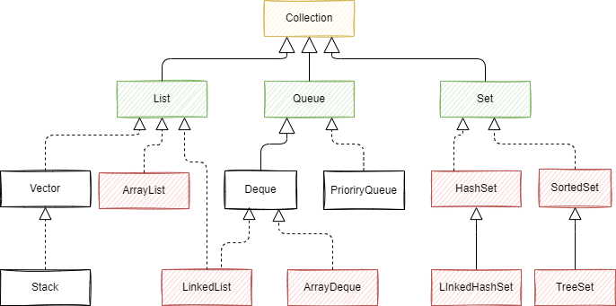

# Java集合常见面试题总结

##  常见的集合有哪些？

Java集合类主要由两个接口**Collection**和**Map**派生出来的，Collection有三个子接口：List、Set、Queue。

Java集合框架图如下：



List代表了有序可重复集合，可直接根据元素的索引来访问；Set代表无序不可重复集合，只能根据元素本身来访问；Queue是队列集合。Map代表的是存储key-value对的集合，可根据元素的key来访问value。

集合体系中常用的实现类有`ArrayList、LinkedList、HashSet、TreeSet、HashMap、TreeMap`等实现类。

## List 、Set和Map 的区别

- List 以索引来存取元素，有序的，元素是允许重复的，可以插入多个null；
- Set 不能存放重复元素，无序的，只允许一个null；
- Map 保存键值对映射；
- List 底层实现有数组、链表两种方式；Set、Map 容器有基于哈希存储和红黑树两种方式实现；
- Set 基于 Map 实现，Set 里的元素值就是 Map的键值。


## ArrayList 了解吗？

ArrayList 是 Java 集合框架中最常用的 `List` 实现类之一，底层基于**动态数组**实现，支持快速随机访问，是日常开发中存储有序、可重复元素的首选容器。以下从底层原理、核心特性、常用操作及面试注意等方面详细解析：

#### 一、底层数据结构

ArrayList 内部维护一个**Object 类型的数组**（`elementData`），用于存储元素。其核心特点是：

- 数组的长度（`capacity`）会根据元素数量动态扩容（扩容以1.5倍）（初始化时可指定初始容量，默认初始容量为 `10`）。
- 支持通过索引（`index`）直接访问元素（类似数组的 `get(index)`），因此**查询效率高**（时间复杂度 `O(1)`）。

#### 二、核心特性

1. **有序性**：元素按插入顺序存储，遍历顺序与插入顺序一致。
2. **可重复性**：允许添加重复元素（通过 `equals()` 判断，相同元素可多次插入）。
3. **允许 null**：可以存储 `null` 值（且可多次添加）。
4. **线程不安全**：未实现同步机制，多线程并发修改时可能导致数据不一致（如需线程安全，可使用 `Collections.synchronizedList(new ArrayList<>())` 或 `CopyOnWriteArrayList`）。
5. **动态扩容**：当元素数量超过当前容量时，会自动扩容以容纳更多元素。


## 怎么在遍历 ArrayList 时移除一个元素？

在遍历 `ArrayList` 时移除元素需要特别注意，若操作不当可能导致 **`ConcurrentModificationException`（并发修改异常）** 或漏删元素。以下是几种安全的实现方式及原理分析：

#### 一、为什么直接遍历删除会出问题？

先看一个错误示例：使用 **for-each 循环（增强 for 循环）** 或 **普通 for 循环正向遍历** 时直接删除元素：

```java
List<String> list = new ArrayList<>(Arrays.asList("A", "B", "C", "D"));

// 错误方式1：for-each循环删除
for (String s : list) {
    if ("B".equals(s)) {
        list.remove(s); // 会抛出 ConcurrentModificationException
    }
}

// 错误方式2：普通for循环正向遍历删除（可能漏删）
for (int i = 0; i < list.size(); i++) {
    if ("B".equals(list.get(i))) {
        list.remove(i); // 删除后元素前移，导致下一个元素被跳过
    }
}
```

**原因分析**：

- `ArrayList` 内部通过 `modCount` 变量记录修改次数（添加、删除等操作会使 `modCount` 递增）。
- for-each 循环底层依赖 `Iterator` 迭代器，迭代器初始化时会记录当前 `modCount`（`expectedModCount`）。若遍历中通过 `list.remove()` 修改了 `modCount`，会导致 `expectedModCount != modCount`，触发 `ConcurrentModificationException`。
- 普通 for 循环正向删除时，删除元素后数组会前移（如删除索引 `i` 的元素后，原索引 `i+1` 的元素会移到 `i`），若 `i` 继续递增，会跳过该元素，导致漏删。

#### 二、安全的删除方式

**1. 使用 `Iterator` 迭代器的 `remove()` 方法（推荐）**

迭代器的 `remove()` 方法会同步更新 `expectedModCount` 和 `modCount`，避免并发修改异常，是最标准的方式：

```java
List<String> list = new ArrayList<>(Arrays.asList("A", "B", "C", "D"));

Iterator<String> iterator = list.iterator();
while (iterator.hasNext()) {
    String s = iterator.next();
    if ("B".equals(s)) {
        iterator.remove(); // 调用迭代器的remove()，而非list.remove()
    }
}

System.out.println(list); // 输出：[A, C, D]（正确删除）
```

**注意**：

- 调用 `iterator.remove()` 前必须先调用 `iterator.next()`（否则会抛 `IllegalStateException`）。
- 每次 `next()` 后只能调用一次 `remove()`（连续调用会报错）。

**2. 普通 for 循环 从后往前遍历 删除**

从后往前遍历可避免元素前移导致的漏删问题（删除当前元素后，前面的元素索引不变）：

```java
List<String> list = new ArrayList<>(Arrays.asList("A", "B", "C", "D"));

for (int i = list.size() - 1; i >= 0; i--) {
    if ("B".equals(list.get(i))) {
        list.remove(i); // 从后往前删，索引不会混乱
    }
}

System.out.println(list); // 输出：[A, C, D]（正确删除）
```

 **3. JDK 8+：使用 `removeIf()` 方法（简洁高效）**

`ArrayList` 实现了 `Collection` 接口的 `removeIf()` 方法，内部通过迭代器实现，可一行代码完成删除：

```java
List<String> list = new ArrayList<>(Arrays.asList("A", "B", "C", "D"));

list.removeIf(s -> "B".equals(s)); // 传入Predicate条件，自动安全删除

System.out.println(list); // 输出：[A, C, D]
```


##  Arraylist 和 Vector 的区别？

`ArrayList` 和 `Vector` 都是 Java 集合框架中 `List` 接口的实现类，底层均基于**动态数组**实现，支持有序、可重复、允许 `null` 的元素存储，但二者在**线程安全性、性能、扩容机制**等核心维度存在显著差异，以下是详细对比：

| 对比维度         | ArrayList                                                    | Vector                                                       |
| ---------------- | ------------------------------------------------------------ | ------------------------------------------------------------ |
| **线程安全性**   | 线程不安全（无同步机制）                                     | 线程安全（方法加 `synchronized`）                            |
| **性能**         | 效率高（无锁竞争，适合单线程）                               | 效率低（全表锁，多线程竞争激烈）                             |
| **扩容机制**     | JDK 8+：默认初始容量 0（首次添加扩至 10），扩容为**旧容量的 1.5 倍** | 默认初始容量 10，扩容为**旧容量的 2 倍**（或指定增量）       |
| **迭代器安全性** | 迭代器（`Iterator`）是**快速失败（fail-fast）** 的，遍历中修改会抛 `ConcurrentModificationException` | 支持 `Enumeration` 迭代器（慢速失败，遍历中修改不抛异常），也支持 `Iterator`（快速失败） |
| **API 丰富度**   | 无 `elements()`、`capacity()` 等 Vector 特有方法             | 提供 `elements()`（返回 `Enumeration`）、`setSize()`、`capacity()` 等特有方法 |
| **历史版本**     | JDK 1.2 引入（属于 Collections Framework 标准组件）          | JDK 1.0 引入（古老类，后适配 List 接口）                     |


## Arraylist 与 LinkedList的区别？

`ArrayList` 和 `LinkedList` 是 Java 集合框架中 `List` 接口的两大核心实现类，虽然都支持**有序、可重复、允许 null** 的元素存储，但底层数据结构完全不同，导致二者在 **查询效率、增删效率、内存占用** 等维度差异显著。以下从底层原理到实际应用进行全面对比：

| 对比维度         | ArrayList                                                    | LinkedList                                                   |
| ---------------- | ------------------------------------------------------------ | ------------------------------------------------------------ |
| **底层数据结构** | 动态数组（Object [] elementData）                            | 双向链表（节点存储元素 + 前后指针）                          |
| **随机访问效率** | 高（直接通过索引访问，时间复杂度 `O(1)`）                    | 低（需从头 / 尾遍历到目标索引，`O(n)`）                      |
| **增删效率**     | 尾部增删快（`O(1)`）；中间 / 头部增删慢（需移动元素，`O(n)`） | 任意位置增删快（仅需修改节点指针，`O(1)`，前提是已找到目标节点） |
| **内存占用**     | 连续内存空间，可能有冗余容量（数组扩容后未使用的空间）       | 非连续内存空间，每个节点需额外存储前后指针（内存开销更大）   |
| **线程安全性**   | 线程不安全（无同步机制）                                     | 线程不安全（无同步机制）                                     |
| **迭代器支持**   | 仅支持 `Iterator`/`ListIterator`                             | 支持 `Iterator`/`ListIterator`，且实现 `Deque` 接口（可作为双端队列使用） |
| **适用场景**     | 频繁查询、尾部增删的场景                                     | 频繁在中间 / 头部增删、作为队列 / 栈的场景                   |


## 讲讲对HashMap的了解？

`HashMap` 是 Java 集合框架中最常用的 `Map` 实现类，基于**哈希表**（JDK 8+ 为**数组 + 链表 + 红黑树**）实现，用于存储**键值对（key-value）**，具有**查询、插入、删除效率高**（平均 `O(1)`）的特点，是日常开发中处理键值映射的首选容器。