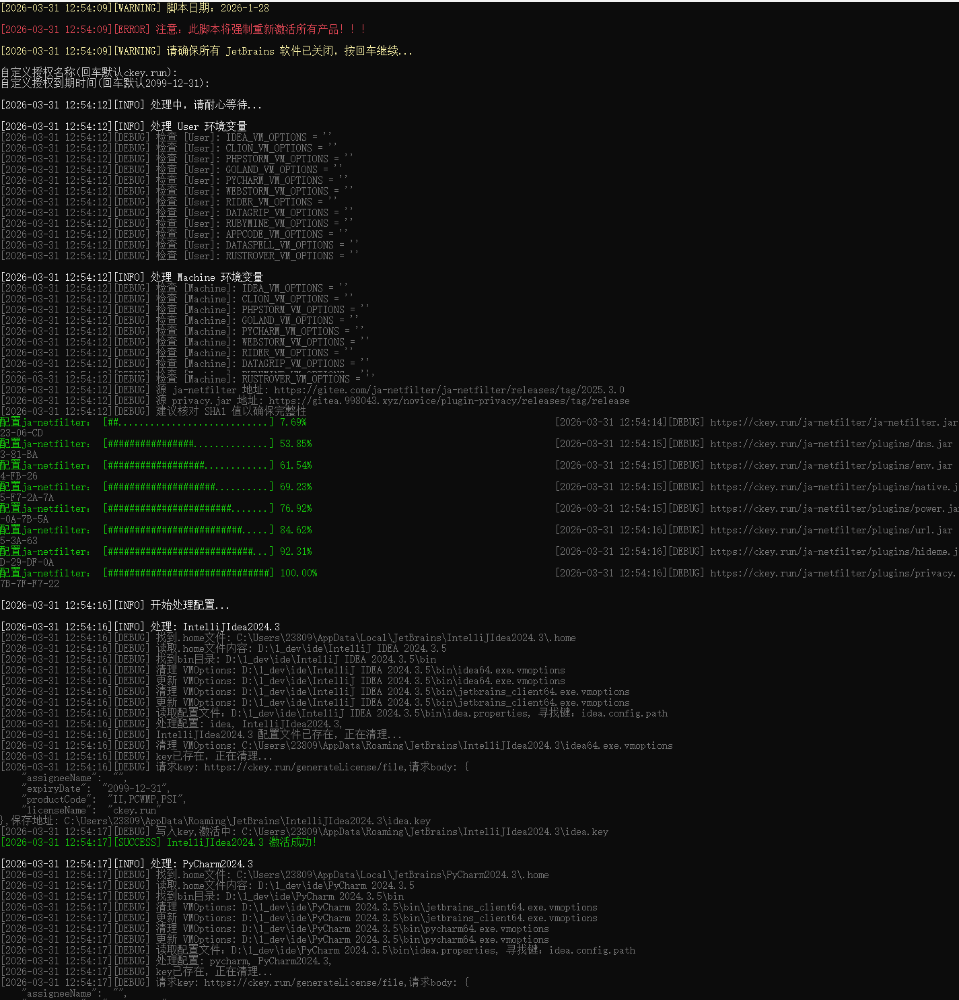
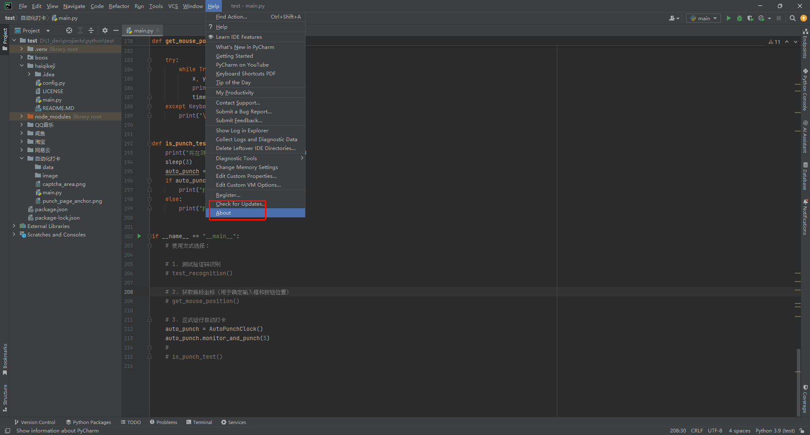
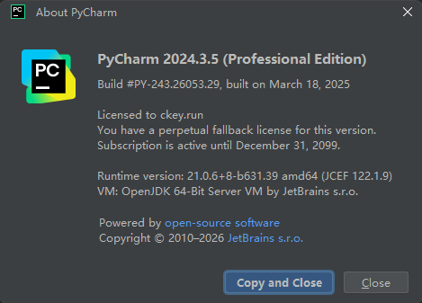

# 一键激活 JetBrains 全家桶

> 适配了Win、Linux、Mac

## 一、使用方法


### 网络环境

>  可能需要访问外网，所以需要准备好梯子

- #### powershell

```bash
$env:http_proxy = "http://127.0.0.1:7897"
$env:https_proxy = "http://127.0.0.1:7897"
```

- #### linux

```bash
export http_proxy=http://192.168.30.1:7897
export https_proxy=http://192.168.30.1:7897
```


### Windows

按键盘Win + X，选择WindowsPowerShell(**管理员**)

**复制**命令到刚才打开的PS中运行(一定要复制，不要手输，容易错)

```bash
irm ckey.run|iex

# 如果想查看处理了哪些文件，可以使用debug命令,会输出相应的信息
irm ckey.run/debug|iex

# 取消激活
irm ckey.run/uninstall|iex

# 查看脚本源代码 ,把后面的|iex去掉即可
irm ckey.run
```

会自动扫描安装的JetBrains系列软件，idea等等、稍等片刻即可激活完毕，激活码都不需要输入，全自动 

### Linux

- 复制命令到终端中执行即可

```css
wget --no-check-certificate ckey.run -O ckey.run && bash ckey.run
```

- debug

```bash
wget --no-check-certificate ckey.run/debug -O ckey.run && bash ckey.run
```

- 取消激活

```bash
wget --no-check-certificate ckey.run/uninstall -O ckey.run && bash ckey.run
```

### Mac

- Mac好像是默认没有安装wget，所以用curl,如果你有wget，也可以直接用linux命令

```undefined
curl -L -o ckey.run ckey.run && bash ckey.run
```

- debug

```bash
curl -L -o ckey.run ckey.run/debug && bash ckey.run
```

- 取消激活

```bash
curl -L ckey.run/uninstall -o ckey.run && bash ckey.run
```


## 二、查看激活状态

### 终端激活成功页面 （Windows PowerShell）




### ide 查看激活状态




**已经显示激活到2099年截止**


